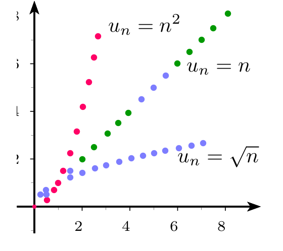
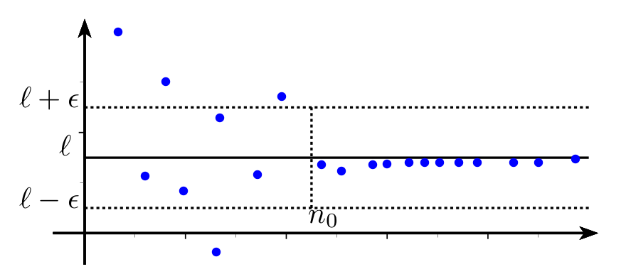

# Limites d'une suite

## Limite infinie d'une suite

### Définition

!!! info "Définition"
	**Une suite $(u_n)$ a pour limite $+\infty$ quand $n$ tend vers $+\infty$**, si tout intervalle de la forme $]A,+\infty[$<!--]--> contient tous les termes $u_n$ à partir d'un certain rang.
	Autrement dit : pour tout réel $A$ , on peut trouver un entier $n_0$ tel que , pour tout $n \geq n_0$ , on ait $u_n>A$.	
	On note : 
	
	\[
	\lim_{n \to +\infty} u_n=+\infty
	\]

[{.Center .VignetteMed}](../Image/Cours_001.png)

!!! info "Définition"
	De même , **une suite $(u_n)$ a pour limite $-\infty$ quand $n$ tend vers $+\infty$**, si tout intervalle de la forme $]-\infty,B[$<!--]--> contient tous les termes $u_n$ à partir d'un certain rang. 
	Autrement dit : pour tout réel $B$ , on peut trouver un entier $n_0$ tel que , pour tout $n \geq n_0$ , on ait $u_n<B$.
	

	On note : 
	
	\[
	\lim_{n \to +\infty} u_n=-\infty
	\]

??? question "Exercice"
	Soit $u_n=2n-5$ pour tout $n \geq 0$ .	
	1. Conjecturer à l'aide de la calculatrice la limite de la suite $(u_n)$ en $+\infty$.
	2. Résoudre l'inéquation $u_n>A$ où $n$ est l'inconnue et où $A$ est un réel donné.
	3. Justifier que la suite ($u_n$)  a pour limite $+\infty$ 
	
	??? done "Solution"
		1. $\lim_{n \to +\infty}u_n=+\infty$
		2. $2n-5>A \iff 2n> A+5 \iff n>\dfrac{A+5}{2}$
		3. Soit$A$ un réel donné. 
		Soit $n_0$ le plus petit entier naturel tel que $n_0 \geq  \dfrac{A+5}{2}$ (on prend ceci car on ne sait pas si $\dfrac{A+5}{2}$ est un entier ), alors , pour tout $n \geq n_0$ on a : $u_n>A$ .Donc 
		
		\[
		\lim_{n \to +\infty}u_n=+\infty
		\]

??? question "Exercice"
	Soit $v_n=-4n-1$ pour tout $n\geq 0$ .
	1. Conjecturer à l'aide de la calculatrice la limite de la suite $(v_n)$ en $+\infty$.
	2. Résoudre l'inéquation $v_n<A$ où $n$ est l'inconnue et où $A$ est un réel donné.
	3. Justifier que la suite ($v_n$)  a pour limite $-\infty$ 
	
	??? done "Solution"
		1. $\lim_{n \to+\infty}v_n=-\infty$
		2. $-4n-1<A \iff -4n<A+1 \iff n>-\dfrac{A+1}{4}$
		3. Soit$A$ un réel donné.
		Soit $n_0$ le plus petit entier naturel tel que $n_0 \geq  -\dfrac{A+1}{4}$  alors , pour tout $n \geq n_0$ on a : $v_n<A$ . Donc 
		
		\[
		\lim_{n \to +\infty}v_n=-\infty
		\]

### Algorithme de seuil pour une limite infinie

Soit $u$ la suite définie par $u_n =0,5n^2-n+1$.

??? question "Exercice"
	1. Conjecturer à l'aide de la calculatrice la limite de la suite $(u_n)$ en $+\infty$.
	2. Déterminer un seuil (c'est-à-dire un entier $n$) à partir duquel on a , $u_n\in ]A,+\infty[$<!--]-->  c'est-à-dire $u_n > A$, pour tout $n \in \mathbb{N}$
	3. Ecrire le programme python qui permet déterminer le seuil.

	!!! warning
		Un programme (seul) ne trouve pas la valeur seuil, mais la plus petite valeur $n_0$ telle que $u_{n_0} > A$. Mais rien ne permettra alors d'affirmer, que pour tout $n \geq n_0$, $u_n>A$!

### Suites de référence de limite infinie

!!! abstract "Théorème"
	- Les suites ($\sqrt{n}$) , ($n$) ,($n^2$),$\cdots$ ,($n^p$), ($e^n$)ont pour limite $+\infty$
	- Si $k>0$ alors  ($k\sqrt{n}$) , ($kn$) ,($kn^2$),$\cdots$ ,($kn^p$), ($ke^n$) ont pour limite $+\infty$ quand $n $ tend vers $+\infty$
	- Si $k >0$ alors  ($-k\sqrt{n}$) , ($-kn$) ,($-kn^2$),$\cdots$ ,($-kn^p$),($-ke^n$)   ont pour limite $-\infty$ quand $n $ tend vers $+\infty$

[{.Center .VignetteMed}](../Image/Cours_002.png)

## Limite finie d'une suite

### Définition

!!! note "Définition"
	Une suite **$(u_n)$ a pour limite le  réel $\ell$  quand $n$ tend vers $+\infty$** ou la suite **$(u_n)$ converge vers $\ell$**, si tout intervalle ouvert $I$ contenant $\ell$  contient tous les termes  $u_n$ à partir d'un certain rang.
	On note : 
	
	\[
	\lim_{n_+\infty} u_n=\ell
	\]

!!! abstract "Théorème"
	Cette limite est **unique**.

[{.Center .VignetteMed}](../Image/Cours_003.png)

!!! tip "Remarque"
	- Tout intervalle ouvert contenant $\ell$ contient un intervalle ouvert centré en $\ell$ de la forme $]\ell-\epsilon,\ell+\epsilon[$<!--]--> où $\epsilon>0$. On peut donc se contenter de chercher si tout intervalle ouvert centré en $\ell$  contient tous les termes  $u_n$ à partir d'un certain rang.
	- Quand $n$ tend vers $+\infty$ , &laquo; ($u_n$) tend vers $\ell$ &raquo; équivaut à $u_n-\ell$ tend vers 0.
	- Si $(u_n)$ converge vers $\ell$ alors les suites $(u_{n+1})$ , ($u_{2n}$) , ($u_{2n+1}$) convergent aussi vers $\ell$.
	- Une suite convergente est bornée.

### Algorithme de seuil pour une limite finie 

???- question "Exercice"
	Soit la suite ($u_n$) définie par : 

	\[
		\Syst{u_0 & = & 0,1}{u_{n+1} & = &2u_n(1-u_n)}
	\]

	1. Programmer la suite à la calculatrice .Cette suite  converge vers $\ell =0,5$ 
	2. Déterminer un seuil \cad un entier $n$, à partir duquel les  $u_n$ sont  dans un intervalle contenant $\ell$. On peut traduire aussi par trouver un entier $n$ tel que $|u_n-\ell|<\epsilon$.
	3. Ecrire le programme python qui permet déterminer le seuil. Utilisez-le pour connaître à partir de quel entier $n$ la suite est dans l’intervalle ouvert centré en 0,5 et de rayon $10^{-3}$.

### Suites de référence de limite 0

!!! abstract "Théorème"
	- Les suites $\left(\dfrac{1}{\sqrt{n}}\right)$, $\left(\dfrac{1}{n}\right)$, $\left(\dfrac{1}{n^2}\right)$,$\left(\dfrac{1}{n^3}\right)$\dots $\left(\dfrac{1}{n^p }\right)$ ($p\in\N^{*}$) ont pour limite 0
	- Si $k$ est un réel , les suites $\left(\dfrac{k}{\sqrt{n}}\right)$, $\left(\dfrac{k}{n}\right)$, $\left(\dfrac{k}{n^2}\right)$,$\left(\dfrac{k}{n^3}\right)$\dots $\left(\dfrac{k}{n^p }\right)$ ($p\in\N^*$) ont pour limite 0.

## Suites qui n'ont pas de limite

Certaines suites n'ont pas de limite c'est le cas des suites de termes généraux: $(-1)^n$ , $(-3)^n$ , $\cos n$ , $\sin n$.

!!! note "Définition"
	On dit qu'une suite est **divergente** si elle n'est pas convergente c'est-à-dire : 
	
	- soit  elle tend vers $\pm \infty$
	- soit elle n'a pas de limite.

???- tip "Méthode"

	Il est souvent demandé de justifier qu'une suite est convergente **sans** qu'il soit possible de trouver sa limite (cf [plus loin](AFAIRE)) !
