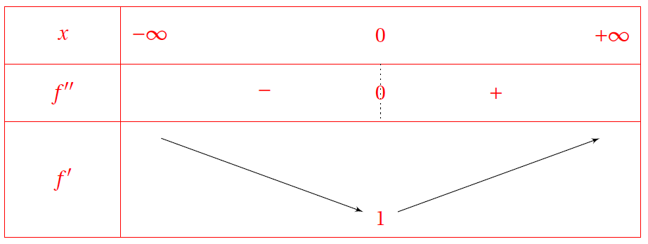

# Démonstration au programme

!!! info "Théorème"

    - $\dlim{x}{+\infty} \ex^x=+\infty$
    - $\dlim{x}{-\infty} \ex^x=0$

???- absrtact "Démonstration"
    Idée : démontrer que pour tout réel $x \geq 0$ , on a $e^x>x$ et  en déduire $\dlim{x}{+\infty}e^x=+\infty$

    ???- done "Réponse"
        - Soit $g$ la fonction définie pour $x \geq 0$ par $g(x)=\mathrm{e}^x-x$.

          g est dérivable comme différence de fonctions dérivables; pour tout $x$ de $[0~;~+\infty[$, $g'(x)=\ex^x-1$ .
    
          Pour $x\geq 0$, on a $\ex^x\geq 1$, donc $g'(x)\geq 0$ et g est croissante sur $[0~;~+\infty[$ ;
          
          pour $x\geq 0$, on a $g(x)\geq  g(0)$ or  g$(0)=1$ donc,pour tout $x\geq 0$, $g(x)\geq 1$ et donc $g(x)>0$ .
          Ainsi pour tout $x \geq 0$  $e^x> x$

        Or $\dlim{x}{+\infty} x=+\infty$ donc par comparaison, on a  $\dlim{x} {+\infty}\ex^x=+\infty$.

        - Pour tout réel $x$,  $\ex^x=\frac{1}{\ex^{-x}}$ et on pose $X=-x$.
        
        $\Lim{\lim\limits_{x \to -\infty}~(-x)&=&+\infty}{\lim\limits_{X\to +\infty}~ \ex^X&=&+\infty} \text{donc par composition}  \lim\limits_{x \to -\infty}~\ex^{-x}=+\infty$.
        
        Ainsi $\dlim{x}{-\infty} \ex^x = \dlim{x}{-\infty} \frac{1}{e^{-x}}=0$

!!! info "Croissance comparée"
    
    Pour tout $n\in \N$, $\dlim{x}{+\infty}\frac{\ex^x}{x^n}=+\infty$

???- abstract "Démonstration"
    1. Pour $n=0$, voir la [démonstration précédente](#lim_exp)
    2. Pour $n=1$. On considère la fonction $f$ définie sur $\R$ par 

        \[
        f(x) = \ex^x - \frac{x^2}{2}
        \]

        1. Après avoir calculé $f'$ et $f''$, déterminer le sens de variations de $f$ sur $\R$.
        2. En déduire que, pour tout $x>0$, $\frac{\ex^x}{x} > \frac{x}{2}$.
        3. En déduire que $\lim_{x \to +\infty} \frac{\ex^x}{x} = +\infty$
    
    3. Pour $n>1$ :
        1. Montrer que pour tout $n\in \N^*$ et pour tout $x>0$ :

            \[
                \frac{\ex^x}{x^n} = \left( \frac{\ex^{\frac{x}{n}}}{\frac{x}{n}} \right)^n \times \left( \frac{1}{n} \right)^n
            \]

        2. En utilisant la limite de composées, déduire de la question précédente que $\lim\limits_{x \to +\infty} \frac{\ex^x}{x^n} = +\infty$.

    ???- done "Réponse"
        
        1. Fait
        2. 
            1. $f'(x)=\ex^x-x$ et $f''(x)=\ex^x-1$.

            \begin{eqnarray*}
            \ex^x-1 >0 & \Longleftrightarrow & \ex^x >1 \\
            & \equivaut & \ex^x >\ex^0 \\
            & \equivaut & x >0
            \end{eqnarray*}

            [{.Center .VignetteMed}](../Image/Cours_015.png)

            Le minimum de $f'$ sur $\R$ est $1$, donc $f'$ est positive sur $\R$. Donc $f$ est croissante sur $\R$.

            2. Si $x>0$ et comme $f$ est croissante sur $\R$, $f(x)>f(0)$. Or $f(0)=1>0$, donc $f(x)>0$ si $x>0$.
            
                Donc $\ex^x-\frac{x^2}{2}>0$ si $x>0$. D'où $\frac{\ex^x}{x}>\frac{x}{2}$, si $x>0$.

            3. Comme $\frac{\ex^x}{x}>\frac{x}{2}$ si $x>0$ et que $\lim_{x \to +\infty} \frac{x}{2} =+\infty$, donc par comparaison $\lim\limits_{x \to +\infty} \frac{\ex^x}{x} = +\infty$.

        3. 
            1. Soit $n\in \N^*$ et $x>0$ :

                \begin{eqnarray*}
                \frac{\ex^x}{x^n} & = & \frac{\left(\ex^{\frac{x}{n}}\right)^n}{x^n \times \left(\frac{n}{n} \right)^n} \\
                & = & \frac{(\ex^{\frac{x}{n}})^n}{\left(\frac{x}{n} \right)^n} \times \left( \frac{1}{n} \right)^n \\
                & = &  \left( \frac{\ex^{\frac{x}{n}}}{\frac{x}{n}} \right)^n \times \left( \frac{1}{n} \right)^n
                \end{eqnarray*}

            2. Soit $n\in \N^*$ et $x>0$ :
            
                \[
                \left.
                \begin{array}{l}
                \lim\limits_{x \to +\infty} \frac{x}{n} = +\infty\\
                \lim\limits_{X \to +\infty} \frac{\ex^X}{X} = +\infty \quad \text{cf 2.}
                \end{array}
                \right\} \text{ par composée } \lim\limits_{x \to + \infty} \frac{\ex^{\frac{x}{n}}}{\frac{x}{n}} = +\infty
                \]

                Donc $\lim\limits_{x \to + \infty} \left(\dfrac{\ex^{\frac{x}{n}}}{\frac{x}{n}}\right)^n \times \left( \dfrac{1}{n} \right)^n=+\infty$.

!!! info "Croissance comparée (2)"

    Pour tout $n\in \N$, $\dlim{x}{-\infty} x^n \ex^x=0$

???- abstract "Démonstration"

    1. En posant $X=-x$, montrer que $\lim_{x \to -\infty} x^n \ex^x = \lim_{X \to +\infty} \dfrac{(-X)^n}{\ex^X}$.
    2. Quelle est la limite de $\dfrac{\ex^X}{X^n}$ lorsque $X$ tend vers $+\infty$ ?
    3. En déduire $\lim_{X \to +\infty} \dfrac{X^n}{\ex^X}$
    4. En déduire $\lim_{X \to +\infty} \dfrac{(-X)^n}{\ex^X}$
    5. Conclure.
