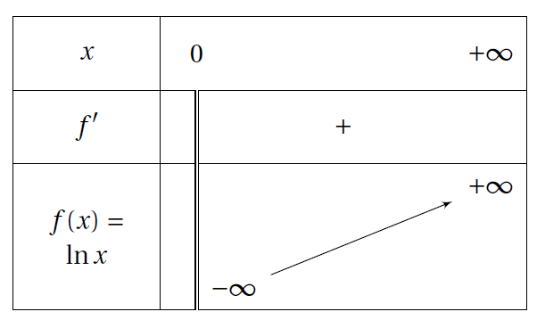
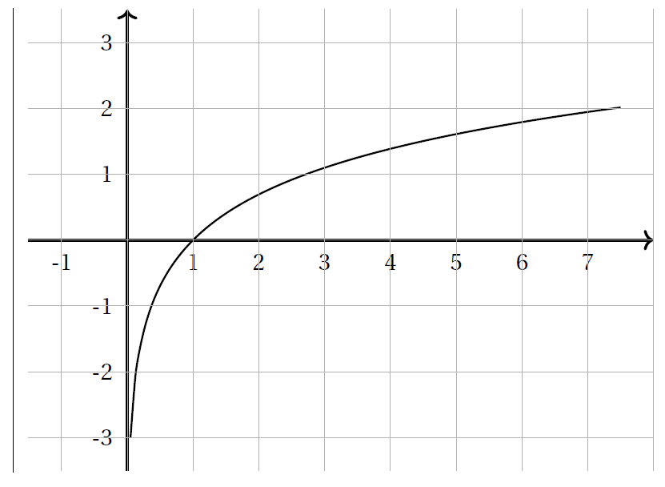
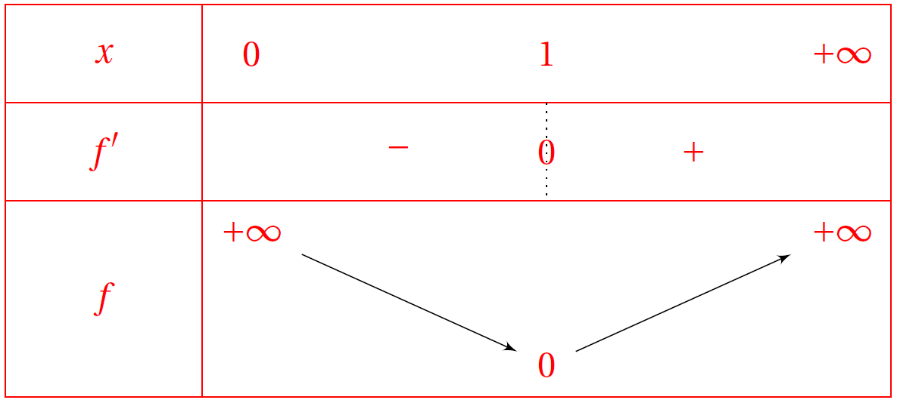

# Etude de la fonction logarithme népérien

## Variations

!!! info "Dérivée de la fonction $\ln$"

	La fonction $\ln$ est dérivable sur $]0,+\infty[$ et pour tout réel $x$ de $]0,+\infty[$, et a pour dérivée  $\dfrac{1}{x}$.

	\[
	\left( \ln x \right)' = \dfrac{1}{x}
	\]

???- tip "Primitive"
	Ainsi d'après le théorème précédent, les primtives de $h(x) = \dfrac{1}{x}$ sont $\ln(x) + k$, $k \in \R$.

???- abstract "Démonstration"
	On admet que la fonction logarithme népérien est dérivable sur $]0 ; +\infty[$.  
	On considère la fonction $f$ définie, pour tout $x>0$, par $f(x)=\ex^{\ln x} -x$.  
	$f'(x)=(\ln(x))' \times \ex^{\ln x} -1= (\ln(x))' \times x -1$.  
	Or $f(x)=0$ pour tout $x>0$, donc $f'(x)=0$.  
	Donc pour tout $x>0$, $(\ln(x))' \times x -1=0$. Donc $(\ln(x))' =\dfrac{1}{x}$, pour tout $x>0$.

!!! info "Conséquence"
	
	- La fonction $\ln$ est continue sur $]0 ; +\infty[$ (car elle est dérivable sur $]0 ; +\infty[$).
	- Comme la fonction $\ln$ est dérivable en $1$, donc $\dlim{h}{0} \dfrac{\ln(1+h)-\ln(1)}{h} = \ln'(1)=1$ donc :
	
	\[
	\dlim{x}{0} \dfrac{\ln(1+x)}{x} =1
	\]

!!! info "Variations (suite)"

	La fonction $\ln$ est strictement croissante sur $]0 ; +\infty[$ et 
	
	\[
		\dlim{x}{+\infty} \ln x = +\infty \qquad \dlim{x}{0^+} \ln x = -\infty
	\]

	Donc la courbe de la fonction $\ln$ possède une asymptote verticale d'équation $x=0$.

	[{.Center .VignetteMed}](../Image/courbe001.png)

	[{.Center .VignetteMed}](../Image/courbe002.png)

???- abstract "Démonstration partielle"
	On admet que $\dlim{x}{+\infty} \ln(x) = +\infty$.  
	Pour $\dlim{x}{0^+} \ln(x)$, on pose $X=\dfrac{1}{x}$.

	Alors $\ln(x) = \ln\left( \dfrac{1}{X} \right)= -\ln(X)$.
	
	Or si $x$ tend vers $0^+$, $X$ tend vers $+\infty$. Donc $\dlim{x}{0^+} \ln(x) = \dlim{X}{+\infty} -\ln(X) = -\infty$.

???- example "Exemple"
	Déterminer l'équation de la tangente à la courbe de $\ln$ au point d'abscisse 1.

???- example "Exemple"
	Après avoir étudier la convexité de la fonction $\ln$ sur $\R$, déterminer la position relative de sa courbe et de la droite d'équation $y=x-1$.

???- example "Exemple"
	f est la fonction définie sur $]0; +\infty[$ par $f(x) = (\ln x)^2$ .

	1. Etudier les limites de $f$ en $0$ et en $+\infty$.
	2. Déterminer la fonction dérivée de $f$. 
	3. Etudier le signe de $f'(x)$ et en déduire le sens de variation de $f$. 
	4. Dresser le tableau de variation de $f$. 
	5. Tracer la courbe représentative de f dans un repère orthonormé. 

	???- done "Réponse"

		<ol>
		<li> $\left\{ \begin{array}{l}
		\dlim{x}{0} \ln(x) = -\infty\\
		\dlim{x}{-\infty} X^2 = +\infty
		\end{array} \right.$

		Donc par composée, $\dlim{x}{0} \left( \ln(x) \right)^2 = +\infty$.

		$\left\{ \begin{array}{l}
		\dlim{x}{+\infty} \ln(x) = +\infty\\
		\dlim{x}{+\infty} X^2 = +\infty
		\end{array} \right.$
	
		Donc par composée, $\dlim{x}{+\infty} \left( \ln(x) \right)^2 = +\infty$.
		</li>
		<li> $f'(x) =2\times  \dfrac{1}{x} \times \ln(x)$
		</li>
		<li> Sur $]0 ; + \infty[$, $\dfrac{2}{x}>0$, donc $f'$ est du signe de $\ln(x)$.

		[{.Center .VignetteMed}](../Image/courbe003.png)

		</li>
		</ol>

## Limites

!!! info "Croissance comparée"

	-  $\dlim{x}{+\infty} \ \dfrac{\ln x}{x} = 0$.
	- $\dlim{x}{0} \ x \ln x = 0$.
	- Pour tout $n\in\N^*$, $\dlim{x}{+ \infty} \ \dfrac{\ln x}{x^n} = 0$.
	- Pour tout $n\in\N^*$, $\dlim{x}{0} \ x^n \ln x  = 0$.

???- abstract "Démonstration"

	1. Soit $f(x)=\ln(\sqrt{x})-\sqrt{x}$ définie sur $I=]1;+\infty[$

		1. Etudier les variations de $f$ sur $I$.
		2. En déduire le signe de $f$ sur $I$.
		3. En déduire que pour tout $x>1$, $0<\ln(\sqrt{x}) \leq \sqrt{x}$.
		4. En déduire que $\dlim{x}{+\infty} \dfrac{\ln x}{x} = 0$.

	2. Déterminer, en utilisant la limite précédente, $\dlim{x}{0} x \ln x$.

	???- done "Réponse"

		<ol>
		<li><ol>
		<li> Calcul de $f'$ sur $]1;+\infty[$.  

		\begin{eqnarray*}
		f'(x) & = & \dfrac{\dfrac{1}{2\sqrt{x}}}{\sqrt{x}}-\dfrac{1}{2\sqrt{x}}\\
		& = & \dfrac{1}{2x}-\dfrac{1}{2\sqrt{x}}\\
		& = & \dfrac{1-\sqrt{x}}{2x}\\
		\end{eqnarray*}  
		
		Sur $]1 ; +\infty[$, $2x>0$ et $\sqrt{x}>1$ (la fonction $x \mapsto \sqrt{x}$ est croissante sur $]1 ; +\infty[$), donc $f'(x)<0$ sur $]1 ; +\infty[$.  
		Donc $f$ est décroissante sur $]1 ; +\infty[$.  
		</li>
		<li> Comme $f(1)=-1$ et que $f$ est décroissante sur $]-1;+\infty[$, le maximum de $f$ est $-1$. Donc $f$ est négative sur  $]1;+\infty[$.
		</li>
		<li> Comme $f(x)\leq 0$ sur $]1;+\infty[$, $0<\ln(\sqrt{x}) \leq \sqrt{x}$.
		</li>
		<li> Pour tout $x \in ]1;+\infty[$ :
		
		\begin{eqnarray*}
		0<\ln(\sqrt{x}) \leq \sqrt{x} & \equivaut & \dfrac{0}{x} < \dfrac{\ln(\sqrt{x})}{x} \leq \dfrac{\sqrt{x}}{x} \quad \text{ car } x>1 \\
		& \equivaut & 0 < \dfrac{\dfrac{1}{2}\ln(x)}{x} \leq \dfrac{1}{\sqrt{x}} \\
		& \equivaut & 0 < \dfrac{\ln(x)}{x} \leq \dfrac{2}{\sqrt{x}}
		\end{eqnarray*}

		Comme $\dlim{x}{+\infty} 0 =0$ et $\dlim{x}{+\infty} \dfrac{2}{\sqrt{x}} = 0$, d'après le théorème d'encadrement $\dlim{x}{+\infty} \dfrac{\ln(x)}{x} =0$
		</li>
		</ol>
		</li>
		<li> On pose $X=\dfrac{1}{x}$.

		$\left\{ \begin{array}{l}
		\dlim{x}{0} \dfrac{1}{x} = + \infty\\
		\dlim{X}{+\infty} \dfrac{\ln(X)}{X} = 0
		\end{array} \right.$

		Donc par composée, $\dlim{x}{0} \dfrac{\ln\left( \dfrac{1}{x} \right)}{\dfrac{1}{x}} =0$.
		
		Donc $\dlim{x}{0} -x\ln(x) = 0$. D'où $\dlim{x}{0} x \ln(x) =0$.
		</li>
		</ol>

???- example "Exemple"
	Montrer que  la suite $(v_n)$ définie pour $n\geq 1$ par  $v_n = \dfrac{\ln n}{n}$   est bornée.
	
	???- done "Réponse"
		Comme $\dlim{n}{+\infty} \dfrac{\ln (n)}{n} =0$ (par croissance comparée), alors la suite $v_n$ est bornée.
		
		En effet, comme $\dlim{n}{+\infty} \dfrac{\ln(n)}{n}=0$, pour un réel $\epsilon$ il existe un rang $N_0$ à partir duquel $|v_n - 0 | < \epsilon$.
		
		Donc, $\forall n \geq N_0$,  $\ -\epsilon < v_n < \epsilon$.

		Si $n<N_0$,  $\min(v_1,v_2,\ldots,v_{\displaystyle  N_0}) < v_n < \max(v_1,v_2,\ldots,v_{N_0})$.

		Donc $(v_n)$ est bornée.

## La composée $\ln(u(x))$

!!! info ""
	Si $u$ est une fonction **strictement positive** et dérivable sur un intervalle $I$ ouvert alors la fonction $f$ définie sur $I$ par $f(x) = \ln(u(x))$ est dérivable sur $I$ et pour tout $x\in I$ , $f'(x) = \dfrac{u'(x)}{u(x)}$, i.e.

	\[
	\left( \ln(u(x)) \right)' = \dfrac{u'(x)}{u(x)}
	\]

???- example "Exemple"
	Calculer la dérivée de sfonctions suivantes :

	1. $f(x) = \ln(x^2+3)$
	2. $f(x) = \dfrac{\ln(2x+3)}{x-1}$
