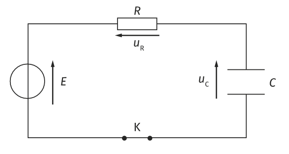
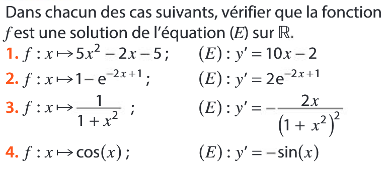
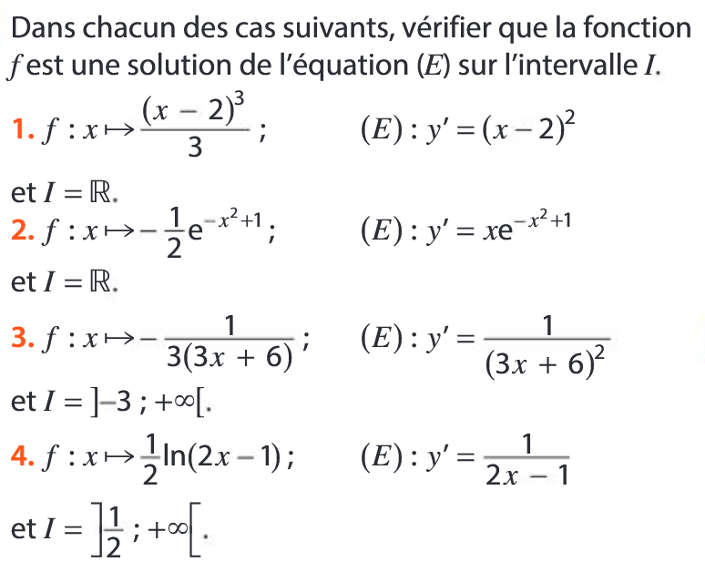

# Equation différentielle du premier ordre

## Equation différentielle et dérivation

!!! info "Défintion d'une équation différentielle"
    On appelle **équation différentielle** une équation dont l'inconnue est *une fonction* notée $y$ dans laquelle apparaissent une ou plusieurs dérivées successives de $y$ (dont peut-être $y$) et éventuellement d'autres fonctions.

    Une fonction qui vérifie une équation différentielle est une **solution** de l'équation différentielle.

???+ example "Premiers exemples"
    Si un circuit constitué d'une résistance $R$, d'un condensateur de capacité $C$ est soudainement connecté à une tension constante $E$. On commence l'étude du circuit au moment où la tension apparaît, en supposant que le condensateur est initialement vide. Alors la tension $u_c$ aux bornes du condensateur vérifie :

    \[
        \displaystyle u_{c}'(t) + \dfrac{1}{RC} u_{c}(t) - \dfrac{E}{RC} = 0
    \]

    [{.Center_lien .VignetteMed .Im_retaille}](../Image/RC01.png)
    
???+ example "Premiers exemples"
    Décharge d'un condensateur : si un circuit constitué d'une résistance $R$, d'un condensateur de capacité $C$ et d'une bobine d'inductance $L$ est monté en série aux bornes d'un générateur fournissant une tension variable $f(t)$, la charge $Q(t)$ du condensateur vérifie l'équation :

    \[
    LQ''(t) + RQ'(t) + \dfrac{1}{C}Q(t) = f(t)
    \]
    
    [{.Center_lien .VignetteMed .Im_retaille}](../Image/RLC01.png)

???+ example "Premiers exemples"
    Si une masse $m$ est suspendue à un ressort ayant un coefficient de rappel $F$ et un amortissement constant $k$, sa position $h(t)$ vérifie l'équation

    \[
        m \times h''(t)+k\times h′(t)+F\times h(t)=0
    \]

    [{.Center_lien .Vignette .Im_cache .Im_retaille}](../Image/ressort.gif)

    

    [Source wikipédia](https://fr.wikipedia.org/wiki/Syst%C3%A8me_masse-ressort)
    

???+ example "Premiers exemples"
    Un pendule, constitué d'une petite bille, se meut dans un plan vertical au bout d'une fine tige rigide de longueur l dont l'autre extrémité est fixe. Notons $\Theta(t)$ l'angle de la tige repéré depuis la position d'équilibre. $Theta(t)$ vérifie l'équation ($g$ désigne l'accélération de la pesanteur) :

    \[
        \Theta''(t) = −\dfrac{g}{l} \sin⁡ (\Theta(t)) 
    \]

    [{.Center_lien .Vignette .Im_retaille}](../Image/Pendulum.gif)

    

    [Source wikipédia](https://fr.wikipedia.org/wiki/Pendule_simple)
    

    

???- tip "Notation en physique"
    En sciences physiques, la variable est souvent le temps. Elle est donc alors notée $t$. Les fonctions sont parfois notées $x(t)$. L'inconnue d'une telle équation différentielle est alors notée $x$ (mais elle représente bien une fonction). La dérivée de cette inconnue est alors notée $x'$ et la dérivée seconde $x''$.

???- tip "Notation différentielle"
    En raison de ces différentes variables, il est possible d'utiliser la notation différentielle $\dfrac{\dx[ ]}{\dx}$.
    
    $LQ''(t) + RQ'(t) + \dfrac{1}{C}Q(t) = f(t)$ se note alors $L\dfrac{\dxx[Q]}{\dx[t]^2}(t) + R \dfrac{\dx[Q]}{\dx[t]}(t) + \dfrac{1}{C}Q(t) = f(t)$.
    
    $x''+2x'-x=2t$ se note alors $\dfrac{\dxx}{\dx[t]^2}(t) + 2 \dfrac{\dx}{\dx[t]}(t)-x(t)= 2t$.

!!! danger "Méthode"
    Pour montrer qu'une fonction $f$ est solution, il suffit de remplacer l'inconnue (souvent $y$) par $f$ dans le &laquo; membre de gauche &raquo;, de faire les calculs (dérivations et opérations) et de vérifier que le résultat est bien égal au &laquo; au membre de droite &raquo;.

???- example "Exemple"
    Soit $f(x)=30\ex^{5x}+10$ définie sur $\R$. Montrer que $f$ est une solution de l'équation différentielle :
    
    \[
    y'-5y=-50 \quad (E)
    \]

    ???- done "Réponse"
        $f'(x)=150\ex^{5x}$.
        
        \begin{eqnarray*}
        f'(x)-5f(x) & = & 150\ex^{5x}-5(30 \ex^{5x}+10)\\
        & = & -50
        \end{eqnarray*}
        
        Donc $f$ est une solution de $y'-5y=-50$.

???+ example "Exemple"

    <ol> 
    <li> Soit $f(x)=\cos \left( 3x +\dfrac{\pi}{6} \right)$. Montrer que $f$ est une solution de l'équation différentielle :

    \[
    y'' + 9y=0
    \]

    </li>
    <li> Soit $g(x)=2\cos (3x)- 5\sin (3x)$. Montrer que $g$ est une solution de l'équation différentielle :
    
    \[ y'' + 9y=0 \]
    
    </li>
    </ol>

    ???+ done "Réponse"

        <ol>
        <li> $f'(x) = -3\sin \left( 3x +\dfrac{\pi}{6} \right)$ et $f''(x)=-9\cos \left( 3x +\dfrac{\pi}{6} \right)$

        \[
        \begin{eqnarray*}
        f''(x)+9f(x) & = & -9\cos \left( 3x +\dfrac{\pi}{6} \right) + 9 \times \cos \left( 3x +\dfrac{\pi}{6} \right)\\
        & = & 0
        \end{eqnarray*}
        \]

        Donc $f$ est une solution de $y''+9y=0$.
        </li>
        <li> $g'(x)=-6\sin(3x)-15\cos (3x)$ et $g''(x)=-18\cos(3x)+45\sin (3x)$.

        \[
        \begin{eqnarray*}
        g''(x)+9g(x) & = & -18\cos(3x)+45\sin (3x) + 9\left( 2\cos (3x)- 5\sin (3x) \right) \\
        & = & 0
        \end{eqnarray*}
        \]

        Donc $g$ est une solution de $y''+9y=0$.
        </li>
        </ol>

## Rappel

**Il est impératif de connaitre par c&#339;ur les formules suivantes :**

\[
\begin{array}{|c|c|c|c|}
\hline
\rule[-4pt]{0pt}{15pt} \text{Fonction $f$ définie sur} & \text{Par :}& \text{a pour fonction dérivée}&\text{la fonction est dérivable sur}\\
\hline
\rule[-4pt]{0pt}{15pt} \mathbf{R} & f(x) = k \ \text{(cste)} & f'(x) = 0 & \mathbf{R} \\
\hline
\rule[-4pt]{0pt}{15pt} \mathbf{R} & f(x) = mx+p\ \text{(cste)} & f'(x) = m & \mathbf{R} \\
\hline
\rule[-4pt]{0pt}{15pt} \mathbf{R} & f(x) = x^2 & f'(x) = 2x & \mathbf{R} \\
\hline
\rule[-4pt]{0pt}{15pt} \mathbf{R} & f(x) = x^n \ \  n \in \mathbb{N},\ n>0 & f'(x) = nx^{n-1} & \mathbf{R} \\
\hline
\rule[-12pt]{0pt}{30pt} \mathbf{R}\setminus \{0\}  & f(x) = \frac{1}{x} & f'(x) = \frac{-1}{x^2} & \mathbf{R}\setminus \{0\}\\
\hline
\rule[-12pt]{0pt}{30pt} \mathbf{R}\setminus \{0\} & f(x) = \frac{1}{x^n} \ n \in \mathbb{N},\ n \neq 0 & f'(x) = \frac{-n}{x^{n+1}} & \mathbf{R}\setminus \{0\}\\
\hline
\rule[-12pt]{0pt}{30pt} \left[0;+\infty \right[ & f(x) = \sqrt{x} & f'(x) = \frac{1}{2 \sqrt{x}} & ]0;+\infty[\\
\hline
\rule[-4pt]{0pt}{15pt} \mathbf{R} & f(x) = \cos{x} & f'(x) = -\sin{x} & \mathbf{R}\\
\hline
\rule[-4pt]{0pt}{15pt} \mathbf{R} & f(x) = \sin{x} & f'(x) = \cos{x} & \mathbf{R}\\
\hline
\rule[-12pt]{0pt}{30pt} ]0;+\infty[ & f(x) = \ln (x) & f'(x) = \dfrac{1}{x} & ]0;+\infty[ \\
\hline
\rule[-4pt]{0pt}{15pt} \mathbf{R} & f(x) = \text{e}^{x}=\exp (x) & f'(x) = \text{e}^{x}=\exp (x) & \mathbf{R}\\
\hline
\end{array}
\]

**Il est impératif de connaitre par c&#339;ur les formules suivantes :**

 Si $u$ et $v$ sont deux fonctions dérivables sur $I$ : 

\[
\begin{array}{|c|c|c|c|}
\hline
\rule[-4pt]{0pt}{15pt} \text{Fonction $f$ définie sur} & \text{Par :}& \text{a pour fonction dérivée}&\text{la fonction est dérivable sur}\\
\hline
\rule[-4pt]{0pt}{15pt} I & u + v & u' + v' & I \\
\hline
\rule[-4pt]{0pt}{15pt} I & k \times u \text{ (k un réel constant)} & k \times u' & I \\
\hline
\rule[-4pt]{0pt}{15pt} I & u \times v & u'\times v + u \times v' & I \\
\hline
\begin{array}{c} J \subset I \text{ tel que }\\ \text{pour tout } x \in J,\ v(x) \neq 0 \end{array} & \dfrac{1}{v}
& \dfrac{- v'}{v^2}
&
\begin{array}{c} J \subset I \text{ tel que }\\ \text{pour tout } x \in J,\ v(x) \neq 0 \end{array}\\
\hline
\begin{array}{c} J \subset I \text{ tel que }\\ \text{pour tout } x \in J,\ v(x) \neq 0 \end{array}& \dfrac{u}{v}
& \dfrac{u'v-v'u}{v^2}
& 
\begin{array}{c} J \subset I \text{ tel que }\\ \text{pour tout } x \in J,\ v(x) \neq 0 \end{array}\\
\hline
\begin{array}{c} J \subset I \text{ tel que }\\ \text{pour tout } x \in J,\ u(x) \geq 0 \end{array}& \sqrt{u}
& \dfrac{u'}{2 \sqrt{u}}
&
\begin{array}{c} J \subset I \text{ tel que }\\ \text{pour tout } x \in J,\ u(x) > 0 \end{array}\\
\hline
\end{array}
\]

\[
\begin{array}{|c|c|c|c|}
\hline
\rule[-4pt]{0pt}{15pt} \text{Fonction $f$ définie sur} & \text{Par :}& \text{a pour fonction dérivée}&\text{la fonction est dérivable sur}\\
\hline
I & \text{e}^{u}=\exp (u) & u' \text{e}^{u}=u' \exp (u) & I \\
\hline
\rule[-12pt]{0pt}{30pt}
\begin{array}{c} J \subset I \text{ tel que }\\ \text{pour tout } x \in J,\ u(x) > 0 \end{array}& \ln (u) \ (u>0)
& \dfrac{u'}{u}
&
\begin{array}{c} J \subset I \text{ tel que }\\ \text{pour tout } x \in J,\ u(x) > 0 \end{array}\\
\hline
\rule[-4pt]{0pt}{15pt} I & \cos(u) & -u' \times \sin (u) & I \\
\hline
\rule[-4pt]{0pt}{15pt} I & \sin(u) & u' \times \cos (u) & I \\
\hline
\rule[-12pt]{0pt}{30pt} mx+p>0 & \ln(mx+p) & \dfrac{m}{mx+p} & mx+p>0 \\
\hline
\rule[-4pt]{0pt}{15pt} \mathbf{R} & \exp(mx+p)=\text{e}^{mx+p} & m\exp(mx+p) = m \text{e}^{mx+p} & \mathbf{R} \\
\hline
\mathbf{R} & \cos(mx+p)  & -m\sin(mx+p) & \mathbf{R} \\
\hline
\mathbf{R} & \sin(mx+p)  & m\cos(mx+p) & \mathbf{R} \\
\hline
\end{array}
\]

## Exercices

???- example "Exercice 1"
    
    [{.Center_lien .Vignette40}](./../Image/Ex01.png)

???+ example "Exercice 2"
    
    [{.Center_lien .Vignette40}](./../Image/Ex02.png)

???+ example "Exercice 3"

    Montrer que la fonction $f$ est une solution de l'équation différentielle $(E)$.
    <ol>
    <li> $f(x)=\ex^{\frac{-3x}{5}}- \left(x+\dfrac{5}{2}\right) \ex^{-x}$ et $(E)$ : $5y'+3y=2x \ex^{-x}$</li>
    <li> $f(x) = -3\exp(-x)+\dfrac{1}{5}(\cos(2x)+2\sin(2x))$ et $(E)$ : $y'+y=cos(2x)$</li>
    <li> $g(t)=\ex^{-t}+\ln(t)$ et $(E)$ : $y'+y=\ln(t)+\dfrac{1}{t}$</li>
    <li> $h(t)=2\ex^{-2t}-4\ex^{-3t}+(72t^2-84t+37)\ex^t$ et $(E) : y''+5y'+6y=864t^2 \ex^t$</li>
    </ol>
