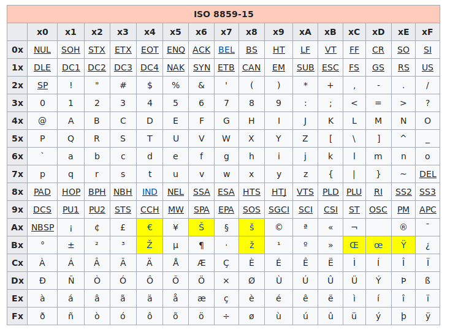

# ISO-8859-15

Dans l'ISO-8859-1, certains caractères n’étaient pas codés : &#0156; &#339;, &#338; $\ldots$ et il manquait le caractère &#8364; de l’euro !! Pour corriger cela, on a créé le code ISO 8859-15.

[{.Center_lien VignetteMed}](./Image/Dif_latin_1_9.png)

???- danger "Et les autres langues ?"
    Mais il fallait encore toute une collection de codes pour chaque groupe de pays qui avaient des alphabets différents.

    Au final en 2004, le groupe de normalisation a décidé d’abandonner ce code au profit de l’Unicode et de l’UTF-8.

!!! tip "Seconde étape ?"
    Ici aussi, la seconde étape, c'est-à-dire le passage de la table de caractère à l'écriture en mémoire, est simple : on retranscrit sur un octet le code du tableau écrit en binaire.

    Ainsi, le caractère £ est codé par A3 et est donc stocké en mémoire par $\base{1010\ 0011}$.
