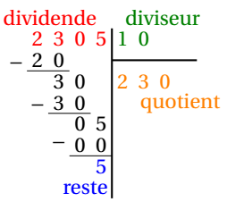

# Représentation d'entiers

## Introduction et histoire (En construction)

[Aspect historique](AFAIRE)

## Les briques de bases

!!! info "Définition"
    **Le bit** (pour *BInary digiT*) est l'unité la plus simple dans le système de numération binaire. Elle ne peut prendre que deux valeurs, désignées le plus souvent par les chiffres 0 et 1.
 

!!! info "Définition"
    Les bits sont regroupés par paquets adjacents pour représenter de l'information. En particulier, un regroupement de 8 bits s'appellent **un octet** (en anglais *bytes*).
 

???- example "Exemple"
    Combien d'octet différents peut-on avoir ?
 

    ???- done "Réponse"
        Il y a $2^8$ octets différents.
 
 

!!! info "Définition"
    **Un mot machine** est la quantité de bits standard manipulée par un microprocesseur. Sa taille diffère selon les processeurs : 8, 16, 32, 64 bits.

!!! info "Définition"
    Dans un octet (ou un mot machine), **le bit de poids fort** est le bit le plus à gauche (sur un nombre de bits précis) et **le bit de poids faible** est le bit le plus à droite.
 
## Ecriture d'un entier naturel dans une base quelconque

### Un exemple connu : la base 10

!!! info " "
    Tout entier $a \geq 0$ s'écrit de façon unique sous la forme : 
    
    \[
    a = a_0 + a_1 \times 10 + a_2 \times 10^2 + \ldots + a_n \times 10^n  = \sum_{i=0}^{n} a_i \times 10^i 
    \]

    où $n$ est un entier et les $a_i$ sont des entiers compris entre 0 et 10-1=9 et $a_n \neq 0$.

    On retrouve à travers ces coefficients l'écriture &laquo; naturelle &raquo; du nombre $a$.
 

???- example "Exemple"
    Soit $a=2\,305$. Alors :
 
    \[
    2\,305 = 5 + 0 \times 10 + 3 \times 10^2 + 2 \times 10^3
    \]
 
 

!!! info "La division euclidienne"
    Soit $b$ un entier naturel non nul. Tout entier naturel $a$ s'écrit de manière unique sous la forme $a=b \times q +r$, avec $q$ un entier naturel et $0 \leq r \leq b$. 
    
    Les entiers $q$ et $r$ sont appelés respectivement **le quotient** et **le reste** de la division euclidienne de $a$ par $b$.
    
    On pourra aussi retenir que $a$ s'appelle *le dividende* et $b$ *le diviseur*.
 

???- example "Exemple"
    Déterminer le quotient et le reste de la division euclidienne de $2\,305$ par $10$.

    ???- done "Réponse"
        $2\,305 = 10 \times 230 + 5$.
        
        Donc le quotient est 230 et le reste est 5.

!!! tip "Poser une division euclidienne"
    On pose une division euclidienne de la façon suivante :

    [{.Center_lien .Vignette}](../../Image/Im01.png)

???- example "Exemple : trouver les chiffres qui composent un naturel"
    <ol>
    <li> Compléter le tableau suivant :

    

    | Dividende | $2305$ |  230 | ? | ? |
    |:---:|:---:|:---:|:---:|:---:|
    |Diviseur | 10 | 10 | 10 | 10|
    |Quotient | 230 | ? | ? | ? |
    |Reste | 5 | ? | ? | ? |

    

    
    ???- done "Réponse"

        

        | Dividende | 2305 |  230 | 23 | 2 |
        |:---:|:---:|:---:|:---:|:---:|
        | Diviseur | 10 | 10 | 10 | 10 |
        | Quotient | 230 | 23 | 2 | 0 |
        | Reste | 5 | 0 | 3 | 2 |

        

    </li>
    <li> Que remarquez-vous à propos de la dernière ligne ?
 
    ???- done "Réponse"
        Sur la dernière ligne, on retrouve les chiffres qui composent l'écriture décimale du nombre $2\,305$, mais il faut commencer la lecture du tableau par la droite.
    
    </li>
    <li> Vérifiez cette conjecture avec le nombre $12\,008$.
 
    ???- done "Réponse"

        
    

        | Dividende  | 12008 |  1200  | 120  | 12  | 1  |
        |:---:|:---:|:---:|:---:|:---:|:---:|
        | Diviseur  | 10            | 10    | 10  | 10 |  10 |
        | Quotient  | 1200   | 120    | 12  |  1 | 0  |
        | Reste   | 8    | 0    | 0  |  2  | 1  |

        

    </li>
    </ol>
 

???- tip "Présentation usuelle"
    Il est classique de rédiger cette méthode à l'aide de divisions euclidiennes successives.

    [{.Center_lien .VignetteTer}](../../Image/Im02.png)

### Un exemple indispensable : la base 2

!!! info " "
    Tout entier $a \geq 0$ s'écrit de façon unique sous la forme : 
    
    \[
    a = a_0 + a_1 \times 2 + a_2 \times 2^2 + \ldots + a_n \times 2^n  = \sum_{i=0}^{n} a_i \times 2^i
    \]

    où $n$ est un entier et les $a_i$ sont des entiers compris entre 0 et 2-1=1 et $a_n \neq 0$.\\
    On note alors $a=\overline{a_n a_{n-1} \ldots a_0}^2$ ou $a=\left( a_n a_{n-1} \ldots a_0 \right)_2$ et on appelle cette notation l'écriture binaire de $a$.
    

???- example "Exemple"
    En utilisant la méthode du paragraphe précédent, donner l'écriture binaire de $114$.

    ???- done "Réponse"
        

        |Dividende  | 114 |  57 | 28  | 14 | 7 | 3 | 1 |
        |:---:|:---:|:---:|:---:|:---:|:---:|:---:|:---:|
        |Diviseur  | 2  | 2  | 2  | 2  |  2 | 2 | 2 |
        |Quotient  | 57 | 28 | 14  |  7 | 3 | 1 | 0 |
        |Reste   | 0  | 1  | 0  |  0  | 1 | 1 | 1 |

        D'où $114=0 + 1 \times 2 + 0 \times 2^2 + 0\times 2^3+ 1 \times 2^4 + 1 \times 2^5 + 1 \times 2^6$.
        Donc $114 = \base{1110010}$.

        

!!! tip "Une autre façon de convertir un décimal en binaire"
    On peut utiliser la méthode suivante (surtout si on connaît à l'avance le nombre de chiffres qui composent l'écriture binaire) : 

    

    | | 108 | 108 | 44 | ? | ? | ? | ? | ? |
    |:---:|:---:|:---:|:---:|:---:|:---:|:---:|:---:|:---:|
    |Puissance de $2$ | $2^7 = 128$ | $2^6=64$ | $2^5=32$ | $2^4=16$ | $2^3=8$ | $2^2=4$ | $2^1=2$ | $2^0=1$ |
    |Différence | $108-128 \leq 0$ | $108-64=44$ | ? | ? | ? | ? | ? | ? | 
    |Coefficient | 0 | 1 | ? | ? | ? | ? | ? | ? |
 
    

    ???- done "Réponse"

        

        | | 108 | 108 | 44 | 12 | 12 | 4 | 0 | 0 |
        |:---:|:---:|:---:|:---:|:---:|:---:|:---:|:---:|:---:|
        |Puissance de $2$ | $2^7 = 128$ | $2^6=64$ | $2^5=32$ | $2^4=16$ | $2^3=8$ | $2^2=4$ | $2^1=2$ | $2^0=1$ |
        |Différence | $108-128 \leq 0$ | $108-64=44$ | $44-32=12$ | $12-16 \leq 0$ | $12-8=4$ | $4-4=0$ | $0-2 \leq 0$ | $0-1 \leq 0$ | 
        |Coefficient | 0 | 1 | 1 | 0 | 1 | 1 | 0 | 0 |
    
        

        D'où $108 = 1\times 2^6 + 1\times 2^5 + 0 \times 2^4 +1 \times 2^3 + 1 \times 2^2 + 0 \times 2 + 0$.

        Donc $108 = \left( 1101100 \right)_2$

???- example "Exemple"
    Donner l'écriture binaire de $173$.
 
    ???- done "Réponse"

        

        | | 173   | 173   | 45   | 45    | 13  | 13  | 5   | 1   | 1 |
        |:--:|:--:|:--:|:--:|:--:|:--:|:--:|:--:|:--:|:--:|
        |Puissance de $2$  | $2^8=256$ | $2^7 = 128$ | $2^6=64$  | $2^5=32$  | $2^4=16$ | $2^3=8$ | $2^2=4$ | $2^1=2$ | $2^0=1$ |
        |Différence    | $173-256 \leq 0$ | $173-128=45$ | $45-64 \leq 0$  | $45-32=13$  | $13-16 \leq 0$ | $13-8=5$ | $5-4=1$ | $1-2 \leq 0$  | $1-1=0$ |
        |Coefficient   |  0  | 1    | 0    | 1    |  0  | 1   | 1   | 0   | 1 |

        

 
        D'où $173 = 1\times 2^7 +0\times 2^6 + 1 \times 2^5 + 0 \times 2^4 + 1\times 2^3 + 1\times 2^2 + 0 \times 2 + 1$
        Donc $173 = \left( 1010\ 1101 \right)_2$
 
 

!!! tip "Convertir un binaire en décimal"
    À partir de $a=\left( a_n a_{n-1} \ldots a_0\right)_2$, on calcule : $a_0 + a_1 \times 2 + a_2 \times 2^2 + \ldots + a_n \times 2^n  = \displaystyle\sum_{i=0}^{n} a_i \times 2^i$.

    On peut aussi utiliser l'algorithme d'Hörner (cf exercice).
 

???- example "Exemple"
    Déterminer le plus grand entier naturel qui puisse être codé :
    <ol>
    <li> si on utilise 4 bits</li>
    <li> si on utilise 1 octet</li>
    <li> si on utilise 2 bytes</li>
    </ol>

    ???- done "Réponse"
        <ol>
        <li> On peut coder $2^4=16$ entiers. Ceux compris entre $0$ et $2^4-1=15$. Le plus grand entier codé sur 4 bits est donc $15$.</li>
        <li> Un octet contient 8 bits. On peut coder $2^8=256$ entiers. Ceux compris entre $0$ et $2^8-1=255$. Le plus grand entier codé sur un octet est donc $255$.</li>
        <li> Deux bytes contient 16 bits. On peut coder $2^{16}= 65\ 536$ entiers. Ceux compris entre $0$ et $2^{16}-1= 65\ 535$. Le plus grand entier codé sur 2 bytes est donc $65\ 535$.</li>
        </ol>
 
 

???- example "Exemple"
    <ol>
    <li> Ecrire en décimal les nombres suivants écrits en binaire :
    <ol>
    <li> $a=\base{1101}$</li>
    <li> $a=\base{101110}$</li>
    </ol></li>
    <li> Que remarquez-vous entre la parité d'un nombre et son écriture binaire ?</li>
    </ol>

    
    ???- done "Réponse"
        <ol>
        <li>
        <ol>
        <li> $a=\base{1101}=13$</li>
        <li> $a=\base{101110}=46$</li>
        </ol></li>
        <li> Si le nombre est pair, l'écriture binaire se termine par un $0$. Sinon, il se termine par un $1$.</li>
        </ol>
    

???- example "Exemple"
    Quels sont les entiers positifs qui pourront être codés sur $8$ bits ?

    ???- done "Réponse"
        On pourra convertir les entiers naturels qu'à la condition que le chiffre le plus à gauche reste un $0$. On commence donc à $\base{0000\ 0000}$ pour terminer à $\base{0111\ 1111}$. On peut donc convertir les entiers naturels compris entre $0$ et $2^7-1=127$.
    
        Les entiers négatifs, eux, occuperont les nombres entre $\base{1000\ 0000}$ et $\base{1111\ 1111}$, soit entre $-128$ et $-1$.
        
        Les entiers qui peuvent donc être écrit en binaire sur 8 bits sont les entiers compris entre $[-128;127]$. Ce qui fait $256$ valeurs.

<!--
### Le cas général 

!!! info "Une base quelconque !"
    Soit $b$ un entier, $b\geq 2$.
    
    Tout entier $a \geq 0$ s'écrit de façon unique sous la forme : 
    
    \[
        a = a_0 + a_1 \times b + a_2 \times b^2 + \ldots + a_n \times b^n  = \sum_{i=0}^{n} a_i \times b^i
    \]
    
    où $n$ est un entier et les $a_i$ sont des entiers compris entre 0 et b-1 et $a_n \neq 0$.
 

 
 

<!--
<ul>
<li> Connaître le vocabulaire : bit, octet, bytes, bit de poids fort, bit de poids faible, complément à 1, complément à 2, dépassement de capacités
</li>
<li> Savoir convertir un entier naturel écrit dans une base (2, 10 ou 16) vers une autre base (2, 10, 16).
</li>
<li> Savoir calculer l'intervalle des entiers naturels qui peuvent être codés sur $n$ bits
</li>
<li> Connaître le principe pour écrire un entier naturel dans une base quelconque.
</li>
<li> Savoir convertir un entier relatif écrit dans une base (2 ou 10) vers une autre base (2 ou 10).
</li>
<li> Savoir étendre l'écriture en binaire d'un entier relatif sur un nombre de bits plus élevés
</li>
<li> Savoir calculer l'intervalle des entiers relatifs qui peuvent être codés sur $n$ bits
</li>
<li> Savoir poser une addition d'entiers relatifs écrits en binaires.
</li>
</ul>
-->