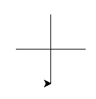
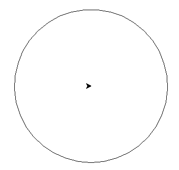
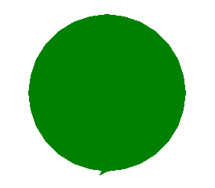

# Python<br>Découverte de la bibliothèque ```turtle``` (suite)

!!! bug "Objectif"

    - Découvrir l'environnement CAPYTALE
    - Créer des fonctions
    - Utiliser des fonctions
    - Modifier/adapter des fonctions

!!! question "Exercice - 1"
    Voici un code :

    ```
    import turtle as tu

    def tracer_carre(long_cote):
        for i in range(4):
            tu.forward(long_cote)
            tu.left(90)
    ```

    1. Recopiez-le et utilisez-le afin de tracer un carré de coté 200. Puis un carré de côté 300.
    2. Ecrire une fonction qui permet de tracer un polygone régulier. Voici la signature de cette fonction :  
    `fonction tracer_polygone(nb_cote : int, long_cote : int) : None`  
    Ainsi, `tracer_polygone(12,100)` permet d'obtenir :  
    [{.Center_lien }](../Image/poligone_01.png)  
    3. Ecrire une fonction qui permet de tracer une spirale. Voici la signature de cette fonction :  
    `fonction tracer_spirale(nb_etape : int, pas : int, angle : int) : None`  
    Ainsi, `tracer_spirale(100,2,72)` permet d'obtenir :  
    [{.Center_lien }](../Image/spirale_01.png)  

!!! danger "A connaitre"
    - Savoir construire une fonction qui respecte une signature
    - Savoir utiliser les paramètres d'une fonction au sein de cette fonction
    - Savoir utiliser une fonction

!!! question "Exercice - 2"
    
    1. On souhaite dessiner un plus $+$ en connaissant **la longueur** des traits du $+$.  
    Signature : `fonction tracer_plus(long_trait : int) : None`  
    Ainsi, `tracer_plus(50)` trace un plus ou chaque &laquo; petit &raquo; trait mesure 50.  
    [{.Center_lien }](../Image/plus_01.png)  
    2. On souhaite toujours dessiner un plus $+$ **mais en partant du point bas** du plus.  
    Signature : `fonction tracer_plus_bas(long_trait : int) : None`  
    **ATTENTION** : il est demandé d'utiliser la fonction précédente.  
    Ainsi, `tracer_plus_bas(50)` donne  
    [{.Center_lien }](../Image/plus_02.png)  

!!! danger "A connaitre"
    - Réflechir à ce qu'il faut faire : on recherche un algorithme
    - Savoir utiliser une fonction au sein d'une autre fonction

!!! note "D'autres méthodes"

    - ```turtle.circle(x)``` trace un cercle de rayon $x$ **en partant d'un point _sur_ le cercle**.
    - ```turtle.pencolor("red")``` change la couleur du tracer en rouge. Il y a aussi blue, purple, olive, magenta, orange, brown, cyan, yellow, green, pink, black, red, gray, white, ... (liste non exhaustive)
    - ```turtle.pencolor()``` renvoie la couleur de la tortue
    - ```turtle.setheading(x)``` oriente la tortue dans la direction $x$ :  
        - 0 la tortue pointe vers l'est
        - 90 la tortue pointe vers le nord
        - 180 la tortue pointe vers le sud
        - 270 la tortue pointe vers l'ouest

!!! question "Exercice -3"
    
    1. Tracer 2 cercles l'un de rayon 300, l'autre de rayon 200. Ces deux cercles ont-ils le même centre ? Etait-ce prévisible ?
    2. Ecrire une fonction qui teleporte la tortue à un point dont les coordonnées sont des paramètres de cette fonction.  
    Signature `fonction teleporte(x : int, y : int) : None`
    3. On souhaite souvent tracer un cercle en connaissant son centre, son rayon et sa couleur. De plus, cette fonction devra ramener la tortue au centre du cercle. Ecrire une fonction qui fait cela.  
    Signature `fonction cercle_centre(x_centre : int, y_centre : int, rayon : int, coul : str)`  
    Ainsi, `cercle_centre(200,100,150)` donne  
    [{.Center_lien }](../Image/cercle_01.png)

!!! question "Exercice - 4"
    
    1. On souhaite maintenant tracer un cercle en connaissant son centre, son rayon et sa couleur **et dessiner un + au niveau de son centre**. Ecrire une fonction qui fait cela. Pensez à utiliser la fonction `tracer_plus`.
    Signature `fonction cercle_centre_plus(x_centre : int, y_centre : int, rayon : int, coul : str)`  
    Ainsi, `cercle_centre(200,100,150)` donne  
    [{.Center_lien }](../Image/cercle_04.png)
    2. Après avoir tourner la tortue de 90$^{\circ}$, tracer un cercle de centre `(200,100)` et de rayon `150`. Que remarquez-vous ?
    3. Il faut donc modifier les fonctions `cercle_centre` et `cercle_centre_plus`. En effet, avant de commencer à tracer le cercle, il faut impérativement positionner la tortue dans la &laquo; direction de départ classique &raquo;. Faites-le.

!!! danger "A connaitre"
    - Une fonction qui semble faire ce qu'il faut ... peut ne pas le faire correctement dans tous les cas !
    - Réfléchir à ce qui ne va pas et proposer une solution

!!! note "Et pour finir"

    - ```turtle.begin_fill()``` et ```turtle.end_fill()``` permet remplir la forme dessinée **après** ```turtle.begin_fill()``` et avant ```turtle.end_fill()```  
    Par exemple  
    ```python
    import turtle as tu

    tu.color('green')
    tu.begin_fill()
    tu.circle(100)
    tu.end_fill()
    ```  
    affiche :  
    [{.Center_lien }](../Image/cercle_03.png)  
    - ```turtle.width(x)``` modifie la largeur de la trace, $x >0$.

!!! question "Exercice - 5"

    L'objectif est de construire une cible, c'est à dire des disques concentriques de couleurs alternées. Le nombre de disques sera ici un nombre pair.  
    Signature : `fonction cible(nb_de_pairs : int, largeur_totale : int) : None`  
    Ainsi `cible(3,600)` trace une cible avec 3 pairs de disques (il y a donc 6 disques) et le diamètre du plus grand disque est de 600.  
    [{.Center_lien }](../Image/cible_01.png)  

    ???- tip "Conseil"

        - Dans quel ordre faut-il tracer les disques pour **voir** tous les disques ?
        - Si on appelle `pas` la différence entre les rayons de deux disques successifs, exprimer `pas` en fonction de `largeur_totale` et de `nb_de_pairs`.

!!! danger "A connaitre"
    - Etre autonome face à un énoncé
    - Savoir réinvestir ce qui a été fait précédemment