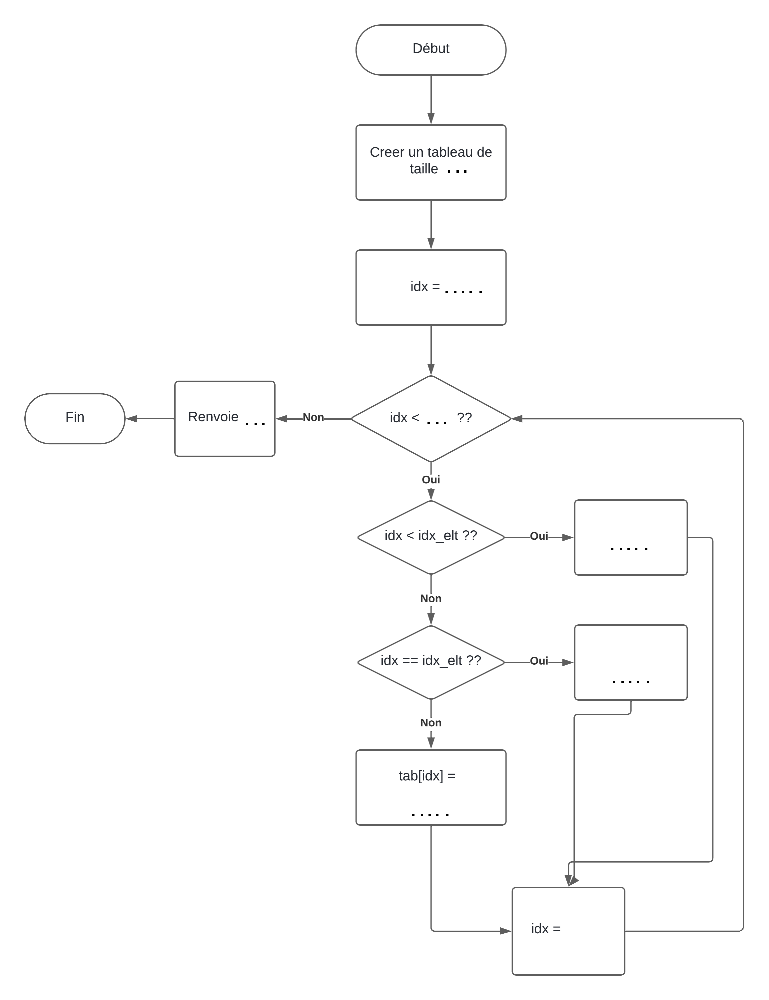

# Python<br>Autour des tableaux

!!! question "Exercice - 1"

    1. Ecrire une fonction qui transforme un chaine de caractères en un tableau dont chaque élément est un caractère de la chaine précédente.  
    Signature `fonction str_en_tab(ch : str) : list`  
    Par exemple, `str_en_tab("HELLO")` renvoie `['H', 'E', 'L', 'L', 'O']`.
    2. Ecrire une fonction qui transforme un tableau contenant des caractères en une chaine formée par ces caractères.  
    Signature `fonction tab_en_str(liste_car : list) : str`  
    Par exemple, `tab_en_str(['H', 'E', 'L', 'L', 'O'])` renvoie `HELLO`.

!!! question "Exercice - 2"

    1. On souhaite ajouter **à la fin** un entier à un tableau d'entier. Pour cela, il faut créer un tableau un peu plus grand, recopier les éléments du tableau de départ au début et ajouter un élément à la fin.  Ecrire une fonction qui ajoute un élément à la fin à un tableau.  
    Signature `ajout_fin_ds_tab(tab_init : list, elt : int) : list`  
    Par exemple :  
    ```python
    un_tab = [0,3,1,5,2,4]
    autre_tab = ajout_fin_ds_tab(un_tab,100)
    print(autre_tab) # Affiche [0, 3, 1, 5, 2, 4, 100]
    ```
    2. On souhaite ajouter un entier à un tableau d'entier à une position quelconque . Pour cela, on précisera l'indice du nouvel élément **dans le nouveau tableau**.  
    Signature `ajout_ds_tab(tab_init : list, elt : int, idx_elt : int) : list`  
    Pour écrire ce programme, analysons ce qu'il faut faire (complétez-le ! ):  
        - créer un tableau `tab` de la taille appropriée
        - parcourir tous les indices de `tab`
        - si l'indice est stritcement inférieur à `idx_elt`, alors ...
        - si l'indice est égal à `idx_elt`, alors ...
        - sinon ...
    
    En pratique, cette présentation est trop imprécise. On utilisera plutôt un algorigramme (avec `N` qui est la taille de `tab_init`):  
    [{.Center_lien .Vignette50}](../Image/diag_tab_vide.png)

    Par exemple :  
    ```python
    un_tab = [0,3,1,5,2,4]
    autre_tab = ajout_ds_tab(un_tab,100, 3)
    print(autre_tab) # Affiche [0, 3, 1, 100, 5, 2, 4]
    ```  

!!! question "Exercice - (EP 24-03-01)"
    Écrire la fonction `maximum_tableau`, prenant en paramètre un tableau non vide de nombres `tab` (de type `list`) et renvoyant le plus grand élément de ce tableau.

    Exemples :

    ```python
    >>> maximum_tableau([98, 12, 104, 23, 131, 9])
    131
    >>> maximum_tableau([-27, 24, -3, 15])
    24
    ```

!!! question "Exercice - (EP 24-05-01)"
    Écrire une fonction `max_et_indice` qui prend en paramètre un tableau non vide `tab` de nombres entiers et qui renvoie la valeur du plus grand élément de ce tableau ainsi que l’indice de sa première apparition dans ce tableau.

    L’utilisation de la fonction native `max` n’est pas autorisée.

    Exemples :

    ```python
    >>> max_et_indice([1, 5, 6, 9, 1, 2, 3, 7, 9, 8])
    (9, 3)
    >>> max_et_indice([-2])
    (-2, 0)
    >>> max_et_indice([-1, -1, 3, 3, 3])
    (3, 2)
    >>> max_et_indice([1, 1, 1, 1])
    (1, 0)
    ```

!!! question "Exercice - (EP 24-25-01)"
    Écrire une fonction `recherche_min` qui prend en paramètre un tableau de nombres `tab`, et qui renvoie l'indice de la première occurrence du minimum de ce tableau. Les tableaux seront représentés sous forme de liste Python.

    Exemples :
    ```python
    >>> recherche_min([5])
    0
    >>> recherche_min([2, 4, 1])
    2
    >>> recherche_min([5, 3, 2, 2, 4])
    2
    >>> recherche_min([-1, -2, -3, -3])
    2
    ```

!!! question "Exercice - (EP 24-38-01)"
    Écrire une fonction `indices_maxi` qui prend en paramètre un tableau non vide de nombre entiers `tab`, représenté par une liste Python et qui renvoie un tuple (`maxi`, `indices`) où :

    - `maxi` est le plus grand élément du tableau `tab` ;
    - `indices` est une liste Python contenant les indices du tableau `tab` où apparaît ce plus grand élément.

    Exemple :
    ```python
    >>> indices_maxi([1, 5, 6, 9, 1, 2, 3, 7, 9, 8])
    (9, [3, 8])
    >>> indices_maxi([7])
    (7, [0])
    ```

!!! question "Exercice - (EP 24-14-01)"
    Écrire une fonction `min_et_max` qui prend en paramètre un tableau de nombres `tab` non vide, et qui renvoie la plus petite et la plus grande valeur du tableau sous la forme d’un dictionnaire à deux clés `min` et `max`.  
    Les tableaux seront représentés sous forme de liste Python.  
    L’utilisation des fonctions natives `min`, `max` et `sorted`, ainsi que la méthode `sort` n’est pas autorisée.

    Exemples :

    ```python
    >>> min_et_max([0, 1, 4, 2, -2, 9, 3, 1, 7, 1])
    {'min': -2, 'max': 9}
    >>> min_et_max([0, 1, 2, 3])
    {'min': 0, 'max': 3}
    >>> min_et_max([3])
    {'min': 3, 'max': 3}
    >>> min_et_max([1, 3, 2, 1, 3])
    {'min': 1, 'max': 3}
    >>> min_et_max([-1, -1, -1, -1, -1])
    {'min': -1, 'max': -1}
    ```

!!! question "Exercice - (EP 24-04-01)"
    Programmer la fonction `recherche`, prenant en paramètres un tableau non vide `tab` (type `list`) d'entiers et un entier `n`, et qui renvoie l'indice de la **dernière** occurrence de l'élément cherché. Si l'élément n'est pas présent, la fonction renvoie `None`.

    Exemples
    ```python
    >>> recherche([5, 3], 1) # renvoie None
    2
    >>> recherche([2, 4], 2)
    0
    >>> recherche([2, 3, 5, 2, 4], 2)
    3
    ```

!!! question "Exercice - (EP 24-17-01)"
    Écrire une fonction Python appelée `nb_repetitions` qui prend en paramètres un élément `elt` et un tableau `tab` (type `list`) et renvoie le nombre de fois où l’élément apparaît dans le tableau.

    Exemples :
    ```python
    >>> nb_repetitions(5, [2, 5, 3, 5, 6, 9, 5])
    3
    >>> nb_repetitions('A', ['B', 'A', 'B', 'A', 'R'])
    2
    >>> nb_repetitions(12, [1, 3, 7, 21, 36, 44])
    0
    ```

!!! question "Exercice - (EP 24-39-01)"
    Écrire une fonction `recherche` qui prend en paramètres `elt` un nombre entier et `tab` un tableau de nombres entiers (type ```list``` ), et qui renvoie l’indice de la dernière occurrence de `elt` dans `tab` si `elt` est dans `tab` et `None` sinon.

    Exemples :
    ```python
    >>> recherche(1, [2, 3, 4]) # renvoie None
    >>> recherche(1, [10, 12, 1, 56])
    2
    >>> recherche(1, [1, 0, 42, 7])
    0
    >>> recherche(1, [1, 50, 1])
    2
    >>> recherche(1, [8, 1, 10, 1, 7, 1, 8])
    5
    ```

!!! question "Exercice - (EP 24-45-01)"
    Écrire une fonction `compte_occurrences` prenant en paramètres une valeur `x` et un tableau `tab` (de type `list`) et renvoyant le nombre d’occurrences de `x` dans `tab`.  
    L’objectif de cet exercice étant de parcourir un tableau, il est interdit d’utiliser la méthode `count` des listes Python.

    Exemples :

    ```python
    >>> compte_occurrences(5, [])
    0
    >>> compte_occurrences(5, [-2, 3, 1, 5, 3, 7, 4])
    1
    >>> compte_occurrences('a', ['a','b','c','a','d','e','a'])
    3
    ```

!!! question "Exercice - (EP 24-06-01)"
    Écrire une fonction `verifie` qui prend en paramètre un tableau de valeurs numériques et qui renvoie `True` si ce tableau est trié dans l’ordre croissant, `False` sinon.  
    Un tableau vide est considéré comme trié.

    Exemples :

    ```python
    Exemples :
    >>> verifie([0, 5, 8, 8, 9])
    True
    >>> verifie([8, 12, 4])
    False
    >>> verifie([-1, 4])
    True
    >>> verifie([])
    True
    >>> verifie([5])
    True
    ```

!!! question "Exercice - (EP 24-13-02)"
    On considère la fonction `insere` ci-dessous qui prend en argument un tableau `tab` d’entiers triés par ordre croissant et un entier `a`.  
    Cette fonction crée et renvoie un nouveau tableau à partir de celui fourni en paramètre en y insérant la valeur `a` de sorte que le tableau renvoyé soit encore trié par ordre croissant. Les tableaux seront représentés sous la forme de listes Python.

    ```python linenums='1'
    def insere(tab, a):
        """
        Insère l'élément a (int) dans le tableau tab (list)
        trié par ordre croissant à sa place et renvoie le
        nouveau tableau.
        """
        tab_a = [ a ] + tab # nouveau tableau contenant a 
                            # suivi des éléments de tab
        i = 0
        while i < ... and a > ...: 
            tab_a[i] = ... 
            tab_a[i+1] = a
            i = ... 
        return tab_a
    ```


!!! question "Exercice - (EP 24-43-01)"
    Écrire une fonction `a_doublon` qui prend en paramètre un tableau **trié** de nombres dans l’ordre croissant et renvoie `True` si ce tableau contient au moins deux nombres identiques, `False` sinon.

    Exemple :

    ```python
    >>> a_doublon([])
    False
    >>> a_doublon([1])
    False
    >>> a_doublon([1, 2, 4, 6, 6])
    True
    >>> a_doublon([2, 5, 7, 7, 7, 9])
    True
    >>> a_doublon([0, 2, 3])
    False
    ```

!!! question "Exercice - (EP 24-41-02)"
On rappelle que les tableaux sont représentés par des listes en Python du type `list`.  
Le but de cet exercice est d’écrire une fonction ajoute qui prend en paramètres trois arguments `indice`, `element` et `tab` et renvoie un tableau `tab_ins` dans lequel les éléments sont ceux du tableau `tab` avec, en plus, l’élément `element` à l’indice `indice`.  
On considère que les variables `indice` et `element` sont des entiers positifs et que les éléments de `tab` sont également des entiers.  
En réalisant cette insertion, Les éléments du tableau `tab` dont les indices sont supérieurs ou égaux à `indice` apparaissent décalés vers la droite dans le tableau `tab_ins`.  
Si `indice` est égal au nombre d’éléments du tableau `tab`, l’élément `element` est ajouté dans `tab_ins` après tous les éléments du tableau `tab`.  

Exemples :

```python
>>> ajoute(1, 4, [7, 8, 9])
[7, 4, 8, 9]
>>> ajoute(3, 4, [7, 8, 9])
[7, 8, 9, 4]
>>> ajoute(0, 4, [7, 8, 9])
[4, 7, 8, 9]
```

Compléter et tester le code ci-dessous :

```python
def ajoute(indice, element, tab):
    '''Renvoie un nouveau tableau obtenu en insérant
    element à l'indice indice dans le tableau tab.'''
    nbre_elts = len(tab)
    tab_ins = [0] * (nbre_elts + 1)
    for i in range(indice):
        tab_ins[i] = ... 
    tab_ins[...] = ... 
    for i in range(indice + 1, nbre_elts + 1):
        tab_ins[i] = ... 
    return tab_ins
```

!!! question "Exercice - (EP 24-07-01)"
    On considère dans cet exercice une représentation binaire d’un entier non signé en tant que
    tableau de booléens.
    Si

    ```python
    tab = [True, False, True, False, False, True, True]
    ```

    est un tel tableau, alors l’entier qu’il représente est $2^6 +2^4 + 2^1 + 2^0 = 83$. Cette représentation consistant à placer en premier le booléen indiquant la puissance la plus élevée de 2 est dite *big-endian* ou grand-boutiste.  
    Écrire une fonction `gb_vers_entier` qui prend en paramètre un tel tableau et renvoie l’entier qu’il représente.

    Exemple :

    ```python
    >>> gb_vers_entier([])
    0
    >>> gb_vers_entier([True])
    1
    >>> gb_vers_entier([True, False, True, False, False, True, True])
    83
    >>> gb_vers_entier([True, False, False, False, False, False, True, False])
    130
    ```

!!! question "Exercice - (EP 24-15-01)"
    Écrire une fonction `moyenne` qui prend en paramètre un tableau non vide de nombres flottants et qui renvoie la moyenne des valeurs du tableau. Les tableaux seront représentés sous forme de liste Python.

    Exemples :
    ```python
    >>> moyenne([1.0])
    1.0
    >>> moyenne([1.0, 2.0, 4.0])
    2.3333333333333335
    ```

!!! question "Exercice - (EP 24-20-01)"
    Dans cet exercice les tableaux sont représentés par des listes Python (type `list`).  
    Écrire en python deux fonctions :

    - `lancer` de paramètre `n`, un entier positif, qui renvoie un tableau de `n` entiers obtenus aléatoirement entre 1 et 6 (1 et 6 inclus) ;
    - `paire_6` de paramètre `tab`, un tableau de n entiers compris entre 1 et 6 et qui renvoie un booléen égal à `True` si le nombre de 6 est supérieur ou égal à 2, `False` sinon.

    On pourra utiliser la fonction `randint(a,b)` du module `random` pour laquelle la documentation officielle est la suivante :  
    `random.randint(a, b) Renvoie un entier aléatoire N tel que a <=N <= b.`

    Exemples :

    ```python
    >>> lancer1 = lancer(5)
    [5, 6, 6, 2, 2]
    >>> paire_6(lancer1)
    True
    >>> lancer2 = lancer(5)
    [6, 5, 1, 6, 6]
    >>> paire_6(lancer2)
    True
    >>> lancer3 = lancer(3)
    [2, 2, 6]
    >>> paire_6(lancer3)
    False
    >>> lancer4 = lancer(0)
    []
    >>> paire_6(lancer4)
    False
    ```

!!! question "Exercice - (EP 24-25-02)"
    On considère la fonction `separe` ci-dessous qui prend en argument un tableau `tab` dont les éléments sont des `0` et des `1` et qui sépare les `0` des `1` en plaçant les `0` en début de tableau et les `1` à la suite.

    ```python linenums='1'
    def separe(tab):
        '''Separe les 0 et les 1 dans le tableau tab'''
        gauche = 0
        droite = ... 
        while gauche < droite:
            if tab[gauche] == 0 :
                gauche = ... 
            else :
                tab[gauche] = ... 
                tab[droite] = ... 
                droite = ... 
        return tab
    ```

    Compléter la fonction separe ci-dessus.  
    Exemples :

    ```python
    >>> separe([1, 0, 1, 0, 1, 0, 1, 0])
    [0, 0, 0, 0, 1, 1, 1, 1]
    >>> separe([1, 0, 0, 0, 1, 1, 0, 1, 1, 0, 1, 0, 1, 1, 1, 0])
    [0, 0, 0, 0, 0, 0, 0, 1, 1, 1, 1, 1, 1, 1, 1, 1]
    ```

    Description d’étapes effectuées par la fonction separe sur le tableau ci-dessous, les caractères ^ indiquent les cases pointées par les indices gauche et droite :

    ```python
    tab = [1, 0, 1, 0, 1, 0, 1, 0]
        ^                    ^
    ```

    **Etape 1 :** on regarde la première case, qui contient un 1 : ce 1 va aller dans la seconde partie du tableau final et on l’échange avec la dernière case. Il est à présent bien positionné : on ne prend plus la dernière case en compte.

    ```python
    tab = [0, 0, 1, 0, 1, 0, 1, 1]
        ^                 ^
    ```

    **Etape 2 :** on regarde à nouveau la première case, qui contient maintenant un 0 : ce 0 va aller dans la première partie du tableau final et est bien positionné : on ne prend plus la première case en compte.

    ```python
    tab = [0, 0, 1, 0, 1, 0, 1, 1]
            ^              ^
    ```

    **Etape 3 :** on regarde la seconde case, qui contient un 0 : ce 0 va aller dans la première partie du tableau final et est bien positionné : on ne prend plus la seconde case en compte.

    ```python
    tab = [0, 0, 1, 0, 1, 0, 1, 1]
                ^           ^
    ```

    **Etape 4 :** on regarde la troisième case, qui contient un 1 : ce 1 va aller dans la seconde partie du tableau final et on l’échange avec l’avant-dernière case. Il est à présent bien positionné : on ne prend plus l’avant-dernière case en compte.

    ```python
    tab = [0, 0, 1, 0, 1, 0, 1, 1]
                ^        ^
    ```

    Et ainsi de suite...

    ```python
    tab = [0, 0, 0, 0, 1, 1, 1, 1]
    ``` 


!!! question "Exercice - (EP 24-28-02)"
    On considère la fonction `eleves_du_mois` prenant en paramètres `eleves` et `notes` deux tableaux de même longueur, le premier contenant le nom des élèves et le second, des entiers positifs désignant leur note à un contrôle de sorte que `eleves[i]` a obtenu la note `notes[i]`.  
    Cette fonction renvoie le couple constitué de la note maximale attribuée et des noms des élèves ayant obtenu cette note regroupés dans un tableau.  
    Ainsi, l’instruction `eleves_du_mois(['a', 'b', 'c', 'd'], [15, 18, 12, 18])` renvoie le couple `(18, ['b', 'd'])`.

    ```python linenums='1'
    def eleves_du_mois(eleves, notes):
        note_maxi = 0
        meilleurs_eleves =  ...

        for i in range(...) :
            if notes[i] == ... :
                meilleurs_eleves.append(...)
            elif notes[i] > note_maxi:
                note_maxi = ...
                meilleurs_eleves = [...]

        return (note_maxi,meilleurs_eleves)
    ```

    Compléter ce code.

    Exemples :

    ```python
    >>> eleves_nsi = ['a','b','c','d','e','f','g','h','i','j']
    >>> notes_nsi = [30, 40, 80, 60, 58, 80, 75, 80, 60, 24]
    >>> eleves_du_mois(eleves_nsi, notes_nsi)
    (80, ['c', 'f', 'h'])
    >>> eleves_du_mois([],[])
    (0, [])
    ``` 


!!! question "Exercice - (EP 24-29-01)"
    Écrire une fonction `moyenne(notes)` qui renvoie la moyenne pondérée des résultats contenus dans le tableau `notes`, non vide, donné en paramètre. Ce tableau contient des couples `(note, coefficient)` dans lesquels :

    - `note` est un nombre de type flottant (`float`) compris entre 0 et 20 ;
    - `coefficient` est un nombre entier strictement positif.

    Ainsi l’expression `moyenne([(15.0,2),(9.0,1),(12.0,3)])` devra renvoyer `12.5`.

    $\dfrac{2 \times 15 + 1 \times 9 + 3 \times 12 }{2+1+3}=12,5$


!!! question "Exercice - (EP 24-35-01)"
    On a relevé les valeurs moyennes annuelles des températures à Paris pour la période allant de 2013 à 2019. Les résultats ont été récupérés sous la forme de deux tableaux (de type `list`) : l’un pour les températures, l’autre pour les années :

    ```python
    t_moy = [14.9, 13.3, 13.1, 12.5, 13.0, 13.6, 13.7]
    annees = [2013, 2014, 2015, 2016, 2017, 2018, 2019]
    ```

    Écrire la fonction `annee_temperature_minimale` qui prend en paramètres ces deux tableaux et qui renvoie la plus petite valeur relevée au cours de la période et l’année correspondante.  
    On suppose que la température minimale est atteinte une seule fois.

    Exemple :

    ```python
    >>> annee_temperature_minimale(t_moy, annees)
    (12.5, 2016)
    ```

!!! question "Exercice - (EP 24-37-01)"
    Programmer la fonction ```moyenne```   prenant en paramètre un tableau d'entiers ```tab``` (de type `list`) qui renvoie la moyenne de ses éléments si le tableau est non vide. Proposer une façon de traiter le cas où le tableau passé en paramètre est vide.  
    Dans cet exercice, on s’interdira d’utiliser la fonction Python `sum`.

    Exemples :

    ```python
    >>> moyenne([5,3,8])
    5.333333333333333
    >>> moyenne([1,2,3,4,5,6,7,8,9,10])
    5.5
    >>> moyenne([])
    # Comportement différent suivant le traitement proposé.
    ```

!!! question "Exercice - (EP 24-42-01)"

    Écrire une fonction `moyenne` qui prend en paramètre un tableau d’entiers non vide et qui renvoie un nombre flottant donnant la moyenne de ces entiers.  
    **Attention** : il est interdit d’utiliser la fonction `sum` ou la fonction `mean` (module `statistics`) de Python.

    Exemples :

    ```python
    >>> moyenne([1])
    1.0
    >>> moyenne([1, 2, 3, 4, 5, 6, 7])
    4.0
    >>> moyenne([1, 2])
    1.5
    ```

