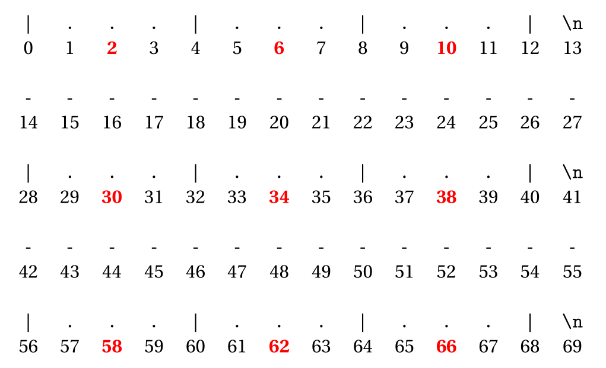

# Python<br> Différences entre les structures<br>Tic-tac-toe (partie 1)

Le plateau du jeu est composé de neufs cases qui peuvent contenir un ``` x ``` (un espace un x et un espace), un ``` o ``` (un espace un o et un espace) ou rien (représenté par trois espaces). Des caractères de séparation pour les colonnes (```|```) et les lignes (```-```) rendront le plateau plus lisible.

Voici par exemple, un tel plateau

```python
plateau="| x | o |   |\n-------------\n|   |   |   |\n-------------\n| o |   |   |"
print(plateau)
```

{{ IDE() }} 

**1)** Ecrire une fonction qui crée le plateau vide.  
Signature `Fonction creer_plateau() : str`  
Ainsi, `print(creer_plateau())` affichera :  

```
|   |   |   |
-------------
|   |   |   |
-------------
|   |   |   |
```  
Vous **devrez** utiliser l'opération *répétition* et *concaténation*.

**2)** Ecrire une fonction qui affichera (donc avec un `print`) un plateau.  
Signature `Fonction afficher(plateau : str) : None`  

**3)** Ecrire une fonction qui remplace un caractère d'indice donné dans une chaine par un caractère précis.  
Signature `Fonction substitue(chaine : str, idx_car : int, car_rempl : str) :str`  
Par exemple, `substitue('Bonjour', 2, 'k')` renvoie `Bokjour` !

Analysons la chaine de caractères liée au plateau :

[{.Center_lien .Vignette40}](../Image/Tp03_01.png)

L'objectif est de pouvoir associer à un couple `(idx_lig, idx_col)` l'indice du caractère à modifier.  
Ainsi, le couple `(0,0)` correspond au caractère d'indice $2$ et le couple `(1,2)` correspond au caractère d'indice $38$.  

**3)** On considére la fonction suivante :

```python
def mystere(idx_lig, idx_col):
    return 4*idx_col + 2 + idx_lig * 28 
```

Qu'affiche le code suivant ?

```python
for i in range(3):
    for j in range(3):
        print('(' + str(i) + ',' + str(j) + ') -> ' + str(mystere(i,j)))
```

Renommer la fonction en conséquence !

**4)** Ecrire une fonction qui modifie le caractère du plateau qu'il faut lorsque le joueur précise de le numéro de ligne, le numéro de colonne et son caractère (`O` ou `X`).  
Signature `Fonction placer_jeton(plateau : str, idx_lig : int, idx_col : int, car_joueur : int) : str`
Ainsi, 

```python
un_plateau = creer_plateau()
un_plateau = placer_jeton(un_plateau, 1,1, 'X')
afficher(un_plateau)
```

affiche

```
|   |   |   |
-------------
|   | X |   |
-------------
|   |   |   |
```

**5)** Ecrire une fonction `case_est_vide` qui renvoie `True` si la case (dont l'indice de la ligne et l'indice de la colonne sont précisés en argument) est vide et `False` sinon !  
Signature `Fonction case_est_vide(plateau : str, idx_lig: int, idx_col: int) : bool`.  
Ainsi :

```python
un_plateau = creer_plateau()
un_plateau = placer_jeton(un_plateau, 1,1, 'X')
print(case_est_vide(un_plateau, 0,0)) # Affiche True
print(case_est_vide(un_plateau, 1,1)) # Affiche False
```

**6)** Ecrire une fonction qui renvoie `True` si il reste au moins une case vide dans le `plateau` et `False` sinon.  
Signature `Fonction reste_case_vide(plateau : str) : bool`  

???- tip "Aide"
    Dès qu'une case vide est rencontrée, il faut renvoyer `True` !

**7)** Compléter la fonction suivante afin que :

- si il n'y a pas **d'alignement horizontal d'un même symbole**, elle renvoie `''` (la chaine vide) 
- sinon, elle renvoie le symbole en question.

```python
def alignement_ligne(plateau):
    rep = ''
    for i in range(3):
        if (not case_est_vide(plateau, ..., ... )) and plateau[calcul_idx_car( ... , ... )] == ... == ... :
            rep = ...
    return ...
```

**8)** En vous inspirant de la fonction précédente, écrire la fonction suivante afin que :

- si il n'y a pas **d'alignement verticale d'un même symbole**, elle renvoie `''` (la chaine vide) 
- sinon, elle renvoie le symbole en question.

Signature : `Fonction alignement_colonne(plateau : str) : bool`

**9)** Ecrire une fonction qui fait la même chose pour l'alignement sur les deux diagonales.  
Signature : `Fonction alignement_diagonale(plateau : str) : bool`

**10)** Expliquer (dans le contexte du jeu) les différentes valeurs renvoyées par la fonction suivante :

```python
def etat_jeu(plateau):
    rep=''
    rep=alignement_ligne(plateau)
    if rep=='':
        rep=alignement_colonne(plateau)
        if rep=='':
            rep=alignement_diagonale(plateau)
            if rep=='' and not(reste_case_vide(plateau)):
                rep='match nul'
            elif rep=='':
                rep='a suivre'
    return rep
```

**11)** Compléter en utilisant les fonctions précédemment créées la fonction qui permet de jouer :

```python
def jouer():
    un_plateau = ...
    joueur = "X"
    while ...  == "a suivre":
        ...
        num_lig = int(input("Joueur " + joueur + " : quelle ligne (entre 1 et 3) : "))
        num_col = int(input("Joueur " + joueur + " : quelle colonne (entre 1 et 3) : "))
        while (not ... ):
            print("La case (" + str(num_lig) + " ; " + str(num_col) + ") est occupée !")
            num_lig = int(input("Joueur " + joueur + " : quelle ligne (entre 1 et 3) : "))
            num_col = int(input("Joueur " + joueur + " : quelle colonne (entre 1 et 3) : "))
        un_plateau = ...
        if joueur == "X":
            joueur = "O"
        else:
            joueur = "X"
    afficher(un_plateau)
    if ... == "X":
        print("Bravo au joueur X")
    elif ... == "O":
        print("Bravo au joueur O")
    else:
        print("match nul !")
```