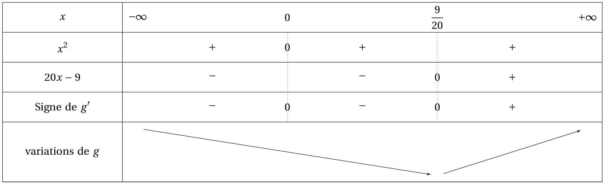

# Dérivation Applications de la dérivation.

## Dérivation et sens de variations.

!!! abstract "Théorème"
    $f$ est une fonction dérivable sur un intervalle $I$.

    - si $f$ est croissante sur $I$ alors pour tout $x$ de $I$:  $f '(x) \geq 0$.
    - si $f$ est décroissante sur $I$ alors pour tout $x$ de $I$ : $f '(x)\leq 0$.
    - si $f$ est constante sur $I$, alors pour tout $x$ de $I$ : $f '(x) = 0$.

???- abstract "Démonstration"
    **Cas où $f$ est croissante sur $I$ :**

    Soit $x$ un réel de $I$ et $h$ tel que $x + h \in I$.

    - Si $h > 0$, alors $x + h \geq x$. Or $f$ est croissante sur $I$, donc $f(x +h) \geq f(x)$
    - Si $h < 0$, alors $x + h \leq x$. Or $f$ est décroissante sur $I$ donc $f(x + h) \leq f(x)$.

    Dans tous les cas $f(x +h)- f(x)$ est du même signe que $h$. Donc   $\frac{f(x +h)- f(x)}{h} \geq 0$. Or $f$ est dérivable, donc $\frac{f(x +h)- f(x)}{h}$  a pour limite $f'(x)$ quand $h$ tend vers $0$. D'où $f'(x)\geq 0$.

!!! abstract "Théorème"
    $f$ est une fonction dérivable sur un intervalle $I$.

    - si pour tout $x$ de $I$, $f'(x) \geq 0$ alors $f$ est croissante sur $I$.
    - si pour tout $x$ de $I$, $f'(x)=0$ alors $f$ est constante sur $I$.
    - Si pour tout $x$ de $I$, $f'(x) \leq 0$ alors $f$ est décroissante sur $I$.

???- info "Conséquence"
    $f$ est une fonction dérivable sur un intervalle $I$.

    - $f' \geq 0$ sur $I$ équivaut à $f$ est croissante sur $I$.
    - $f' \leq 0$ sur $I$ équivaut à $f$ est décroissante sur $I$.
    - $f' = 0$ sur $I$ équivaut à $f$ est constante sur $I$.

???- tip "Méthode pour les inégalités strictes"
    $f$ est une fonction dérivable sur un intervalle $I$.

    - Si pour tout x de I, f '(x) > 0 alors f est strictement croissante sur I.
    - Si pour tout x de I, f '(x) > 0 sauf en un nombre fini de réels où f ' s'annule, alors f est strictement croissante.

!!! example "Exemple"
    Soit $g(x) = 5x^4 - 3x^3$ définie sur $\R$.
    
    Alors $g '(x) = 20x^3 - 9 x^2 = x^2(20x - 9)$

    [{.Center_lien .Vignette60}](../Image/der_app_01.png)

    $g'$ est strictement négatif sur $\left]-\infty ; \dfrac{9}{20} \right]$ et s'annule en deux valeurs $\left(x = 0 \text{ et } x = \dfrac{20}{9} \right)$, donc $g$ est strictement décroissante sur $\left]-\infty ; \dfrac{9}{20} \right]$.

## Dérivation et Extremum

!!! info "Définition"
    $f$ est une fonction définie sur un intervalle $I$ et $c$ un réel de $I$. Dire que $M = f(c)$  est un maximum local de $f$ en $c$ signifie qu'il existe un intervalle ouvert $J$ contenant $c$ tel que pour tout $x$ dans $I \cap J$, $f(x) \leq f(c)$.

!!! info "Remarques"
    - De façon analogue, on définit un  minimum local de $f$.
    - Un extremum local est un maximum local ou un minimum local.

<!-- %Avec la figure ci-contre : f est définie sur [-4 ; 6]
%f(-1) = 4 est un maximum local. f(3) = -4 est un minimum local.
%Est-ce que f(6) = 8 est un maximum local ? Non, car il faut un intervalle ouvert inclus dans I contenant 6 et un tel intervalle n'existe pas. -->

!!! abstract "Théorème"
    $f$ est une fonction dérivable sur un intervalle ouvert $I$ et $x_0$ est un réel de $I$. Si $f(x_0)$ est un extremum local de $f$ alors $f'(x_0) = 0$.

!!! warning "Attention !!"
    **La réciproque est fausse.** Par exemple $f(x) = x^3$ a pour dérivée $f'(x) = 3x^2$ qui s'annule en $0$. Or $0$ n'est pas un extremum local. Mais on a le théorème suivant : 

!!! abstract "Théorème"
    $f$ est une fonction dérivable sur un intervalle ouvert $I$ et $x_0$ est un réel de $I$. Si $f'$ s'annule en $x_0$ **en changeant de signe** alors $f(x_0)$ est un extremum local.

## Majorant, minorant

!!! info "Définition"
    $f$ est une fonction et $D$ une partie de son ensemble définition. On appelle majorant de $f$ sur $D$ un nombre $M$ tel que pour tout $x$ de $D$, $f(x) \leq M$. 

!!! info "Définition"
    $f$ est une fonction et $D$ une partie de son ensemble définition. On appelle minorant de $f$ sur $D$ un nombre $m$ tel que pour tout $x$ de $D$, $f(x) \geq m$. 

!!! info "Définition"
    $f$ est une fonction et $D$ une partie de son ensemble définition. On dit que $f$ est bornée sur $I$ si $f$ admet un majorant et un minorant.

<!-- %Dans l'exemple précédent, f possède des majorants sur [-4 ; 6] (9 par exemple). Elle n'a pas de minorants sur [-4 ; 6], et donc elle n'est pas bornée. -->

!!! info "Remarques"
    
    - Le maximum de $f$ sur $D$ (si il existe) est un majorant et c'est de plus le plus petit des majorants.
    - Le minimum de $f$ sur $D$ (si il existe) est un minorant et c'est de plus le plus grand des minorants.