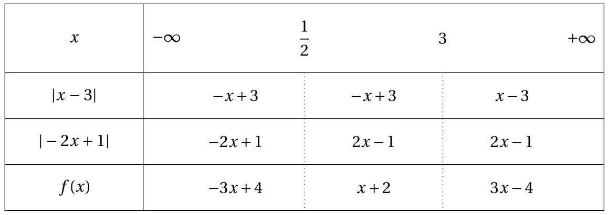

# Fonctions de références Fonction valeur absolue

## Valeur absolue d'un réel

!!! note "Définition"
    La valeur absolue de $x$, notée $|x|$, est la distance entre $x$ et zéro. Ainsi:
    
    - $|x| = x$ si $x$ est positif;
    - $|x| = -x$ si $x$ est négatif.

!!! example "Exemple"
    $\left| 8 \right| = 8 \ ;\  \left| - 5 \right| = 5 \ ;\  \left| 0 \right| = 0$.

    $\left| \pi - 3 \right| = \pi - 3$ car $\pi - 3$ est positif.

    $\left| 1 - \sqrt 2 \right| = - \left( 1 - \sqrt 2 \right) = - 1 + \sqrt 2$ car $1 - \sqrt 2$ est négatif.

!!! abstract "Théorème"
    Pour tous les réels $x$ et $y$ :
  
    - $\left| x \right| \geq 0$
    - $\left| { - x} \right| = \left| x \right|$
    - $\sqrt{x^2} = \left| x \right|$
    - $\left| x \right| = 0 \Leftrightarrow x = 0$
    - $\left| x \right| = \left| y \right| \Leftrightarrow x = y{\text{ ou }}x = - y$

!!! abstract "Théorème"
    On considère la droite des réels munie du repère ($O$ \ ;\  $I$).  

    - Si $M$ est un point d'abscisse $x$, alors $OM = \left| x \right|$.  
    DESSIN A FAIRE
    - Si $A$ et $B$ sont deux points d'abscisses respectives $a$ et $b$, alors $AB = \left| a - b \right| = \left| b - a \right|$.  
    DESSIN A FAIRE

!!! example "Exemple"
    Une droite est munie d'un repère ($O$ \ ;\  $I$). Sur cette droite, on considère les points $A$ et $B$ d'abscisses respectives $-3$ et 2,5.

    Calculer les distances $OA$, $AB$ et $BI$.

    DESSIN A FAIRE

    ???- done "Solution"
        $OA = |x_A - x_O| = |-3 - 0| = 3$
        
        $AB = |x_B - x_A| = |2,5 + 3| = 5,5$
        
        $BI = |x_I - x_B| = |1 - 2,5| = |-1,5| = 1,5$

## Fonction valeur absolue

!!! note "Définition"
    La **fonction valeur absolue** est la fonction $f$ définie sur $\R$ par $f\left( x \right) = \left| x \right|$.

!!! abstract "Théorème"
    La fonction valeur absolue est strictement décroissante sur $\left] { - \infty \ ;\ 0} \right]$ et strictement croissante sur $\left[ {0\ ;\  + \infty } \right[$.

???- abstract "Théorème"
    La fonction $x \mapsto -x$ est strictement décroissante sur $\left]-\infty\ \ ;\ \ 0 \right]$ et la fonction\linebreak $x \mapsto x$ est strictement croissante sur $\left[ {0\ \ ;\ \  + \infty } \right[$.

???- tip "Méthode - Étudier et représenter une fonction avec des valeurs absolues"
    Pour écrire l'expression $\left| {A(x)} \right|$ sans barre de valeur absolue, on cherche le signe de $A\left( x \right)$.

    Lorsque l'expression $A\left( x \right)$ est positive, alors $\left| {A(x)} \right| = A\left( x \right)$.

    Lorsque l'expression $A\left( x \right)$ est négative, alors $\left| {A(x)} \right| = - A\left( x \right)$.

???- example "Exemple"
    Écrire sans valeur absolue :

    $f\left( x \right) = \left| {x - 3} \right| + \left| { - 2x + 1}\right|$.

    Puis représenter $f$.

    ???- done "Solution"

        [{.Center_lien .Vignette50}](../Image/fct_ref_01.png)

        DESSIN A FAIRE