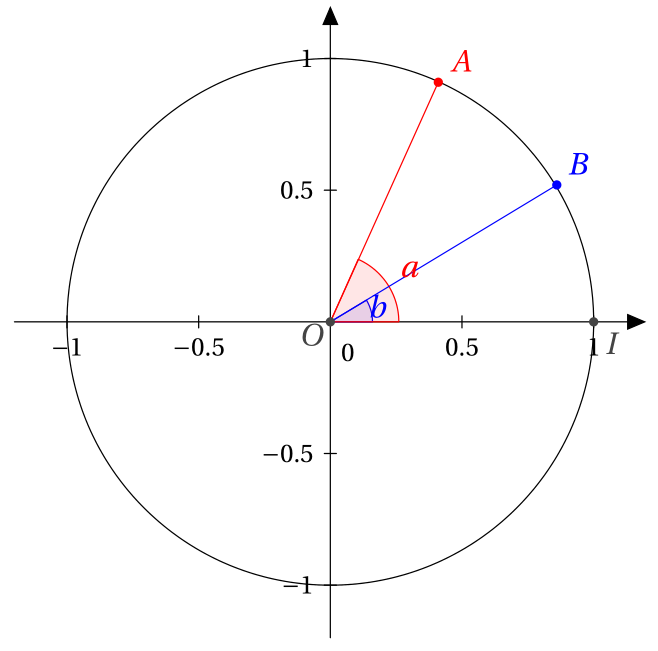

# Produit scalaire Applications

## Vecteur normal

!!! note "Définition"
    Dire qu'un vecteur $\vec{n}$ est **normal** à une droite $(d)$ signifie que $\vec{n} \neq \vec{0}$ et que la direction de $\vec{n}$ est orthogonale à celle de $(d)$. Ce qui revient à dire que $\vec{n}$ et $\vec{u}$ (un vecteur directeur de $(d)$) sont orthogonaux.

!!! abstract "Théorème"
    Dans un repère orthonormé, si $(d)$ a pour équation $ax+by+c=0$ (où $(a;b) \neq (0;0)$), alors $\vec{n}(a;b)$ est un vecteur normal de $(d)$.

    ???- abstract "Démonstration"
        $\vec{u}(-b;a)$ est un vecteur directeur, alors $\vec{n} \cdot \vec{u} = 0$.

!!! abstract "Théorème"
    Réciproquement :  
    si $\vec{n}(a;b) \neq (0;0)$ est un vecteur normal de $(d)$, alors une équation cartésienne de $(d)$ est $ax+by+c=0$ (où $c\in \R$).

    ???- abstract "Démonstration"
        Soit $A(x_0;y_0) \in (d)$.

        \[ \begin{eqnarray*}
        M \in (d) & \Leftrightarrow & \overrightarrow{AM} \text{ et } \vec{n} \text{ sont orthogonaux} \\
        & \Leftrightarrow & \overrightarrow{AM} \cdot \vec{n} = 0 \\
        & \Leftrightarrow & (x-x_0)a+(y-y_0)b=0 \quad \text{Forme à retenir} \\
        & \Leftrightarrow & ax + by + \underbrace{(-ax_0-by_0)}_{c} =0
        \end{eqnarray*} \]

!!! abstract "Théorème"

    - Si $(d)$ a pour équation réduite $y=mx+p$ alors un vecteur normal de $(d)$ est $(-m;1)$.
    - Si $(d)$ a pour équation réduite $x=k$ alors un vecteur normal de $(d)$ est $(1;0)$.

## Équation d'un cercle.

!!! abstract "Théorème - Avec un diamètre"
    On note $\repv$ un repère orthonormal. Soient $A(x_A;y_A)$ et $B(x_B;y_B)$ deux points distincts du plan. L'ensemble des points $M$ du plan tels que $\vect{AM} \cdot \vect{BM}=0$ est le cercle $\mc{C}$ de diamètre $[AB]$. Une équation cartésienne de $\mc{C}$ dans le repère $\repv$ est :

    \[ (x-x_A)(x-x_B)+(y-y_A)(y-y_B)=0 \]

    ???- abstract "Démonstration"

        \[ \begin{eqnarray*}
        \vect{AM} \cdot \vect{BM} = 0 & \Leftrightarrow & \vect{AM}=\vec{0} \text{ ou } \vect{BM}=\vec{0} \text{ ou } AM \times BM \times \cos  \widehat{AMB} = 0 \\
        & \Leftrightarrow & \vect{AM}=\vec{0} \text{ ou } \vect{BM}=\vec{0} \text{ ou } \widehat{AMB} = \dfrac{\pi}{2} \\
        & \Leftrightarrow & M=A \text{ ou } M=B \text{ ou le triangle } AMB \text{ est rectangle en } M \\
        & \Leftrightarrow & M \text{ appartient au cercle de diamètre } [AB] 
        \end{eqnarray*} \]

!!! abstract "Théorème - Avec le centre et le rayon"
    On note $\repv$ un repère orthonormal. Soit $\Omega$ un point du plan et $R$ un réel strictement positif. Le cercle $\mc{C}$ de centre $\Omega$ et de rayon $R$ est l'ensemble des points $M$ du plan tels que $\Omega M=R$, ou encore $\Omega M^2=R^2$. Une équation cartésienne de $\mc{C}$ dans $\repv$ est :

    \[ (x-x_{\Omega})^2+(y-y_{\Omega})^2=R^2 \]

## Calcul de longueurs et d'angles.

!!! abstract "Théorème - Théorème de la médiane"
    Soit $A,B,M$ trois points du plan et $I$ le milieu du segment $[AB]$. Alors ;

    \[ MA^2+MB^2=2 MI^2+2 IA^2\]

    ???- abstract "Démonstration"
        
        \[ \begin{eqnarray*}
        MA^2+MB^2 & = & \vect{MA}^2 + \vect{MB}^2 \\
        & = & (\vect{MI}+\vect{IA})^2+(\vect{MI}+\vect{IB})^2\\
        & = & \vect{MI}^2+2\vect{MI} \cdot \vect{IA}+\vect{IA}^2+\vect{MI}^2+2\vect{MI} \cdot \vect{IB}+\vect{IB}^2 \\
        & = & 2\vect{MI}^2+2\vect{MI}\cdot (\vect{IA} + \vect{IB})+\vect{IA}^2+\vect{IB}^2 \\
        & = & 2\vect{MI}^2+2\vect{IA}^2 \\
        \end{eqnarray*} \]

        En effet, comme $I$ est le milieu de $[AB]$, on a $\vect{IA}+\vect{IB}=\vec{0}$ et $IA=IB$.

!!! abstract "Théorème - Théorème d'Al-Kashi ou de Pythagore généralisé"
    Soit $ABC$ un triangle. On pose $BC = a,CA=b$ et $AB=c$, alors :

    - $a^2=b^2+c^2-2b c \cos \widehat{A}$
    - $b^2=c^2+a^2-2c a \cos \widehat{B}$
    - $c^2=a^2+b^2-2a b \cos \widehat{C}$

    ???- abstract "Démonstration"

        \[ \begin{eqnarray*}
        a^2 & = & BC^2 \\
        & = & \left (\vect{BA}+\vect{AC}\right )^2\\
        & = & \vect{BA}^2+\vect{AC}^2+2\times \vect{BA} \cdot \vect{AC} \\
        & = & BA^2+AC^2-2\vect{AB} \cdot \vect{AC} \\
        & = & c^2+b^2-2\| \vect{AB} \| \times \| \vect{AC} \| \cos\anglev{AB}{AC}\\
        & = & c^2+b^2-2 b a \times \cos \widehat{A}
        \end{eqnarray*} \]

## Formule de trigonométrie

!!! abstract "Théorème"
    Pour tous réels $a$ et $b$, on a les formules :

    - $\cos (a-b)=\cos(a) \cos(b)+\sin(a)\sin(b)$
    - $\cos (a+b)=\cos(a) \cos(b)-\sin(a)\sin(b)$
    - $\sin (a-b)=\sin(a) \cos(b)-\sin(b)\cos(a)$
    - $\sin (a+b)=\sin(a) \cos(b)+\sin(b)\cos(a)$

    ???- abstract "Démonstration"

        Soit $\mc{C}$ le cercle trigonométrique, $A$ et $B$ deux points de $\mc{C}$ tels que $\anglev{i}{OA}=a$ et $\anglev{i}{OB}=b$.  
        [{.Center_lien .Vignette40}](../Image/pdt_scal_03.png)

        Calculons de deux manières différentes $\vect{OB} \cdot \vect{OA}$.

        - $\vect{OB} \cdot \vect{OA}=\| \vect{OB} \| \times \| \vect{OA} \| \times \cos \anglev{OB}{OA}$.  
        Or $\anglev{OB}{OA} =\anglev{OB}{i} + \anglev{i}{OA} = -b+a = a-b$.  
        Donc $\vect{OB} \cdot \vect{OA}=\cos (a-b)$.
        - $\vectCo{OA}{\|\vect{OA} \| \cos \anglev{i}{OA}}{\|\vect{OA} \| \sin \anglev{i}{OA}} = \coordVec{\cos(a)}{\sin(a)}$  
        $\vectCo{OB}{\|\vect{OB} \| \cos \anglev{i}{OB}}{\|\vect{OB} \| \sin \anglev{i}{OB}} = \coordVec{\cos(b)}{\sin(b)}$  
        Donc $\vect{OB} \cdot \vect{OA}=\cos (a) \cos(b) + \sin (a) \sin (b)$

        Donc $\cos (a-b)=\cos (a) \cos(b) + \sin (a) \sin (b)$
        
        - De plus :  
        
        \[ \begin{eqnarray*}
        \cos (a+b) & = & \cos (a- (-b)) \\
        & = & \cos (a) \cos(-b) + \sin (a) \sin (-b)\\
        & = & \cos (a) \cos(b) + \sin (a) \times (-\sin (b))\\
        & = & \cos (a) \cos(b) - \sin (a) \sin (b)\\
        \end{eqnarray*} \]
        
        - Par ailleurs :  
        
        \[ \begin{eqnarray*}
        \sin(a-b) & = & \cos\left( \dfrac{\pi}{2}-(a-b)\right)\\
        & = & \cos\left( \dfrac{\pi}{2}-a+b)\right)\\
        & = & \cos\left( \dfrac{\pi}{2}-a \right)\cos (b)-\sin \left( \dfrac{\pi}{2}-a \right) \sin (b) \\
        & = & \sin(a)\cos (b)-\cos a\sin (b) \\
        \end{eqnarray*}\]

        - Mais aussi :
        
        \[ \begin{eqnarray*}
        \sin(a+b) & = & \sin (a-(-b))\\
        & = & \sin(a)\cos (-b) - \sin(-b) \cos(a) \\
        & = & \sin(a) \cos(b)+\sin(b)\cos(a)
        \end{eqnarray*} \]

