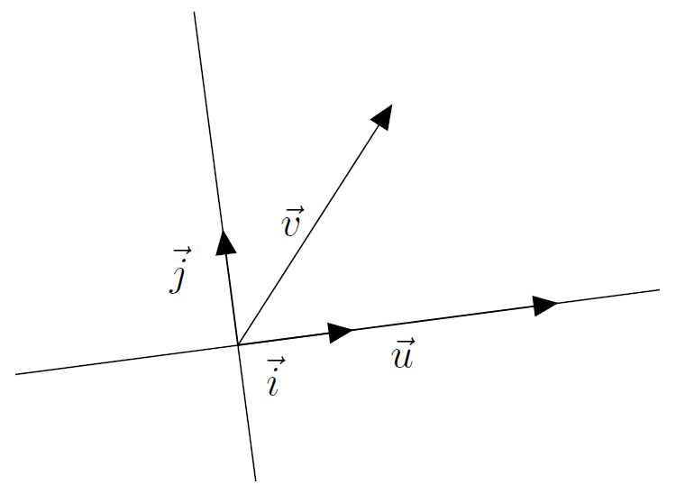
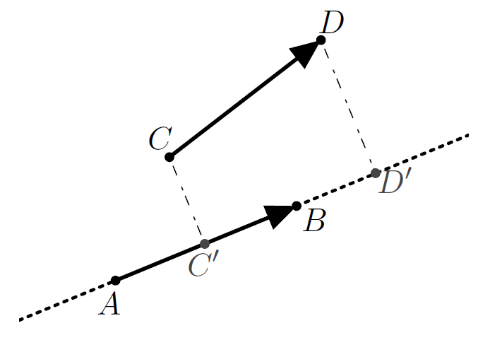

# Produit scalaire Définition et formules

## Des formules

!!! note "Défintion"
    Le produit scalaire  de $\vec{u}$ et de $\vec{v}$, noté $\vec{u} \cdot \vec{v}$, est un **nombre réel** défini par $\frac{1}{2} \left( \| \vec{u} + \vec{v} \|^2 - \| \vec{u} \|^2 - \| \vec{v} \|^2 \right)$.

    \[ \vec{u} \cdot \vec{v} = \frac{1}{2} \left( \| \vec{u} + \vec{v} \|^2 - \| \vec{u} \|^2 - \| \vec{v} \|^2 \right) \]

!!! abstract "Théorème - Conséquences immédiates"

    - $\vec{u} \cdot \vec{v} = \vec{v} \cdot \vec{u}$
    - Si $\vec{u}=\vec{0}$ ou $\vec{v}=\vec{0}$, alors $\vec{u} \cdot \vec{v}=0$. La réciproque est fausse.

!!! tip "Remarque - Notation"
    Par convention, on note $\vec{u}^2=\vec{u} \cdot \vec{u}$. C'est une notation cohérente, car :

    \[ \begin{eqnarray*}
    \vec{u} \cdot \vec{u} & = & \frac{1}{2} \left( \|2 \vec{u} \|^2 - 2 \| \vec{u} \|^2 \right) \\
    & = & \frac{1}{2} \left( 4\| \vec{u} \|^2 - 2 \| \vec{u} \|^2 \right) \\
    & = & \| \vec{u} \|^2
    \end{eqnarray*} \]

!!! abstract "Théorème"
    Dans un **_repère orthonormal_**, $\vec{u}$ et $\vec{v}$ ont pour coordonnées respectives $(x;y)$ et $(x';y')$, alors 
    
    \[ \vec{u} \cdot \vec{v} = xx' + yy' \]

    ???- abstract "Démonstration"
        Dans ces conditions $\| u\|^2=x^2+y^2$ et $\| v \|^2=x'^2+y'^2$ et $\| \vec{u} + \vec{v} \|^2 = (x+x')^2 + (y+y')^2$ d'où $\vec{u} \cdot \vec{v} = xx' + yy'$.

!!! abstract "Théorème"
    Si $\vec{u}$ et $\vec{v}$ sont deux vecteurs non nuls, alors

    \[ \vec{u} \cdot \vec{v} = \| \vec{u} \| \times \| \vec{v}\| \times \cos (\vec{u};\vec{v}) \]

    ???- abstract "Démonstration"
        Soit $O$ un point. On construit $A,B, \vec{i}$ et $\vec{j}$ tels que :  
        
        - $\overrightarrow{OA} = \vec{u}$
        - $\overrightarrow{OB} = \vec{v}$
        - $\vec{i} = \frac{1}{\left\| \overrightarrow{OA} \right\|} \overrightarrow{OA}$
        - $\vec{j}$ est tel que $\repv$ soit un repère orthonormal direct.

        [{.Center_lien .Vignette30}](../Image/pdt_scal_01.png)

        Dans ce cas, $\overrightarrow{OA} = \| \overrightarrow{OA} \| \vec{i} + 0 \vec{j}$, d'où $\vec{u}=(\| \overrightarrow{OA} \|;0)=(\| \vec{u} \|;0)$.
        <!--%Dans le repère polaire $(O;\vec{i})$, $B$ a pour coordonnées polaires :
        %\[ B=\left[ \| \overrightarrow{OB} \|; (\vec{i};\overrightarrow{OB}) \right] = \left[ \| \vec{v} \|; (\vec{u};\vec{v}) \right]  \]-->
        Donc les coordonnées cartésiennes de $B$ sont $(\| \vec{v} \| \cos(\vec{u};\vec{v});\| \vec{v} \| \sin(\vec{u};\vec{v}))$; et comme $\vec{v} = \overrightarrow{OB}$, on trouve les coordonnées cartésiennes de $\vec{v} = \coordVec{\| \vec{v} \| \cos(\vec{u};\vec{v})}{\| \vec{v} \| \sin(\vec{u};\vec{v})}$.  
        Comme $\repv$ est orthonormal, on peut utiliser le théorème précédent, d'où :

        \[ \vec{u} \cdot \vec{v} = \| \vec{u} \| \times \| \vec{v}\| \times \cos (\vec{u};\vec{v}) \]

!!! abstract "Théorème - Cas particuliers"
    Si $\vec{u}$ et $\vec{v}$ sont colinéaires :

    - si $\vec{u}$ et $\vec{v}$ sont de même sens, alors $\vec{u} \cdot \vec{v} = \| \vec{u} \| \times \| \vec{v}\|$.
    - si $\vec{u}$ et $\vec{v}$ sont de sens contraires, alors $\vec{u} \cdot \vec{v} = - \| \vec{u} \| \times \| \vec{v}\|$.

## Produit scalaire et orthogonalité.

!!! note "Défintion"
    Dire que deux vecteurs $\vec{u}$ et $\vec{v}$ sont orthogonaux signifie que :

    - $\vec{u}=\vec{0}$ ou $\vec{v}=\vec{0}$
    - $(OA)$ et $(OB)$  sont perpendiculaires (où $\vec{u} = \overrightarrow{OA}$ et $\vec{v} = \overrightarrow{OB}$ sont non nuls) et dans ce cas $(\vec{u};\vec{v})= \frac{\pi}{2} \quad [2\pi]$ ou $(\vec{u};\vec{v})= -\frac{\pi}{2} \quad [2 \pi ]$. 

!!! abstract "Théorème"
    Dire que $\vec{u}$ et $\vec{v}$ sont orthogonaux équivaut à dire que $\vec{u} \cdot \vec{v} = 0$.

    ???- abstract "Démonstration"

        - Partie directe ou condition suffisante :  
        Si $\vec{u}$ et $\vec{v}$ sont orthogonaux :

            - Si $\vec{u}=\vec{0}$ ou $\vec{v}=\vec{0}$ alors $\vec{u} \cdot \vec{v} =0$.
            - Sinon $\vec{u} \neq \vec{0}$ et $\vec{v} \neq \vec{0}$ et $(\vec{u};\vec{v})=\frac{\pi}{2} \quad [2\pi]$ ou $(\vec{u};\vec{v})=-\frac{\pi}{2} \quad [2\pi]$. Dans tous les cas :  
            $\vec{u} \cdot \vec{v} = \| \vec{u} \| \times \| \vec{v}\| \times \cos (\vec{u};\vec{v}) = 0$
            
        - Partie réciproque ou condition nécessaire :  
        Si $\vec{u} \cdot \vec{v}=0$
            - Si $\vec{u}=\vec{0}$ ou $\vec{v}=\vec{0}$ alors $\vec{u}$ et $\vec{v}$ sont orthogonaux (par définition).
            - Sinon $\vec{u} \neq \vec{0}$ et $\vec{v} \neq \vec{0}$ et alors :  
            $\vec{u} \cdot \vec{v} = \| \vec{u} \| \times \| \vec{v}\| \times \cos (\vec{u};\vec{v}) = 0$  
            D'où $\cos (\vec{u};\vec{v}) = 0 = \cos \left( \frac{\pi}{2} \right)$  
            D'où $\vec{u}$ et $\vec{v}$ sont orthogonaux

!!! abstract "Théorème - Conséquence"
    Dans un repère orthonormé, $\vec{u}(x;y)$ et $\vec{v}(x';y')$ sont orthogonaux équivaut à $xx'+yy'=0$

!!! note "Défintion"
    Soient $B$ un point et $(d)$ une droite. Le projeté orthogonal de $B$ sur $(d)$ est le point $H$ de $(d)$ tel que $(BH)$ et $(d)$ soient perpendiculaires.

!!! tip "Remarque"
    En utilisant le théorème de Pythagore, pour tout point $M$ de $(d)$, $BM \geq BH$.

!!! abstract "Théorème"
    $\overrightarrow{AB}$ et $\overrightarrow{CD}$ sont deux vecteurs. $C$ et $D$ se projettent orthogonalement en $C'$ et $D'$ sur la droite $(AB)$. Alors :
    
    \[ \overrightarrow{AB} \cdot \overrightarrow{CD} = \overrightarrow{AB} \cdot \overrightarrow{C'D'} \]

    [{.Center_lien .Vignette30}](../Image/pdt_scal_02.png)

    ???- abstract "Démonstration"
        Analytiquement :  
        On construit :

        - $\vec{i}=\frac{1}{\| \overrightarrow{AB} \|} \overrightarrow{AB}$.
        - $\vec{j}$ tel que $(A; \vec{i}, \vec{j})$ soit un repère orthonormé direct.
        
        a. Trouver les coordonnées de $\overrightarrow{AB},\overrightarrow{CD}$ et $\overrightarrow{C'D'}$.  
        b. En déduire $\overrightarrow{AB} \cdot \overrightarrow{CD}$. Puis que $\overrightarrow{AB} \cdot \overrightarrow{CD} = \overrightarrow{AB} \cdot \overrightarrow{C'D'}$

!!! abstract "Théorème"
    Si $\vec{u}=\vect{AB}$ et $\vec{v}=\vect{AC}$ et si $H$ est le projeté orthogonal de $C$ sur $(AB)$, alors :

    \[ \vec{u} \cdot \vec{v} = \vect{AB} \cdot \vect{AC} = 
    \left\{ \begin{array}{ll}
    AB \times AH & \text{ si } \vect{AB} \text{ et } \vect{AH} \text{ sont de même sens}\\
    -AB \times AH & \text{ si } \vect{AB} \text{ et } \vect{AH} \text{ sont de sens contraire}
    \end{array} \right. \]

## Règles de calcul.

!!! abstract "Théorème"
    Pour tous vecteurs $\vec{u},\vec{v}$ et $\vec{w}$ et pour tous réels $a$ et $b$ :

    - $\vec{u} \cdot \vec{v} = \vec{v} \cdot \vec{u}$ (rappel)
    - $\vec{u} \cdot \left( \vec{v} + \vec{w} \right) = \vec{u} \cdot \vec{v}+ \vec{u} \cdot \vec{w}$
    - $(a\vec{u}) \cdot (b\vec{v}) = (ab)(\vec{u} \cdot \vec{v})$

    ???- abstract "Démonstration"
        Choisissons un repère orthonormal $\repv$ et utilisons la formule avec les coordonnées.

!!! abstract "Théorème - Conséquence"

    - $\vec{-u} \cdot \vec{v} = -(\vec{u} \cdot \vec{v})$ et donc 

    \[ \begin{eqnarray*}
    \overrightarrow{AB} \cdot \overrightarrow{CD} & = & -\overrightarrow{BA} \cdot \overrightarrow{CD} \\
    & = & -\overrightarrow{AB} \cdot \overrightarrow{DC}\\
    & = &  \overrightarrow{BA} \cdot \overrightarrow{DC}
    \end{eqnarray*} \]

    - $(\vec{u}+\vec{v}) \cdot (\vec{u'} + \vec{v'}) = \vec{u} \cdot \vec{u'} + \vec{u} \cdot \vec{v'} + \vec{v} \cdot \vec{u'} + \vec{v} \cdot \vec{v'}$

Les calculs  sont très semblables à ceux avec la multiplication. Mais il y a **_une grande différence_**, le produit scalaire ne possède pas d'opération inverse (la division est l'opération inverse de la multiplication) et donc l'affirmation suivante est en général fausse :

\[ \text{FAUX!!FAUX!! } \vec{u} \cdot \vec{v} = \vec{u} \cdot \vec{w} \text{ alors } \vec{v} = \vec{w} \text{ FAUX!!FAUX!! } \]

Par contre, avec la notation $\vec{u}^2=\vec{u} \cdot \vec{u}$, on retrouve une notation analogue aux identités remarquables :

\[
\begin{eqnarray*}
(\vec{u} + \vec{v})^2 & = & (\vec{u}+ \vec{v}) \cdot (\vec{u}+\vec{v}) \\
 & =& \vec{u}^2+2*\vec{u} \cdot \vec{v} + \vec{v}^2 \\
(\vec{u} - \vec{v})^2 & = & (\vec{u}- \vec{v}) \cdot (\vec{u}-\vec{v}) \\
 & =& \vec{u}^2-2*\vec{u} \cdot \vec{v} + \vec{v}^2 \\
(\vec{u}+ \vec{v}) \cdot (\vec{u} - \vec{v}) & = &  \vec{u}^2 - \vec{v}^2 \\
\end{eqnarray*} \]