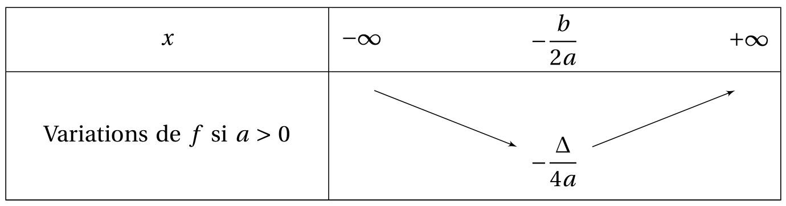
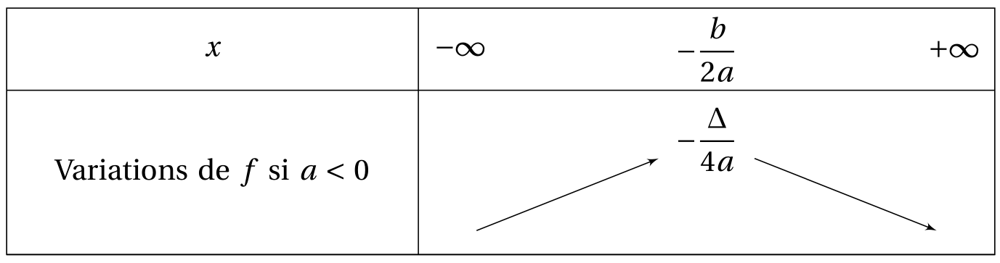

# Polynôme du second degré Courbe d'un second degré

## Sens de variations

Soit $f(x) = ax^2+bx+c$, avec $a \neq 0$. Pour étudier son sens de variations, il faut revenir à sa forme canonique.

\[ f(x) = ax^2+bx+c = a\left( x + \frac{b}{2a} \right)^2 -  \frac{b^2-4ac}{4a} \]

???- abstract "Démonstration"
    Pour tout $x_1$ et $x_1$ deux réels tels que $x_1 > x_2$, on veut étudier le signe de $f(x_1) - f(x_2)$.

    \[ 
    \begin{eqnarray*}
    f(x_1) - f(x_2) & = & a\left( x_1 + \frac{b}{2a} \right)^2 -  \frac{b^2-4ac}{4a} - \left( a\left( x_2 + \frac{b}{2a} \right)^2 -  \frac{b^2-4ac}{4a}\right)\\
    & = & a \left( \left( x_1 + \frac{b}{2a} \right)^2 - \left( x_2 + \frac{b}{2a} \right)^2\right)\\
    & = & a \left( x_1 - x_2 \right)\left( x_1 + \dfrac{b}{2a} + x_2 + \dfrac{b}{2a} \right)
    \end{eqnarray*}
    \]

    Comme $x_1 - x_2>0$ (car $x_1 > x_2$), le signe $f(x_1) - f(x_2)$ dépend du signe de $a$ et du signe de $x_1 + \dfrac{b}{2a} + x_2 + \dfrac{b}{2a}$. Mais, il y a l'implication suivante :

    \[ x_1 > -\dfrac{b}{2a} \text{ et } x_2 > -\dfrac{b}{2a} \Rightarrow x_1 + \dfrac{b}{2a} + x_2 + \dfrac{b}{2a} > 0 \]
    
    et

    \[ x_1 < -\dfrac{b}{2a} \text{ et } x_2 < -\dfrac{b}{2a} \Rightarrow x_1 + \dfrac{b}{2a} + x_2 + \dfrac{b}{2a} < 0 \]

    Donc :

    - si $a>0$ et si $x_1$ et $x_2$ appartiennent à $\left] \dfrac{-b}{2a} ; +\infty \right[$, alors $f(x_1)> f(x_2)$ et ainsi, $f$ est croissante sur $\left] \dfrac{-b}{2a} ; +\infty \right[$ si $a>0$;
    - si $a>0$ et si $x_1$ et $x_2$ appartiennent à $\left]-\infty ; \dfrac{-b}{2a} \right[$, alors $f(x_1)< f(x_2)$ et ainsi, $f$ est décroissante sur $\left]-\infty ; \dfrac{-b}{2a} \right[$ si $a>0$;

    - si $a<0$ et si $x_1$ et $x_2$ appartiennent à $\left] \dfrac{-b}{2a} ; +\infty \right[$, alors $f(x_1)< f(x_2)$ et ainsi, $f$ est décroissante sur $\left] \dfrac{-b}{2a} ; +\infty \right[$ si $a < 0$;
    - si $a<0$ et si $x_1$ et $x_2$ appartiennent à $\left]-\infty ; \dfrac{-b}{2a} \right[$, alors $f(x_1)> f(x_2)$ et ainsi, $f$ est croissante sur $\left]-\infty ; \dfrac{-b}{2a} \right[$ si $a < 0$;

Voici les tableaux de variations :

!!! info "Théorème :  si a > 0"

    [{.Center_lien .Vignette50}](../Image/Courbe_01.png)

!!! info "Théorème :  si a < 0"

    [{.Center_lien .Vignette50}](../Image/Courbe_02.png)

!!! info "Théorème"
    Ainsi,
    
    - si $a>0$, $f$ possède un minimum sur $\R$ et le minimum de $f(x) = ax^2+bx+c$ sur $\R$ est $-\dfrac{\Delta}{2a}$    
    - si $a<0$, $f$ possède un maximum sur $\R$ et le maximum de $f(x) = ax^2+bx+c$ sur $\R$ est $-\dfrac{\Delta}{2a}$