# Polynôme du second degré Signe et inéquation

Pour étudier le signe d'une expression $A(x)$, il faut résoudre (par exemple) $A(x)\geq 0$. Pour cela, il faut factoriser $A(x)$ sous la forme d'un produit de facteurs ; facteurs dont le signe est connu. Pour l'instant, vous devez pour connaitre le signe des fonctions affines, le signe d'un carré et le signe d'une addition de termes positifs.

Il faut donc connaitre les tableaux de signes suivants :

[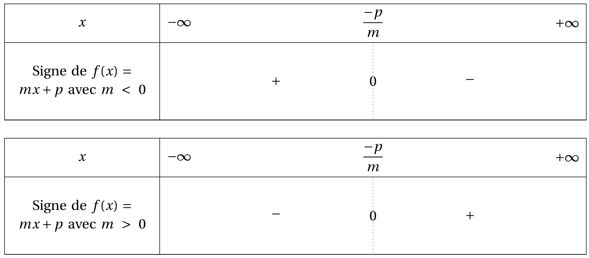{.Center_lien .Vignette50}](../Image/Signe_05.png)

## Méthode générale

Revenons à la forme canonique 

\[ ax^2+bx+c = a \left[ \left( x + \dfrac{b}{2a} \right)^2 -  \dfrac{\Delta}{4a^2} \right] \]

### Cas où $\Delta <0$

Si $\Delta <0$, alors $-\dfrac{\Delta}{4a^2} >0$. Donc (addition de nombre positif dont un terme est strictement positif), $\left( x + \dfrac{b}{2a} \right)^2 -  \dfrac{\Delta}{4a^2}>0$ pour tout $x$ réel.  
Dans ce cas, le signe de $f$ dépend uniquement de celui de $a$.

\[\begin{eqnarray*}
    ax^2 + bx + c\geq 0 & \iff &  a \geq 0\\
    & \iff & x \in \R \text{ lorsque } a \geq 0\\
    & & \text{ ou pas de solutions lorsque } a \leq 0
\end{eqnarray*}\]

Bilan : 

[{.Center_lien .VignetteMed}](../Image/Signe_01.png)

[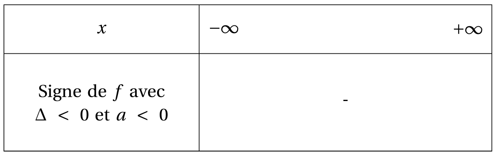{.Center_lien .VignetteMed}](../Image/Signe_02.png)

### Cas où $\Delta = 0$

Si $\Delta = 0$, alors $ax^2+bx+c = a \left( x + \dfrac{b}{2a} \right)^2$ s'annule en $x_0 = \dfrac{-b}{2a}$  et est du signe de $a$ partout ailleurs.

[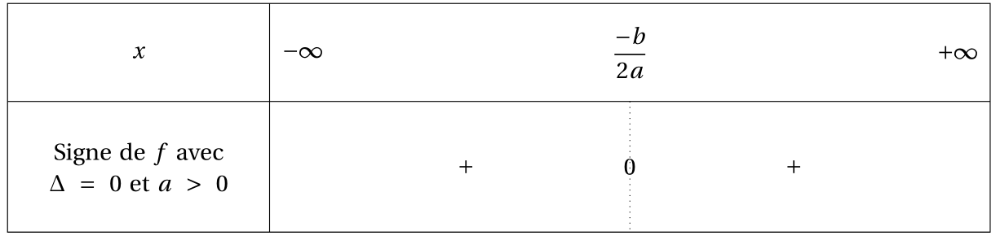{.Center_lien .Vignette50}](../Image/Signe_03.png)

[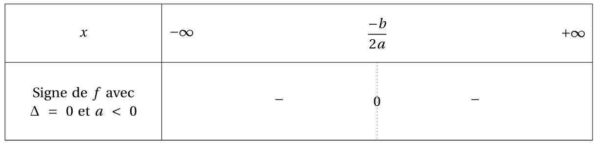{.Center_lien .Vignette50}](../Image/Signe_04.png)

### Cas où $\Delta >0$

\[\begin{eqnarray*}
ax^2 + bx + x \geq 0 & \iff & a \left[ \left( x + \dfrac{b}{2a} \right)^2 -  \dfrac{\Delta}{4a^2} \right] \\
& \iff & a \left[ x+\frac{b}{2a}  - \frac{\sqrt{\Delta}}{2a} \right] \left[ x+\frac{b}{2a}  + \frac{\sqrt{\Delta}}{2a} \right]
\end{eqnarray*}\]

Bilan :

[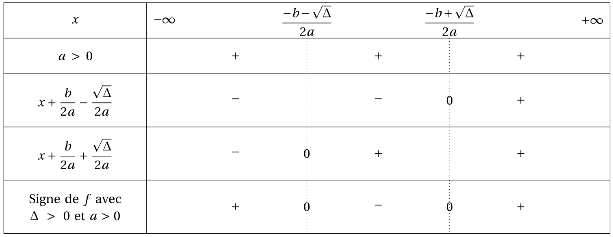{.Center_lien .Vignette60}](../Image/Signe_06.png)

[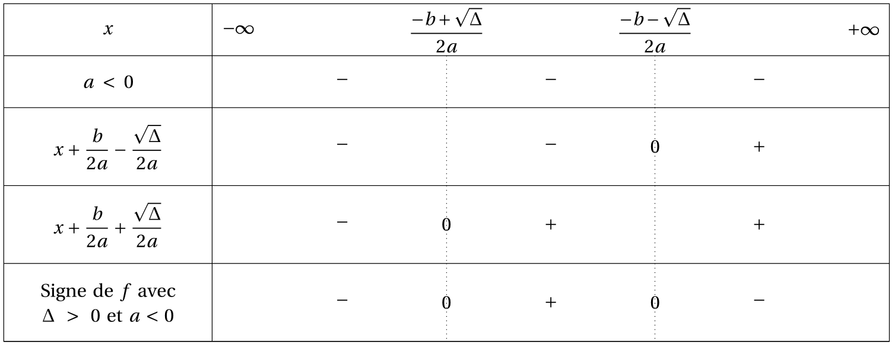{.Center_lien .Vignette60}](../Image/Signe_07.png)

## Méthode alternative

Si vous connaissez les variations d'une fonction $f$, il est alors possible de déterminer, si il existe, un maximum (ou un minimum) sur un intervalle. On peut alors utiliser ce renseignement pour en déduire le signe de $f$ sur cet intervalle.

Ainsi, en utilisant les tableaux de variations de $f(x) = ax^2 +b +c$ et ses éventuelles racines, on obtient les tableaux suivants.

### Cas où $\Delta < 0$

- Si $a>0$, [le minimum](./courbe.md#min_sec_deg) de $f$ sur $\R$ est $\dfrac{-\Delta}{2a}$. Donc pour tout $x \in \R$, $f(x) \geq \dfrac{-\Delta}{2a}$. Or ce minimum est strictment positif car $\Delta <0$ et $a>0$. Donc pour tout $x \in \R$, $f(x)>0$. On retrouve ainsi le tableau de signes précédents.

- Si $a<0$>, [le maximum](./courbe.md#max_sec_deg) de $f$ sur $\R$ est $\dfrac{-\Delta}{2a}$. Donc pour tout $x \in \R$, $f(x) \leq \dfrac{-\Delta}{2a}$. Or ce maximum est strictment négatif car $\Delta <0$ et $a<0$. Donc pour tout $x \in \R$, $f(x)>0$. On retrouve ainsi le tableau de signes précédents.

### Cas où $\Delta = 0$

- Si $a>0$, [le minimum](./courbe.md#min_sec_deg) de $f$ sur $\R$ est $\dfrac{-\Delta}{2a} = 0$. Donc pour tout $x \in \R$, $f(x) \geq 0$ et [s'annule en $x_0=\dfrac{-b}{2a}$](./Equation.md#sol_double_sec_deg). On retrouve ainsi le tableau de signes précédents.

- Si $a<0$>, [le maximum](./courbe.md#max_sec_deg) de $f$ sur $\R$ est $\dfrac{-\Delta}{2a} = 0$. Donc pour tout $x \in \R$, $f(x) \leq 0$ et [s'annule en $x_0=\dfrac{-b}{2a}$](./Equation.md#sol_double_sec_deg). On retrouve ainsi le tableau de signes précédents.

### Cas où $\Delta >0$

[Les racines](./Equation.md#sol_sec_deg) de $f$ sont $x_1 = \dfrac{-b + \sqrt{\Delta}}{2a}$ et $x_2 = \dfrac{-b - \sqrt{\Delta}}{2a}$. 

- Si $a>0$, on remarque que $\dfrac{-b - \sqrt{\Delta}}{2a}< \dfrac{-b}{2a} < \dfrac{-b + \sqrt{\Delta}}{2a}$. Et en les insérant dans le tableau de variations de $f$, on trouve :  
[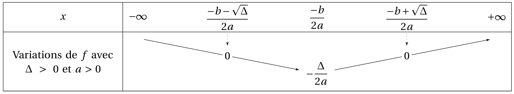{.Center_lien .Vignette60}](../Image/Signe_09.png)  
Ainsi :  
    - sur $\left] -\infty ; \dfrac{-b - \sqrt{\Delta}}{2a}\right] \cup \left[\dfrac{-b + \sqrt{\Delta}}{2a} ; +\infty \right[$ le minimum de $f$ est $0$, donc pour tout $x \in \left] -\infty ; \dfrac{-b - \sqrt{\Delta}}{2a}\right] \cup \left[\dfrac{-b + \sqrt{\Delta}}{2a} ; +\infty \right[$ $f(x)>0$ ;
    - $\left[\dfrac{-b - \sqrt{\Delta}}{2a} ; \dfrac{-b + \sqrt{\Delta}}{2a}\right]$, le maximum de $f$ est $0$, donc pour tout $x \in \left[\dfrac{-b - \sqrt{\Delta}}{2a} ; \dfrac{-b + \sqrt{\Delta}}{2a}\right]$ $f(x)<0$ ;
    - $f$ s'annule en $x_1 = \dfrac{-b + \sqrt{\Delta}}{2a}$ et $x_2 = \dfrac{-b - \sqrt{\Delta}}{2a}$.  
On retrouve ainsi le tableau de signe précédent.

- Si $a<0$, on remarque que $\dfrac{-b + \sqrt{\Delta}}{2a}< \dfrac{-b}{2a} < \dfrac{-b - \sqrt{\Delta}}{2a}$. Et en les insérant dans le tableau de variations de $f$, on trouve :  
[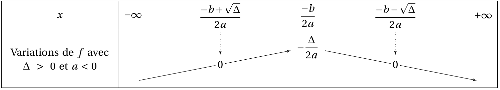{.Center_lien .Vignette60}](../Image/Signe_10.png)  
Ainsi :  
    - sur $\left] -\infty ; \dfrac{-b + \sqrt{\Delta}}{2a}\right] \cup \left[\dfrac{-b - \sqrt{\Delta}}{2a} ; +\infty \right[$ le maximum de $f$ est $0$, donc pour tout $x \in \left] -\infty ; \dfrac{-b + \sqrt{\Delta}}{2a}\right] \cup \left[\dfrac{-b - \sqrt{\Delta}}{2a} ; +\infty \right[$ $f(x)<0$ ;
    - $\left[\dfrac{-b + \sqrt{\Delta}}{2a} ; \dfrac{-b - \sqrt{\Delta}}{2a}\right]$, le minimum de $f$ est $0$, donc pour tout $x \in \left[\dfrac{-b + \sqrt{\Delta}}{2a} ; \dfrac{-b - \sqrt{\Delta}}{2a}\right]$ $f(x)>0$ ;
    - $f$ s'annule en $x_1 = \dfrac{-b + \sqrt{\Delta}}{2a}$ et $x_2 = \dfrac{-b - \sqrt{\Delta}}{2a}$.  
On retrouve ainsi le tableau de signe précédent.

## En pratique

!!! info "Théorème"
    Soit $f(x) = ax^2+bx+c$ avec $a \neq 0$. Pour construire le tableau de signe associé à $f$, on commence à calculer le discriminant associé.

    - Si $\Delta <0$  
    [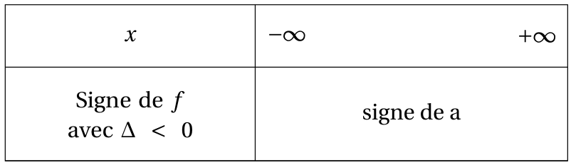{.Center_lien .Vignette30}](../Image/Signe_11.png)  
    - Si $\Delta = 0$  
    [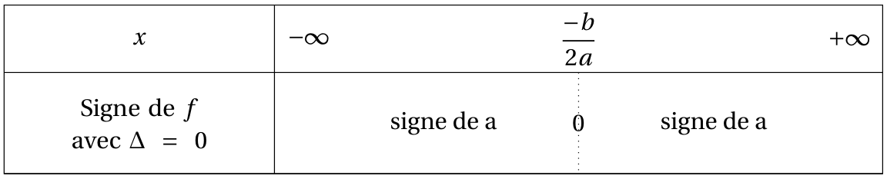{.Center_lien .Vignette40}](../Image/Signe_12.png)  
    - Si $\Delta > 0$, $f$ possède deux racines $x_1$ et $x_2$ :  
    [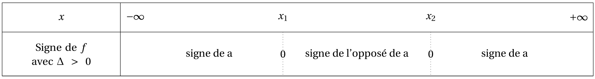{.Center_lien .Vignette60}](../Image/Signe_13.png)  