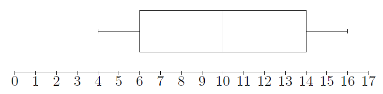

# Statistiques Rappels et nouveautés

## Propriétés de la moyenne

!!! abstract "Théorème - Moyenne par paquets"
    On considère une série statistique $(x_1 , x_2 , \ldots , x_n)$ de taille $n$ et de moyenne $\overline{x}$, obtenue en réunissant $k$ séries statistiques de tailles et de moyennes respectives $n_i$ et $\overline{y}_i$.

    Alors, $\overline{x}$ est la moyenne des $k$ réels $\overline{y}_i$ pondérés respectivement par les effectifs $n_i$ :
    
    \[
    \overline{x} = \frac{n_1 \overline{y}_1 + n_2 \overline{y}_2 + \ldots + n_k \overline{y}_k}{n_1 + n_2 + \ldots + n_k} = \dfrac{1}{n}\sum_{i=1}^{k} n_i y_i, \, \textrm{avec} \, \, n_1 + n_2 + \ldots + n_k = N
    \]

!!! abstract "Théorème - Linéarité de la moyenne"
    Soit $a$ et $b$ deux réels fixés et $S$ est la série statistique suivante :
    
    \[
    \begin{array}{|c|c|c|c|c|}
    \hline
    \textrm{Valeur }x_i & x_1 & x_2 & \ldots & x_p\\
    \hline
    \textrm{Effectif} & n_1 & n_2 & \ldots & n_p\\
    \hline
    \end{array}
    \]
    
    Si pour tout entier $i$ compris entre $1$ et $n$, on a $y_i = ax_i + b$, alors la moyenne de la série $(y_1,y_2,\ldots ,y_n)$ est égale à $\mathbf{ \overline{y} = a \overline{x} + b}$.
    
    \[
    \begin{array}{|c|c|c|c|c|}
    \hline
    \textrm{Valeur } y_i & y_1 = ax_1+b & y_2= ax_2+b & \ldots & y_p= ax_p+b\\
    \hline
    \textrm{Effectif} & n_1 & n_2 & \ldots & n_p\\
    \hline
    \end{array} \]

!!! note "Définition"
    **La médiane** est une valeur qui permet de partager une série statistique (rangée dans l'ordre) en deux populations de même effectif.

!!! tip "Méthode"
    En pratique, pour déterminer la médiane de $N$ valeurs, on range ces valeurs par ordre croissant. 

    - Si $N$ est impair, la médiane $m$ est la valeur du caractère de rang $\dfrac{N+1}{2}$.
    - Si $N$ est pair, la médiane $m$ est la demi-somme des termes de rang $\dfrac{N}{2}$ et $\dfrac{N}{2}+1$.

    On utilise alors les effectifs cumulés croissants. On gardera l'utilisation des polygones des effectifs cumulés croissants lorsque les valeurs du caractère sont regroupées en classe.

!!! note "Définition"
    La moyenne et la médiane sont *des mesures de tendance centrale* d'une série statistique. L'étendue mesure *sa dispersion*.

## Quartile et décile

Pour étudier la répartition des valeurs d'une série, on définit les quartiles, les déciles et un nouvel outil graphique : **le diagramme en boîte**.

!!! note "Définition"
    On donne une série statistique $(x_1 , x_2 , \ldots , x_n)$ de taille $n$ dont les valeurs sont ordonnées par ordre croissant : $x_1 \leq x_2 \leq \ldots \leq x_n$. Les **quartiles** partagent cette série en quatre parties.

    - Le **premier quartile Q1** est la valeur $x_i$ dont l'indice $i$ est le plus petit entier supérieur ou égal à $\frac{\textstyle{n}}{\textstyle{4}}$.
    - Le **troisième quartile Q3** est la valeur $x_j$ dont l'indice $j$ est le plus petit entier supérieur ou égal à $\frac{\textstyle{3n}}{\textstyle{4}}$.
    - L'intervalle $[Q1 ; Q3]$ est appelé **intervalle inter-quartile**, son amplitude $Q3-Q1$ est appelée **l'écart inter-quartile**.

!!! example "Exemple"
    Voici les notes obtenues à un examen par 27 élèves :

    \[ \begin{array}{|c|c|c|c|c|c|c|c|c|c|c|c|c|c|}
    \hline
    \textrm{rang } & 1&2&3&4&5&6&7&8&9&10&11&12&13\\
    \hline
    \textrm{note } & 4&4&4&5&6&6&6&7&8&8&8&8&9\\
    \hline
    \end{array} \]

    \[ \begin{array}{|c|c|c|c|c|c|c|c|c|c|c|c|c|c|c|}
    \hline
    \textrm{rang } & 14&15&16&17&18&19&20&21&22&23&24&25&26&27\\
    \hline
    \textrm{note } & 10&11&12&12&12&12&12&14&15&15&15&16&16&16\\
    \hline
    \end{array} \]

    $\frac{\textstyle{27}}{\textstyle{4}} = 6.75$ : le premier quartile est donc la $7^{\textrm{ème}}$ valeur, ainsi $Q1= 6$.
    
    De même, $\frac{\textstyle{3} \times \textstyle{27}}{\textstyle{4}} = 20.25$ : le troisième quartile est donc la $21^{\textrm{ème}}$ valeur, ainsi $Q3= 14$.
    
    L'intervalle inter-quartile $[6 ; 14]$ contient au moins la moitié des notes. L'écart inter-quartile est $14-6=8$.

!!! info "Remarque"
    L'écart inter-quartile d'une série statistique est *une mesure de &laquo; dispersion &raquo; liée à la médiane*, qui rend compte de la répartition des $50 \%$ des valeurs entourant la médiane.

!!! note "Définition"
    Les neufs **déciles** partagent la série en dix parties, par &laquo; tranches de $10 \%$ &raquo;. On conserve les hypothèses de la définition précédente.

    - Le **premier décile D1** est la valeur $x_i$ dont l'indice $i$ est le plus petit entier supérieur ou égal à $\frac{\textstyle{n}}{\textstyle{10}}$.
    - Le **neuvième décile D9** est la valeur $x_j$ dont l'indice $j$ est le plus petit entier supérieur ou égal à $\frac{\textstyle{9} \times \textstyle{n}}{\textstyle{10}}$

!!! example "Exemple"
    Avec l'exemple précédent, $D1 = 4$, $D2 = 6$ et $D9 = 16$.

## Diagramme en boîte

En utilisant l'exemple précédent, on représente le minimum, Q1, la médiane, Q3 et le maximum dans un diagramme appelé **diagramme en boite**.

<!-- \begin{center}
\begin{tikzpicture}[scale=0.5]
\draw (0,0) -- (17,0);
\foreach \x in {0,...,17} 
	\draw (\x,-0.1) -- (\x,0.1);
\foreach \x in {0,...,17}
	\draw (\x,-0.4) node{\x};
\draw (4,1.9) -- (4,2.1);
\draw (4,2) -- (6,2);
\draw (6,1) rectangle (14,3);
\draw (10,1) -- (10,3);
\draw (14,2) -- (16,2);
\draw (16,1.9) -- (16,2.1);
\end{tikzpicture}
\end{center} -->

[{.Center_lien .Vignette50}](../Image/stat_rappel_01.png)

!!! info "Remarque"
    Si, sur un diagramme en boîte, on rajoute le premier et neuvième décile, le nouveau graphique s'appelle une boîte à moustache.

