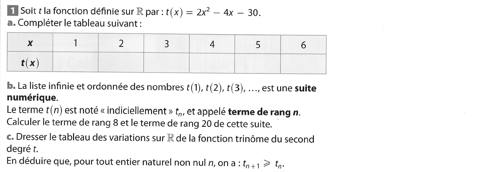
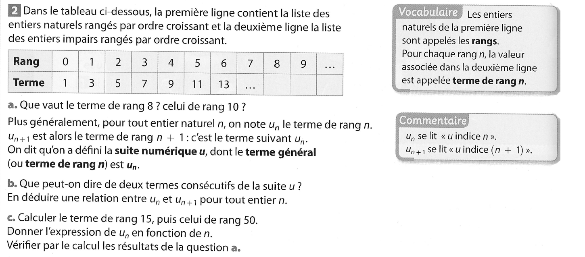
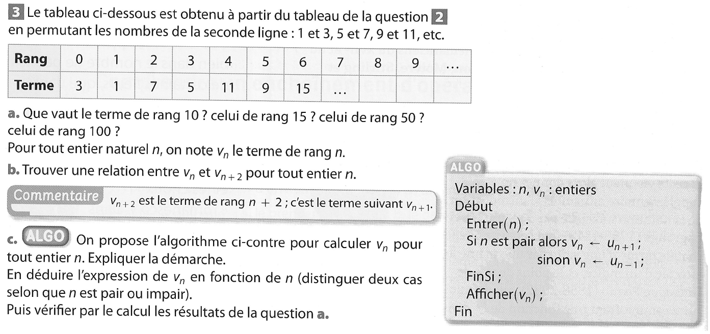
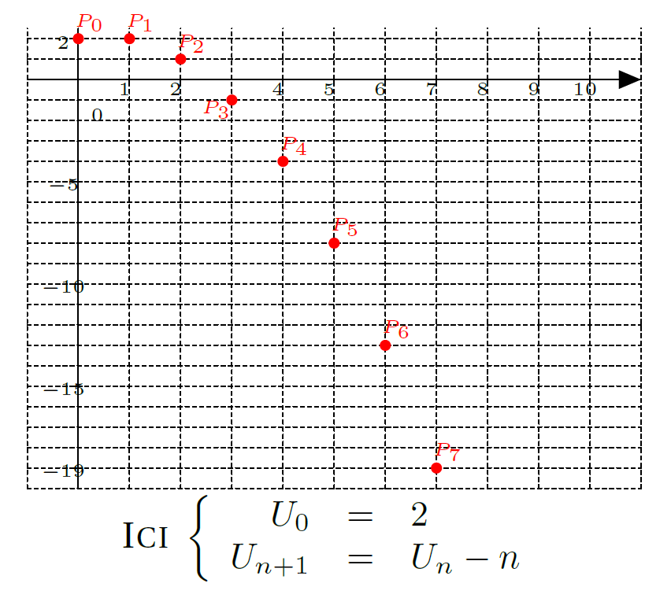
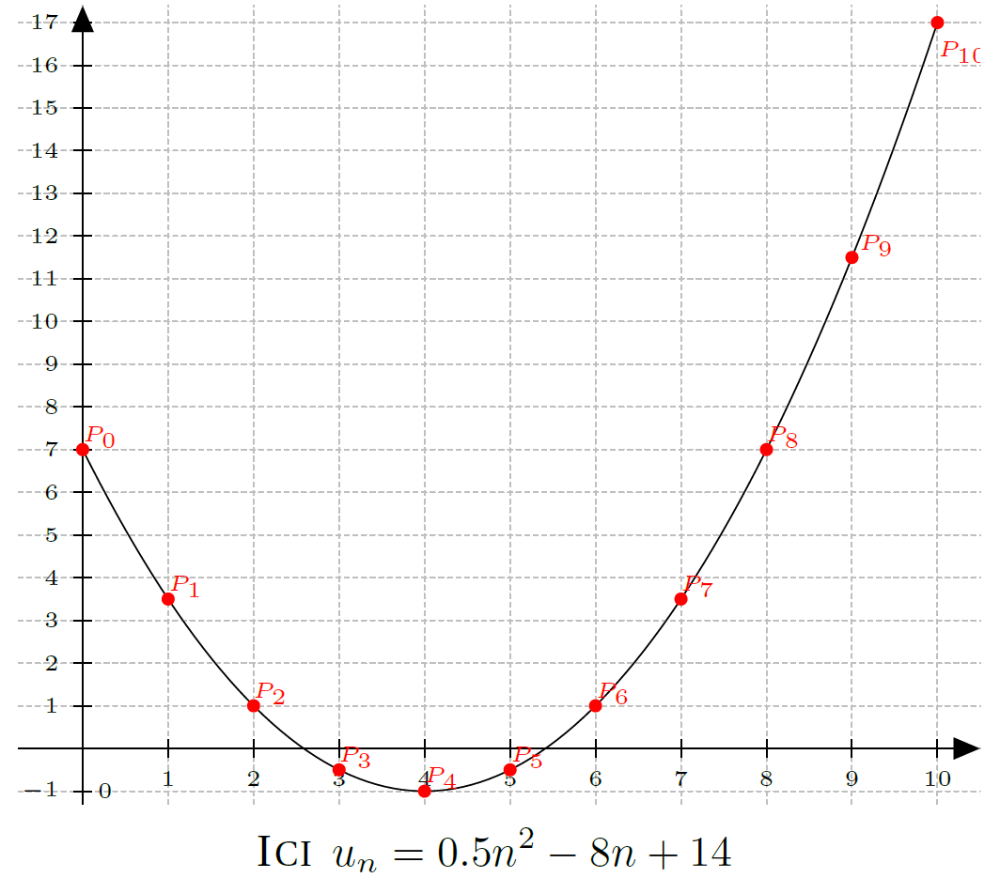

# Suite Définition

[{.Center_lien .Vignette60}](../Image/Suite_def_01.png)
[{.Center_lien .Vignette60}](../Image/Suite_def_02.png)
[{.Center_lien .Vignette60}](../Image/Suite_def_03.png)

## Généralité

!!! example "Exemple"

    \[1 ; \frac{1}{2} ; \frac{1}{4} ; \frac{1}{8} ; \ldots\]

    Fabriquer une suite, c'est associer à chaque entier $n$ un réel noté $u_n$ :
    
    \[ u_0 = 1 ; u_1 = \frac{1}{2} ; u_2 = \frac{1}{4} ; u_3 = \frac{1}{8} ; \ldots \]
 

!!! note "Définition"
    \textbf{Une suite} est une fonction dont l'ensemble de définition est l'ensemble $²$ des entiers naturels ou à partir d'un entier. On note alors $(u_n)_{n \in \N}$ plutôt que $\left\{ \begin{array}{rccc} u\ : & \N & \longrightarrow & \R \\ & n & \mapsto & u(n) \end{array} \right.$

!!! note "Vocabulaire"
    $u_n$ se lit &laquo; $u$ indice $n$ &raquo; ou &laquo; $u \ldots n$ &raquo; . On dit que $u_n$ est le terme d'indice $n$ de la suite.

## Définie explicitement en fonction de $n$

Ici, on a $u_n = f(n)$.

!!! example "Exemple"

    - $u_n=n^2+3n-2$, ici $f(x)=x^2+x-2$
    - $w_n=\sqrt{n-5}$ définie pour $n \in \N$, $n \geq 5$ et $f(x) = \sqrt{x - 5}$

 

???- example "Exercice"
    Pour chaque suite de l'exemple précédent, exprimer en fonction de $n$ :

    1. $u_{n+1}$
    2. $u_{2n}$
    3. $u_{2n+1}$

## Définie par une relation de récurrence

Ici, un terme de la suite s'exprime en fonction d'un ou des termes précédents.

!!! example "Exemple"

    - $\left\{ \begin{array}{rcl} t_0 & = & 2 \\ t_{n+1} & = & 2 t_n -3 \quad \text{pour tout } n \in \N \end{array}\right.$
    - $\left\{ \begin{array}{rcl} r_0 & = & 2 \\ r_1 & = & -1 \\ r_{n+2} & = & 5r_{n+1}-2 r_n -3 \end{array}\right.$
    - $\left\{ \begin{array}{rcl} s_0 & = & -2 \\ s_{n+1} & = & 2 s_n + n \end{array}\right.$

Le cas où $u_{n+1} =f(u_n)$ est le cas le plus fréquemment étudié.

## Représentation graphique

On représente souvent une suite par un nuage de point dont les coordonnées sont $(n;u_n)$.

[{.Center_lien .Vignette40}](../Image/Suite_def_04.png)

<!--
\begin{center}
\definecolor{uququq}{rgb}{1,0,0}
\begin{tikzpicture}[line cap=round,line join=round,>=triangle 45,x=0.5cm,y=0.2cm]
\draw [color=black,dash pattern=on 1pt off 1pt, xstep=0.5cm,ystep=0.2cm] (-1,-20) grid (11,2.5);
\draw[->,color=black] (-1,0) -- (11,0);
%\foreach \x in {1,2,4,5,6,7,8,9,10}
%\draw[shift={(\x-0.1,0)},color=black] (0pt,1pt) -- (0pt,-1pt) node[below] {\tiny $\x$};
\foreach \x in {1,2,4,5,6,7,8,9,10}
\draw[shift={(\x,0)},color=black] (0pt,1pt) -- (0pt,-1pt);
\foreach \x in {1,2,4,5,6,7,8,9,10}
\draw[shift={(\x-0.1,-0.5)},color=black] node {\tiny $\x$};
\draw[color=black] (0,-20) -- (0,2.5);
%\foreach \y in {-19,-15,-10,-5,2}
%\draw[shift={(0,\y)},color=black] (-1pt,0pt) -- (1pt,0) node[left] {\tiny $\y$};
\foreach \y in {-19,-15,-10,-5,2}
\draw[shift={(0,\y)},color=black] (-1pt,0pt) -- (1pt,0);
\foreach \y in {-19,-15,-10,-5,2}
\draw[shift={(-0.3,\y-0.2)},color=black] node {\tiny $\y$};
\draw[color=black] (0pt,-10pt) node[right] {\tiny $0$};
\clip(-1.1,-20) rectangle (11,4);
\fill [color=uququq] (0,2) circle (1.5pt);
\draw[color=uququq] (0.22,2.77) node {\tiny $P_0$};
\fill [color=uququq] (1,2) circle (1.5pt);
\draw[color=uququq] (1.22,2.77) node {\tiny $P_1$};
\fill [color=uququq] (2,1) circle (1.5pt);
\draw[color=uququq] (2.21,1.76) node {\tiny $P_2$};
\fill [color=uququq] (3,-1) circle (1.5pt);
\draw[color=uququq] (2.7,-1.5) node {\tiny $P_3$};
\fill [color=uququq] (4,-4) circle (1.5pt);
\draw[color=uququq] (4.22,-3.24) node {\tiny $P_4$};
\fill [color=uququq] (5,-8) circle (1.5pt);
\draw[color=uququq] (5.22,-7.23) node {\tiny $P_5$};
\fill [color=uququq] (6,-13) circle (1.5pt);
\draw[color=uququq] (6.22,-12.23) node {\tiny $P_6$};
\fill [color=uququq] (7,-19) circle (1.5pt);
\draw[color=uququq] (7.22,-18.24) node {\tiny $P_7$};
\end{tikzpicture}\\
\textsc{Ici } $\left\{ \begin{array}{rcl} U_0 & = & 2 \\ U_{n+1} & = & U_n - n \end{array}\right.$
\end{center}
-->

???- example "Exercice"
    Tracer la représentation graphique des suites suivantes :
    1. $\left\{ \begin{array}{rcl} r_0 & = & 2 \\ r_1 & = & -1 \\ r_{n+2} & = & 5r_{n+1}-2 r_n -3 \end{array}\right.$
    2. $\left\{ \begin{array}{rcl} s_0 & = & 2 \\ s_{n+1} & = & 2 s_n + n \end{array}\right.$

Pour les suites pouvant s'écrire sous la forme $u_{n}=f(n)$, les points $(n;u_n)$ sont sur la courbe de $f$.

[{.Center_lien .Vignette40}](../Image/Suite_def_05.png)

<!--
\begin{center}
\definecolor{uququq}{rgb}{1,0,0}
\definecolor{cqcqcq}{rgb}{0.75,0.75,0.75}
\begin{tikzpicture}[line cap=round,line join=round,>=triangle 45,x=0.7cm,y=0.35cm]
\draw [color=cqcqcq,dash pattern=on 1pt off 1pt, xstep=0.7cm,ystep=0.35cm] (-0.75,-1.3) grid (10.5,17.4);
\draw[->,color=black] (-0.75,0) -- (10.5,0);
\foreach \x in {,1,2,3,4,5,6,7,8,9,10}
\draw[shift={(\x,0)},color=black] (0pt,2pt) -- (0pt,-2pt) node[below] {\tiny $\x$};
\draw[->,color=black] (0,-1.3) -- (0,17.4);
\foreach \y in {-1,1,2,3,4,5,6,7,8,9,10,11,12,13,14,15,16,17}
\draw[shift={(0,\y)},color=black] (2pt,0pt) -- (-2pt,0pt) node[left] {\tiny $\y$};
\draw[color=black] (0pt,-10pt) node[right] {\tiny $0$};
\clip(-0.75,-1.3) rectangle (10.5,17.4);
\draw plot[raw gnuplot, id=func1] function{set samples 100; set xrange [0:10]; plot 0.5*(x**2-8*x+14)};
%\draw[color=black] (0.18,6.71) node {$f$};
\fill [color=uququq] (0,7) circle (1.5pt);
\draw[color=uququq] (0.21,7.29) node {\tiny $P_0$};
\fill [color=uququq] (1,3.5) circle (1.5pt);
\draw[color=uququq] (1.21,3.79) node {\tiny $P_1$};
\fill [color=uququq] (2,1) circle (1.5pt);
\draw[color=uququq] (2.2,1.28) node {\tiny $P_2$};
\fill [color=uququq] (3,-0.5) circle (1.5pt);
\draw[color=uququq] (3.2,-0.21) node {\tiny $P_3$};
\fill [color=uququq] (4,-1) circle (1.5pt);
\draw[color=uququq] (4.2,-0.7) node {\tiny $P_4$};
\fill [color=uququq] (5,-0.5) circle (1.5pt);
\draw[color=uququq] (5.21,-0.21) node {\tiny $P_5$};
\fill [color=uququq] (6,1) circle (1.5pt);
\draw[color=uququq] (6.21,1.28) node {\tiny $P_6$};
\fill [color=uququq] (7,3.5) circle (1.5pt);
\draw[color=uququq] (7.2,3.79) node {\tiny $P_7$};
\fill [color=uququq] (8,7) circle (1.5pt);
\draw[color=uququq] (8.2,7.29) node {\tiny $P_8$};
\fill [color=uququq] (9,11.5) circle (1.5pt);
\draw[color=uququq] (9.29,11.78) node {\tiny $P_{9}$};
\fill [color=uququq] (10,17) circle (1.5pt);
\draw[color=uququq] (10.3,16.3) node {\tiny $P_{10}$};
\end{tikzpicture}\\
\textsc{Ici } $u_n=0.5n^2-8n+14$
\end{center}
-->

???- example "Exercice"
    Tracer la représentation graphique des suites suivantes :

    - $u_n=n^2+3n-2$
    - $w_n=\sqrt{n-5}$ définie pour $n \in \N$, $n \geq 5$ 
