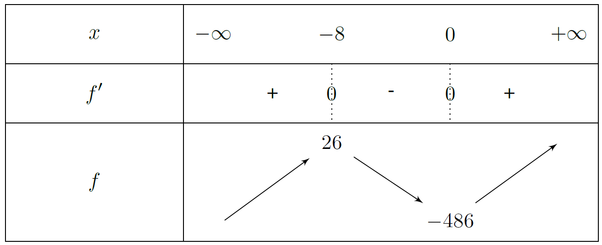

# Suite Sens de variations

## Généralités

!!! note "Défintion"
    Une suite $(u_n)_{n \in \N}$ est :
    
    -  **croissante** si pour tout $n \in \N$, $u_n \leq u_{n+1}$ (ou $u_{n+1}-u_n \geq 0$)
    -  **strictement croissante** si pour tout $n \in \N$, $u_n < u_{n+1}$ (ou $u_{n+1}-u_n > 0$)
    -  **décroissante** si pour tout $n \in \N$, $u_n \geq u_{n+1}$ (ou $u_{n+1}-u_n \leq 0$)
    -  **strictement décroissante** si pour tout $n \in \N$, $u_n > u_{n+1}$ (ou $u_{n+1}-u_n < 0$)

 

!!! note "Défintion"
    On dit qu'une suite est **monotone** si elle possède un seul sens de variation sur $\N$.
 

## Comment établir un sens de variations

### La méthode générale

!!! tip "Méthode"
    Il faut étudier le signe de $u_{n+1} - u_n$, pour tout entier $n \in \N$. 

### Cas $u_n = f(n)$

!!! tip "Méthode"
    **Si pour tout** $\mathbf{n \in \N \  u_n=f(n)}$, alors on s'intéresse aux variations de $f$.

!!! abstract "Théorème"
    Si $u_n=f(n)$ pour tout $n \in \N$ et si $f$ est monotone sur $[0;+\infty[$, alors $f$ et $u$ ont le même sens de variation.

Rque : Adaptez ce théorème pour une suite définie à partir d'un certain rang.

???- warning "Attention" 
    - La réciproque est fausse : la monotonie de $u$ n'assure rien à propos des variations de $f$.
    - Si $f$ n'est pas monotone, on ne peut rien affirmer à propos de la suite $u$

???- example "Exemple"
    $(u_n)$ est définie, pour tout naturel non nul, par :

    \[ u_n = 2n^3 + 24n^2 - 486 \]

    On commence par étudier les variations de $f(x)=2x^3+24x^2-486$.
    
    $f'(x)=6x^2+48x$ d'où :

    <!-- \begin{center}
    \begin{tikzpicture}
    \tkzTab[lgt=3,espcl=2]
    {$x$ /1,$f'$ /1, $f$ /2}
    {$-\infty$,$-8$,$0$,$+\infty$}
    {,$+$,z,$-$,z,$+$,}
    {-/ ,+/$26$ , -/$-486$, +/ }
    \end{tikzpicture}
    \end{center} -->

    [{.Center_lien .Vignette40}](../Image/Suite_def_06.png)

    $f$ est croissante sur $[0;+\infty[$, donc $(u_n)$ est croissante.

### Si pour tout  $\mathbf{n \in \N, u_n>0}$ :

!!! abstract "Théorème"
    Soit $u_n$ est une suite telle que pour tout $n \in \N$, $u_n>0$ , alors 
 
    -  si $\dfrac{u_{n+1}}{u_n}>1$ (resp. $\dfrac{u_{n+1}}{u_n} \geq 1$), alors $u$ est strictement croissante (resp. croissante).
    -  si $0< \dfrac{u_{n+1}}{u_n} < 1$ (resp. $0< \dfrac{u_{n+1}}{u_n} \leq 1$), alors $u$ est strictement décroissante (resp. décroissante).

!!! abstract "Théorème"
    Soit $u_n$ est une suite telle que pour tout $n \in \N$, $u_n<0$ , alors 
 
    -  si $\dfrac{u_{n+1}}{u_n}>1$ (resp. $\dfrac{u_{n+1}}{u_n} \geq 1$), alors $u$ est **strictement décroissante** (resp. **décroissante**).
    -  si $0< \dfrac{u_{n+1}}{u_n} < 1$ (resp. $0< \dfrac{u_{n+1}}{u_n} \leq 1$), alors $u$ est **strictement croissante** (resp. **décroissante**).

???- example "Exemple"
    La suite $(u_n)$ est définie, pour tout naturel $n \geq 1$, par $u_n=\dfrac{1}{n}-\dfrac{1}{n+1}$
    
    -  Montrons que pour tout naturel $n \geq 1$, $u_n>0$.  
    Comme pour tout $n \geq 1$, $1 \leq n < n+1$, on a $\dfrac{1}{1} \geq \dfrac{1}{n} > \dfrac{1}{n+1}$. Donc $\dfrac{1}{n}-\dfrac{1}{n+1}>0$
    -  Calculons $\dfrac{u_{n+1}}{u_n}$.  
    Comme $u_n=\dfrac{1}{n(n+1)}$, $u_{n+1}=\dfrac{1}{(n+1)(n+2)}$. D'où $\dfrac{u_{n+1}}{u_n} = \dfrac{n}{n+2}$.  
    Or pour tout naturel $n \geq 1$, $0 < n <n+2$, donc $\dfrac{n}{n+2} <1$ (On divise par un nombre positif $n+2$).

    Donc pour tout naturel $n \geq 1$, $\dfrac{u_{n+1}}{u_n}<1$ et comme $u_n>0$, $u_{n+1}<u_n$. La suite est donc décroissante.

### Cas particulier : Étude possible pour certaine suite de la forme $\mathbf{u_{n+1}=f(u_n)}$ :

Cf le programme de terminale.