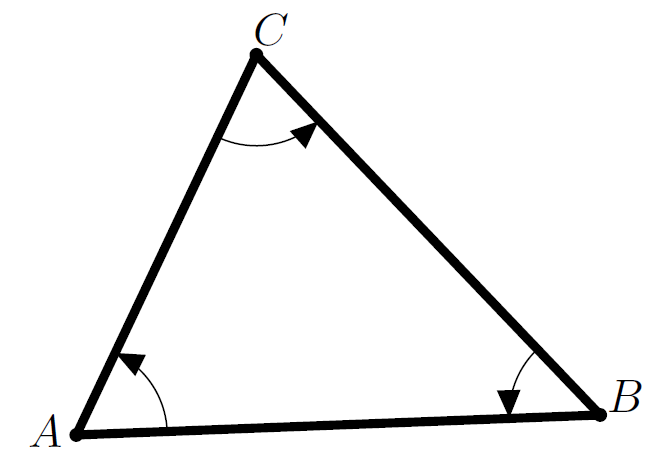
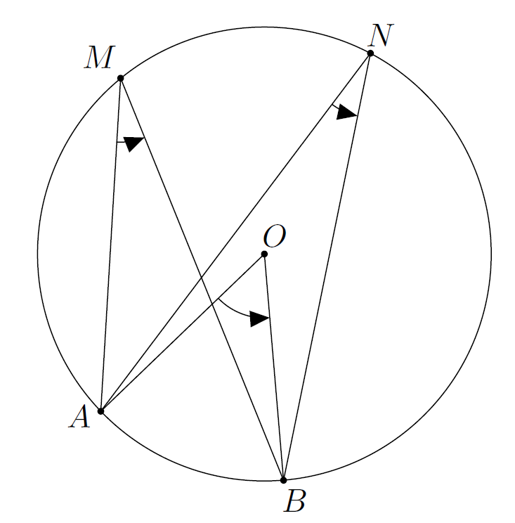

# Trigonométrie Angles orientés

## Mesures d'un angle orienté

!!! note "Définition - Angle orienté"
    Soit $\vect{u}$ et $\vect{v}$ deux vecteurs non nuls. On définit les points $M$ et $N$ tels que $\vect{OM}$ et $\vect{ON}$ sont leurs représentants respectifs d'origine $O$. Soit $M'$ et $N'$ les points d'intersection des demi-droites [$OM$) et [$ON$) avec le cercle trigonométrique.

    Soit $x$ et $y$ deux nombres réels qui ont pour points-images $M'$ et $N'$, alors $y - x$ est une mesure en radian de l'angle orienté $\left(\vect{u},\vect{v}\right)$.

- Si $M$ est le point-image du réel $x$, alors $\left(\vect{OI},\vect{OM}\right)=x$.

- Un angle orienté $x$ a une infinité de mesures différentes. Cependant, elles sont toutes égales à un nombre entier de fois $2\pi$ près, c'est-à-dire à un nombre $k\times{}2\pi{}$ près ($k\in{}\Z$), ou encore modulo $2\pi{}$ : ** on note $\mathbf{x = \ldots \ [2\pi]}$**. On ne le notera pas systématiquement mais c'est important de le savoir car une division (ou une multiplication) peut s'avérer problématique.  

L'équation $2x=\dfrac{\pi{}}{2}+k\times{}2\pi{}$ est équivalente à $x=\dfrac{\pi{}}{4}+k\times{}\pi{}$. Cette égalité entre $x$ et $\dfrac{\pi{}}{4}$ est alors réalisée modulo $\pi{}$ et non modulo $2\pi$.

!!! abstract "Théorème et définition - Mesure principale"
    L'angle orienté $\left(\vect{u},\vect{v}\right)$ a une unique mesure $\alpha{}$ dans l'intervalle, $\left]-\pi{}\ ;\ \pi{}\right]$ appelée **mesure principale**.

???- example "Exemple"
    Dans le repère orthonormé ($O$ ; $I$, $J$), on a l'égalité $\left(\vect{OI},\vect{OJ}\right)=\dfrac{\pi{}}{2}$.

???- tip "Méthode - Déterminer la mesure principale d'un angle orienté"
      Pour obtenir la mesure principale :
    
    - soit la mesure de l'angle est dans l'intervalle $\left]-\pi{}\ ;\ \pi{}\right]$, c'est alors la mesure principale ;
    - soit la mesure de l'angle est strictement supérieure à $\pi{}$.  On retranche $2\pi$, plusieurs fois si nécessaire, jusqu'à obtenir une mesure dans $\left]-\pi{}\ ;\ \pi{}\right]$;
    - soit la mesure de l'angle est inférieure ou égale à $\pi{}$. On ajoute $2\pi$, plusieurs fois si nécessaire, jusqu'à obtenir une mesure dans $\left]-\pi{}\ ;\ \pi{}\right]$.

    ???- example "Exemple"
        $\left(\vect{u},\vect{v}\right)=\dfrac{29\pi{}}{6}$.

        Quelle est la mesure principale de l'angle orienté~$\left(\vect{u},\vect{v}\right)$ ?

        ???- done "Solution"
            $\dfrac{29\pi{}}{6}$ n'est pas la mesure principale de $\left(\vect{u},\vect{v}\right)$ car $\dfrac{29\pi{}}{6}\not\in{}\left]-\pi{}\ ;\ \pi{}\right]$.
        
            Combien de fois $2\pi$ faut-il retrancher pour obtenir la mesure principale ?

            \[ \begin{eqnarray*}
            \pi < \dfrac{29 \pi}{6} - k \times 2\pi < \pi \text{ et } k \in \Z & \iff & -1 < \dfrac{29}{6} - 2k < 1 \text{ et } k \in \Z \\
            & \iff & -1 - \dfrac{29}{6} < -2k < 1 - \dfrac{29}{6} \text{ et } k \in \Z \\
            & \iff & \dfrac{35}{12} > k > \frac{23}{12}  \text{ et } k \in \Z \\
            & \iff & 2 + \dfrac{11}{12} > k > 1 + \dfrac{11}{12}  \text{ et } k \in \Z \\
            & \iff & k = 2
            \end{eqnarray*}
            \]

            Ainsi, la mesure principale de $\dfrac{29\pi}{6}$ est $\dfrac{29\pi}{6} - 2 \times 2\pi = \dfrac{24 \pi}{6}$.

## Propriétés

!!! abstract "Théorème"

    - **Relation de Chasles pour les angles**  
    Soit $\vect{u}$, $\vect{v}$ et $\vect{w}$ trois vecteurs non nuls, alors $\left(\vect{u},\vect{v}\right)+\left(\vect{v},\vect{w}\right)=\left(\vect{u},\vect{w}\right)$.
    - **Caractérisation de la colinéarité de deux vecteurs** $\vect{u}$ et $\vect{v}$ sont colinéaires si, et seulement si, $\left(\vect{u},\vect{v}\right)=0$ ou $\left(\vect{u},\vect{v}\right)=\pi{}$.

!!! abstract "Théorème"
    Pour tous vecteurs non nuls $\vec{u}$ et $\vec{v}$, on a :

    - $\anglev{v}{u}=- \anglev{u}{v} \quad [2\pi]$
    - Soit $k$ et $k'$ de même signe alors : $\anglev{ku}{k'v}=\anglev{u}{v} \quad [2\pi]$.  
    En particulier :  
      
    \[ \anglev{-u}{-v}=\anglev{u}{v} \quad [2\pi] \]  
      
    - Soit $k$ et $k'$ de signe contraire alors : $\anglev{ku}{k'v}=\pi+\anglev{u}{v} \quad [2\pi]$.  
    En particulier :  
      
    \[ \anglev{-u}{v}=\anglev{u}{-v}=\pi+\anglev{u}{v} \quad [2\pi] \]

    ???- abstract "Démonstration"

        - Comme $\anglev{v}{u}+ \anglev{u}{v} = \anglev{v}{v} = 0 \quad [2\pi]$ (Chasles), on a $\anglev{v}{u}=- \anglev{u}{v} \quad [2\pi]$.
        - Démonstration pour le cas particulier :

        \[ \begin{eqnarray*}
        \anglev{-u}{-v} & = & \anglev{-u}{u}+\anglev{u}{v}+\anglev{v}{-v} \quad [2\pi]\\
        \text{et comme } \anglev{-u}{u} & = & \anglev{v}{-v}=\pi \quad [2\pi] \\
        \text{ on  a } \anglev{-u}{-v} & = & \anglev{u}{v}+2\pi \quad [2\pi]\\
        \text{ d'où } \anglev{-u}{-v} & = &\anglev{u}{v} \quad [2\pi] 
        \end{eqnarray*} \]

        - Démonstration pour le cas particulier :  
        $\anglev{-u}{v}=\anglev{-u}{u}+\anglev{u}{v}=\pi+\anglev{u}{v} \quad [2\pi]$.  
        $\anglev{u}{-v}=\anglev{u}{v}+\anglev{v}{-v}=\anglev{u}{v}+\pi \quad [2\pi]$.

!!! abstract "Théorème"
    - **Somme des angles d'un triangle.** Dans tout triangle $ABC$ :
    
    \[ \left( \overrightarrow{AB};\overrightarrow{AC}   \right) + \left( \overrightarrow{BC};\overrightarrow{BA}   \right)  + \left( \overrightarrow{CA};\overrightarrow{CB}   \right) = \pi \quad [2 \pi] \]

    [{.Center_lien .Vignette20}](../Image/Trigo_01.png)

    - Bissectrice : $(OJ)$ bissectrice $\left( \overrightarrow{OA};\overrightarrow{OB} \right)$ $\Leftrightarrow$ $\left( \overrightarrow{OA};\overrightarrow{OJ}   \right) = \left( \overrightarrow{OJ};\overrightarrow{OB}   \right) \quad [2 \pi]$
    - **Angles inscrits et angle au centre.** Soit $\mathscr{C}$ un cercle de centre $O$ et $A$ et $B$ deux points distincts de $\mathscr{C}$, pour tous points $M$ et $N$ distincts de $A$ et de $B$ on a :
    
    \[ \left( \overrightarrow{OA};\overrightarrow{OB}   \right) = 2 \times \left( \overrightarrow{MA};\overrightarrow{MB}   \right) \quad [2 \pi ]\]

    \[ \left( \overrightarrow{MA};\overrightarrow{MB}   \right) = \left( \overrightarrow{NA};\overrightarrow{NB}   \right)  \quad [2 \pi] \]

    [{.Center_lien .Vignette20}](../Image/Trigo_02.png)