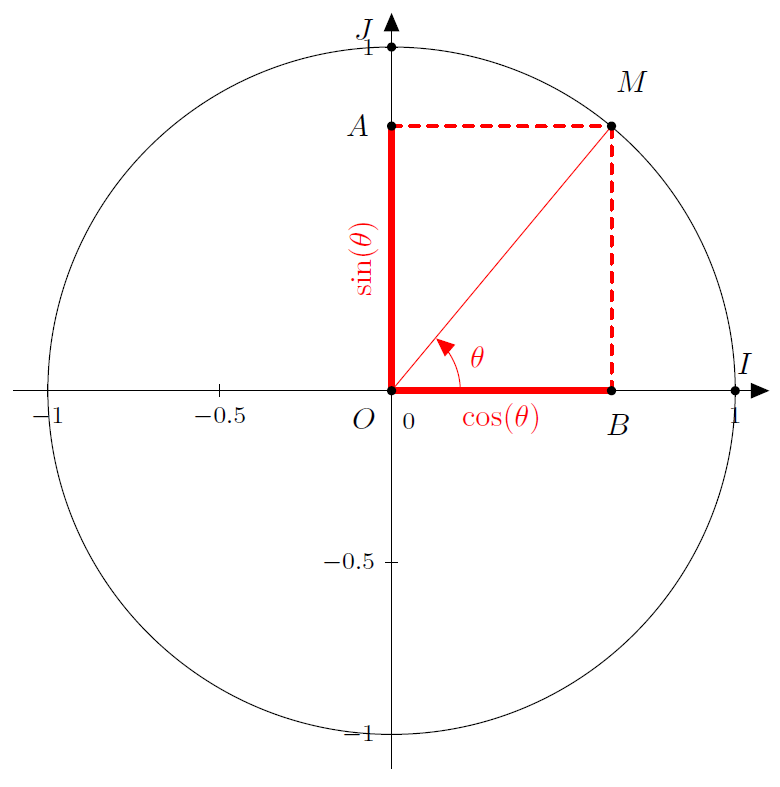
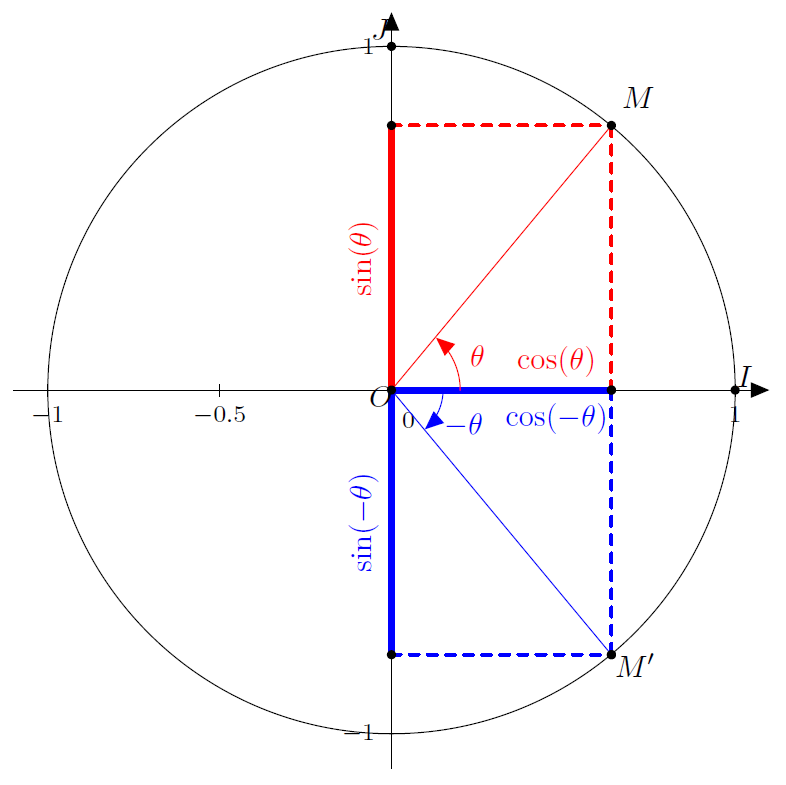
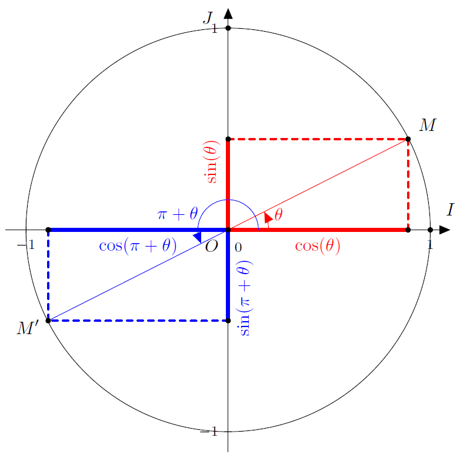
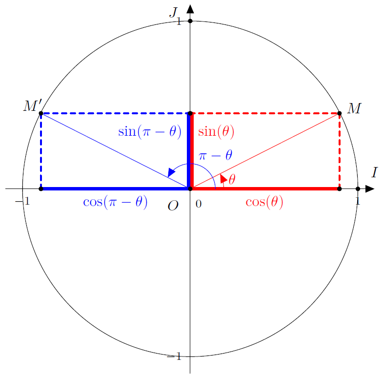
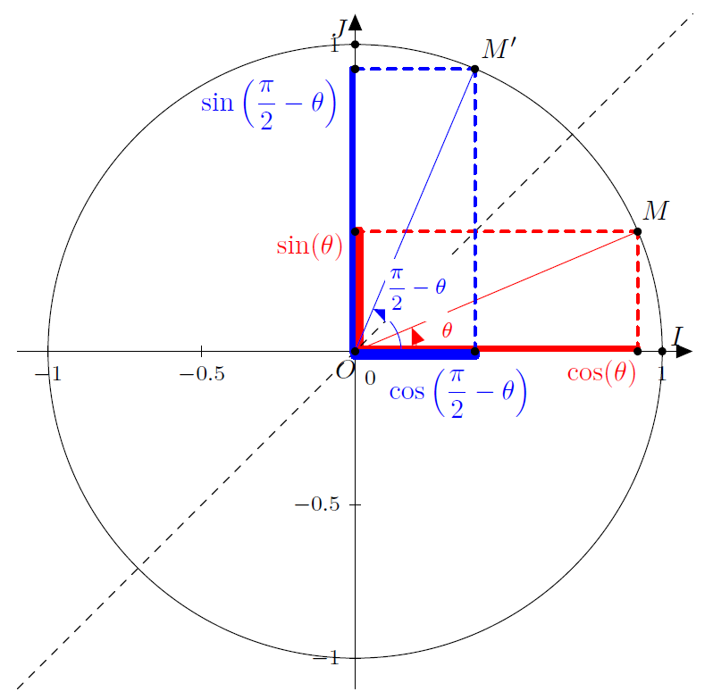
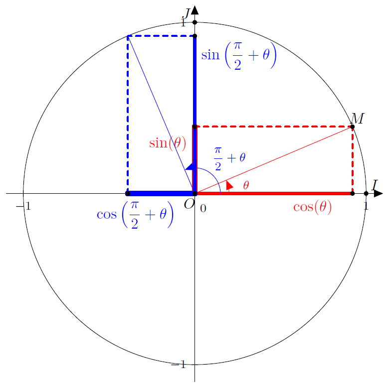

# Trigonométrie Cosinus et sinus

## Définition

!!! note "Définition"
    $\mathscr{C}$ est un cercle trigonométrique d'origine $I$ et $\theta$ la mesure d'un angle en radian, associé à un point $M$ de $\mathscr{C}$. On positionne $\mathscr{C}$ dans le repère orthonormé $(O;I,J)$. Alors :

    - $\cos( \theta)$ est l'abscisse de $M$.
    - $\sin( \theta)$ est l'ordonnée de $M$.
    
    [{.Center_lien .Vignette20}](../Image/Trigo_03.png)

!!! abstract "Théorème"
    - Pour tout $\theta \in \R$, $\cos^2 (\theta) + \sin^2(\theta)=1$.
    - Pour tout $k \in \N$ et pour tout $\theta \in \R$, $\cos( \theta + 2k \pi) = \cos(\theta)$ et $\sin( \theta + 2k \pi) = \sin(\theta)$.

!!! note "Définition"
    Un repère orthonormal $\repv$ du plan est dit **direct** lorsque $(\vec{i}; \vec{j})= \frac{\pi}{2}$.  
    Un repère orthonormal $\repv$ du plan est dit **indirect** lorsque $(\vec{i}; \vec{j})= -\frac{\pi}{2}$.

## Cosinus et sinus des angles orientés.

!!! note "Définition"
    Le cosinus (resp. sinus) d'un angle orienté $( \vec{u}; \vec{v})$ est le cosinus (resp. le sinus) de l'une quelconque de ses mesures en radians. On note alors $\cos( \vec{u}; \vec{v})$ (resp. $\sin( \vec{u}; \vec{v})$).

!!! abstract "Théorème"
    Avec la symétrie d'axe $(Ox)$, on remarque que 

    - $\cos(-\theta)=\cos(\theta)$
    - $\sin(-\theta)=-\sin(\theta)$.

    [{.Center_lien .Vignette20}](../Image/Trigo_04.png)

!!! abstract "Théorème"
    Avec la symétrie centrale de centre $O$, on remarque que 

    - $\cos(\pi+\theta) = -\cos(\theta)$
    - $\sin(\pi+\theta)=-\sin(\theta)$

    [{.Center_lien .Vignette20}](../Image/Trigo_05.png)

!!! abstract "Théorème"
    Avec la symétrie d'axe $(Oy)$, on remarque que 

    - $\cos(\pi-\theta)=-\cos(\theta)$
    - $\sin(\pi-\theta)=\sin(\theta)$

    [{.Center_lien .Vignette20}](../Image/Trigo_06.png)

!!! abstract "Théorème"
    Avec la symétrie d'axe la première bissectrice, on remarque que

    - $\cos \left( \frac{\pi}{2}-\theta \right)=\sin(\theta)$
    - $\sin \left( \frac{\pi}{2}-\theta \right)=\cos(\theta)$

    [{.Center_lien .Vignette20}](../Image/Trigo_07.png)

!!! abstract "Théorème"
    Avec la rotation de centre $O$ et d'angle $\frac{\pi}{2}$, on remarque que

    - $\cos \left( \frac{\pi}{2}+\theta \right)=-\sin(\theta)$ 
    - $\sin \left( \frac{\pi}{2}+\theta \right)=\cos(\theta)$

    [{.Center_lien .Vignette20}](../Image/Trigo_08.png)

## Equations $\cos (x) =\cos (a)$ et $\sin (x)= \sin (a)$

!!! abstract "Théorème"
    Soit $a$ un réel donné. Les solutions à l'équation $\cos (x) = \cos (a)$ sont :
    
    \[ \cos (x) = \cos (a) \Leftrightarrow 
    \left| \begin{array}{l}
    \ x = a + k \times 2\pi \quad k \in \Z \\
    \text{ ou }\\
    \ x = -a + k' \times 2\pi \quad k' \in \Z
    \end{array} \right.  \]

!!! abstract "Théorème"
    Soit $a$ un réel donné. Les solutions à l'équation $\sin (x) = \sin (a)$ sont :

    \[ \sin (x) = \sin (a) \Leftrightarrow 
    \left| \begin{array}{l}
    \ x = a + k \times 2\pi \quad k \in \Z \\
    \text{ ou }\\
    \ x = \pi-a + k' \times 2\pi \quad k' \in \Z
    \end{array} \right.  \]

???- example "Exemple"

    a. Résoudre dans $\R$ l'équation $\cos (x) = \dfrac{\sqrt{3}}{2}$.  
    b. En déduire les solutions qui appartiennent à l'intervalle $]-2\pi;2\pi]$.

    ???- done "Solution"

        a. $\cos (x) = \dfrac{\sqrt{3}}{2} = \cos \left( \dfrac{\pi}{6} \right)$, donc  

        \[ \left| \begin{array}{l}
        \ x = \dfrac{\pi}{6} + k \times 2\pi \quad k \in \Z \\
        \text{ ou }\\
        \ x = -\dfrac{\pi}{6} + k' \times 2\pi \quad k' \in \Z
        \end{array} \right. \]  
          
        b.  
        $\bullet$
        
        \[ \begin{eqnarray*}
        -2\pi < \dfrac{\pi}{6} + k \times 2\pi \leq 2\pi & \Leftrightarrow & -2\pi -\dfrac{\pi}{6}<  k \times 2\pi \leq 2\pi - \dfrac{\pi}{6} \\
        & \Leftrightarrow & -\dfrac{13\pi}{6}<  k \times 2\pi \leq  \dfrac{11\pi}{6} \\
        & \Leftrightarrow & -\dfrac{13}{12}<  k \leq  \dfrac{11}{12} \\
        \end{eqnarray*} \]

        Or $k \in \Z$, donc $k=-1$ ou $k=0$. Donc $x=\dfrac{\pi}{6}+(-1)\times 2\pi=\mathbf{\dfrac{-11\pi}{6}}$ ou $x=\dfrac{\pi}{6}+0\times 2\pi=\mathbf{\dfrac{\pi}{6}}$.  
        $\bullet$
        
        \[ \begin{eqnarray*}
        -2\pi < -\dfrac{\pi}{6} + k' \times 2\pi \leq 2\pi & \Leftrightarrow & -2\pi +\dfrac{\pi}{6}<  k' \times 2\pi \leq 2\pi + \dfrac{\pi}{6} \\
        & \Leftrightarrow & -\dfrac{11\pi}{6}<  k' \times 2\pi \leq  \dfrac{13\pi}{6} \\
        & \Leftrightarrow & -\dfrac{11}{12}<  k' \leq  \dfrac{13}{12} \\
        \end{eqnarray*} \]  
             
        Or $k' \in \Z$, donc $k'=0$ ou $k'=1$. Donc $x=-\dfrac{\pi}{6}+0\times 2\pi=\mathbf{\dfrac{-\pi}{6}}$ ou $x=-\dfrac{\pi}{6}+1\times 2\pi=\mathbf{\dfrac{11\pi}{6}}$.

        D'où $S=\left\{ \dfrac{-11\pi}{6},\dfrac{-\pi}{6},\dfrac{\pi}{6}, \dfrac{11\pi}{6}\right\}$.

???- example "Exemple"
    a. Résoudre dans $\R$ l'équation $\sin (x) = -\sin \left( \dfrac{\pi}{4} \right)$.  
    b. En déduire les solutions qui appartiennent à l'intervalle $]-\pi;3\pi]$.

    ???- done "Solution"
    
        a. $\sin (x) = -\sin \left( \dfrac{\pi}{4} \right)=\sin \left( \pi + \dfrac{\pi}{4}\right) =\sin \left( \dfrac{5\pi}{4} \right)$. D'où  
        
        \[ \left| \begin{array}{l}
        \ x = \dfrac{5\pi}{4} + k \times 2\pi \quad k \in \Z \\
        \text{ ou }\\
        \ x = \pi-\dfrac{5\pi}{4} + k' \times 2\pi = -\dfrac{\pi}{4}+ k' \times 2\pi \quad k' \in \Z
        \end{array} \right. \]
        
        b.
        $\bullet$

        \[ \begin{eqnarray*}
        -\pi < \dfrac{5\pi}{4} + k \times 2\pi \leq 3\pi & \Leftrightarrow & -\pi -\dfrac{5\pi}{4}<  k \times 2\pi \leq 3\pi - \dfrac{5\pi}{4} \\
        & \Leftrightarrow & -\dfrac{9\pi}{4}<  k \times 2\pi \leq  \dfrac{7\pi}{4} \\
        & \Leftrightarrow & -\dfrac{9}{8}<  k \leq  \dfrac{7}{8} \\
        \end{eqnarray*} \]
        
        Or $k \in \Z$, donc $k=-1$ ou $k=0$. Donc $x=\dfrac{5\pi}{4}+(-1)\times 2\pi=\mathbf{\dfrac{-3\pi}{4}}$ ou $x=\dfrac{5\pi}{4}+0\times 2\pi=\mathbf{\dfrac{5\pi}{4}}$.

        $\bullet$

        \[ \begin{eqnarray*}
        -\pi < -\dfrac{\pi}{4} + k' \times 2\pi \leq 3\pi & \Leftrightarrow & -\pi +\dfrac{\pi}{4}<  k' \times 2\pi \leq 3\pi + \dfrac{\pi}{4} \\
        & \Leftrightarrow & -\dfrac{3\pi}{4}<  k' \times 2\pi \leq  \dfrac{13\pi}{4} \\
        & \Leftrightarrow & -\dfrac{3}{8}<  k' \leq  \dfrac{13}{8} \\
        \end{eqnarray*} \]

        Or $k' \in \Z$, donc $k'=0$ ou $k'=1$. Donc $x=-\dfrac{\pi}{4}+0\times 2\pi=\mathbf{\dfrac{-\pi}{4}}$ ou $x=-\dfrac{\pi}{4}+1\times 2\pi=\mathbf{\dfrac{7\pi}{4}}$.

        D'où $S=\left\{ \dfrac{-3\pi}{4},\dfrac{-\pi}{4},\dfrac{5\pi}{4}, \dfrac{7\pi}{4}\right\}$.

???- example "Exemple"

    a. Résoudre dans $\R$ l'équation $\sin (x)  -\cos \left( \dfrac{\pi}{6} \right)=0$.  
    b. En déduire les solutions qui appartiennent à l'intervalle $]-10;20]$.

    ???- done "Solution"

        a. 
        
        \[ \begin{eqnarray*}
        \sin (x)  -\cos \left( \dfrac{\pi}{6} \right)=0 & \Leftrightarrow &  \sin (x)  =\cos \left( \dfrac{\pi}{6} \right)\\
        & \Leftrightarrow &  \sin (x)  =\sin \left( \dfrac{\pi}{2} - \dfrac{\pi}{6} \right) \\
        & \Leftrightarrow &  \sin (x)  =\sin \left( \dfrac{\pi}{3} \right) \\
        \end{eqnarray*} \]

        D'où $\left| \begin{array}{l}
        \ x = \dfrac{\pi}{3} + k \times 2\pi \quad k \in \Z \\
        \text{ ou }\\
        \ x = \pi-\dfrac{\pi}{3} + k' \times 2\pi = \dfrac{2\pi}{3} + k' \times 2\pi\quad k' \in \Z
        \end{array} \right.$ 

        b. 
        $\bullet$
        
        \[ \begin{eqnarray*}
        -10 < \dfrac{\pi}{3} + k \times 2\pi \leq 20 & \Leftrightarrow & -10 -\dfrac{\pi}{3}<  k \times 2\pi \leq 20 - \dfrac{\pi}{3} \\
        & \Leftrightarrow & -\dfrac{30+\pi}{3}<  k \times 2\pi \leq  \dfrac{60-\pi}{3} \\
        & \Leftrightarrow & -\dfrac{30+\pi}{6\pi}<  k  \leq  \dfrac{60-\pi}{6\pi} \\
        \end{eqnarray*} \]

        Donc $-1.8<k \leq 3.1$. Or $k \in \Z$, donc $k=-1$, $k=0$, $k=1$, $k=2$ ou $k=3$. Donc  

        - $x=\dfrac{\pi}{3}+(-1)\times 2\pi=\mathbf{\dfrac{-5\pi}{3}}$
        - $x=\dfrac{\pi}{3}+0\times 2\pi=\mathbf{\dfrac{\pi}{3}}$
        - $x=\dfrac{\pi}{3}+(1)\times 2\pi=\mathbf{\dfrac{7\pi}{3}}$
        - $x=\dfrac{\pi}{3}+(2)\times 2\pi=\mathbf{\dfrac{13\pi}{3}}$
        - $x=\dfrac{\pi}{3}+(3)\times 2\pi=\mathbf{\dfrac{19\pi}{3}}$

        $\bullet$
        
        \[ \begin{eqnarray*}
        -10 < \dfrac{2\pi}{3} + k' \times 2\pi \leq 20 & \Leftrightarrow & -10 -\dfrac{2\pi}{3}<  k' \times 2\pi \leq 20 - \dfrac{2\pi}{3} \\
        & \Leftrightarrow & -\dfrac{30+2\pi}{3}<  k' \times 2\pi \leq  \dfrac{60-2\pi}{3} \\
        & \Leftrightarrow & -\dfrac{30+2\pi}{6\pi}<  k'  \leq  \dfrac{60-2\pi}{6\pi} \\
        \end{eqnarray*} \]

        Donc $-1.93<k' \leq 2.9$. Or $k' \in \Z$, donc $k'=-1$, $k'=0$, $k'=1$ ou $k'=2$. Donc  
        
        - $x=\dfrac{2\pi}{3}+(-1)\times 2\pi=\mathbf{\dfrac{-4\pi}{3}}$
        - $x=\dfrac{2\pi}{3}+0\times 2\pi=\mathbf{\dfrac{2\pi}{3}}$
        - $x=\dfrac{2\pi}{3}+(1)\times 2\pi=\mathbf{\dfrac{8\pi}{3}}$
        - $x=\dfrac{2\pi}{3}+(2)\times 2\pi=\mathbf{\dfrac{14\pi}{3}}$

        D'où $S=\left\{ \dfrac{-5\pi}{3},\dfrac{-4\pi}{3},\dfrac{\pi}{3},\dfrac{2\pi}{3},\dfrac{7\pi}{3},\dfrac{8\pi}{3},\dfrac{13\pi}{3},\dfrac{14\pi}{3},\dfrac{19\pi}{3} \right\}$.

???- example "Exemple - Pour aller plus loin"

    a. Résoudre dans $\R$ l'équation $\sin \left( \dfrac{x}{5} \right)  +\cos \left( -\dfrac{\pi}{3} \right)=0$.  
    b. En déduire les solutions qui appartiennent à l'intervalle $]-4;6]$.

    ???- done "Solution"

        a.
        $\bullet$ 
        
        \[ \begin{eqnarray*}
        \sin \left( \dfrac{x}{5} \right)  +\cos \left( -\dfrac{\pi}{3} \right)=0 & \Leftrightarrow & \sin \left( \dfrac{x}{5} \right)  =-\cos \left( -\dfrac{\pi}{3} \right) \\
        & \Leftrightarrow & \sin \left( \dfrac{x}{5} \right)  =-\sin \left( \dfrac{\pi}{2}- \left(-\dfrac{\pi}{3} \right) \right) \\
        & \Leftrightarrow & \sin \left( \dfrac{x}{5} \right)  =-\sin \left( \dfrac{\pi}{2}+\dfrac{\pi}{3} \right) \\
        & \Leftrightarrow & \sin \left( \dfrac{x}{5} \right)  =-\sin \left( \dfrac{5\pi}{6}\right) \\
        & \Leftrightarrow & \sin \left( \dfrac{x}{5} \right)  =\sin \left( \pi +  \dfrac{5\pi}{6}\right) \\
        & \Leftrightarrow & \sin \left( \dfrac{x}{5} \right)  =\sin \left( \dfrac{11\pi}{6}\right) \\
        \end{eqnarray*} \]
        
        D'où : $\left\{ \begin{array}{l}
        \ \dfrac{x}{5} = \dfrac{11\pi}{6} + k \times 2\pi \quad k \in \Z \\
        \text{ ou }\\
        \ \dfrac{x}{5} = \pi-\dfrac{11\pi}{6} + k' \times 2\pi = -\dfrac{5\pi}{6} + k' \times 2\pi\quad k' \in \Z
        \end{array} \right.$ 
        
        D'où : $\left\{ \begin{array}{l}
        \ x = \dfrac{55\pi}{6} + k \times 10\pi \quad k \in \Z \\
        \text{ ou }\\
        \ x =  -\dfrac{25\pi}{6} + k' \times 10\pi\quad k' \in \Z
        \end{array} \right.$
        
        b.  
        $\bullet$ 
        
        \[ \begin{eqnarray*}
        -4< \dfrac{55\pi}{6} + k \times 10\pi \leq 6 & \Leftrightarrow & -4 -\dfrac{55\pi}{6}<  k \times 10\pi \leq 6 - \dfrac{55\pi}{6} \\
        & \Leftrightarrow & -\dfrac{24+55\pi}{6}<  k \times 10\pi \leq  \dfrac{36-55\pi}{6} \\
        & \Leftrightarrow & -\dfrac{24+55\pi}{60\pi}<  k  \leq  \dfrac{36-55\pi}{60\pi} \\
        \end{eqnarray*} \]

        Donc $-1.1<k\leq-0.8$. Or $k \in \Z$, donc $k=-1$. Donc $x=\dfrac{55\pi}{6}+(-1)\times 10\pi=\mathbf{-\dfrac{5\pi}{6}}$

        $\bullet$ 
        
        \[ \begin{eqnarray*}
        -4< -\dfrac{25\pi}{6} + k \times 10\pi \leq 6 & \Leftrightarrow & -4 +\dfrac{25\pi}{6}<  k \times 10\pi \leq 6 + \dfrac{25\pi}{6} \\
        & \Leftrightarrow & \dfrac{-24+25\pi}{6}<  k \times 10\pi \leq  \dfrac{36+25\pi}{6} \\
        & \Leftrightarrow & \dfrac{-24+25\pi}{60\pi}<  k  \leq  \dfrac{36+25\pi}{60\pi} \\
        \end{eqnarray*} \]

        Donc $0.2<k<0.61$. Or $k \in \Z$, donc pas de solution.

        D'où $S=\left\{ \dfrac{-5\pi}{6} \right\}$.

