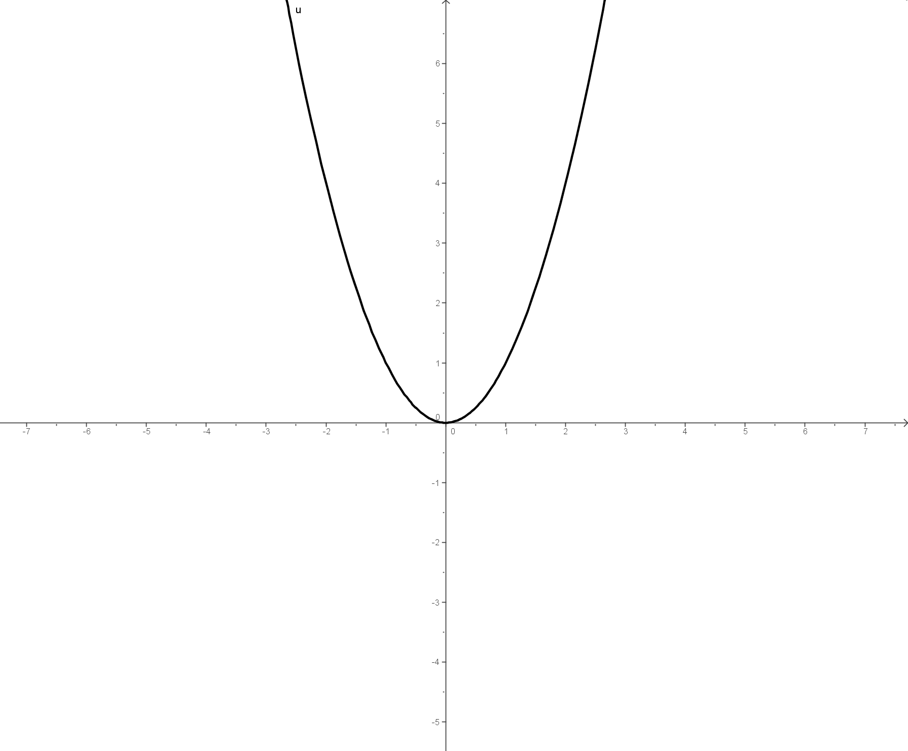
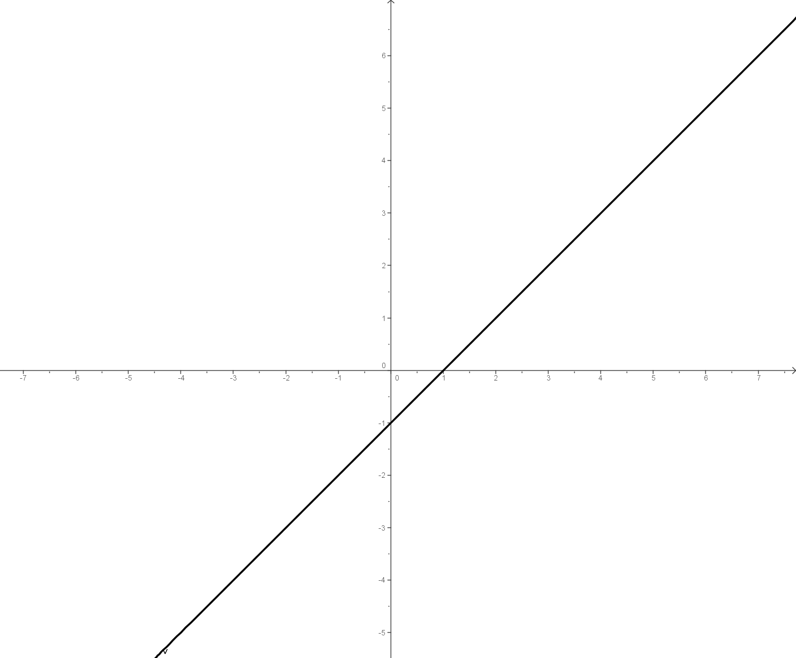
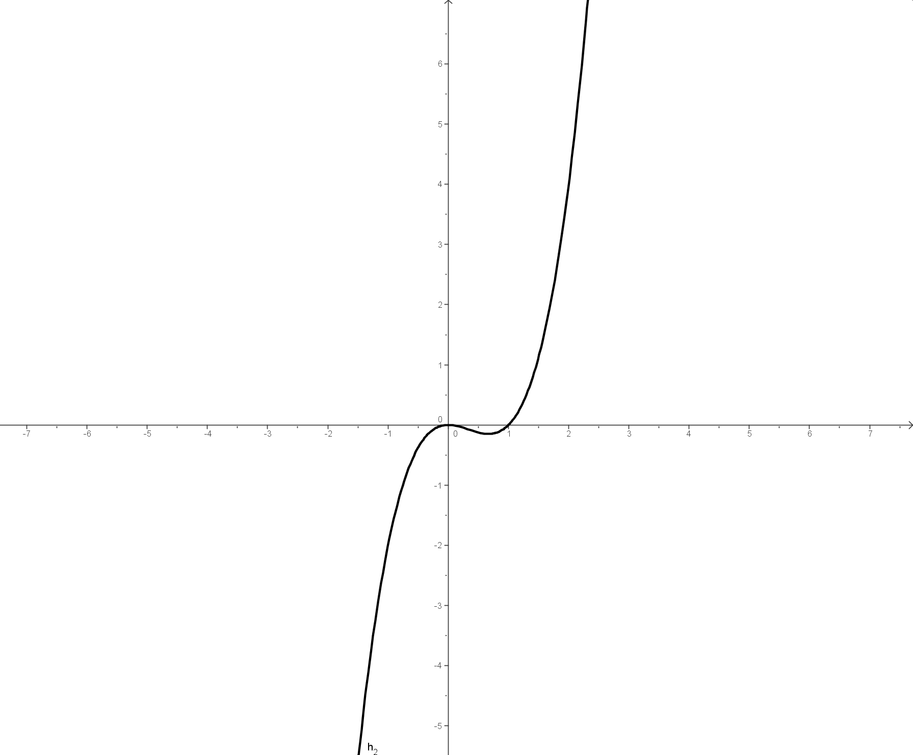
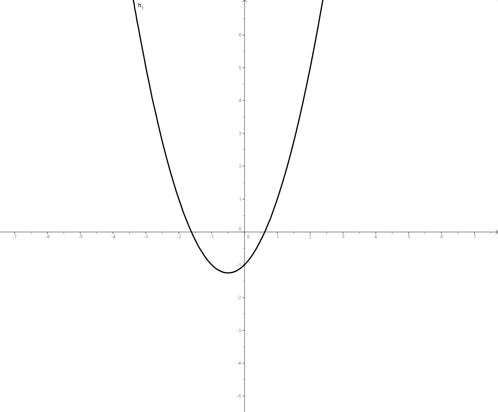
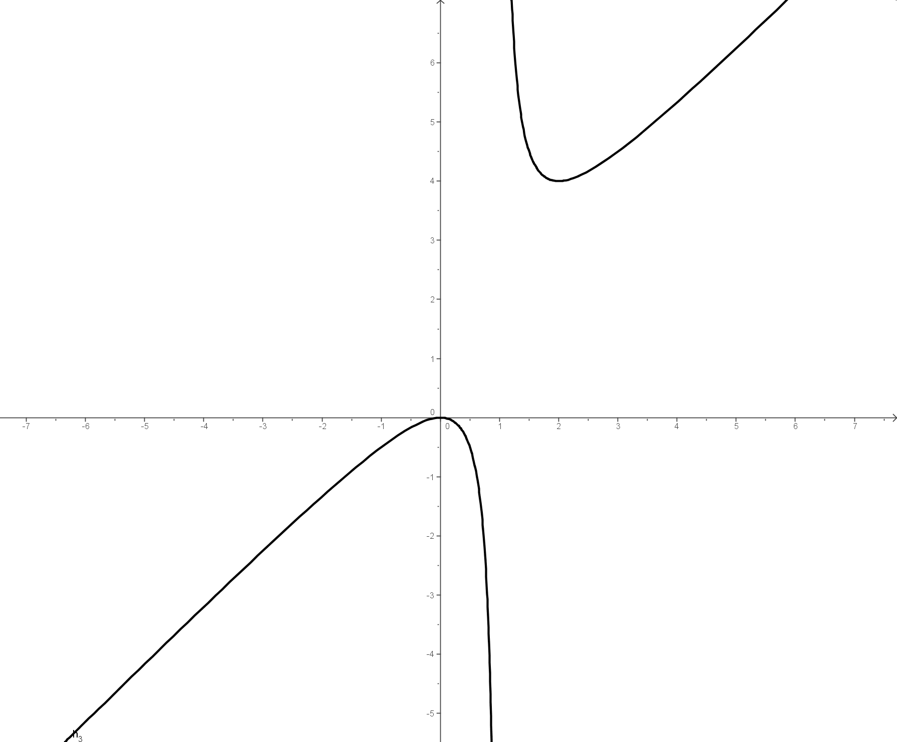
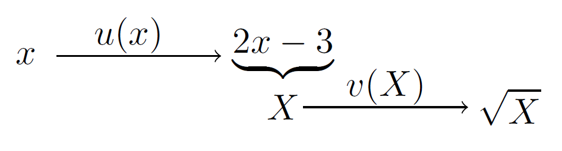
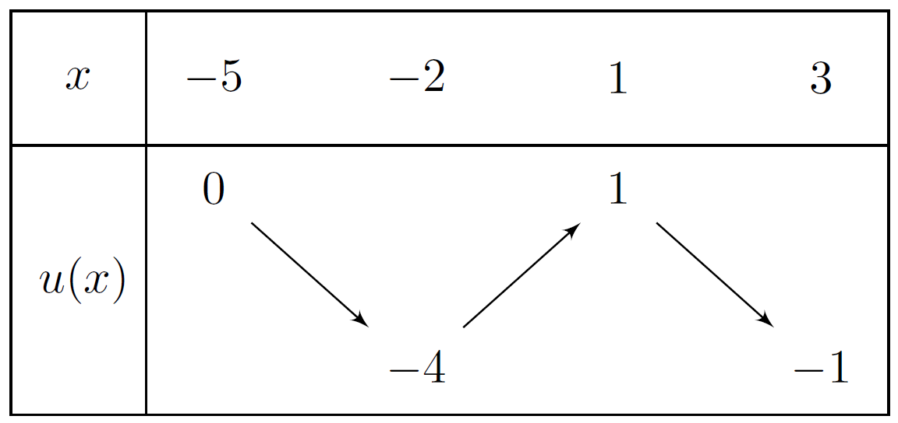

# Autour des fonctions

## Opérations sur les fonctions.

!!! note "Définition - Rappel"
    Soit $f$ une fonction définie sur un intervalle $I$.

    - Dire que $f$ est une fonction strictement croissante sur $I$ signifie que, pour tout couple $(a;b)$ de réels de $I$

    \[ \text{si } a<b, \text{ alors } f(a)<f(b) \]

    On peut donc dire qu'une fonction croissante conserve l'ordre.
    - Dire que $f$ est une fonction strictement décroissante sur $I$ signifie que, pour tout couple $(a;b)$ de réels de $I$

    \[ \text{si } a<b, \text{ alors } f(a)>f(b) \]

    On peut donc dire qu'une fonction décroissante change l'ordre. 
    - Dire que $f$ est une fonction strictement monotone sur $I$ signifie que $f$ est strictement croissante ou strictement décroissante sur $I$.

!!! note "Définition - Egalité de fonctions"
    Dire que deux fonctions $u$ et $v$ sont égales signifie que :

    - $u$ et $v$ ont le même ensemble de définition $\mathcal{D}$
    - pour tout réel $x$ de $\mathcal{D}$, $u(x)=v(x)$.

    On note alors $u=v$.

!!! note "Définition - Opérations sur les fonctions"
    
    Soient $u$ et $v$ deux fonctions définies respectivement sur les ensembles $\mathcal{D}_u$ et $\mathcal{D}_v$.

    - La fonction $\mathbf{u+v}$ est la fonction $x \mapsto u(x) + v(x)$ définie sur $\mathcal{D}_u \cap \mathcal{D}_v$, ensemble des réels appartenant à la fois à $\mathcal{D}_u$ et à $\mathcal{D}_v$.
    - La fonction $\mathbf{u-v}$ est la fonction $x \mapsto u(x) - v(x)$ définie sur $\mathcal{D}_u \cap \mathcal{D}_v$.
    - La fonction $\mathbf{uv}$ est la fonction $x \mapsto u(x) \times v(x)$ définie sur $\mathcal{D}_u \cap \mathcal{D}_v$.
    - La fonction $\mathbf{u^2}$ est la fonction $x \mapsto \left( u(x) \right)^2$ définie sur $\mathcal{D}_u$
    - La fonction $\mathbf{\frac{u}{v}}$ est la fonction $x \mapsto \frac{u(x)}{v(x)}$ définie sur $\mathcal{D}_u \cap \mathcal{D}_v$ tels que $v(x) \neq 0$.

!!! info "Remarque - Notation"
    Lorsque $v$ est une fonction constante prenant la valeur $\lambda$, où $\lambda$ est un réel fixé, la fonction $u+v$ est notée $u+\lambda$ et la fonction $uv$ est notée $\lambda u$.

!!! example "Exemple"
    Soit $u$ et $v$ les fonctions définies sur $\R$ par $u(x)=x^2$ et $v(x)=x-1$.

    - Les fonctions $u+v$ et $uv$ sont définies sur $\R$ par :
    
    \[ (u+v)(x) = x^2+x-1 \quad \text{et} \quad (uv)(x)=x^2(x-1) \]

    - La fonction $\frac{u}{v}$ est définie sur $\R -\{1\}$ par $\frac{u}{v}(x)=\frac{x^2}{x-1}$.

???- example "Exemple"
     $u(x) = x^2$   $v(x) = x-1$ 

    [{.Vignette40}](../Image/op_fct_03.png)
    [{.Vignette40}](../Image/op_fct_04.png)
    
    [{.Vignette40}](../Image/op_fct_05.png)
    [{.Vignette40}](../Image/op_fct_07.png)

     $u \times v$   $u + v$ 
    
    [{.Vignette40}](../Image/op_fct_06.png)

     $\dfrac{u}{v}$ 

## Sens de variations et opérations

!!! abstract "Théorème"
    - La somme de deux fonctions strictement croissantes sur un intervalle $I$ est une fonction strictement croissante sur $I$.
    - La somme de deux fonctions strictement décroissantes sur un intervalle $I$ est une fonction strictement décroissante sur $I$.

???- abstract "Démonstration"
    Supposons $u$ et $v$ croissantes sur $I$ et $a$ et $b$ deux réels de $I$ tels que $a < b$.  
    Comme $u$ et $v$ sont croissantes sur $I$ alors $u(a) < u(b)$ et $v(a) < v(b)$.
    
    \[ \begin{eqnarray*}
    u(a) & < &  u(b)\\
    u(a) + v(a) & < & u(b) + v(a) \\
    \text{Or} \quad v(a) & < & v(b) \\
    \text{d'où} \quad v(a) + u(b) & < & v(b) + u(b) \\
    \text{donc} \quad u(a) + v(a)  & < & u(b) + v(a) < v(b) + u(b) \\
    \text{conclusion :} \quad u(a)+v(a) & < & u(b) + v(b) \\
    \end{eqnarray*} 
    \]

    D'où $u(a)+v(a) < u(b) + v(b)$.
    Donc $u+v$ est croissante sur $I$.

!!! abstract "Théorème"
    Si $u$ est une fonction définie sur un intervalle $I$ et $\lambda$ est un réel.

    - Si $\lambda >0$, $u$ et $\lambda u$ ont même sens de variation sur $I$.
    - Si $\lambda <0$, $u$ et $\lambda u$ ont un sens de variation contraire sur $I$.

???- abstract "Démonstration"
    Supposons $u$ croissante sur $I$ et $\lambda >0$.
    Soient $a$ et $b$ deux réels de $I$, tels que $a<b$.

    \[ \begin{eqnarray*}
    a & < & b \\
    u(a) & < & u(b) \qquad \text{car $u$ est croissante sur $I$} \\
    \lambda u(a) & < & \lambda u(b) \qquad \text{car $\lambda \geq 0$}\\
    \left( \lambda u \right)(a) & < & \left( \lambda u \right)(b)
    \end{eqnarray*}
    \]
    
    Donc $\lambda u$ est croissante sur $I$.

!!! abstract "Théorème"
    Si $u$ est une fonction définie sur un intervalle $I$ telle que pour tout réel $x$ de  $I$, $u(x)\geq 0$. La fonction $\sqrt{u}$ est la fonction définie sur $I$ par : $x \mapsto \sqrt{u(x)}$.

    **Les fonctions $u$ et $\sqrt{u}$ ont le même sens de variation sur $I$.**

???- abstract "Démonstration"
    
    - Si $u$ est croissante sur $I$. Soit $a$ et $b$ de $I$, tels que $a<b$. Alors comme $u$ est croissante sur $I$, $0 \leq u(a)<u(b)$. Comme la fonction racine carrée est croissante sur $[0 ; +\infty[$, $\sqrt{u(a)}<\sqrt{u(b)}$. L'ordre est conservé pour tout $a$ et $b$ de $I$. Donc $\sqrt{u}$ est croissante.
    - Si $u$ est décroissante sur $I$. Soit $a$ et $b$ de $I$, tels que $a<b$. Alors comme $u$ est décroissante sur $I$, $u(a)>u(b)\geq 0$. Comme la fonction racine carrée est croissante sur $[0 ; +\infty[$, $\sqrt{u(a)}>\sqrt{u(b)}$. L'ordre est changé pour tout $a$ et $b$ de $I$. Donc $\sqrt{u}$ est décroissante.

!!! abstract "Théorème"
    Soit une fonction $u$ définie sur un intervalle $I$ sur lequel $u$ a un signe constant et ne s'annule pas. La fonction $\dfrac{1}{u}$ est la fonction définie sur $I$ par : $x \mapsto \dfrac{1}{u(x)}$.

    Les fonctions $u$ et $\dfrac{1}{u}$ ont des sens de variations contraires sur $I$.

???- abstract "Démonstration"

    - Si $u$ est croissante sur $I$ et $u$ est strictement positive sur $I$. Soit $a$ et $b$ de $I$, tels que $a<b$. Alors comme $u$ est croissante sur $I$, $0 < u(a)<u(b)$. Comme la fonction inverse est décroissante sur $]0 ; +\infty[$, $\dfrac{1}{u(a)}>\dfrac{1}{u(b)}$. L'ordre est changé pour tout $a$ et $b$ de $I$. Donc $\dfrac{1}{u(x)}$ est décroissante.
    - Si $u$ est croissante sur $I$ et $u$ est strictement négative sur $I$. Soit $a$ et $b$ de $I$, tels que $a<b$. Alors comme $u$ est croissante sur $I$, $u(a)<u(b)<0$. Comme la fonction inverse est décroissante sur $]0 ; +\infty[$, $\dfrac{1}{u(a)}>\dfrac{1}{u(b)}$. L'ordre est changé pour tout $a$ et $b$ de $I$. Donc $\dfrac{1}{u(x)}$ est décroissante.
    - Si $u$ est décroissante sur $I$ et $u$ est strictement positive sur $I$. Soit $a$ et $b$ de $I$, tels que $a<b$. Alors comme $u$ est décroissante sur $I$, $u(a)>u(b)>0$. Comme la fonction inverse est décroissante sur $]0 ; +\infty[$, $\dfrac{1}{u(a)}<\dfrac{1}{u(b)}$. L'ordre est conservé pour tout $a$ et $b$ de $I$. Donc $\dfrac{1}{u(x)}$ est croissante.
    - Si $u$ est décroissante sur $I$ et $u$ est strictement négative sur $I$. Soit $a$ et $b$ de $I$, tels que $a<b$. Alors comme $u$ est décroissante sur $I$, $0>u(a)>u(b)$. Comme la fonction inverse est décroissante sur $]0 ; +\infty[$, $\dfrac{1}{u(a)}<\dfrac{1}{u(b)}$. L'ordre est conservé pour tout $a$ et $b$ de $I$. Donc $\dfrac{1}{u(x)}$ est croissante.

## Composée de fonctions

!!! note "Définition - Composée de $u$ par $v$"
    Soit $u$ et $v$ deux fonctions définies respectivement sur les ensembles $\mathcal{D}_u$ et $\mathcal{D}_v$.
    
    La fonction obtenue en appliquant successivement $u$, puis $v$, est la composée de $u$ par $v$, notée $\mathbf{v \circ u}$ (lire $v$ &laquo; rond &raquo; $\u$.
    
    La fonction $\mathbf{v \circ u}$ est définie :

    - sur l'ensemble $\mathcal{D}$ des réels $x$ de $\mathcal{D}_u$ tels que $u(x)$ appartienne à $\mathcal{D}_v$
    - par $(v \circ u)(x) = v \left( u(x) \right)$.

!!! info "Remarque"
    Remarquez l'ordre différent entre la phrase (&laquo; la composée de $u$ par $v$ &raquo;) et la notation $v \circ u$.

!!! example "Exemple"

    Soient $u(x) = \sqrt{x}$ définie sur $\left[0 ; + \infty \right[$ et $v$ la fonction définie sur $\R - {2}$ par $v(x)=\frac{1}{x-2}$.

    - Trouver le domaine de définition de $v \circ u$.
    - Donner l'expression de $v \circ u$

    ???- done "Solution"

        - $v \circ u$ est définie lorsque $x \in \mathcal{D}_u$ et $u(x) \neq 2$, donc si $x \in [0 ; + \infty [$ et $x \neq 4$. D'où $\mathcal{D}_{v \circ u} = [0 ; 4[ \cup ]4 ; + \infty [$.
        - $(v \circ u)(x) = v \left( u(x) \right) =  v \left( \sqrt{x} \right) = \frac{1}{\sqrt{x}-2}$

!!! example "Exemple"
    Soit $f(x)=\sqrt{2x-3}$.

    Ecrire $f$ sous la forme d'une composée de deux fonctions de référence (i.e. trouver $u$ et $v$ telles que $f=v \circ u$.

    ???- done "Solution"
        Il faut calculer une image ($f(4)$ par exemple) en mettant en valeur les étapes de calculs. On peut alors résumé ceci comme suit :

        [{.Center_lien .Vignette30}](../Image/op_fct_02.png)
<!-- \begin{center}
\begin{tikzpicture}
\draw[->] (0,0) node{$x$} +(0.3,0) -- (1.9,0);
\draw (1,0.2) node{$u(x)$};
\draw (2.5,0) node{$\underbrace{2x-3}$};
\draw (2.5,-0.5) node{$X$};
\draw[->] (2.7,-0.5) -- (4.3,-0.5);
\draw (3.5,-0.3) node{$v(X)$};
\draw (4.7,-0.5) node{$\sqrt{X}$};
\end{tikzpicture}
\end{center} -->

!!! abstract "Théorème"
    $u$ est une fonction strictement monotone sur l'intervalle $I$ et $v$ est une fonction strictement monotone sur l'intervalle $J$ tel que pour tout $x \in I$ $u(x) \in J$. 

    - Lorsque $u$ et $v$ ont même sens de variation, alors $v \circ u$ est strictement croissante sur $I$.
    - Lorsque $u$ et $v$ sont de sens contraire, alors $v \circ u$ est strictement décroissante sur $I$.

???- abstract "Démonstration"

    Soient $a$ et $b$ deux réels de $I$ tels que $a<b$.  
    
    - Supposons $u$ et $v$ croissantes.

    \[ \begin{eqnarray*}
    a & < & b \\
    u(a) & < & u(b) \quad \text{car $u$ est croissante sur $I$}
    \]

    $u(a)$ et $u(b)$ appartiennent à $J$ ; or $v$ est croissante sur $J$, donc :

    \[ \begin{eqnarray*}
    v(u(a)) & < & v(u(b)) \\
    \left( v \circ u \right)(a) & < & \left( v \circ u \right)(b) 
    \end{eqnarray*}
    \]
    
    Donc $v \circ u$ est croissante.
    - Supposons $u$ et $v$ décroissantes.
    
    \[ \begin{eqnarray*}
    a & < & b \\
    u(a) & > & u(b) \quad \text{car $u$ est décroissante sur $I$}
    \end{eqnarray*}
    \]
    $u(a)$ et $u(b)$ appartiennent à $J$ ; or $v$ est décroissante sur $J$, donc :

    \[ \begin{eqnarray*}
    v(u(a)) & < & v(u(b)) \\
    \left( v \circ u \right)(a) & < & \left( v \circ u \right)(b) 
    \end{eqnarray*}
    \]
    
    Donc $v \circ u$ est croissante.
    - Si $u$ est croissante et $v$ est décroissante.
    
    \[ \begin{eqnarray*}
    a & < & b \\
    u(a) & < & u(b) \quad \text{car $u$ est croissante sur $I$}
    \end{eqnarray*}
    \]
    
    $u(a)$ et $u(b)$ appartiennent à $J$ ; or $v$ est décroissante sur $J$, donc :

    \[ \begin{eqnarray*}
    v(u(a)) & > & v(u(b)) \\
    \left( v \circ u \right)(a) & > & \left( v \circ u \right)(b) 
    \end{eqnarray*}
    \]
    
    Donc $v \circ u$ est décroissante.

!!! example "Exemple"
    La fonction $u$ est définie sur l'intervalle $\left[ -5 ; 3 \right]$ et a pour tableau de variations :

    [{.Center_lien .Vignette30}](../Image/op_fct_01.png)
    <!-- \begin{center}
    \begin{tikzpicture}
    \tkzTabInit[lgt=1,espcl=1.5]
    {$x$ /1, $u(x)$ /2}{$-5$,$-2$,$1$,$3$}
    \tkzTabVar{+/ $0$ /, -/ $-4$ /, +/ $1$ /, -/ $-1$ /}
    \end{tikzpicture}
    \end{center} -->

    Les fonctions $v$ et $w$ sont définies sur $\R$ par $v(x) = x+3$ et $w(x) = -x+2$.\\
    Déterminer les tableaux de variations des fonctions :

    - $u \circ v$
    - $v \circ u$
    - $u \circ w$
    - $w \circ u$
