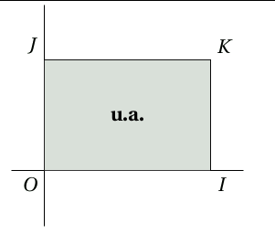
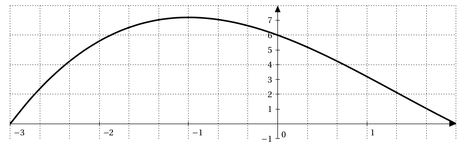
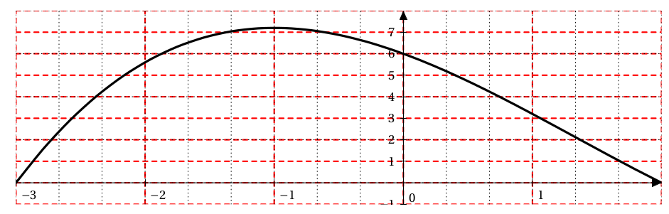
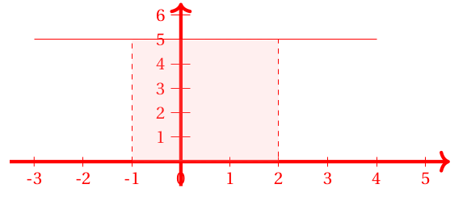
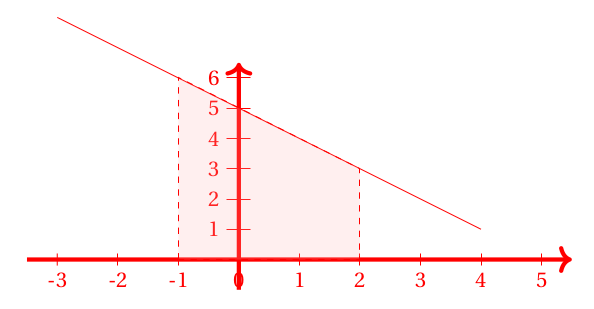
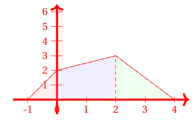

# Intégrale d'une fonction positive sur un intervalle $[a,b]$

## Définition

Soit f une fonction continue et positive sur un intervalle $[a,b]$ et $\mc{C}$ sa courbe représentative dans un repère orthogonal $\rep$.

La partie du plan situé entre la courbe , l'axe des abscisses et les droites d'équations $x=a$ et $x= b$ admet une aire.

!!!- info "Définition"
    **L'intégrale de $a$ à $b$ de $f$** , notée $\displaystyle\int_a^b f(x) \dx$ est l'aire en unités d'aires de la partie du plan située entre la courbe, l 'axe des abscisses et les droites d'équations x=a et x= b.
    
    L'unité d'aire est l'aire du rectangle OIKJ. Elle est notée **u.a.**.

    [{.Center_lien .Vignette .Im_retaille}](../Image/Im01.png)

 $\displaystyle\int_a^b f(x) \dx$ se lit &laquo; *intégrale de $a$ à $b$ de $f(x)\dx$* &raquo; ou &laquo; somme de $a$ à $b$ de $f(x )\dx$ &raquo;.
 
Les réels $a$ et $b$ sont appelés les bornes de l'intégrale.

Le symbole $\displaystyle\int$ est un S stylisé (initiale de somme) afin de rappeler que l'intégrale peut être obtenue comme la limite d'une somme d'aires de rectangles.

$f(x)\dx$ est l'aire d'un rectangle de dimension $f(x)$ et $\dx$. Derrière la notation $f(x)\dx$ se cache une multiplication.

La variable $x$ est dite muette , elle peut être remplacée par n'importe quelle lettre : $\displaystyle\int_a^b f(x) \dx = \displaystyle\int_a^b f(t) \dx[t]$

???- example "Exemple"
	
	<ol><li> Calculer l'intégrale $A=\displaystyle\int_1^3 -2x+8 \dx$.
 
    ???- done "Réponse"
		La fonction $x \mapsto -2x+8$ est continue et positive sur $[1;3]$. Donc $\displaystyle\int_1^3 -2x+8 \dx$ est l'aire, en u.a., du trapèze $IABC$ rectangle en $I$ et en $A$.
		
		Donc $\displaystyle\int_1^3 -2x+8 \dx = \dfrac{(IA+AB)\times IA}{2}=\dfrac{(6+2)\times 2}{2}=8$ (u.a.)
 
	</li>
	<li> Si $\left(\text{O}; \text{I} , \text{J} \right)$ est un repère orthogonal d'unités graphiques $3$ cm en abscisse et $2$ cm en ordonnée, alors l'unité d'aire est égale à  ??? . On écrit $1$ u.a. =  ??? $.
	
	Donc dans un tel repère, l'aire serait de  ???. 

	???- done "Reponse"
		Si $\left(\text{O}; \text{I} , \text{J} \right)$ est un repère orthogonal d'unités graphiques $3$ cm en abscisse et $2$ cm en ordonnée, alors l'unité d'aire est égale à \ans{$2 \times 3=6$ $\text{cm}^2$}. On écrit $1$ u.a. = \ans{$6\ \text{cm}^2$}.
	
		Donc dans un tel repère, l'aire serait de  \ans{$8\times 6 = 48\ \text{cm}^2$}. 
	</li>
	</ol>

???- example "Exemple"
	Soit $\left(\text{O}; \text{I} , \text{J} \right)$ est un repère orthogonal d'unités graphiques $3$ cm en abscisse et $0.5$ cm en ordonnée.

	Soit $f$ la fonction dont la courbe $\mc{C}$ est donnée ci-dessous:

	[{.Center_lien .VignetteTer}](../Image/Im02.png)

	Alors $\displaystyle\int_{-2}^1 f(x) \dx$ est l'aire, exprimée en unités d'aire, de la zone grisée.
	
	Attention, si (ici) on compte le quadrillage, on aura l'aire en $\text{cm}^2$ : **ce n'est donc pas** $\displaystyle\int_{-2}^1 f(x) \dx$.

	Voici avec un découpage faisant apparaître les unités d'aire.

	[{.Center_lien .VignetteTer}](../Image/Im03.png)

	En comptant ces petits rectangles, on a :

	\[ 
		\displaystyle\int_{-2}^1 f(x) \dx \approx 18 
	\]

	Pour convertir en $\text{cm}^2$, il faut noter que $1$ u.a. = $3 \times 0.5 \text{ cm}^2$.
	
	Donc ici l'aire vaut (environ) $1.5 \times 18=27 \text{ cm}^2$.

	BILAN : 
	
	- Comme $f$ est **une fonction positive** sur $[-2;1]$ : $\displaystyle\int_{-2}^1 f(x) \dx \approx 18$ u.a.
	- l'aire vaut (environ) $27 \text{ cm}^2$.
 
 

???- example "Exemple"

	<ol><li> Soit $\left(\text{O}; \text{I} , \text{J} \right)$ est un repère orthogonal d'unités graphiques $2$ cm en abscisse et $0.5$ cm en ordonnée et $f$ la fonction définie par $f(x)=5$.

	<ol><li> Tracer la courbe sur l'intervalle $[-3;4]$
    
	???- done "Réponse"

		[{.Center_lien .VignetteTer}](../Image/Im04.png)
 
	</li><li> Calculer $\displaystyle\int_{-1}^2 f(x) \dx$
    
	???- done "Réponse"

		Comme $f$ est positive sur $[-1;2]$, $\displaystyle\int_{-1}^2 f(x) \dx$ est l'aire du rectangle en u.a. Donc $\displaystyle\int_{-1}^2 f(x) \dx = 3 \times 5 = 15$
 
	</li></ol>
	<li> Soit $\left(\text{O}; \text{I} , \text{J} \right)$ est un repère orthogonal d'unités graphiques $1$ cm en abscisse et $0.5$ cm en ordonnée et $f$ la fonction définie par $f(x)=-x+5$.
	<ol>
	<li> Tracer la courbe sur l'intervalle $[-3;4]$
    
	???- done "Réponse"

		[{.Center_lien .VignetteTer}](../Image/Im05.png)
 
	</li>
	<li> Calculer $\displaystyle\int_{-1}^2 f(x) \dx$ 
	(on rappelle que l'aire d'un trapèze est $\dfrac{(grande\ base\ +\ petite\ base)\times \ hauteur}{2}$)
    
	???- done "Réponse"

		Comme $f$ est positive sur $[-1;2]$, $\displaystyle\int_{-1}^2 f(x) \dx$ est l'aire du trapèze en u.a. Donc $\displaystyle\int_{-1}^2 f(x) \dx =\dfrac{(6+3)\times 3}{2} = \dfrac{27}{2}$.
 

	</li></ol>
	</ol>

 

## Propriétés

!!! info ""

	- L'intégrale d'une fonction continue et positive sur un intervalle $[a;b]$ est positive.

	\[ 
		\text{Si } \forall x \in[a;b] f(x)\geq 0 \text{ alors } \displaystyle\int_a^b f(x) \dx \geq 0  
	\]

	Soient $f$ et $g$ deux fonctions continues et positives sur un intervalle $I$. $a,b$ et $c$ sont trois réels de $I$ et $k$ est une constante réelle.

    - Si $f=0$ alors $\displaystyle\int_a^b f(x) \dx =0$. 
    - $\displaystyle\int_a^a f(x) \dx =0$
    - $\displaystyle\int_a^b f(x)\dx = - \int_b^a f(x) \dx$
    - **Linéarité :** 
    
    \[
        \int_a^b kf(x) \dx = k \times \int_a^b f(x) \dx
    \]

    \[ 
        \int_a^b f(x) + g(x) \dx = \int_a^b f(x) \dx + \int_a^b g(x) \dx 
    \]

    - Relation de Chasles : pour tous réels $a,b$ et $c$

    \[
    \int_a^c f(x) \dx + \int_c^b f(x) \dx =\int_a^b f(x) \dx
    \] 
    
    - Comparaison : si pour tout $x$ de $[a;b]$ ($a\leq b$) $f(x) \geq g(x) \geq 0$, alors $\displaystyle\int_a^b f(x) \dx \geq \int_a^b g(x) \dx \geq 0$.

    - Conservation par symétrie : soit $f$ est une fonction définie et continue sur $[-a;a]$, si $f$ est **paire** alors 

    \[
    \int_{-a}^0 f(x) \dx = \int_0^a f(x) \dx
    \]

    - Conservation par translation : soit $f$ est une fonction définie et continue sur $\R$, si $f$ est périodique de période $T$ alors :
    
    \[
    \int_0^T f(x) \dx = \int_{a}^{a+T} f(x) \dx \text{ pour tout } a \in \R
    \]
<!--\item Conservation par symétrie : soit $f$ est une fonction définie et continue sur $[-a;a]$, si $f$ est \textbf{paire} alors 
%\[ \displaystyle\int_{-a}^0 f(x) \dx = \displaystyle\int_0^a f(x) \dx \]
%\item Conservation par translation : soit $f$ est une fonction définie et continue sur $\R$, si $f$ est périodique de période $T$ alors :
%\[ \displaystyle\int_0^T f(x) \dx = \displaystyle\int_{a}^{a+T} f(x) \dx \text{ pour tout } a \in \R   \]-->
 
???- tip "En pratique"
	Les propriétés précédentes sont encore valables pour une fonction quelconque.

???- example "Exemple"
	Soit $f$ une fonction définie sur $[-1;4]$ par :
	
	- $f(x)=2x+2$ sur $[-1;0]$
	- $f(x)=\dfrac{1}{2}x+2$ sur $[0;2]$
	- $f(x)=\dfrac{-3}{2}x+6$ sur $[2;4]$
 

	<ol><li> Tracer la courbe de $f$.
    
	???- done "Réponse"
		
		[{.Center}](../Image/Im06.png){.Center_txt}
 
	</li>
	<li>A l'aide de la relation de Chasles, se ramener à l'aire de triangles et de trapèzes.
    
	???- done "Réponse"
		$\displaystyle\int_{-1}^4 f(x) \dx =\displaystyle\int_{-1}^0 f(x) \dx + \displaystyle\int_{0}^2 f(x) \dx + \displaystyle\int_{2}^4 f(x) \dx$.
		
		Comme $f$ est positive sur $[-1;4]$, $\displaystyle\int_{-1}^4 f(x) \dx$ est l'aire en u.a. de la zone colorée. Il y a donc 2 triangles et un trapèze.
 
	</li>
	<li> En déduire $\displaystyle\int_{-1}^4 f(x) \dx$
    
	???- done "Réponse"

		$\displaystyle\int_{-1}^4 f(x) \dx = \displaystyle\int_{-1}^0 f(x) \dx + \displaystyle\int_{0}^2 f(x) \dx + \displaystyle\int_{2}^4 f(x) \dx = \dfrac{2\times 1 }{2} + \dfrac{(2+3)\times 2}{2} + \dfrac{3 \times 2}{2} = 9$

	</li>
	</ol>
 
 