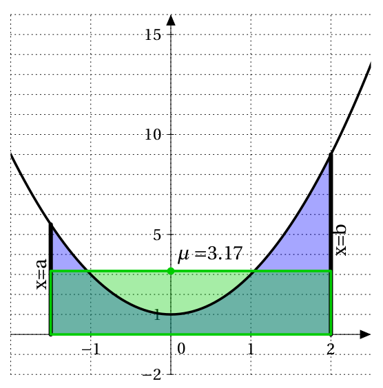

# Intégrale d'une fonction quelconque

## Prolongement du cas positif

!!! info "Définition"
    Si $f$ est une fonction continue sur un intervalle $I$, on définit pour tout réel $a$ et $b$ de $I$, l'intégrale de $a$ à $b$ par :

    \[
        \int_a^b f(x) \dx = F(b) - F(a)
    \]

    Où $F$ est une primitive de $f$.
 

!!! info "Propriétés"
    Soient $f$ et $g$ deux fonctions continues sur un intervalle $I$. $a,b$ et $c$ sont trois réels de $I$ et $k$ est une constante réelle.

    - Si $f=0$ alors $\displaystyle\int_a^b f(x) \dx =0$. 
    - $\displaystyle\int_a^a f(x) \dx =0$
    - $\displaystyle\int_a^b f(x)\dx = - \int_b^a f(x) \dx$
    - **Linéarité :** 
    
    \[
        \int_a^b kf(x) \dx = k \times \int_a^b f(x) \dx
    \]

    \[ 
        \int_a^b f(x) + g(x) \dx = \int_a^b f(x) \dx + \int_a^b g(x) \dx 
    \]

    - Relation de Chasles : pour tous réels $a,b$ et $c$

    \[
    \int_a^c f(x) \dx + \int_c^b f(x) \dx =\int_a^b f(x) \dx
    \]

    - Positivité : si pour tout $x$ de $[a;b]$ ($a\leq b$) $f(x) \geq 0$, alors $\displaystyle\int_a^b f(x) \dx \geq 0$ **(Réciproque fausse)**. 
    
    - Comparaison : si pour tout $x$ de $[a;b]$ ($a\leq b$) $f(x) \geq g(x)$, alors $\displaystyle\int_a^b f(x) \dx \geq \int_a^b g(x) \dx$ **(Réciproque fausse)**.

    - Conservation par symétrie : soit $f$ est une fonction définie et continue sur $[-a;a]$, si $f$ est **paire** alors 

    \[
    \int_{-a}^0 f(x) \dx = \int_0^a f(x) \dx
    \]

    - Conservation par translation : soit $f$ est une fonction définie et continue sur $\R$, si $f$ est périodique de période $T$ alors :
    
    \[
    \int_0^T f(x) \dx = \int_{a}^{a+T} f(x) \dx \text{ pour tout } a \in \R
    \]

## Comparaison et intégrale

!!! info "Positivité de l'intégrale"
    Si pour tout $x$ de $[a;b]$ (avec $a\leq b$), $f$ est continue et $f(x)\geq 0$ alors $\displaystyle\int_a^b f(x) \dx \geq 0$.
    
    Si pour tout $x$ de $[a;b]$ (avec $a\leq b$), $f$ est continue et $f(x)\leq 0$ alors $\displaystyle\int_a^b f(x) \dx \leq 0$

!!! info "Intégrale et comparaison"
    Si pour tout $x$ de $[a;b]$, avec $a \leq b$, $f$ et  $g$ sont continues et $g(x) \leq f(x)$ alors $\displaystyle\int_a^b g(x) \dx \leq \int_a^b f(x) \dx$
 

???- example "Exemple"
    Soit $I_n=\int_1^n \dfrac{1}{1+x^2} \dx$ pour tout $n \in \N^*$.
    <ol>
    <li> Montrer que la suite $(I_n$) est croissante.</li>
    <li> Montrer que pour tout $n$, $I_n \leq \displaystyle\int_1^n \dfrac{1}{x^2} \dx$.
        En déduire que la suite $(I_n)$ converge.
    </li>
    </ol>
 
    ???- done "Réponse"
        <ol>
        <li> Pour tout $n \in \N^*$, 
        
        \begin{eqnarray*}
        I_{n+1}-I_n & = & \int_1^{n+1} \dfrac{1}{1+x^2} \dx - \int_1^n \dfrac{1}{1+x^2} \dx\\
        & = & \int_1^{n+1} \dfrac{1}{1+x^2} \dx + \int_n^1 \dfrac{1}{1+x^2} \dx\\
        & = & \int_n^{n+1} \dfrac{1}{1+x^2} \dx \quad (\text{ Relation de Chasles})
        \end{eqnarray*}

        Comme $x \mapsto \dfrac{1}{1+x^2}$ est continue, positive sur $\R$ et que la borne inférieure $n$ est inférieure à la borne supérieure $n+1$, $\displaystyle\int_n^{n+1} \dfrac{1}{1+x^2} \dx \geq 0$. Donc pour tout $n\in \N^*$, $I_{n+1}-I_n \geq 0$.

        Donc la suite $(I_n)$ est croissante.
        </li>
        <li> Pour tout $x$ de $[1;n]$, $1+x^2 \geq x^2$. Donc $0 \leq \dfrac{1}{1+x^2} \leq \dfrac{1}{x^2}$.

        De plus $1 \leq n$, donc $0 \leq \displaystyle\int_1^n \dfrac{1}{1+x^2} \dx \leq \displaystyle\int_1^n \dfrac{1}{x^2} \dx$.

        \begin{eqnarray*}
        \int_1^n \dfrac{1}{x^2} \dx & = & \left[ \dfrac{-1}{x} \right]_1^n \\
        & = & \dfrac{-1}{n}- \dfrac{-1}{1} \\
        & = & 1-\dfrac{1}{n}
        \end{eqnarray*}

        $\dlim_{n}{+\infty} 1-\dfrac{1}{n} =1$. Cette suite est convergente, elle est donc bornée. Donc, il existe $M$ tel que $1+\dfrac{1}{n} \leq M$.

        Comme pour tout $n \in \N^*$, $I_n \leq 1-\dfrac{1}{n}$, donc $I_n \leq M$, pour tout $n \in \N$.

        $(I_n)$ est une suite croissante majorée, elle est donc convergente.
        </li>
        </ol>

## Valeur moyenne d'une fonction continue

!!! info "Valeur moyenne"
    $f$ est une fonction continue sur $[a;b]$ $(a<b)$, la valeur moyenne de la fonction $f$ sur $[a;b]$ est le réel $\mu = \dfrac{1}{b-a} \displaystyle\int_a^b f(x) \dx$.
 
???- tip "Interprétation graphique pour $f \geq 0$"

    On a $\mu (b-a)=\displaystyle\int_a^b f(x) \dx$. En termes d'aires, ceci signifie que l'aire &laquo; sous la courbe &raquo; de $f$ est égale à l'aire &laquo; sous la courbe &raquo; de la fonction constante égale à $\mu$.
    
    C'est-à-dire que la valeur moyenne $\mu$ de la fonction $f$ est la hauteur du rectangle ABCD de base $(b-a)$ ayant la même aire que l'aire du domaine sous la courbe de la fonction $f$ entre $a$ et $b$.

    [{.Center_lien .vignette}](../Image/Im08.png)

???- example "Exemple"
    On considère les fonctions $f$ et $g$ définies pour $x>0$ par $f(x)=2x \ln x$ et $g(x)= x^2 \ln x$.
    <ol>
    <li> Vérifier que $f(x)=g'(x)-x$.</li>
    <li> Déterminer une primitive $F$ de $f$.</li>
    <li> Calculer la valeur moyenne de la fonction $f$ enter $1$ et $\ex$</li>
    </ol>
 
    ???- done "Réponse"
        <ol>
        <li> $g'(x) = 2x \ln(x) + x^2 \times \dfrac{1}{x} = 2x \ln(x) + x=f(x) + x$.
        
        Donc $f(x) = g'(x) - x$</li>
        <li> Une primitive de $f$ est donc une primitive de $g'(x)-x$. Donc, $F(x) = g(x) - \dfrac{x^2}{2} = x^2\ln(x) - \dfrac{x^2}{2}$</li>
        <li> La valeur moyenne de $f$ enter $1$ et $\ex$ est notée $m$.

        \begin{eqnarray*}
        m & = &  \dfrac{1}{\ex-1}\int_1^{\ex} f(x) \dx \\
        & =  & \dfrac{1}{\ex-1}\left[ x^2 \ln(x) - \dfrac{x^2}{2} \right]_1^{\ex} \\
        & = & \dfrac{1}{\ex-1} \times \left( \left(\ex^2-\dfrac{\ex^2}{2} \right) - \left( 0 - \dfrac{1}{2} \right) \right) \\ 
        & =& \dfrac{\ex^2+1}{2\ex - 2}
        \end{eqnarray*}

        </li>
        </ol>
 
 
