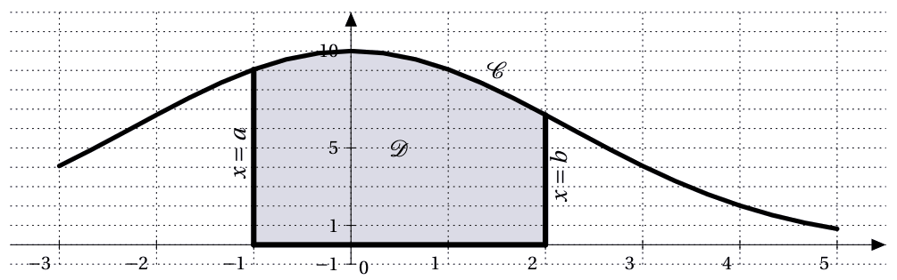
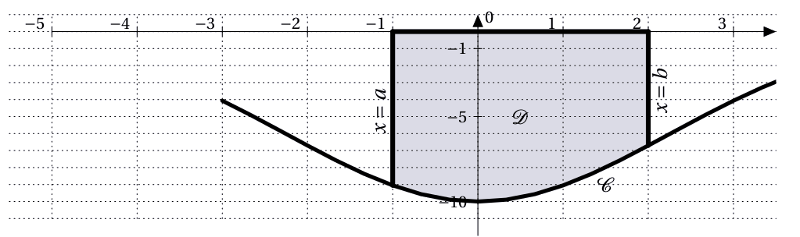

# Application : calcul d'aire

## Aire sous une courbe

!!! info "Cas d'une fonction positive"
    Soit une fonction $f$ continue sur un intervalle $[a;b]$ et $\mc{C}$ sa courbe représentative de $f$ dans un repère orthogonal. On note $\mc{D}$ la partie du plan limitée par :
    <ul>
    </li>
    <li> la courbe $\mc{C}$</li>
    <li> l'axe des abscisses</li>
    <li> les droites verticales d'équations $x=a$ et $x=b$.</li>
    </ul>

    Si $f$ est positive sur $[a;b]$, alors l'aire de $\mc{D}$ en u.a. est $\displaystyle\int_a^b f(x) \dx$

    [{.Center_lien}](../Image/Im09.png)

    $\text{Aire}(\mc{D}) = \displaystyle\int_a^b f(x) \dx$ en u.a.

!!! info "Cas d'une fonction négative"
    Si $f$ est négative sur $[a;b]$, alors l'aire de $\mc{D}$ est $-\displaystyle\int_a^b f(x) \dx=\displaystyle\int_a^b (-f(x)) \dx$

    [{.Center_lien}](../Image/Im10.png)

    $\text{Aire}(\mc{D}) = -\displaystyle\int_a^b f(x) \dx$ en u.a.

!!! tip "Cas des fonctions de signes quelconques"
    Si $f$ change de signe sur $[a;b]$, alors on calcule les aires sur chaque intervalle de $[a;b]$ où $f$ est de signe constant. L'aire totale est alors la somme des aires calculées.

    $\text{Aire}(\mc{D})=\left( -\displaystyle\int_1^3 f(x) \dx \right) + \left( \displaystyle\int_3^4 f(x) \dx \right)$

!!! example "Exemple : cas où $f$ est négative sur $I$"

    Soit $\left(\text{O}; \text{I} , \text{J} \right)$ est un repère orthogonal d'unités graphiques $2$ cm en abscisse et $1$ cm en ordonnée.

    Soit $f(x)=-x^2-x-1$ définie sur $\R$ et $\mc{C}$ sa courbe représentative. Calculer l'aire de la zone $\mc{D}$ limitée par :
    <ul>
    <li> la courbe $\mc{C}$</li>
    <li> l'axe des abscisse</li>
    <li> les droites d'équation $x=-1$ et $x=0$</li>
    </ul>

    \begin{eqnarray*}
    \displaystyle\int_{-1}^0 f(x) \dx & = & \displaystyle\int_{-1}^0 -x^2-x-1 \dx\\
    & = & \left[ -\dfrac{x^3}{3}-\dfrac{x^2}{2}-x \right]_{-1}^0\\
    & = & \left( -\dfrac{0^3}{3}-\dfrac{0^2}{2}-0 \right)-\left( -\dfrac{(-1)^3}{3}-\dfrac{(-1)^2}{2}-(-1) \right)\\
    & = & 0-\left( \dfrac{5}{6} \right)\\
    & = & -\dfrac{5}{6} 
    \end{eqnarray*}

    Comme $f$ négative sur $[-1;0]$, alors $\text{Aire}(\mc{D})=-\displaystyle\int_{-1}^0 f(x) \dx$ u.a.
    
    Donc $\text{Aire}(\mc{D})= \dfrac{5}{6}$ u.a.

    Comme $1$ u.a. $= 2 \text{ cm}^2$, $\text{Aire}(\mc{D})= 2 \times \dfrac{5}{6} = \dfrac{5}{3} \cm^2$.
 

!!! example "Exemple : cas où $f$ change de signes sur $I$"

    Soit $\left(\text{O}; \text{I} , \text{J} \right)$ est un repère orthogonal d'unités graphiques $1.5$ cm en abscisse et $3$ cm pour $20$ unités en ordonnée.

    Soit $f(x)=2x^2+2x-24$ définie sur $\R$ et $\mc{C}$ sa courbe représentative. Calculer l'aire de la zone $\mc{D}$ limitée par :
    <ul>
    <li> la courbe $\mc{C}$</li>
    <li> l'axe des abscisse</li>
    <li> les droites d'équation $x=1$ et $x=4$</li>
    </ul>

    <ul>
    <li> Ici, $f$ est négative sur $[1;3]$.
    
    \begin{eqnarray*}
    \displaystyle\int_1^3 f(x) \dx & = & \displaystyle\int_1^3 2x^2+2x-24 \dx\\
    & = & \left[ 2\dfrac{x^3}{3} + x^2 -24x \right]_1^3\\
    & = & \left( 2\dfrac{3^3}{3} + 3^2 -24 \times 3 \right) - \left( 2\dfrac{1^3}{3} + 1^2 -24 \times 1 \right)\\
    & = & \left( -45 \right) - \left( \dfrac{-67}{3} \right)\\
    & = & \dfrac{-68}{3}
    \end{eqnarray*}
    
    Donc $\Aire(\mc{D}_1)=-\displaystyle\int_1^3 f(x) \dx=\dfrac{68}{3}$ u.a.
    </li>
    <li> Ici, $f$ est positive sur $[3;4]$.

    \begin{eqnarray*}
    \displaystyle\int_3^4 f(x) \dx & = & \displaystyle\int_3^4 2x^2+2x-24 \dx\\
    & = & \left[ 2\dfrac{x^3}{3} + x^2 -24x \right]_3^4\\
    & = & \left( 2\dfrac{4^3}{3} + 4^2 -24 \times 4 \right) - \left( 2\dfrac{3^3}{3} + 3^2 -24 \times 3 \right)\\
    & = & \left( \dfrac{-112}{3} \right) - \left( -45 \right)\\
    & = & \dfrac{23}{3}
    \end{eqnarray*}

    Donc $\Aire(\mc{D}_2)=\displaystyle\int_3^4 f(x) \dx=\dfrac{23}{3}$ u.a.
    </li>
    <li> Donc $\Aire(\mc{D})=\dfrac{68}{3}+\dfrac{23}{3}=\dfrac{91}{3}$ u.a.
    
    Comme $1 \ua = 1.5 \times 0.15 \cm^2$, $\Aire(\mc{D})=\dfrac{91}{3} \times 0.225=\dfrac{273}{40} =6.825 \cm^2$
    </li>
    </ul>
 

## Aire entre deux courbes

!!! info "Aire entre deux courbes"
    Soit deux fonctions $f$ et $g$ continues sur un intervalle $[a;b]$ de courbe respective $\mc{C}_f$ et $\mc{C}_g$ telles que, pour tout $x$ de  $[a;b]$, $f(x) \leq g(x)$.
    
    Alors l'aire, en unité d'aire, de la partie du plan notée $\mc{D}$ limitée par :
    <ul>
    </li>
    <li> la courbe $\mc{C}_f$
    </li>
    <li> la courbe $\mc{C}_g$
    </li>
    <li> les droites d'équations $x=a$ et $x=b$
    </li>
    </ul>
    est $\displaystyle\int_a^b (g(x)-f(x)) \dx$.

    Ici, comme $g(x)\geq f(x)$ sur $[a;b]$, $\Aire(\mc{D})=\displaystyle\int_a^b (g(x)-f(x)) \dx$

???- tip "Courbe qui se croisent ..." 
    Naturellement, si les deux courbes se croisent, il faut calculer les aires de différentes zones et les ajouter.
