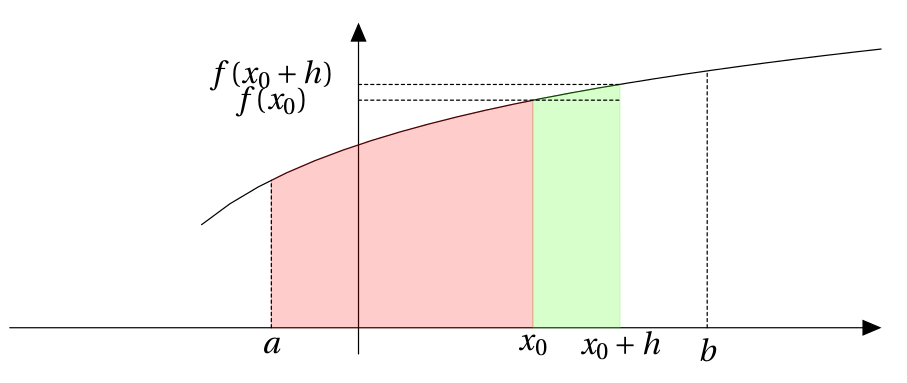

# Démonstration au programme

!!! info "Théorème fondamental"
    Si $f$ est **une fonction continue et positive** sur un intervalle $[a,b]$ alors la fonction $F$ définie sur $[a,b]$ par $\displaystyle\int_a^x f(t) \dx[t]$ est dérivable sur $[a,b]$ et a pour dérivée $f$ . On a donc $F'(x)=f(x)$.
 

!!! abstract "Démonstration au programme"
    **Cas d'une fonction continue et croissante sur $[a;b]$.**

    Soit $x_0\in [a;b]$ et $h$ tel que $x_0+h \in [a;b]$.
    
    On veut démontrer que $F$ est dérivable sur $[a;b]$ donc en particulier en $x_0 \in [a;b]$, on cherche la limite en 0 de la fonction $T$ définie pour tout $h \neq 0$ par $T(h)=\dfrac{F(x_0+h)-F(x_0)}{h}$

    [{.Center}](../Image/Im07.png){.Center_txt}

    \begin{eqnarray*}
    F(x_0+h)-F(x_0)  & = & \displaystyle\int_a^{x_0+h} f(x) \dx - \displaystyle\int_a^{x_0} f(x) \dx\\
    & = & \displaystyle\int_a^{x_0} f(x) \dx+ \displaystyle\int_{x_0}^{x_0+h} f(x) \dx - \displaystyle\int_a^{x_0} f(x) \dx \\
    & = & \displaystyle\int_{x_0}^{x_0+h} f(x) \dx
    \end{eqnarray*}

    Donc $F(x_0+h)-F(x_0)$ est l'aire du domaine $D$ en vert.

    Comme $f$ est croissante, l'aire de $D$ est comprise entre l'aire du rectangle de largeur $h$ et de hauteur $f(x_0)$ et l'aire du rectangle de largeur $h$ et de hauteur $f(x_0 +h)$ donc :

    \begin{eqnarray*}
    hf(x_0) \leq F(x_0+h) - F(x_0) \leq h f(x_0+h)  & \equivaut & f(x_0) \leq \dfrac{F(x_0+h) - F(x_0)}{h} \leq f(x_0+h) \quad \text{ si h >0}
    \end{eqnarray*}

    \begin{eqnarray*}
    hf(x_0) \leq F(x_0+h) - F(x_0) \leq h f(x_0+h)  & \equivaut & f(x_0) \geq \dfrac{F(x_0+h) - F(x_0)}{h} \geq f(x_0+h) \quad \text{ si h <0}
    \end{eqnarray*}

    Comme $f$ est continue en $x_0$ donc $\dlim{h}{0} f(x_0+h)=f(x_0)$ et d'après le théorème d'encadrement, $\dlim{h}{0} \dfrac{F(x_0+h) - f(x_0)}{h} = f(x_0)$.

    Donc la fonction $F$ est dérivable en $x_0$ et $F'(x_0)=f(x_0)$. Or $x_0$ est un réel quelconque de $I$ donc $F$ est dérivable sur $I$ et $F'=f$

!!! info "Calcul d'une intégrale"
    Si $f$ est une fonction continue et positive sur un intervalle $[a;b]$ et $F$ une primitive de $f$ sur $[a;b]$ : 
    
    \[
        \displaystyle\int_a^b f(x) \dx = F(b) - F(a)
    \]

    On note $F(b) - F(a) = \left[ F(x) \right]_a^b$
 

???- abstract "Démonstration au programme"
    Notons $G(x)=\displaystyle\int_a^x f(t) \dx[t]$. D'après le théorème fondamental, $G$ est une primitive de $f$. Comme $G(a)=0$ et $G(b)= \displaystyle\int_a^b f(t) \dx[t]$, alors $\displaystyle\int_a^b f(t) \dx[t] = G(b) - G(a)$.

    Soit $F$ une primitive de $f$. Il existe donc $k \in \R$ tel que $F(x) = G(x) +k$. Donc $F(b)-F(a) = G(b)-G(a)$.
    
    Donc, si $F$ est une primitive de $f$ alors $\displaystyle\int_a^b f(x) \dx = F(b) - F(a)$.
