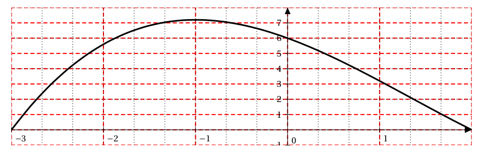
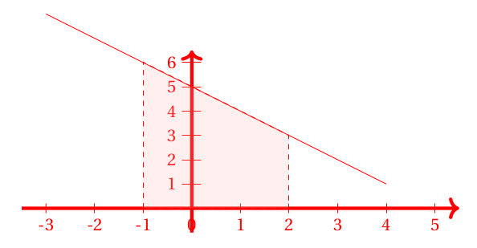
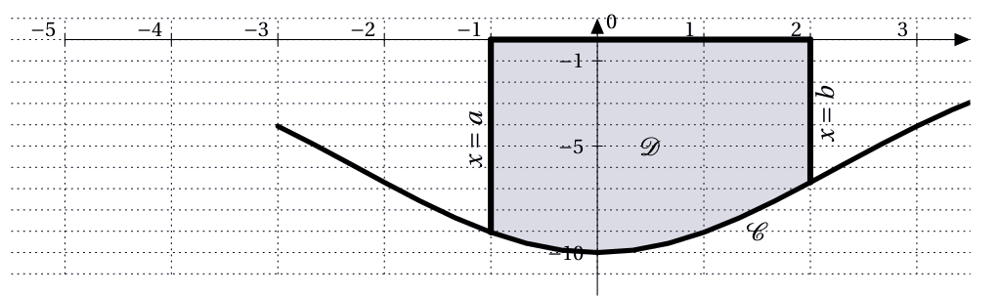

# Intégrale d'une fonction positive sur un intervalle [a,b]

## Définition

Soit f une fonction continue et positive sur un intervalle $[a,b]$ et $\mc{C}$ sa courbe représentative dans un repère orthogonal $\rep$.

La partie du plan situé entre la courbe , l'axe des abscisses et les droites d'équations $x=a$ et $x= b$ admet une aire.

!!!- info "Définition"
    **L'intégrale de $a$ à $b$ de $f$** , notée $\displaystyle\int_a^b f(x) \dx$ est l'aire en unités d'aires de la partie du plan située entre la courbe, l 'axe des abscisses et les droites d'équations x=a et x= b.
    
    L'unité d'aire est l'aire du rectangle OIKJ. Elle est notée **u.a.**.

    [{.Center_lien .Vignette .Im_retaille20}](../Image/Im01.png)

 $\displaystyle\int_a^b f(x) \dx$ se lit &laquo; *intégrale de $a$ à $b$ de $f(x)\dx$* &raquo; ou &laquo; somme de $a$ à $b$ de $f(x )\dx$ &raquo;.
 
Les réels $a$ et $b$ sont appelés les bornes de l'intégrale.

Le symbole $\displaystyle\int$ est un S stylisé (initiale de somme) afin de rappeler que l'intégrale peut être obtenue comme la limite d'une somme d'aires de rectangles.

$f(x)\dx$ est l'aire d'un rectangle de dimension $f(x)$ et $\dx$. Derrière la notation $f(x)\dx$ se cache une multiplication.

La variable $x$ est dite muette , elle peut être remplacée par n'importe quelle lettre : $\displaystyle\int_a^b f(x) \dx = \displaystyle\int_a^b f(t) \dx[t]$

???- example "Exemple"
	
	<ol><li> Calculer l'intégrale $A=\displaystyle\int_1^3 -2x+8 \dx$.
 
    ???- done "Réponse"
		La fonction $x \mapsto -2x+8$ est continue et positive sur $[1;3]$. Donc $\displaystyle\int_1^3 -2x+8 \dx$ est l'aire, en u.a., du trapèze $IABC$ rectangle en $I$ et en $A$.
		
		Donc $\displaystyle\int_1^3 -2x+8 \dx = \dfrac{(IA+AB)\times IA}{2}=\dfrac{(6+2)\times 2}{2}=8$ (u.a.)
 
	</li>
	<li> Si $\left(\text{O}; \text{I} , \text{J} \right)$ est un repère orthogonal d'unités graphiques $3$ cm en abscisse et $2$ cm en ordonnée, alors l'unité d'aire est égale à  ??? . On écrit $1$ u.a. =  ??? $.
	
	Donc dans un tel repère, l'aire serait de  ???. 

	???- done "Reponse"
		Si $\left(\text{O}; \text{I} , \text{J} \right)$ est un repère orthogonal d'unités graphiques $3$ cm en abscisse et $2$ cm en ordonnée, alors l'unité d'aire est égale à \ans{$2 \times 3=6$ $\text{cm}^2$}. On écrit $1$ u.a. = \ans{$6\ \text{cm}^2$}.
	
		Donc dans un tel repère, l'aire serait de  \ans{$8\times 6 = 48\ \text{cm}^2$}. 
	</li>
	</ol>

???- example "Exemple"
	Soit $\left(\text{O}; \text{I} , \text{J} \right)$ est un repère orthogonal d'unités graphiques $3$ cm en abscisse et $0.5$ cm en ordonnée.

	Soit $f$ la fonction dont la courbe $\mc{C}$ est donnée ci-dessous:

	[{.Center_lien .VignetteTer}](../Image/Im02.png)

	Alors $\displaystyle\int_{-2}^1 f(x) \dx$ est l'aire, exprimée en unités d'aire, de la zone grisée.
	
	Attention, si (ici) on compte le quadrillage, on aura l'aire en $\text{cm}^2$ : **ce n'est donc pas** $\displaystyle\int_{-2}^1 f(x) \dx$.

	Voici avec un découpage faisant apparaître les unités d'aire.

	[{.Center_lien .VignetteTer}](../Image/Im03.png)

	En comptant ces petits rectangles, on a :

	\[ 
		\displaystyle\int_{-2}^1 f(x) \dx \approx 18 
	\]

	Pour convertir en $\text{cm}^2$, il faut noter que $1$ u.a. = $3 \times 0.5 \text{ cm}^2$.
	
	Donc ici l'aire vaut (environ) $1.5 \times 18=27 \text{ cm}^2$.

	BILAN : 
	
	- Comme $f$ est **une fonction positive** sur $[-2;1]$ : $\displaystyle\int_{-2}^1 f(x) \dx \approx 18$ u.a.
	- l'aire vaut (environ) $27 \text{ cm}^2$.
 
 

???- example "Exemple"

	<ol><li> Soit $\left(\text{O}; \text{I} , \text{J} \right)$ est un repère orthogonal d'unités graphiques $2$ cm en abscisse et $0.5$ cm en ordonnée et $f$ la fonction définie par $f(x)=5$.

	<ol><li> Tracer la courbe sur l'intervalle $[-3;4]$
    
	???- done "Réponse"

		[{.Center_lien .VignetteTer}](../Image/Im04.png)
 
	</li><li> Calculer $\displaystyle\int_{-1}^2 f(x) \dx$
    
	???- done "Réponse"

		Comme $f$ est positive sur $[-1;2]$, $\displaystyle\int_{-1}^2 f(x) \dx$ est l'aire du rectangle en u.a. Donc $\displaystyle\int_{-1}^2 f(x) \dx = 3 \times 5 = 15$
 
	</li></ol>
	<li> Soit $\left(\text{O}; \text{I} , \text{J} \right)$ est un repère orthogonal d'unités graphiques $1$ cm en abscisse et $0.5$ cm en ordonnée et $f$ la fonction définie par $f(x)=-x+5$.
	<ol>
	<li> Tracer la courbe sur l'intervalle $[-3;4]$
    
	???- done "Réponse"

		[{.Center_lien .VignetteTer}](../Image/Im05.png)
 
	</li>
	<li> Calculer $\displaystyle\int_{-1}^2 f(x) \dx$ 
	(on rappelle que l'aire d'un trapèze est $\dfrac{(grande\ base\ +\ petite\ base)\times \ hauteur}{2}$)
    
	???- done "Réponse"

		Comme $f$ est positive sur $[-1;2]$, $\displaystyle\int_{-1}^2 f(x) \dx$ est l'aire du trapèze en u.a. Donc $\displaystyle\int_{-1}^2 f(x) \dx =\dfrac{(6+3)\times 3}{2} = \dfrac{27}{2}$.
 

	</li></ol>
	</ol>

 

## Propriétés

!!! info "Positivité"

	- L'intégrale d'une fonction continue et positive sur un intervalle $[a;b]$ est positive.

	\[ 
		\text{Si } \forall x \in[a;b] f(x)\geq 0 \text{ alors } \displaystyle\int_a^b f(x) \dx \geq 0  
	\]

	Soient $f$ et $g$ deux fonctions continues et positives sur un intervalle $I$. $a,b$ et $c$ sont trois réels de $I$ et $k$ est une constante réelle.

    - Si $f=0$ alors $\displaystyle\int_a^b f(x) \dx =0$. 
    - $\displaystyle\int_a^a f(x) \dx =0$
    - $\displaystyle\int_a^b f(x)\dx = - \int_b^a f(x) \dx$

!!! info "Linéarité"
    
    \[
        \int_a^b kf(x) \dx = k \times \int_a^b f(x) \dx
    \]

    \[ 
        \int_a^b f(x) + g(x) \dx = \int_a^b f(x) \dx + \int_a^b g(x) \dx 
    \]

!!! info "Relation de Chasles"

    - Relation de Chasles : pour tous réels $a,b$ et $c$

    \[
    \int_a^c f(x) \dx + \int_c^b f(x) \dx =\int_a^b f(x) \dx
    \] 

!!! info "Comparaison et conservation"

    - Comparaison : si pour tout $x$ de $[a;b]$ ($a\leq b$) $f(x) \geq g(x) \geq 0$, alors $\displaystyle\int_a^b f(x) \dx \geq \int_a^b g(x) \dx \geq 0$.

    - Conservation par symétrie : soit $f$ est une fonction définie et continue sur $[-a;a]$, si $f$ est **paire** alors 

    \[
    \int_{-a}^0 f(x) \dx = \int_0^a f(x) \dx
    \]

    - Conservation par translation : soit $f$ est une fonction définie et continue sur $\R$, si $f$ est périodique de période $T$ alors :
    
    \[
    \int_0^T f(x) \dx = \int_{a}^{a+T} f(x) \dx \text{ pour tout } a \in \R
    \]
<!--\item Conservation par symétrie : soit $f$ est une fonction définie et continue sur $[-a;a]$, si $f$ est \textbf{paire} alors 
%\[ \displaystyle\int_{-a}^0 f(x) \dx = \displaystyle\int_0^a f(x) \dx \]
%\item Conservation par translation : soit $f$ est une fonction définie et continue sur $\R$, si $f$ est périodique de période $T$ alors :
%\[ \displaystyle\int_0^T f(x) \dx = \displaystyle\int_{a}^{a+T} f(x) \dx \text{ pour tout } a \in \R   \]-->
 
???- tip "En pratique"
	Les propriétés précédentes sont encore valables pour une fonction quelconque.

???- example "Exemple"
	Soit $f$ une fonction définie sur $[-1;4]$ par :
	
	- $f(x)=2x+2$ sur $[-1;0]$
	- $f(x)=\dfrac{1}{2}x+2$ sur $[0;2]$
	- $f(x)=\dfrac{-3}{2}x+6$ sur $[2;4]$
 

	<ol><li> Tracer la courbe de $f$.
    
	???- done "Réponse"
		
		[{.Center}](../Image/Im06.png){.Center_txt}
 
	</li>
	<li>A l'aide de la relation de Chasles, se ramener à l'aire de triangles et de trapèzes.
    
	???- done "Réponse"
		$\displaystyle\int_{-1}^4 f(x) \dx =\displaystyle\int_{-1}^0 f(x) \dx + \displaystyle\int_{0}^2 f(x) \dx + \displaystyle\int_{2}^4 f(x) \dx$.
		
		Comme $f$ est positive sur $[-1;4]$, $\displaystyle\int_{-1}^4 f(x) \dx$ est l'aire en u.a. de la zone colorée. Il y a donc 2 triangles et un trapèze.
 
	</li>
	<li> En déduire $\displaystyle\int_{-1}^4 f(x) \dx$
    
	???- done "Réponse"

		$\displaystyle\int_{-1}^4 f(x) \dx = \displaystyle\int_{-1}^0 f(x) \dx + \displaystyle\int_{0}^2 f(x) \dx + \displaystyle\int_{2}^4 f(x) \dx = \dfrac{2\times 1 }{2} + \dfrac{(2+3)\times 2}{2} + \dfrac{3 \times 2}{2} = 9$

	</li>
	</ol>
 
# Primitives d'une fonction continue sur un intervalle

## Théorème fondamental

!!! info "Théorème fondamental"
    Si $f$ est **une fonction continue et positive** sur un intervalle $[a,b]$ alors la fonction $F$ définie sur $[a,b]$ par $\displaystyle\int_a^x f(t) \dx[t]$ est dérivable sur $[a,b]$ et a pour dérivée $f$ . On a donc $F'(x)=f(x)$.
 

## Lien entre primitives et intégrales

!!! info "Calcul d'une intégrale"
    Si $f$ est une fonction continue et positive sur un intervalle $[a;b]$ et $F$ une primitive de $f$ sur $[a;b]$ : 
    
    \[
        \displaystyle\int_a^b f(x) \dx = F(b) - F(a)
    \]

    On note $F(b) - F(a) = \left[ F(x) \right]_a^b$
 

???- example "Exemple"
    Calculer $\displaystyle\int_0^1 x^2 \dx$.

    ???- done "Réponse"
    
        $F(x)=\dfrac{x^3}{3}$. Donc $\displaystyle\int_0^1 x^2 \dx = \left[ \dfrac{x^3}{3} \right]_0^1 = \dfrac{1}{3}$.

# Intégrale d'une fonction quelconque

## Prolongement du cas positif

!!! info "Définition"
    Si $f$ est une fonction continue sur un intervalle $I$, on définit pour tout réel $a$ et $b$ de $I$, l'intégrale de $a$ à $b$ par :

    \[
        \int_a^b f(x) \dx = F(b) - F(a)
    \]

    Où $F$ est une primitive de $f$.
 

!!! info "Propriétés immédiates"
    Soient $f$ et $g$ deux fonctions continues sur un intervalle $I$. $a,b$ et $c$ sont trois réels de $I$ et $k$ est une constante réelle.

    - Si $f=0$ alors $\displaystyle\int_a^b f(x) \dx =0$. 
    - $\displaystyle\int_a^a f(x) \dx =0$
    - $\displaystyle\int_a^b f(x)\dx = - \int_b^a f(x) \dx$

!!! info "Propriétés : linéarité de l'intégrale"
    - **Linéarité :** 
    
    \[
        \int_a^b kf(x) \dx = k \times \int_a^b f(x) \dx
    \]

    \[ 
        \int_a^b f(x) + g(x) \dx = \int_a^b f(x) \dx + \int_a^b g(x) \dx 
    \]

!!! info "Relation de Chasles"
    Relation de Chasles : pour tous réels $a,b$ et $c$

    \[
    \int_a^c f(x) \dx + \int_c^b f(x) \dx =\int_a^b f(x) \dx
    \]

!!! info "Comparaison"

    - Positivité : si pour tout $x$ de $[a;b]$ ($a\leq b$) $f(x) \geq 0$, alors $\displaystyle\int_a^b f(x) \dx \geq 0$ **(Réciproque fausse)**. 
    
    - Comparaison : si pour tout $x$ de $[a;b]$ ($a\leq b$) $f(x) \geq g(x)$, alors $\displaystyle\int_a^b f(x) \dx \geq \int_a^b g(x) \dx$ **(Réciproque fausse)**.

!!! info "Conservation"
    - Conservation par symétrie : soit $f$ est une fonction définie et continue sur $[-a;a]$, si $f$ est **paire** alors 

    \[
    \int_{-a}^0 f(x) \dx = \int_0^a f(x) \dx
    \]

    - Conservation par translation : soit $f$ est une fonction définie et continue sur $\R$, si $f$ est périodique de période $T$ alors :
    
    \[
    \int_0^T f(x) \dx = \int_{a}^{a+T} f(x) \dx \text{ pour tout } a \in \R
    \]

## Comparaison et intégrale

!!! info "Positivité de l'intégrale"
    Si pour tout $x$ de $[a;b]$ (avec $a\leq b$), $f$ est continue et $f(x)\geq 0$ alors $\displaystyle\int_a^b f(x) \dx \geq 0$.
    
    Si pour tout $x$ de $[a;b]$ (avec $a\leq b$), $f$ est continue et $f(x)\leq 0$ alors $\displaystyle\int_a^b f(x) \dx \leq 0$

!!! info "Intégrale et comparaison"
    Si pour tout $x$ de $[a;b]$, avec $a \leq b$, $f$ et  $g$ sont continues et $g(x) \leq f(x)$ alors $\displaystyle\int_a^b g(x) \dx \leq \int_a^b f(x) \dx$
 

???- example "Exemple"
    Soit $I_n=\int_1^n \dfrac{1}{1+x^2} \dx$ pour tout $n \in \N^*$.
    <ol>
    <li> Montrer que la suite $(I_n$) est croissante.</li>
    <li> Montrer que pour tout $n$, $I_n \leq \displaystyle\int_1^n \dfrac{1}{x^2} \dx$.
        En déduire que la suite $(I_n)$ converge.
    </li>
    </ol>
 
    ???- done "Réponse"
        <ol>
        <li> Pour tout $n \in \N^*$, 
        
        \begin{eqnarray*}
        I_{n+1}-I_n & = & \int_1^{n+1} \dfrac{1}{1+x^2} \dx - \int_1^n \dfrac{1}{1+x^2} \dx\\
        & = & \int_1^{n+1} \dfrac{1}{1+x^2} \dx + \int_n^1 \dfrac{1}{1+x^2} \dx\\
        & = & \int_n^{n+1} \dfrac{1}{1+x^2} \dx \quad (\text{ Relation de Chasles})
        \end{eqnarray*}

        Comme $x \mapsto \dfrac{1}{1+x^2}$ est continue, positive sur $\R$ et que la borne inférieure $n$ est inférieure à la borne supérieure $n+1$, $\displaystyle\int_n^{n+1} \dfrac{1}{1+x^2} \dx \geq 0$. Donc pour tout $n\in \N^*$, $I_{n+1}-I_n \geq 0$.

        Donc la suite $(I_n)$ est croissante.
        </li>
        <li> Pour tout $x$ de $[1;n]$, $1+x^2 \geq x^2$. Donc $0 \leq \dfrac{1}{1+x^2} \leq \dfrac{1}{x^2}$.

        De plus $1 \leq n$, donc $0 \leq \displaystyle\int_1^n \dfrac{1}{1+x^2} \dx \leq \displaystyle\int_1^n \dfrac{1}{x^2} \dx$.

        \begin{eqnarray*}
        \int_1^n \dfrac{1}{x^2} \dx & = & \left[ \dfrac{-1}{x} \right]_1^n \\
        & = & \dfrac{-1}{n}- \dfrac{-1}{1} \\
        & = & 1-\dfrac{1}{n}
        \end{eqnarray*}

        $\dlim_{n}{+\infty} 1-\dfrac{1}{n} =1$. Cette suite est convergente, elle est donc bornée. Donc, il existe $M$ tel que $1+\dfrac{1}{n} \leq M$.

        Comme pour tout $n \in \N^*$, $I_n \leq 1-\dfrac{1}{n}$, donc $I_n \leq M$, pour tout $n \in \N$.

        $(I_n)$ est une suite croissante majorée, elle est donc convergente.
        </li>
        </ol>

## Valeur moyenne d'une fonction continue

!!! info "Valeur moyenne"
    $f$ est une fonction continue sur $[a;b]$ $(a<b)$, la valeur moyenne de la fonction $f$ sur $[a;b]$ est le réel $\mu = \dfrac{1}{b-a} \displaystyle\int_a^b f(x) \dx$.
 
???- tip "Interprétation graphique pour $f \geq 0$"

    On a $\mu (b-a)=\displaystyle\int_a^b f(x) \dx$. En termes d'aires, ceci signifie que l'aire &laquo; sous la courbe &raquo; de $f$ est égale à l'aire &laquo; sous la courbe &raquo; de la fonction constante égale à $\mu$.
    
    C'est-à-dire que la valeur moyenne $\mu$ de la fonction $f$ est la hauteur du rectangle ABCD de base $(b-a)$ ayant la même aire que l'aire du domaine sous la courbe de la fonction $f$ entre $a$ et $b$.

    [{.Center_lien .vignette .Im_retaille}](../Image/Im08.png)

???- example "Exemple"
    On considère les fonctions $f$ et $g$ définies pour $x>0$ par $f(x)=2x \ln x$ et $g(x)= x^2 \ln x$.
    <ol>
    <li> Vérifier que $f(x)=g'(x)-x$.</li>
    <li> Déterminer une primitive $F$ de $f$.</li>
    <li> Calculer la valeur moyenne de la fonction $f$ enter $1$ et $\ex$</li>
    </ol>
 
    ???- done "Réponse"
        <ol>
        <li> $g'(x) = 2x \ln(x) + x^2 \times \dfrac{1}{x} = 2x \ln(x) + x=f(x) + x$.
        
        Donc $f(x) = g'(x) - x$</li>
        <li> Une primitive de $f$ est donc une primitive de $g'(x)-x$. Donc, $F(x) = g(x) - \dfrac{x^2}{2} = x^2\ln(x) - \dfrac{x^2}{2}$</li>
        <li> La valeur moyenne de $f$ enter $1$ et $\ex$ est notée $m$.

        \begin{eqnarray*}
        m & = &  \dfrac{1}{\ex-1}\int_1^{\ex} f(x) \dx \\
        & =  & \dfrac{1}{\ex-1}\left[ x^2 \ln(x) - \dfrac{x^2}{2} \right]_1^{\ex} \\
        & = & \dfrac{1}{\ex-1} \times \left( \left(\ex^2-\dfrac{\ex^2}{2} \right) - \left( 0 - \dfrac{1}{2} \right) \right) \\ 
        & =& \dfrac{\ex^2+1}{2\ex - 2}
        \end{eqnarray*}

        </li>
        </ol>
 
# Intégration par partie

!!! info " "
    Soient $u$ et $v$ deux fonctions dérivables sur un intervalle $I$ et dont les dérivées sont $u'$ et $v'$ sont continues sur $I$. Soient $a$ et $b$ deux réels de $I$.

    \[ 
        \displaystyle\int_a^b u(x) v'(x) \dx = \left[ u(x) v(x) \right]_a^b - \displaystyle\int_a^b u'(x) v(x) \dx
    \]
 

???- tip "En pratique"
    Après avoir écris une expression sous la forme d'un produit $A(x) \times B(x)$, il faut choisir le facteur qui jouera le rôle de $u$ et celui pour $v'$.

    <ul>
    <li> Si l'un des deux facteurs (par exemple $A(x)$) ne possède pas une primitive possédant une expression &laquo; simple &raquo;, alors $A(x)$ correspond à $u(x)$ et $B(x)$ à $v'(x)$. Cf [exple](#ipp01).</li>
    <li> Sinon, il faut choisir pour $u$ le facteur dont la dérivée est la plus simple. Cf [exple](#ipp02).</li>
    <li> Attention : parfois il faut faire apparaitre les produits ! Cf [exple](ipp03).</li>
    </ul>
 

???- example "Exemple"
    En utilisant une intégration par partie, calculer $I=\displaystyle\int_1^{\ex} x \ln(x) \dx$.
    
    ???- done "Réponse"
        Ici, $x \mapsto \ln x$ ne possède pas de primitive &laquo; simple &raquo;. Donc :
    
        \[ 
        \begin{array}{ccc}
        u(x) = \ln(x) & \text{ et } & v'(x)=x \\
        \text{ on dérive } & & \text{on &laquo; primitive &raquo;}\\
        u'(x) = \dfrac{1}{x} & & v(x) = \dfrac{x^2}{2}
        \end{array}
        \]

        D'où :
        
        \begin{eqnarray*}
        I &  = & \left[ \dfrac{x^2}{2} \ln(x) \right]_1^{\ex} - \displaystyle\int_1^{\ex} \dfrac{1}{x} \times \dfrac{x^2}{2} \dx\\
        & = & \left( \dfrac{\ex^2}{2}-0 \right) - \left[ \dfrac{x^2}{4} \right]_1^{\ex}\\
        & = & \dfrac{\ex^2}{2} -\left( \dfrac{\ex^2}{4} - \dfrac{1}{4} \right) \\
        & = & \dfrac{\ex^2}{4}+\dfrac{1}{4}
        \end{eqnarray*}
 
 

???- example "Exemple"
    En utilisant une intégration par partie, calculer $I=\displaystyle\int_0^{\ln 2} (x-1)\ex^x \dx$.

    ???- done "Réponse"
        Ici, les deux facteurs possèdent des primitives &laquo; simples &raquo;. Mais, la dérivée de $x \mapsto x-1$ est plus &laquo; simple &raquo; que celle de $x \mapsto \ex^x$. Donc : 

        \[ 
        \begin{array}{ccc}
        u(x) =x-1 & \text{ et } & v'(x)=\ex^x \\
        \text{ on dérive } & & \text{on &laquo; primitive &raquo;}\\
        u'(x) = 1 & & v(x) = \ex^x
        \end{array}
        \]

        D'où :

        \begin{eqnarray*}
        I &  = & \left[ (x-1)\ex^x \right]_0^{\ln 2} - \displaystyle\int_0^{\ln 2} 1 \times \ex^x \dx\\
        & = & \left( (\ln(2)-1)\times 2 - (-1) \right) - \left[ \ex^x \right]_0^{\ln 2}\\
        & = & 2\ln(2) -1 -\left( 2-1 \right) \\
        & = & 2\ln(2) -2
        \end{eqnarray*}
 
 

???- example "Exemple"
    En utilisant une intégration par partie, calculer $I=\displaystyle\int_1^{3} \ln x \dx$.

    ???- done "Réponse"
        Ici, il faut voir que $I=\displaystyle\int_1^{3} 1 \times \ln x \dx$.

        \[ 
        \begin{array}{ccc}
        u(x) =\ln(x) & \text{ et } & v'(x)=1 \\
        \text{ on dérive } & & \text{on &laquo; primitive &raquo;}\\
        u'(x) = \dfrac{1}{x} & & v(x) = x
        \end{array}
        \]

        D'où :

        \begin{eqnarray*}
        I &  = & \left[ x \times \ln(x) \right]_1^{3} - \displaystyle\int_1^{3} \dfrac{1}{x} \times x \dx\\
        & = & \left( 3\ln(3) - 0 \right) - \left[ x \right]_1^{3}\\
        & = & 3\ln(3) -\left( 3-1 \right) \\
        & = & 3\ln(3) -2
        \end{eqnarray*}
 
 

???- example "Exemple"
    On considère la suite $(I_n)$, définie pour tout entier naturel $n$, supérieur  ou égal à $1$, par : $I_n=\displaystyle\displaystyle\int_0^1 x^n \ex^{1-x} \dx$.
    
    <ol>
    <li> Montrer que $I_1=\ex^1-2$</li>
    <li> 
    <ol>
    <li> Montrer, à l'aide d'une intégration par parties que, pour tout entier naturel $n$ supérieur ou égal à $1$, on a :

    \[ 
    I_{n+1} =(n+1)I_n -1
    \]

    </li>
    <li> En déduire la valeur de $I_2$</li>
    </ol>
    </li>
    </ol>
 

???- example "Exemple"
    Soit la suite \Su définie pour tout entier naturel $n$ par :
    
    \[
    u_n = \displaystyle\int_0^1 \dfrac{x^n}{1+x} \dx 
    \]

    <ol>
    <li> Calculer $u_0 = \displaystyle\int_0^1 \dfrac{1}{1+x} \dx$</li>
    <li> 
    <ol>
    <li> Démontrer que, pour tout entier naturel $n$, 
    
    \[
        u_{n+1} + u_n = \dfrac{1}{n+1}
    \]

    </li>
    <li> En déduire la valeur exacte de $u_1$.
    </li>
    </ol>
    </li>
    <li> Démontrer que la suite $\Su$ est décroissante.</li>
    </ol>

    ???- done "Réponse"
        
        <ol>
        <li>
        
        \begin{eqnarray*}
        \displaystyle\int_0^1 \dfrac{1}{1+x} \dx & = & \left[ \ln(1+x) \right]_0^1\\
        & = & \ln(2)
        \end{eqnarray*}

        </li>
        AFAIRE
        </ol>

# Application : calcul d'aire

## Aire sous une courbe

!!! info "Cas d'une fonction positive"
    Soit une fonction $f$ continue sur un intervalle $[a;b]$ et $\mc{C}$ sa courbe représentative de $f$ dans un repère orthogonal. On note $\mc{D}$ la partie du plan limitée par :
    <ul>
    </li>
    <li> la courbe $\mc{C}$</li>
    <li> l'axe des abscisses</li>
    <li> les droites verticales d'équations $x=a$ et $x=b$.</li>
    </ul>

    Si $f$ est positive sur $[a;b]$, alors l'aire de $\mc{D}$ en u.a. est $\displaystyle\int_a^b f(x) \dx$

    [{.Center_lien .VignetteTer}](../Image/Im09.png)

    $\text{Aire}(\mc{D}) = \displaystyle\int_a^b f(x) \dx$ en u.a.

!!! info "Cas d'une fonction négative"
    Si $f$ est négative sur $[a;b]$, alors l'aire de $\mc{D}$ est $-\displaystyle\int_a^b f(x) \dx=\displaystyle\int_a^b (-f(x)) \dx$

    [{.Center_lien .VignetteTer}](../Image/Im10.png)

    $\text{Aire}(\mc{D}) = -\displaystyle\int_a^b f(x) \dx$ en u.a.

!!! tip "Cas des fonctions de signes quelconques"
    Si $f$ change de signe sur $[a;b]$, alors on calcule les aires sur chaque intervalle de $[a;b]$ où $f$ est de signe constant. L'aire totale est alors la somme des aires calculées.

    $\text{Aire}(\mc{D})=\left( -\displaystyle\int_1^3 f(x) \dx \right) + \left( \displaystyle\int_3^4 f(x) \dx \right)$

???- example "Exemple : cas où $f$ est négative sur $I$"

    Soit $\left(\text{O}; \text{I} , \text{J} \right)$ est un repère orthogonal d'unités graphiques $2$ cm en abscisse et $1$ cm en ordonnée.

    Soit $f(x)=-x^2-x-1$ définie sur $\R$ et $\mc{C}$ sa courbe représentative. Calculer l'aire de la zone $\mc{D}$ limitée par :
    <ul>
    <li> la courbe $\mc{C}$</li>
    <li> l'axe des abscisse</li>
    <li> les droites d'équation $x=-1$ et $x=0$</li>
    </ul>

    \begin{eqnarray*}
    \displaystyle\int_{-1}^0 f(x) \dx & = & \displaystyle\int_{-1}^0 -x^2-x-1 \dx\\
    & = & \left[ -\dfrac{x^3}{3}-\dfrac{x^2}{2}-x \right]_{-1}^0\\
    & = & \left( -\dfrac{0^3}{3}-\dfrac{0^2}{2}-0 \right)-\left( -\dfrac{(-1)^3}{3}-\dfrac{(-1)^2}{2}-(-1) \right)\\
    & = & 0-\left( \dfrac{5}{6} \right)\\
    & = & -\dfrac{5}{6} 
    \end{eqnarray*}

    Comme $f$ négative sur $[-1;0]$, alors $\text{Aire}(\mc{D})=-\displaystyle\int_{-1}^0 f(x) \dx$ u.a.
    
    Donc $\text{Aire}(\mc{D})= \dfrac{5}{6}$ u.a.

    Comme $1$ u.a. $= 2 \text{ cm}^2$, $\text{Aire}(\mc{D})= 2 \times \dfrac{5}{6} = \dfrac{5}{3} \cm^2$.
 

???- example "Exemple : cas où $f$ change de signes sur $I$"

    Soit $\left(\text{O}; \text{I} , \text{J} \right)$ est un repère orthogonal d'unités graphiques $1.5$ cm en abscisse et $3$ cm pour $20$ unités en ordonnée.

    Soit $f(x)=2x^2+2x-24$ définie sur $\R$ et $\mc{C}$ sa courbe représentative. Calculer l'aire de la zone $\mc{D}$ limitée par :
    <ul>
    <li> la courbe $\mc{C}$</li>
    <li> l'axe des abscisse</li>
    <li> les droites d'équation $x=1$ et $x=4$</li>
    </ul>

    <ul>
    <li> Ici, $f$ est négative sur $[1;3]$.
    
    \begin{eqnarray*}
    \displaystyle\int_1^3 f(x) \dx & = & \displaystyle\int_1^3 2x^2+2x-24 \dx\\
    & = & \left[ 2\dfrac{x^3}{3} + x^2 -24x \right]_1^3\\
    & = & \left( 2\dfrac{3^3}{3} + 3^2 -24 \times 3 \right) - \left( 2\dfrac{1^3}{3} + 1^2 -24 \times 1 \right)\\
    & = & \left( -45 \right) - \left( \dfrac{-67}{3} \right)\\
    & = & \dfrac{-68}{3}
    \end{eqnarray*}
    
    Donc $\Aire(\mc{D}_1)=-\displaystyle\int_1^3 f(x) \dx=\dfrac{68}{3}$ u.a.
    </li>
    <li> Ici, $f$ est positive sur $[3;4]$.

    \begin{eqnarray*}
    \displaystyle\int_3^4 f(x) \dx & = & \displaystyle\int_3^4 2x^2+2x-24 \dx\\
    & = & \left[ 2\dfrac{x^3}{3} + x^2 -24x \right]_3^4\\
    & = & \left( 2\dfrac{4^3}{3} + 4^2 -24 \times 4 \right) - \left( 2\dfrac{3^3}{3} + 3^2 -24 \times 3 \right)\\
    & = & \left( \dfrac{-112}{3} \right) - \left( -45 \right)\\
    & = & \dfrac{23}{3}
    \end{eqnarray*}

    Donc $\Aire(\mc{D}_2)=\displaystyle\int_3^4 f(x) \dx=\dfrac{23}{3}$ u.a.
    </li>
    <li> Donc $\Aire(\mc{D})=\dfrac{68}{3}+\dfrac{23}{3}=\dfrac{91}{3}$ u.a.
    
    Comme $1 \ua = 1.5 \times 0.15 \cm^2$, $\Aire(\mc{D})=\dfrac{91}{3} \times 0.225=\dfrac{273}{40} =6.825 \cm^2$
    </li>
    </ul>
 

## Aire entre deux courbes

!!! info "Aire entre deux courbes"
    Soit deux fonctions $f$ et $g$ continues sur un intervalle $[a;b]$ de courbe respective $\mc{C}_f$ et $\mc{C}_g$ telles que, pour tout $x$ de  $[a;b]$, $f(x) \leq g(x)$.
    
    Alors l'aire, en unité d'aire, de la partie du plan notée $\mc{D}$ limitée par :
    <ul>
    </li>
    <li> la courbe $\mc{C}_f$
    </li>
    <li> la courbe $\mc{C}_g$
    </li>
    <li> les droites d'équations $x=a$ et $x=b$
    </li>
    </ul>
    est $\displaystyle\int_a^b (g(x)-f(x)) \dx$.

    Ici, comme $g(x)\geq f(x)$ sur $[a;b]$, $\Aire(\mc{D})=\displaystyle\int_a^b (g(x)-f(x)) \dx$

???- tip "Courbe qui se croisent ..." 
    Naturellement, si les deux courbes se croisent, il faut calculer les aires de différentes zones et les ajouter.

