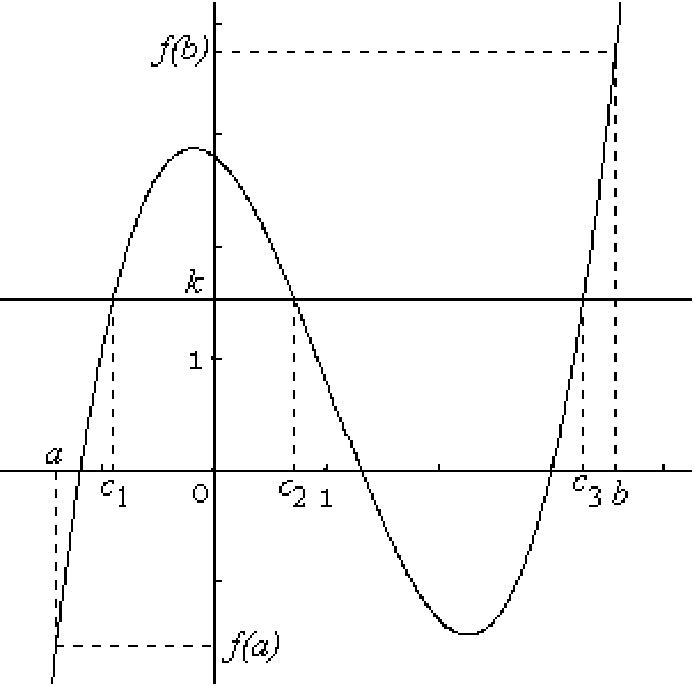

# Théorème des valeurs intermédiaires

## Sur un intervalle fermé borné (un segment)

On conviendra que dans un tableau de variation une flèche vers le haut (respectivement vers le bas) signifie que la fonction ƒ est continue et **strictement**  croissante (respectivement **strictement** décroissante).

!!! abstract "Théorème des valeurs intermédiaires"
    Soit $f$ une **fonction continue sur un intervalle I** contenant  a et b, avec $a < b$.

    Pour tout réel $k$ compris entre $f(a)$ et $f(b)$, il existe **au moins** un réel $c \in[a,b]$ tel que $f(c)=k$.

    En d'autres termes , $f$ prend au moins une fois toute valeur comprise entre $f(a)$ et $f(b)$.

    [{.Center_lien .Vignette}](./Image/cours_cb3.png)

???- danger "Attention"

    - Même si $f$ est continue sur $[a;b]$, $f([a;b])$ est en général différent de $[f(a);f(b)]$ et de $[f(b);f(a)]$.

    - Ce théorème montre qu'il existe **au moins** un réel $c \in[a,b]$ tel que $f(c)=k$ ($k$ compris entre $f(a)$ et $f(b)$). Il peut donc y en avoir plusieurs !

    - Contrairement au corollaire vu plus loin, il n'est pas nécessaire d'étudier les variations de $f$ sur $[a;b]$ pour utiliser ce théorème.

!!! info "Cas particulier important"
    Soit $f$ une fonction continue sur un intervalle I contenant  a et b ,avec $a < b$.

    Si 0 est compris entre $f(a)$ et $f(b)$ c'est-à-dire si $f(a)$ et $f(b)$ sont de signes contraires (i.e. $f(a)\times f(b) <0$ ) alors il existe au moins un réel $c \in[a,b]$ tel que $f(c)=0$.

???- example "Exemple"
    Soit $f(x)=\ex^x-x^3+1$ est définie sur $[-1;4]$. Justifier que $f(x)=1$ possède au moins une solution sur $[-1;4]$.
 

!!! abstract "Corollaire du théorème des valeurs intermédiaires"
    Si $f$ est une fonction **continue <u>et</u> strictement monotone** sur un intervalle $[a;b]$, pour tout réel $k$ compris entre $f(a)$ et $f(b)$ l'équation $f(x)=k$, d'inconnue $x$, a **une unique solution $\alpha$** dans $[a,b]$.

???- example "Exemple"
    Soit $f$ la fonction définie sur $\R$ par
    
    \[
        f(x) = x \ex^{-x} +1
    \]

    1. Etudier les variations de $f$ sur $\R$.
    2. Justifier que l'équation $f(x)=0$ possède une unique solution $\alpha$ sur $[-1;0]$. Donner une valeur de $\alpha$ à $10^{-3}$ près.
    3. En déduire le nombre de solution à $f(x)=0$ sur $\R$.
    4. De façon analogue, justifier que $f(x)=1.2$ possède exactement 2 solutions sur $\R$.

!!! tip "Méthode - Par balayage"
    Dans le cadre de l'utilisation du corollaire du théorème des valeurs intermédiaires et en utilisant la calculatrice, il est possible de trouver un encadrement (et donc une valeur approchée) de la solution à $f(x) =k$.

    Il est possible d'utiliser des programmes informatiques (Méthode par dichotomie, méthode de la sécante, méthode de Newton).

## Résolution d'équations sur un intervalle ouvert, semi -ouvert

On généralise le théorème des valeurs intermédiaires sur un intervalle ouvert  et semi-ouvert. Ce sont donc des limites qui sont calculées &laquo; aux extrémités &raquo; de l'intervalle.

???- example "Exemple"
    Soit $f$ la fonction définie sur $[0,+\infty[$ par $f(x)=\dfrac{xe^{-x}}{x^2+1}$.

    1. Déterminer la limite en $+\infty$ .Interpréter graphiquement le résultat obtenu.
    2. On considère la fonction $g$ définie sur $[0,+\infty[$ par $g(x) =x^3+x^2+x-1$.  
       Etablir que $g(x)=0$ a une unique solution $\alpha$ dans $[0,+\infty[$.  
       En déduire le signe de g(x) 
    3. 
        1. Montrer que pour tout $x$ de $[0,+\infty[$ , $f'(x)$ et $g(x)$ sont de signe contraires.
        2. En déduire le sens de variation de $f$  .
  
    ???- done "Réponse"

        1. $f(x) = xe^{-x} \times \dfrac{1}{x^2+1}$  
           $\Lim{\dlim{x}{+\infty} xe^{-x}=0}{\dlim{x}{+\infty} \dfrac{1}{x^2+1} = 0}$  donc par produit $\dlim{x}{+\infty} f(x) =0$.  
           La droite d'équation $y=0$  est asymptote horizontale à la courbe de la fonction $f$ au voisinage de $+\infty$. 
        2. Pour tout réel $x$  de $[0,+\infty[$ on a $g'(x)=3x^2+ 2x+1$.  
            $g'$ est strictement positive sur $\R$, on en déduit que $g$ est strictement croissante sur $\R$.  
            $g(0)=-1$ et $\dlim{x}{+\infty} g(x) = \dlim{x}{ +\infty} x^3 =+\infty$  
            On applique  le corollaire du théorème des valeurs intermédiaires :  
               - $g$ est continue sur $[0,+\infty[$  
               - $g$ est strictement croissante sur $[0,+\infty[$  
               - $0$ est compris entre -1 et $+\infty [$,  

            donc l'équation $g(x)=0$ admet une solution unique $\alpha$ dans $[0,+\infty[$.  
            <u>Signe de g(x)</u>  
            Sur $]0,\alpha]$ , alors $g(x) \leq 0$ et sur $[\alpha, +\infty[$ , $g(x)  \geq 0$.

        3.  
            1. $f$ est dérivable sur $[0,+\infty[$.  
            On pose $u(x) = x\ex^{-x}$ et $v(x) = x^2+1$.  
            $u'(x) = \ex^{-x} -x\ex^{-x}= \ex^{-x} ( 1-x)$ et $v'(x) = 2x$.  
            $f'(x) = \dfrac{\ex^{-x} ( 1-x)\times (x^2+1) - (  x\ex^{-x} \times 2x)}{ ( x^2+1)^2}= \dfrac{ \ex^{-x} ( 1+x^2-x-x^3-2x^2)}{(1+x^2)^2}=\dfrac{ -g(x) \ex^{-x} }{ ( 1+x^2)^2}$.  
            $f'(x)$ et $g(x)$  sont de signes contraires.  
            2. Tableau de variations  

                [{.Center_lien .VignetteMed}](./Image/Cours_004.png)

