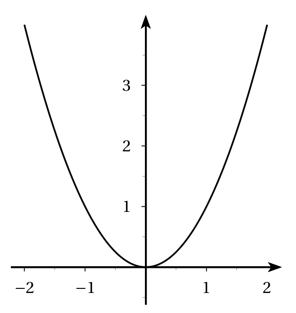
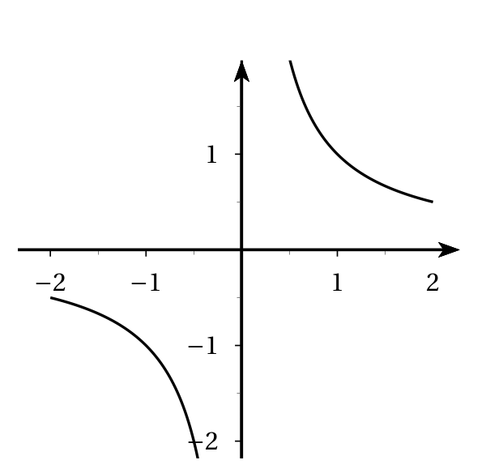
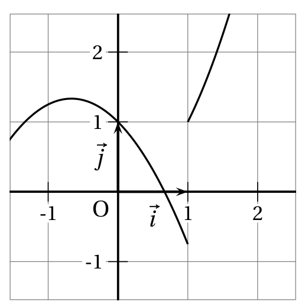

# Fonction continue
 

## Définition

!!! info "Fonction continue en un point"
    Soient $f$ une fonction définie sur un intervalle $I$ et $a$ un réel appartenant à $I$.

    $f$ **est continue en $\mathbf{a}$** lorsque $f$ admet une limite $\ell_g$ à gauche et une limite $\ell_d$ à droite en $a$ et lorsque $\ell_g=\ell_d=f(a)$.

!!! info "Fonction continue sur un intervalle"
    Soient $f$ une fonction définie sur un intervalle $I$ et $a$ un réel appartenant à $I$.
    
    $f$ est continue sur un intervalle $I$ lorsqu'elle est continue $a$ pour tout $a \in I$.

???- example "Exemple"
    - Une fonction continue sur $[-2; 2]$.

        [{.Center_lien .Vignette}](../Image/Cours_001.png)
    
    - Une fonction continue sur $[-2;0[ \cup ]0; 2]$

        [{.Center_lien .Vignette}](../Image/Cours_002.png)
    
    - Une fonction qui n'est pas continue sur $[-1;2]$

        [{.Center_lien .Vignette}](../Image/Cours_003.png)
    
???- example "Exemple"
    Soit $f$ la fonction définie sur $\R$ par $f(x)= \left\{ \begin{array}{l} x^2 \text{ si } x<2\\ 3  \text{ si } x=2\\ x^2 \text{ si } x>2 \end{array} \right.$.

    $f$ n'est pas continue en $2$. En effet, même si $\dlim{x}{2^-} f(x) = \dlim{x}{2^+} f(x) = 2^2$, ces limites ne sont pas égales à $f(2) = 3$ !

???- example "Exemple"
    Soit $f$ la fonction définie sur $\R$ par $f(x)= \left\{ \begin{array}{l}
    x+6 \text{ si } x\leq 3\\
    x^2 \text{ si } x>3
    \end{array}
    \right.$.
    
    Cette fonction est-elle continue en $3$ ?

    ???- done "Réponse"
        
        - $f(3) = 3+6 = 9$
        - $\dlim{x}{3^+} f(x) = \dlim{x}{3^+} x+6 = 9$
        - $\dlim{x}{3^-} f(x) = \dlim{x}{3^-} x^2 = 3^2 = 9$

        Donc $f$ est continue en $3$.

!!! info "Fonctions de références"
    - Les fonctions affines sont continues sur $\R$ .
    - La fonction carrée est continue sur $\R$. 
    - La fonction inverse est continue sur $]-\infty,0[$ et sur $]0+\infty[$.
    - La fonction racine carrée est continue sur $[0,+\infty[$.
    - La fonction valeur absolue  est continue sur $\R$.

## La fonction partie entière

!!! info "Fonction partie entière"
    La fonction partie entière notée $E$ est la fonction qui à tout nombre réel $x$ associe  est le plus grand nombre  entier inférieur ou égal à $x$.
    
    Donc  si $n\leq x<n+1$ alors $E(x)=n$ .

???- example "Exemple"

    1. Calculer $E(-1)$, $E(-0,6)$ ; $E(0,85)$ $E(0,99)$
    2. Représenter graphiquement la fonction $E$ sur $\R$.
    3. La fonction est-elle continue sur $\R$ ? Si non, sur quels intervalles est -elle continue?

    ???- done "Réponse"

        1. $E(-1)=-1$, $E(-0,6)=-1$, $E(0,85)=0$, $E(0,99)=0$.
        2. $E$ est constante par intervalle.

            - Si $-1 \leq x<0$ alors $E(x)=-1$
            - si $0 \leq x<1$ alors $E(x)=0$
            - si $1 \leq x<2$ alors $E(x)=2$

        3. La courbe présente un saut en tout point d'abscisse entière. $E$ n'est pas continue sur $\R$ mais est continue sur chaque intervalle $[n,n+1[$ où $n\in \Z$.

## Caractérisation 

!!! info "Une implication bien utile"
    Une fonction dérivable sur un intervalle $I$ est continue sur $I$.

!!!- warning "La réciproque est fausse"
    Une fonction peut être continue sans être dérivable.
    
    - La fonction valeur absolue est continue sur $\R$ mais n'est pas dérivable en 0.  
    - La fonction racine carrée est continue sur $[0,+\infty[$ mais n'est pas dérivable en 0 donc seulement dérivable sur $]0,+\infty[$. 

!!!- info "Des fonctions de références et des opérations"

    - Les fonctions polynômes sont continues sur $\R$ et les fonctions rationnelles sont continues sur tout intervalle inclus dans leur ensemble de définition. 
    - La somme , le produit de fonctions continues sur un intervalle $I$ est continue sur $I$.
    - Le quotient  d'une fonction continue sur un intervalle $I$ dont le dénominateur ne s'annule pas sur $I$ est continue sur $I$.
    - Si $v$ est continue sur $J$ et $u$ est continue sur $I$ et si pour tout $x \in I$ $u(x) \in J$, alors $v \circ u$ est continue sur $I$.

???- example "Exemple"

    - La fonction $x\mapsto 3x^2-2x+5$ est continue sur $\R$.
    - La fonction $x\mapsto \dfrac{x-3}{x+1}$ est continue sur $]-\infty,-1[$ et sur $]-1,+\infty[$.
    - la fonction $x\mapsto \sqrt{2x-4}$ est continue sur $[2,+\infty[$.
    
    en effet $u:\mapsto 2x-4 $ est continue et positive sur $[2,+\infty[$.

    La fonction racine carrée est continue sur $[0 ,+\infty[$ donc $g=\sqrt{u}$ est continue sur $[2,+\infty[$ comme racine carrée (composée) d'une  fonction continue.

!!! danger "Ne pas confondre continuité et dérivabilité"

    - Une fonction $f$ est **continue en $a$**  si la courbe $C_f$ ne présente pas de saut en son point d'abscisse $a$.
    - Une fonction $f$ est **dérivable en $a$** si la courbe $C_f$ admet  une tangente non verticale en son point d'abscisse $a$.
    - Une fonction $f$ n'est pas **dérivable en $a$** si la courbe $C_f$ admet  une tangente  verticale en son point d'abscisse $a$ ou deux demi-tangentes à droite et à gauche en "a" non confondues.

## Continuité et suite

!!!- info "Une conséquence"
    Soient $f$ une fonction continue sur un intervalle $I$ et $(u_n)$ une suite d'éléments de $I$ convergeant vers $a \in I$. Alors $\dlim{n}{+\infty} f(u_n) = f(a)$.

!!!- info "Théorème du point fixe"
    Soient $f$ une fonction définie et continue sur un intervalle $I$ dans lui-même (i.e. $f(I) \subset I$) et $(u_n)$ la suite définie par un réel $u_0 \in I$ et, pour tout $n\in \N$, $u_{n+1}=f(u_n)$.

    Si $(u_n)$ converge vers $\ell \in I$, alors $\ell$ est solution de l'équation $f(x)=x$.

!!! warning "Pas de conclusion hative !"

    - L'équation $f(x) = x$ peut possèder plusieurs solutions. Il faut donc trouver un intervalle contenant $\ell$ et une seule solution.
    - Si les hypothèses ne sont pas vérifiées (et citées), alors la condition &laquo; l'équation $f(x)=x$ possède une solution (même unique) &raquo; ne permet pas d'affirmer que la suite définie par $u_{n+1} = f(u_n)$ converge !

???- tip "Remarques théoriques"

    - $f$ une fonction définie et continue sur un intervalle (fermé) $I=[a;b]$ dans lui-même (i.e. $f(I) \subset I$), alors il existe au moins une solution à $f(x) = x$. 
    
    - Si $u_0 \in I$ et si $f(I) \subset I$, alors pour tout $n \in \N$, $u_n \in I$ (Un récurrence à faire !).

???- example "Exemple"
    Soit $(u_n)$ la suite définie par $u_0=1$ et, pour tout $n\in \N$, $u_{n+1} =5- \dfrac{3}{u_n+1}$. 
    
    <ol>
    <li>Déterminer $f$ telle que $f(u_n)=u_{n+1}$ et étudier les variations de $f$ sur $[-0.4 ; 5]$.</li>
    <li> Montrer que $f([-0.4;5]) \subset [-0.4;5]$.</li>
    <li> Montrer par récurrence que pour tout $n\in \N$, $-0.4\leq u_n \leq u_{n+1} \leq 5$.</li>
    <li> En déduire que $(u_n)$ est convergente.</li>
    <li> Déterminer sa limite.</li>
    </ol>
