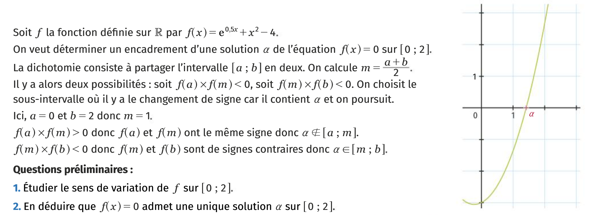
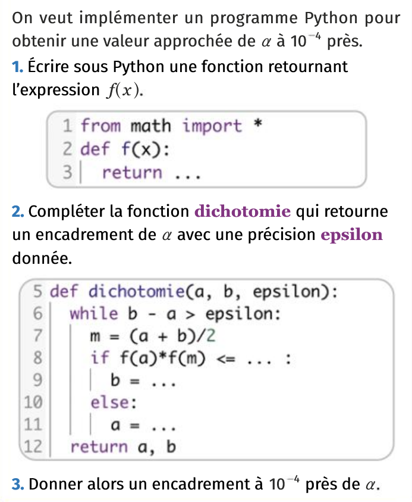
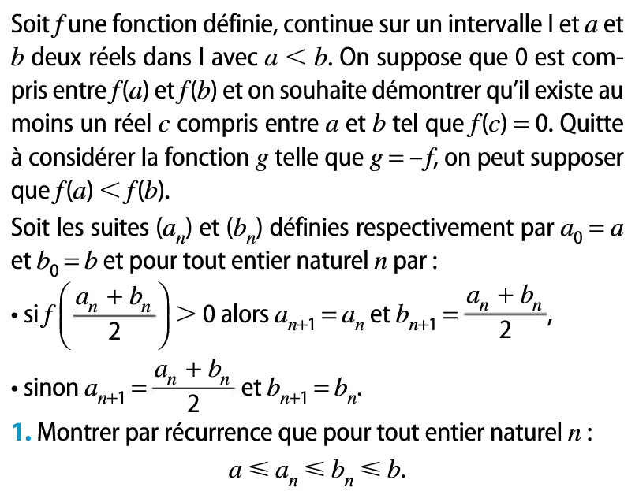
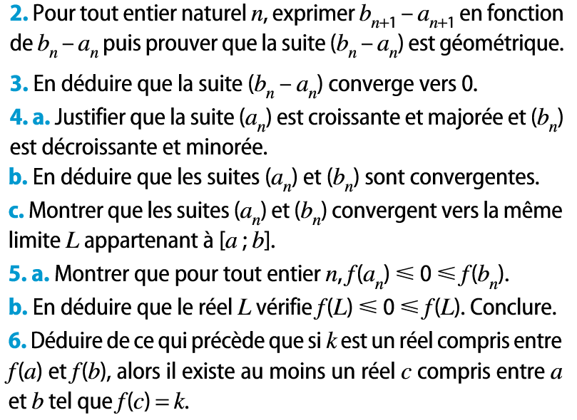
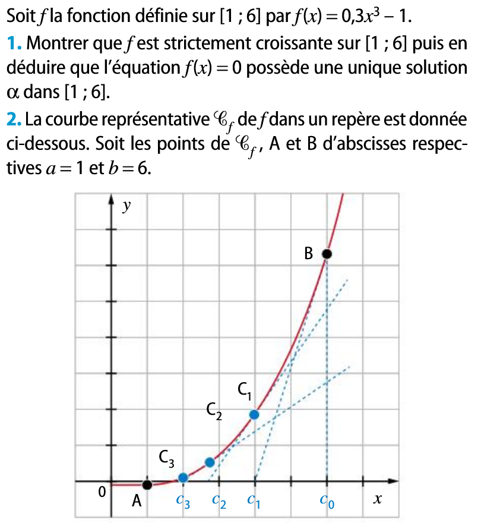
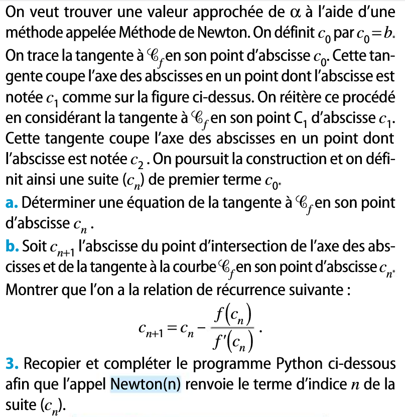
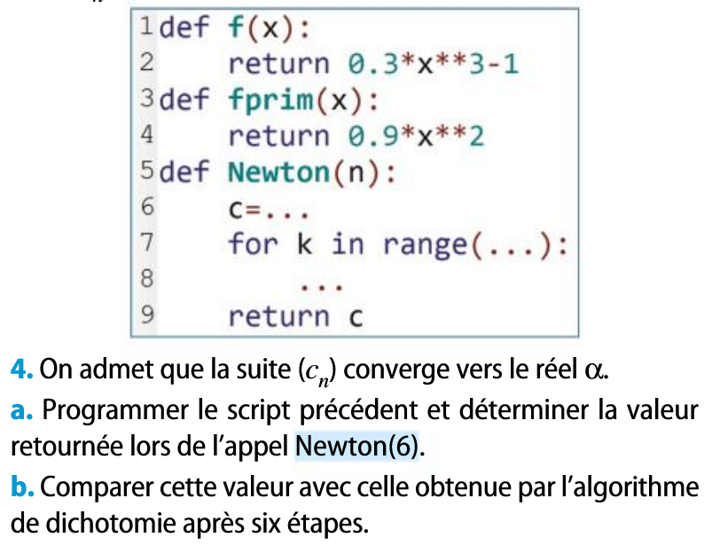
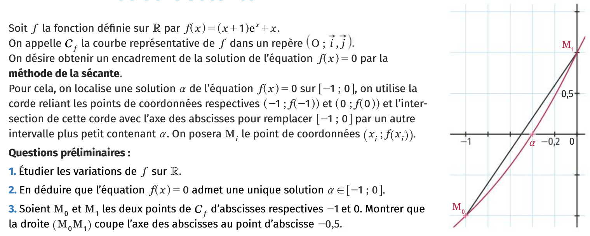
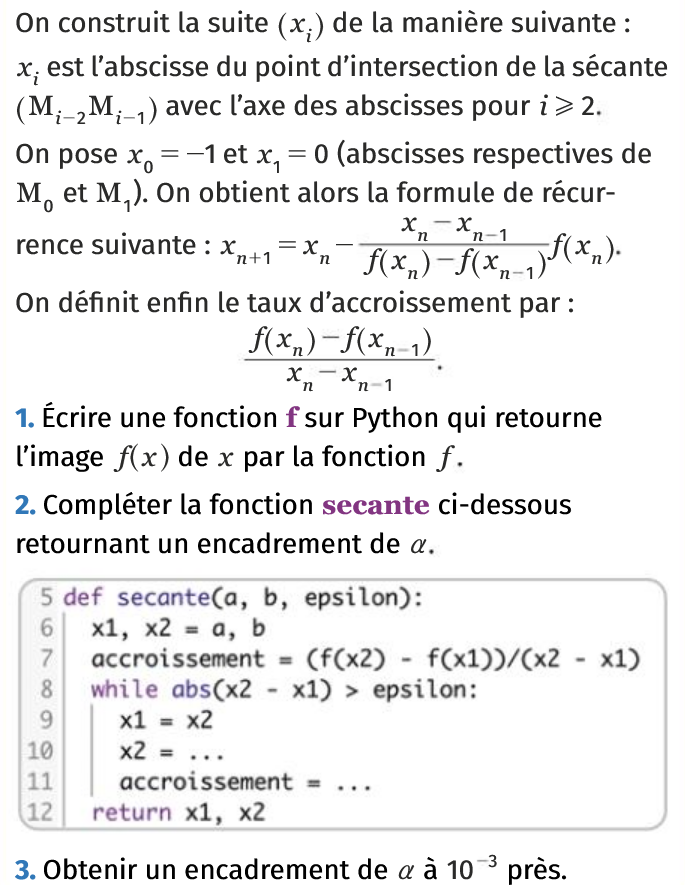

# Continuité Méthodes pour une solution approchée

## La méthode par dichotomie

### Avec Python

[{.Center_lien .Vignette60 .Cote_demi}](./Image/Dicho01.png)
[{.Center_lien .Vignette30 .Cote_demi}](./Image/Dicho02.png)

{{ IDE() }}  

### Sans Python

[{.Center_lien .Vignette40 .Cote_demi}](./Image/Dicho01b.png)
[{.Center_lien .Vignette40 .Cote_demi}](./Image/Dicho02b.png)

???-  done "Solution"
    
    1. Notons $P(n)$  : $a \leq a_n \leq b_n \leq b$.
    
        - Init : $a_0=a$ et $b_0=b$ et $a\leq b$. Donc $P(0)$ est vraie.
        - Hered : On suppose que $P(k)$ est vraie pour un entier $k\geq 0$.
    
            - Si $f\left(\dfrac{a_k+b_k}{2} \right) >0$ alors $a_{k+1}=a_k$ et $b_{k+1} = \dfrac{a_k+b_k}{2}$. Donc $a_k \leq b_{k+1} \leq b_k$. D'après l'HR : $a \leq a_k \leq b_k \leq b$. Donc $a \leq a_k\leq b_{k+1} \leq b_k \leq b$  et comme $a_{k+1}=a_k$, on trouve que $a \leq a_{k+1}\leq b_{k+1} \leq b$.
            - Procéder de façon analogue pour le cas où $f\left(\dfrac{a_k+b_k}{2} \right) \leq 0$
    
        - Conclusion : la propriété $P$ est vraie au rang $0$ et est héréditaire. On a donc démontré par récurrence que pour tout entier naturel $n$, $a \leq a_n \leq b_n \leq b$.
    
    2. Deux cas : 
    
        - Si $f\left(\dfrac{a_n+b_n}{2} \right) >0$, alors $b_{n+1}=\dfrac{a_n+b_n}{2}$, donc $b_{n+1}-a_{n+1}=\dfrac{a_n+b_n}{2}-a_n = \dfrac{b_n-a_n}{2}$
        - Si $f\left(\dfrac{a_n+b_n}{2} \right) <0$, alors $a_{n+1}=\dfrac{a_n+b_n}{2}$, donc $b_{n+1}-a_{n+1}=b_n-\dfrac{a_n+b_n}{2} = \dfrac{b_n-a_n}{2}$
    
        Donc pour tout $n \in \N$, $b_{n+1}-a_{n+1}=\dfrac{1}{2}(b_n-a_n)$.  
        Ainsi $(b_n-a_n)$ est une suite géométrique de raison $\dfrac{1}{2}$.
    
    AFAIRE

## La méthode de Newton-Raphson

[{.Center_lien .Vignette40 .Cote_demi}](./Image/Newton01.png)
[{.Center_lien .Vignette40 .Cote_demi}](./Image/Newton02.png)

[{.Center_lien .Vignette40}](./Image/Newton03.png)

{{ IDE() }}  

## La méthode de la sécante

[{.Center_lien .Vignette60 .Cote_demi}](./Image/Secant01.png)
[{.Center_lien .Vignette30 .Cote_demi}](./Image/Secant02.png)

{{ IDE() }}  