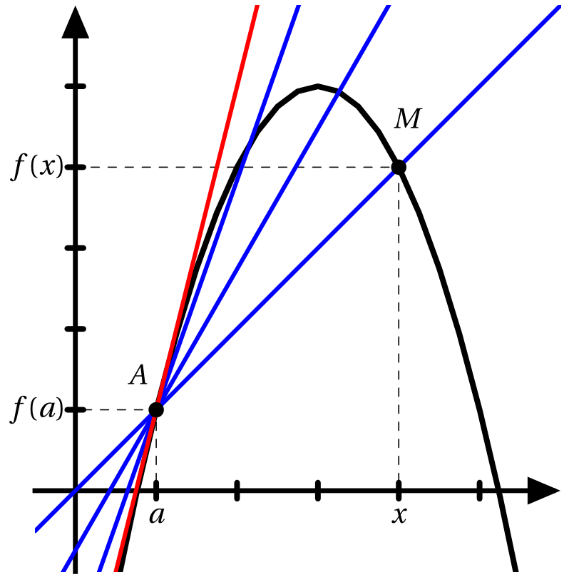

# Fonction dérivable

!!! note "Définition"
	Soit $f$  une fonction définie sur un intervalle $I$ contenant $a$.

	* $f$ est **dérivable** en $a$  de nombre dérivé $f'(a)$ signifie:
	
	\[
	\lim\limits_{h\to 0}\dfrac{f(a+h)-f(a)}{h}=f'(a)
	\]
	
	ou encore
	
	\[
	\lim\limits_{x\to a}\dfrac{f(x)-f(a)}{x-a}=f'(a)
	\]
	
	(avec $f'(a)$ nombre **fini**).
	
	* $f$ est dérivable sur $I$ signifie que $f$ est dérivable en tout $x$ de $I$.
	* La fonction dérivée de $f$  notée $f'$ est la fonction qui, à tout $x$ de I associe le nombre $f'(x)$ .

???+ example "Exemple"
	Etudier la dérivabilité en 2 de la fonction $f:x\mapsto x^2+2$.
	
	???+ done "Question"
		Soit $h\neq0$ 
		$\dfrac{f(2+h)-f(2)}{h}=\dfrac{(2+h)^2+2-6}{h}= \dfrac{h^2+4h}{h}=h+4$. Or 
		
		\[
		\lim_{h \to 0}(h+4)=4
		\]
		
		Donc $f$ est dérivable en 2 et $f'(2)=4$.

???+ example "Exemple"
	Etudier la dérivabilité en 0 de la fonction $f:x \mapsto \sqrt{x}$.
	
	???+ done "Question"
		La fonction racine carrée est définie pour $x\geq 0$. 
		Soit $h>0$ 
		$\dfrac{f(0+h)-f(0)}{h}=\dfrac{\sqrt{h}}{h}=\dfrac{1}{\sqrt{h}}$, or
		
		\[
		\lim_{h \to 0} \dfrac{1}{\sqrt{h}}=+\infty
		\]
		
		donc 
		
		\[
		\lim_{h \to 0} \dfrac{f(0+h)-f(0)}{h}=+\infty
		\]
		
		Donc la fonction racine carrée n'est pas dérivable en 0.

Rappel : Le coefficient directeur d'une droite passant par $A(x_A,y_B)$ et $B(x_B,y_B) $ est $m= \dfrac{y_B-y_A}{x_B-x_A}$.

**Interprétation graphique de la dérivabilité**

Si  $A(a,f(a))$ et $M(x,f(x))$ alors  $\dfrac{f(x)-f(a)}{x-a}$ est le coefficient directeur de la droite (AM). 
Lorsque $x$ tend vers $a$, cette droite (AM) tend vers une position limite la tangente à la courbe $C_f$ au point A.

<!--<iframe scrolling="no"
src="https://www.geogebra.org/m/axmvyk6m"
width="800px"
height="600px"
style="border:0px;" allowfullscreen>
</iframe>-->

!!! abstract "Théorème"
	Dire que $f$ est dérivable en $a$ signifie que $C_f$ admet au point $A(a,f(a))$  une tangente $T_A$ 
	**non verticale** (ou 2 demi-tangentes à droites et à gauche de A confondues). 
	Le **coefficient directeur de la tangente au point d'abscisse $a$  est $f'(a)$**. 
	Une **équation de la tangente** $T_A$ (on dit aussi au point d'abscisse $a$) est 
	
	\[
	y=f'(a)(x-a)+f(a)
	\]

[{.Center_lien .VignetteMed}](./Image/Im01.png)

