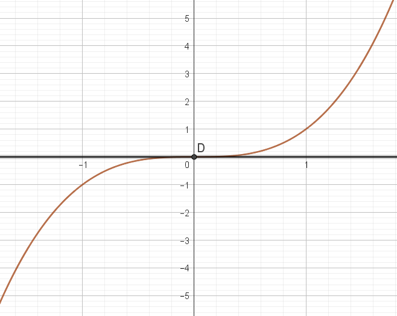

# Dérivation et tangente : techniques de base

!!! abstract "Théorème"
	Si $f$ est une fonction dérivable sur $I$, $\mathcal{C}_f$ sa courbe représentative et $a$ est un réel de $I$, alors l'équation de la tangente à $\mathcal{C}_f$ au point d'abscisse $a$ est :

	\[
	y = f'(a)(x-a) + f(a)
	\]

???- example "Exemple"
	Soit $f(x) = x^2+3x-5$. 
	
	1/ Déterminer l'équation de la tangente à la courbe de $f$ au point d'abscisse $2$

	2/ Tracer la courbe de $f$ et sa tangente.
	
	???- done "Solution"
		1/ $f(2) = 5$.
		$f'(x) = 2x +3$. Donc $f'(2) = 7$. Ainsi, l'équaiton de la tangente est $y = 7(x-2) + 5$ c'est-à-dire $y=7x + 9$. 

		2/ AFAIRE

???- example "Exemple"
	Soit $f$ une fonction dont la courbe est donnée ci-dessous. Les droites sont des tangentes respectivement aux points $A, B$ et $C$. Déterminer $f'(-1), f'(0)$ et $f'(3)$.

	[{.Center_lien .VignetteMed}](../Image/conv_tgte01.png)
	
	???- done "Solution"
		AFAIRE

!!! abstract "Théorème"
	Si $f$ est une fonction dérivable sur $I$ et si $a$ possède un extremum local en $x = a$, alors sa tangente au point d'abscisse $a$ a pour coefficient directeur $0$. Cette tangente est alors horizontale.

???- example "Exemple"
	En reprenant :
	
	[{.Center_lien .VignetteMed}](../Image/Tgte01.png)

	<ol>
	<li> Déterminer par lecture graphique les points où les tangentes sont horizontales </li>
	<li> La fonction associée à la courbe tracée est $f(x) = x^3-2x^2-5x+6$. Déterminer alors les valeurs exactes des abscisses des points où la tangente est horizontale.
	</ol>

	???- done "Réponse"
		AFAIRE

!!! warning
	**Attention la réciproque est fausse :**

	Il existe des fonctions qui possèdent une tangente horizontale et pourtant il n'y a pas de maximum local. C'est le cas de la $f(x) = x^3$ au point d'abscisse $0$.

	[{.Center_lien .VignetteMed}](../Image/Tgte02.png)

???- example "Exemple"

	Voici la **courbe représentative de la dérivée** d'une fonction $f$ :

	[{.Center_lien .VignetteMed}](../Image/Tgte03.png)

	<ol>
	<li> Déterminer les points de la courbe de $f$ où la tangente est horizontale.</li>
	<li> En quelle(s) abscisse(s) la fonction $f$ possède-t-elle un extremum local ?</li>
	</ol>

Il est important :

- de savoir trouver l'équation d'une tangente
- de savoir retrouver un nombre dérivée à partir de la lecture graphique d'une tangente

