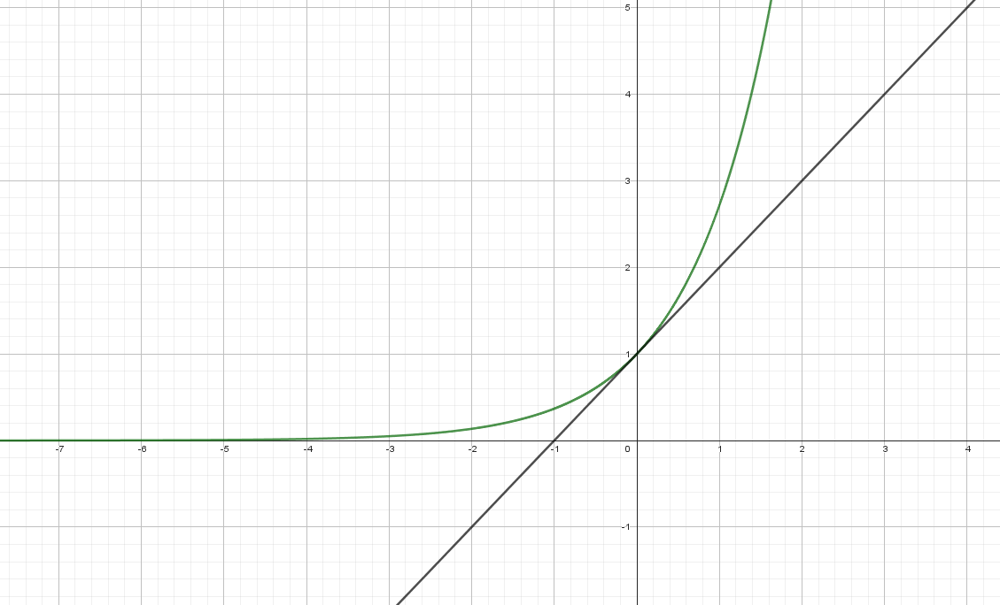
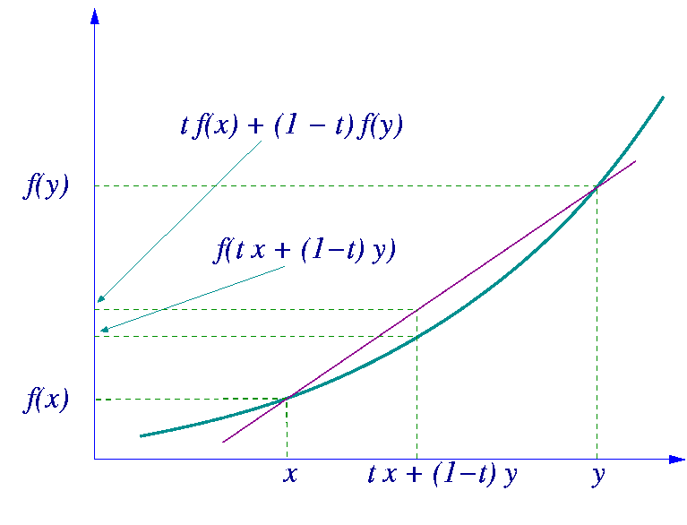

# Convexité et inégalité

## Convexité et tangente

**Rappel :**  

- Soit $f$ une fonction définie et **dérivable** sur un intervalle I. $f$ est _convexe_ sur $I$ équivaut à $\mathcal{C}_f$ est **au-dessus** de ses tangentes sur $I$.

- Soit $f$ une fonction définie et **dérivable** sur un intervalle I. $f$ est _concave_ sur $I$ équivaut à $\mathcal{C}_f$ est **au-dessous** de ses tangentes sur $I$.

???- question "Exercice"

    Montrer que pour tout $x \in \mathbb{R}$, e$^x \geq x + 1$.

    ???- done "Réponse"

        Soit $f$ la fonction définie sur $\mathbb{R}$ par $f(x) = \text{e}^x$. 
        
        $f'(x) = \text{e}^x$ et $f''(x)=\text{e}^x$. 
        
        Ainsi, pour tout $x \in \mathbb{R}$, $f''(x) \geq 0$. Donc $f$ est convexe sur $\mathbb{R}$.

        Par ailleurs, la tangente au point d'abscisse $0$ a pour équation $y = f'(0)(x-0)+f(0)$, c'est-à-dire $y=x+1$.

        Comme $f$ est convexe sur $\mathbb{R}, sa courbe est au-dessus de ses tangentes sur $\mathbb{R}$, en particulier au-dessus de la tangente d'équation $y=x+1$.

        Donc pour tout $x \in \mathbb{R}$, $f(x) \geq x+1$, c'est-à-dire pour tout $x \in \mathbb{R}$, e$^x \geq x + 1$.

        

        

        

???- question "Exercice"

    Soit $f$ la fonction définie sur $\mathbb{R}$ par $f(x) = \dfrac{1}{2}x^3-\dfrac{3}{2}x^2-3x+4$. On note $\mathcal{C}_f$ sa courbe représentative.

    1. Déterminer l'équation de la tangente $(T)$ à $\mathcal{C}_f$ en $x_0 = 0.5$
    2. Déterminer la convexité de $f$ sur $\mathbb{R}$.
    3. En déduire que, pour tout $x \in ]-\infty; 1], $f(x) \leq -\dfrac{9}{8}x+\dfrac{9}{2}$.
    4. Soit $P(x) = f(x) - \left(-\dfrac{9}{8}x+\dfrac{9}{2}\right)$.

		1. Calculer $P(4)$.
        2. Déterminer les réels $a, b, c$ tels que $P(x) = (x-4)(ax^2+bx+c)$.
        3. En déduire la position relative de $\mathcal{C}_f$ et de $(T)$.

## Convexité et corde

Dans un repère du plan, soient $A(x_A;y_A)$, $B(x_B;yB)$ et $M(x;y)$

\begin{eqnarray*}
M \text{ appartient au segment } [AB] & \Leftrightarrow & \exists t \in [0;1]\ :\ \overrightarrow{AM} = t \overrightarrow{AB} \\
 & \Leftrightarrow & \exists t \in [0;1]\ :\ x = t (x_B-x_A) + x_A \text{ et } y = t (y_B-y_A) + y_A\\
 & \Leftrightarrow & \exists t \in [0;1]\ :\ x = (1-t)x_A + t \times x_B \text{ et } y = (1-t)y_A + t \times y_B\\
\end{eqnarray*}

**Rappel :**

Soit une fonction et $\mathcal{C}_f$ sa courbe représentative dans un repère. On dit que $f$ est **convexe** sur un intervalle $I$ si $\mathcal{C}_f$ est en dessous de **toutes** ses sécantes entre les deux points d'intersection, c'est-à-dire en dessous des cordes associées.

On suppose que $f$ est convexe sur $I$ et $x$ et $y$ sont deux réels de $I$. On note $A(y; f(y))$ et $B(x; f(x))$.

$M(x_M;y_M)$ appartient à la corde $[AB]$ si et seulement si il existe un réel $t \in [0;1]$, tel que 

\[
\left\{
\begin{array}{l}
x_M = (1-t)y + t \times x\\
y_M = (1-t)f(y) + t\times f(x)
\end{array}
\right.	
\]

Ainsi, $\mathcal{C}_f$ est en dessous de la corde $[AB]$ signifie que $y_M \geq f(x_M)$. D'où

\[
t \times f(x) + (1-t) f(y) \geq f(t \times x + (1-t)y)
\]

!!! info "A retenir"

    Si $f$ est convexe sur $I$, alors pour tout $x,y$ deux réels de $I$ et pour tout $t \in [0;1]$

    \[
    t \times f(x) + (1-t) f(y) \geq f(t \times x + (1-t)y)
    \]
