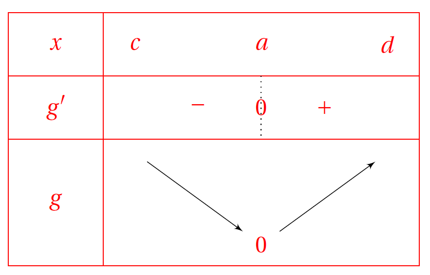

# Démonstration au programme

!!! info "Théorème"
    Soit $f$ une fonction définie et **deux fois dérivable** sur un intervalle I. 
    $f''$ est positive sur $I$ équivaut à $\mathcal{C}_f$ est au-dessus de ses tangentes sur $I$.

!!! abstract "Démonstration"

    ???- done "_Hypothèses du corollaire :_"

        - $f$ est deux fois dérivable sur un intervalle $I$.
        - $f''$ est positive $I$
        
    ???- done "_Objectif de la démonstration :_"
    
        $\mathcal{C}_f$ est au-dessus de ses tangentes sur $I$}

    ???- tip "_Une méthode pour l'étude de la position relative :_"

        Pour étudier la position relative de la courbe de $h$ et celle de $k$, il faut étudier le signe de $h-k$.

    ???- done "Démonstration"

        Soit $f$ une fonction définie et deux fois dérivable sur un intervalle $I$ et telle que $f''$ est positive sur $I$.

        Soit $a$ un réel de $I$. L'équation de la tangente en $a$ est $y=f'(a)(x-a)+f(a)$.

        Etudions donc le signe $g(x)=f(x)-\left( f'(a)(x-a)+f(a) \right)$

        ???- tip "_Une méthode pour étudier le signe d'une expression :_"

            On peut utiliser un tableau de variations pour trouver le signe.

        Calculons $g'$, ce qui est possible car $f$ est dérivable sur $I$ : $g'(x)=f'(x)-f'(a)$.

        Comme $f''$ est positive sur $I$, $f'$ est croissante sur $I$.

        - Si $x \geq a$, $f'(x) \geq f'(a)$ donc $g'(x)\geq 0$ sur $[a ; +\infty[\cap I$
        - Si $x \leq a$, $f'(x) \leq f'(a)$ donc $g'(x)\leq 0$ sur $]-\infty;a] \cap I$

        D'où le tableau de variations de $g$ sur $I=[c;d]$:

        

        
        

        Comme $g$ admet $0$ pour minimum sur $I$, alors $g$ est positive sur $I$. Donc pour tout $a \in I$ et pour tout $x \in I$, $f$ est au-dessus de sa tangente en $a$.     
