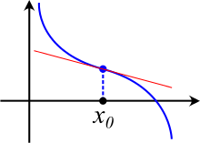

# Dérivation et tangente : techniques de base

!!! abstract "Théorème"
	Si $f$ est une fonction dérivable sur $I$, $\mathcal{C}_f$ sa courbe représentative et $a$ est un réel de $I$, alors l'équation de la tangente à $\mathcal{C}_f$ au point d'abscisse $a$ est :

	\[
	y = f'(a)(x-a) + f(a)
	\]

???- example "Exemple"
	Soit $f(x) = x^2+3x-5$. 
	
	1/ Déterminer l'équation de la tangente à la courbe de $f$ au point d'abscisse $2$

	2/ Tracer la courbe de $f$ et sa tangente.
	
	???- done "Solution"
		1/ $f(2) = 5$.
		$f'(x) = 2x +3$. Donc $f'(2) = 7$. Ainsi, l'équaiton de la tangente est $y = 7(x-2) + 5$ c'est-à-dire $y=7x + 9$. 

		2/ AFAIRE

???- example "Exemple"
	Soit $f$ une fonction dont la courbe est donnée ci-dessous. Les droites sont des tangentes respectivement aux points $A, B$ et $C$. Déterminer $f'(-1), f'(0)$ et $f'(3)$.

	[{.Center_lien .VignetteMed}](../Image/conv_tgte01.png)
	
	???- done "Solution"
		AFAIRE

!!! abstract "Théorème"
	Si $f$ est une fonction dérivable sur $I$ et si $a$ possède un extremum local en $x = a$, alors sa tangente au point d'abscisse $a$ a pour coefficient directeur $0$. Cette tangente est alors horizontale.

???- example "Exemple"
	En reprenant :
	
	[{.Center_lien .VignetteMed}](../Image/Tgte01.png)

	<ol>
	<li> Déterminer par lecture graphique les points où les tangentes sont horizontales </li>
	<li> La fonction associée à la courbe tracée est $f(x) = x^3-2x^2-5x+6$. Déterminer alors les valeurs exactes des abscisses des points où la tangente est horizontale.
	</ol>

	???- done "Réponse"
		AFAIRE

!!! warning
	**Attention la réciproque est fausse :**

	Il existe des fonctions qui possèdent une tangente horizontale et pourtant il n'y a pas de maximum local. C'est le cas de la $f(x) = x^3$ au point d'abscisse $0$.

	[{.Center_lien .VignetteMed}](../Image/Tgte02.png)

???- example "Exemple"

	Voici la **courbe représentative de la dérivée** d'une fonction $f$ :

	[{.Center_lien .VignetteMed}](../Image/Tgte03.png)

	<ol>
	<li> Déterminer les points de la courbe de $f$ où la tangente est horizontale.</li>
	<li> En quelle(s) abscisse(s) la fonction $f$ possède-t-elle un extremum local ?</li>
	</ol>

Il est important :

- de savoir trouver l'équation d'une tangente
- de savoir retrouver un nombre dérivée à partir de la lecture graphique d'une tangente

# Dérivation et formule

**Il est impératif de connaitre par c&#339;ur les formules suivantes :**

\[
\begin{array}{|c|c|c|c|}
\hline
\rule[-4pt]{0pt}{15pt} \text{Fonction $f$ définie sur} & \text{Par :}& \text{a pour fonction dérivée}&\text{la fonction est dérivable sur}\\
\hline
\rule[-4pt]{0pt}{15pt} \mathbf{R} & f(x) = k \ \text{(cste)} & f'(x) = 0 & \mathbf{R} \\
\hline
\rule[-4pt]{0pt}{15pt} \mathbf{R} & f(x) = x^n \ \  n \in \mathbb{N},\ n>0 & f'(x) = nx^{n-1} & \mathbf{R} \\
\hline
\rule[-4pt]{0pt}{15pt} \mathbf{R}^* & f(x) = x^n \ \   n \in \mathbb{Z},\ n<0 & f'(x) = nx^{n-1} & \mathbf{R}^* \\
\rule[-12pt]{0pt}{30pt}  & \text{Ou } f(x) = \frac{1}{x^n} \ n \in \mathbb{N},\ n \neq 0 & f'(x) = \frac{-n}{x^{n+1}} & \\
\hline
\rule[-12pt]{0pt}{30pt} \left[0;+\infty \right[ & f(x) = \sqrt{x} & f'(x) = \frac{1}{2 \sqrt{x}} & ]0;+\infty[\\
\hline
\rule[-4pt]{0pt}{15pt} \mathbf{R} & f(x) = \cos{x} & f'(x) = -\sin{x} & \mathbf{R}\\
\hline
\rule[-4pt]{0pt}{15pt} \mathbf{R} & f(x) = \sin{x} & f'(x) = \cos{x} & \mathbf{R}\\
\hline
\rule[-12pt]{0pt}{30pt} ]0;+\infty[ & f(x) = \ln (x) & f'(x) = \dfrac{1}{x} & ]0;+\infty[ \\
\hline
\rule[-4pt]{0pt}{15pt} \mathbf{R} & f(x) = \text{e}^{x}=\exp (x) & f'(x) = \text{e}^{x}=\exp (x) & \mathbf{R}\\
\hline
\end{array}
\]

???- example "Exemple"
	Calculer la dérivée des fonctions suivantes :
	<ol>
	<li> $f(x) = x^5$ </li>
	<li> $f(x) = \dfrac{1}{x^3}$ </li>
	</ol>

	Courbe A FAIRE
	
	???- done "Solution"
		A FAIRE

!!! abstract "Théorème"
	Si $u$ et $v$ sont deux fonctions dérivables sur $I$ et $\lambda$ un réel, alors :

	- $u+v$ est dérivable sur $I$ et pour tout $x$ de $I$ $(u+v)'(x) = u'(x) + v'(x)$
	- $\lambda u$ est dérivable sur $I$ et pour tout $x$ de $I$ : $(\lambda u)'(x) = \lambda \times u'(x)$

???- example "Exemple"
	Calculer la dérivée des fonctions suivantes :
	<ol>
	<li> $f(x) = 3x^4-5x^3+2x+1$ </li>
	<li> $f(x) = \dfrac{1}{x^3} - 5\times \text{e}^{x} - 2\sqrt{x}$ </li>
	</ol>

	Courbe A FAIRE
	
	???- done "Solution"
		A FAIRE

???- tip "Astuce"
	
	- $f(x) = \dfrac{k}{x^n} = k \times \dfrac{1}{x^n}$ (c'est plus simple que la formule d'un quotient)
	- $f(x) = \dfrac{x^n}{k} = \dfrac{1}{k} \times x^n$ (c'est plus simple que la formule d'un quotient)

???- example "Exemple"
	Calculer la dérivée des fonctions suivantes :
	<ol>
	<li> $f(x) = 3x^4-5x^3+2x+1$ </li>
	<li> $f(x) = \dfrac{1}{x^3} - 5\times \text{e}^{x} - 2\sqrt{x}$ </li>
	</ol>

	Courbe A FAIRE
	
	???- done "Solution"
		A FAIRE

**Il est impératif de connaitre par c&#339;ur les formules suivantes :**

 Si $u$ et $v$ sont deux fonctions dérivables sur $I$ : 

\[
\begin{array}{|c|c|c|c|}
\hline
\rule[-4pt]{0pt}{15pt} \text{Fonction $f$ définie sur} & \text{Par :}& \text{a pour fonction dérivée}&\text{la fonction est dérivable sur}\\
\hline
\rule[-4pt]{0pt}{15pt} I & u + v & u' + v' & I \\
\hline
\rule[-4pt]{0pt}{15pt} I & k \times u \text{ (k un réel constant)} & k \times u' & I \\
\hline
\rule[-4pt]{0pt}{15pt} I & u \times v & u'\times v + u \times v' & I \\
\hline
\begin{array}{c} J \subset I \text{ tel que }\\ \text{pour tout } x \in J,\ v(x) \neq 0 \end{array} & \dfrac{1}{v}
& \dfrac{- v'}{v^2}
&
\begin{array}{c} J \subset I \text{ tel que }\\ \text{pour tout } x \in J,\ v(x) \neq 0 \end{array}\\
\hline
\begin{array}{c} J \subset I \text{ tel que }\\ \text{pour tout } x \in J,\ v(x) \neq 0 \end{array}& \dfrac{u}{v}
& \dfrac{u'v-v'u}{v^2}
& 
\begin{array}{c} J \subset I \text{ tel que }\\ \text{pour tout } x \in J,\ v(x) \neq 0 \end{array}\\
\hline
\begin{array}{c} J \subset I \text{ tel que }\\ \text{pour tout } x \in J,\ u(x) \geq 0 \end{array}& \sqrt{u}
& \dfrac{u'}{2 \sqrt{u}}
&
\begin{array}{c} J \subset I \text{ tel que }\\ \text{pour tout } x \in J,\ u(x) > 0 \end{array}\\
\hline
\begin{array}{c} v \text{ est définie sur } J\\ u \text{ est définie sur } I\\ \text{ et } \forall x \in I,\ u(x) \in J \end{array}& v \circ u
& u' \times \left( v' \circ u \right)
&
I
\\
\hline
\end{array}
\]

Quant à la dernière formule du tableau précédent, elle peut s'appliquer aux cas particuliers les plus rencontrés :

\[
\begin{array}{|c|c|c|c|}
\hline
\rule[-4pt]{0pt}{15pt} \text{Fonction $f$ définie sur} & \text{Par :}& \text{a pour fonction dérivée}&\text{la fonction est dérivable sur}\\
\hline
I & \text{e}^{u}=\exp (u) & u' \text{e}^{u}=u' \exp (u) & I \\
\hline
\rule[-12pt]{0pt}{30pt}
\begin{array}{c} J \subset I \text{ tel que }\\ \text{pour tout } x \in J,\ u(x) > 0 \end{array}& \ln (u) \ (u>0)
& \dfrac{u'}{u}
&
\begin{array}{c} J \subset I \text{ tel que }\\ \text{pour tout } x \in J,\ u(x) > 0 \end{array}\\
\hline
\rule[-4pt]{0pt}{15pt} I & \cos(u) & -u' \times \sin (u) & I \\
\hline
\rule[-4pt]{0pt}{15pt} I & \sin(u) & u' \times \cos (u) & I \\
\hline
\rule[-12pt]{0pt}{30pt} mx+p>0 & \ln(mx+p) & \dfrac{m}{mx+p} & mx+p>0 \\
\hline
\rule[-4pt]{0pt}{15pt} \mathbf{R} & \exp(mx+p)=\text{e}^{mx+p} & m\exp(mx+p) = m \text{e}^{mx+p} & \mathbf{R} \\
\hline
\mathbf{R} & \cos(mx+p)  & -m\sin(mx+p) & \mathbf{R} \\
\hline
\mathbf{R} & \sin(mx+p)  & m\cos(mx+p) & \mathbf{R} \\
\hline
\end{array}
\]

???- example "Exemple"
	A FAIRE
	
	???- done "Solution"
		A FAIRE

**Il est indispensable de savoir dériver les fonctions en utilisant les formules précédents !**

!!! warning "Attention"

	Il faut faire attention aux parenthèses, invisibles dans les formules précédentes ! Par exemple :

	\[ \left(\dfrac{u}{v}\right)'(x) = \dfrac{(u'(x)) \times (v(x)) - (v'(x)) \times (u(x))}{(u(x))^2} \]

???- example "Exemple"
	Dériver $f(x) = \dfrac{2x^2-3}{x^3-4}$
	
	???- done "Solution"
		A FAIRE

# Utilisation de la dérivation

## Dérivation et variations

Dans la plupart des énoncés, vous serez amenés à dériver afin d'étudier les variations d'une fonction. Mais, il est aussi possible de calculer une dérivée afin :

- d'étudier la convexité d'une fonction et donc d'établir des inégalités (cf *lien AFAIRE*)
- de vérifier si une fonction est une primitive (cf *lien AFAIRE*)
- de vérifier si une fonction est une solution d'une équation différentielle
- de faire encore plus lors de vos futures études !
  
!!! abstract "Théorème"
	Soit $f$ une fonction dérivable sur un intervalle $I$.

	- $f'$ est positive sur $I$ équivaut à $f$ est croissante sur $I$
	- $f'$ est négative sur $I$ équivaut à $f$ est décroissante sur $I$
	- $f'$ est nulle sur $I$ équivaut à $f$ est constante sur $I$.

Rappel : tableau de signe (*lien AFAIRE*), etude de signe et maximum et/ou minimum (*lien AFAIRE*), etude du signe d'un second degré (*lien AFAIRE*), étude du signe d'une expression contenant une exponentielle (*lien vers première AFAIRE* et *lien vers term et* $\ln$ *AFAIRE*), étude du signe d'une expression contenant un logarithme (*lien vers première AFAIRE* et *lien vers term et* $\ln$ *AFAIRE*).

???- example "Exemple"

	AFAIRE

!!! abstract "Théorème"

	Soit $f$ une fonction définie sur $I$ et $a$ réel de $I$. Si $f'$ s'annule **en changeant de signe**, alors $f$ possède un extremum local au point d'abscisse $a$.

	En pratique, ce théorème n'est pas cité ! Mais il se voit au travers du tableau de variations !

???- example "Exemple"

	AFAIRE

## Dérivée seconde

!!! note "Exemple"

	Soit $f$ une fonction dérivable sur $I$ et $f'$ sa dérivée. Si $f'$ est dérivable sur $I$, alors on dit que $f$ est deux fois dérivable. La dérivée de $f'$ est appelée la dérivée seconde de $f$ est est notée $f''$.

Naturellement, il est possible de définir de façon analogue la dérivée troisième, quatrième, $\ldots$ n-ième.

En physique, on utilise parfois la notation différentielle : si la variable est $x$, $f'$ se note $\dfrac{\text{d}f}{\text{d}x}$ et $f''$ se note alors $\dfrac{\text{d}^2 f}{\text{d}x^2}$. Cette notion de dérivée seconde peut se rencontrer avec les calculs de vitesse et d'accélération.

???- example "Exemple"

	Calculer la dérivée seconde des fonctions suivantes :

	1. $f(x)=x^3-5x^2+3x-1$
	2. $g(x)=5x-\text{e}^x$
	
# Composition de fonctions

## Définition

!!! note "Définition"

	Soient $u$ une fonction définie sur un intervalle $I$ à valeurs dans un intervalle $J$ et $v$ une fonction définie sur l'intervalle $J$.
	
	**La composée de $\mathbf{u}$ par $\mathbf{v}$**, notée $v \circ u$, est la fonction définie sur $I$ par :

	\[ (v \circ u) (x) = v(u(x)) \]

	image AFAIRE

???- example "Exemple"
	
	On note $u(x)=x^2-1$, et $v(x)=\sqrt{x}$. Déterminer 

	1. $v \circ u$ définie sur  $I=]-\infty ; -1] \cup [1; + \infty[$
	2. $u \circ v$ définie sur $I=[0;+\infty[$

		???- done "Solution"
			
			1. $(v \circ u)(x)=\sqrt{x^2-1}$.
			2. $(u \circ v)(x)=\sqrt{x}^2-1=x-1$.

Vous aurez surtout besoin de savoir écrire une fonction comme étant la composée de deux fonctions de &laquo; référence &raquo;.

???- example "Exemple"

	Ecrire les fonctions suivantes comme la composée de deux fonctions à déterminer :

	1. $f(x)=\text{e}^{x^2+x}$
	2. $g(x)=\cos(3x+1)$
	3. $h(x)=\text{e}^{2x}+3\text{e}^{x}-5$

	???- done "Solution"

		1. $f(x)=(v \circ u)(x)$ où $u(x)=x^2+x$ et $v(x)=\text{e}^x$
		2. $g(x)=(v \circ u)(x)$ où $u(x)=3x+1$ et $v(x)=\cos(x)$
		3. $h(x)=(v \circ u)(x)$ où $u(x)=\text{e}^x$ et $v(x)=x^2+3x-5$
   
## Dérivée d'une composée.

!!! abstract "Théorème"

	Soient $v$  une fonction définie et dérivable sur $J$ et $u$ une fonction définie et dérivable sur $I$ tel que $u(x) \in J$ pour tout $x \in I$, alors la fonction $v \circ u$ est dérivable sur $I$ et :
	
	\[
	(v \circ u)'(x)=u'(x) \times v'(u(x))
	\]
	
	On note cette formule $(v \circ u)'=u' \times (v' \circ u)$

???- example "Exemple"

	Après avoir déterminer le domaine de dérivabilité, calculer la fonction dérivée des fonctions suivantes :
	
	1. $f(x)=\text{e}^{x^2-5x}$
	2. $g(x)=\sqrt{2-5x}$
	3. $h(x)=\text{e}^{4x+7}$
	4. $k(x)=(x^2-2x+1)^3$

	???- done "Solution"

	AFAIRE

???- tip "Remarque"

	Dans [le tableau des formules de dérivations](02_deriv_base_formule.md#Tab_cas_part), les cas particuliers rendent optionnels cette formule ... **cette année de terminale uniquement**.

	Par contre, écrire une fonction comme composée de deux fonctions est **indispensable** pour des calculs de limite. **Et cela dès cette année !**

# Convexité

## Première approche

!!! info "Une sécante, une corde"

    Soit $f$ une fonction et $\mathcal{C}_f$ sa courbe représentative dans un repère. Soient $A$ et $B$ deux points distincts de $\mathcal{C}_f$, la droite $(AB)$ est appelée **sécante** de $\mathcal{C}_f$. Par ailleurs, le segement $[AB]$ est appelé **corde** $[AB]$.

    

    

    Deux sécantes : (AB) et (AC)
    

On remarque

!!! info "Convexe"

    Soit une fonction et $\mathcal{C}_f$ sa courbe représentative dans un repère. On dit que $f$ est **convexe** sur un intervalle $I$ si $\mathcal{C}_f$ est en dessous de **toutes** ses sécantes entre les deux points d'intersection, c'est-à-dire en dessous des cordes associées.

???- example "Une fonction convexe sur son domaine"

    <iframe scrolling="no" title="Sécante01" src="https://www.geogebra.org/material/iframe/id/zkhwaskg/width/1906/height/901/border/888888/sfsb/true/smb/false/stb/false/stbh/false/ai/false/asb/false/sri/false/rc/false/ld/false/sdz/false/ctl/false" width="1906px" height="901px" style="border:0px;"> </iframe>

    

    La fonction exponentielle est au-dessous de ses sécantes sur $\mathbb{R}$ ! Elle est convexe sur $\mathbb{R}$ (pas encore démontré).
    

!!! info "Concave"

    Soit une fonction et $\mathcal{C}_f$ sa courbe représentative dans un repère. On dit que $f$ est **concave** sur un intervalle $I$ si pour tout réel $x$ de $I$, $\mathcal{C}_f$ est au-dessus de chacune de ses sécantes entre les deux points d'intersection.

???- example "Une fonction concave sur son domaine"

    <iframe scrolling="no" title="secante02" src="https://www.geogebra.org/material/iframe/id/rcqfstar/width/1906/height/901/border/888888/sfsb/true/smb/false/stb/false/stbh/false/ai/false/asb/false/sri/false/rc/false/ld/false/sdz/false/ctl/false" width="1906px" height="901px" style="border:0px;"> </iframe>

    

    Cette fonction (qui est la fonction logarithme) est au-dessus de ses sécantes sur $[0; +\infty[$ ! Elle est concave sur $[0; +\infty[$ (pas encore démontré).
    

!!! warning "Attention"

    Il faut toujours préciser **l'intervalle** sur lequel une fonction est convexe (ou concave) !

!!! warning "Attention"

    Une fonction qui n'est pas convexe sur un intervalle $I$ n'est pas une fonction concave sur $I$ !!
    Comme pour le sens de variations, il faudra le plus souvent décrire la convexité d'une fonction.

    Par exemple, une fonction est convexe sur $[-5;2]$, concave sur $[2;10]$ et convexe sur $[10; + \infty[$.

???- example "Une fonction quelconque"

    <iframe scrolling="no" title="Sécante03" src="https://www.geogebra.org/material/iframe/id/qur2rtxv/width/1906/height/901/border/888888/sfsb/true/smb/false/stb/false/stbh/false/ai/false/asb/false/sri/false/rc/false/ld/false/sdz/false/ctl/false" width="1906px" height="901px" style="border:0px;"> </iframe>

    

    Cette fonction est au-dessus de ses sécantes sur $]-\infty; 1]$ ! Elle est concave sur $]-\infty; 1]$ (pas encore démontré).
    
    Cette fonction est au-dessous de ses sécantes sur $[1; +\infty[$ ! Elle est convexe sur $[1; +\infty[$ (pas encore démontré).
    

!!! tip "Une définition presque inutilisable"

    Il est plutôt compliqué de démontrer qu'une courbe est au-dessous au-dessus de **toutes** ses sécantes sur un intervalle. Aussi, ne cherchez pas à le faire !

    Les théorèmes ci-dessous sont beaucoup plus simples d'utilisation.

L'étude de la convexité d'une fonction permet (entre autre) d'affiner la compréhension de son comportement : cela permet de savoir si la croissance &laquo; accélère &raquo; ou &laquo; ralentit &raquo;.

## Convexité et dérivation

!!! info "Convexe et dérivation"

    Soit $f$ une fonction définie et **deux fois dérivable** sur un intervalle I. 

    - $f$ est _convexe_ sur $I$ équivaut à $f'$ est croissante sur $I$.
    - $f$ est _convexe_ sur $I$ équivaut à **$f''$** est **positive** sur $I$.
    - $f$ est _convexe_ sur $I$ équivaut à $\mathcal{C}_f$ est **au-dessus** de ses tangentes sur $I$.

!!! info "Concave et dérivation"

    Soit $f$ une fonction définie et **deux fois dérivable** sur un intervalle I. 

    - $f$ est _concave_ sur $I$ équivaut à $f'$ est décroissante sur $I$.
    - $f$ est _concave_ sur $I$ équivaut à **$f''$** est **négative** sur $I$.
    - $f$ est _concave_ sur $I$ équivaut à $\mathcal{C}_f$ est **au-dessous** de ses tangentes sur $I$.

!!! warning "tangente et convextié"

    Avec la convexité (resp. concavité), la position relative entre une courbe et ses tangentes n'est connue que sur l'intervalle où la fonction est convexe (resp. concave).

???- example "Courbe et tangente"

    <iframe scrolling="no" title="Tgte02" src="https://www.geogebra.org/material/iframe/id/hyxh8zf2/width/1906/height/901/border/888888/sfsb/true/smb/false/stb/false/stbh/false/ai/false/asb/false/sri/false/rc/false/ld/false/sdz/false/ctl/false" width="1906px" height="901px" style="border:0px;"> </iframe>

    

    Cette fonction  est concave sur $]-\infty; 1]$. Elle est _au-dessous_ de ses tangentes **uniquement** sur $]-\infty; 1]$ ! On remarque que la courbe passe _en dessus_ de la tangente tracée un peu plus loin sur $[1; +\infty[$.

    Cette fonction  est convexe sur $[1; +\infty[$. Elle est _au-dessus_ de ses tangentes **uniquement** sur $[1; +\infty[$ ! On remarque que la courbe passe _en dessous_ de la tangente tracée un peu plus loin sur $]-\infty; 1]$.
    

## Point d'inflexion

Il est intéressant de trouver le moment où se produit le changement de convexité. D'où la définition :

!!! info "Point d'inflexion"

    Un **point d'inflexion** est un point où la courbe représentative d'une fonction traverse sa tangente.

    

    

    

!!! info "Caractérisation d'un point d'inflexion"

    Soit $f$ une fonction définie sur un intervalle $I$ et $a$ un réel de $I$.

    - Le point $A(a;f(a))$ est un point d'inflexion de $\mathcal{C}_f$ si et seulement si la convexité de $f$ change en $a$.
    - Si de plus $f$ est deux fois dérivable sur $I$, alors le point $A(a;f(a))$ est un point d'inflexion si et seulement $f''$ s'annule **et change de signe** en $a$.

???- tip "Astuce"

    Il est évident que, pour trouver un point d'inflexion, le plus simple est d'étudier le signe de $f''$ !

    !!! warning "Attention"

        La seule résolution de $f''(x) = 0$ ne permet pas de conclure ! Il faut en plus savoir si la dérivée seconde change de signe !

# Calcul de primitive

## Primitives des fonctions usuelles

\[
\begin{array}{|c|c|c|c|}
\hline
\rule[-4pt]{0pt}{15pt} \text{Fonction $f$ définie sur} & \text{Par :}& \text{a pour primitive}& \text{sur} \\
\hline
\rule[-4pt]{0pt}{15pt} \R & f(x) = k & F(x) = kx  \ \text{(k cste)} & \R \\
\hline
\rule[-12pt]{0pt}{30pt} \R & f(x) = x^n \quad n \in \mathbb{N},\ n \geq 1 & F(x) = \dfrac{x^{n+1}}{n+1} & \R \\
\hline
\rule[-12pt]{0pt}{30pt} ]-\infty;0[ \text{ou}  ]0;+\infty[  & f(x) = x^n \quad n \in \mathbb{Z},\ n \leq -2 & F(x) = \dfrac{x^{n+1}}{n+1} & ]-\infty;0[ \text{ou}  ]0;+\infty[ \\
\hline
\rule[-12pt]{0pt}{30pt} ]-\infty;0[ \text{ou}  ]0;+\infty[  & f(x) = \dfrac{1}{x^n} \quad n \in \mathbb{N},\ n \geq 2 & F(x) = \dfrac{-1}{(n-1)x^{n-1}} & ]-\infty;0[ \text{ou}  ]0;+\infty[ \\
\hline
\rule[-12pt]{0pt}{30pt}]-\infty;0[ \text{ou}  ]0;+\infty[ & f(x) = \frac{1}{x} & F(x) = \ln (|x|) & ]-\infty;0[ \text{ou}  ]0;+\infty[\\
\hline
\rule[-12pt]{0pt}{30pt} \left]0;+\infty \right[ & f(x) = \dfrac{1}{\sqrt{x}} & F(x) = 2\sqrt{x} & ]0;+\infty[\\
\hline
\rule[-4pt]{0pt}{15pt} \R & f(x) = \cos{x} & F(x) = \sin{x} & \R\\
\hline
\rule[-4pt]{0pt}{15pt} \R & f(x) = \sin{x} & F(x) = -\cos{x} & \R\\
\hline
\rule[-12pt]{0pt}{30pt} \R & f(x) = \cos{(ax+b)} & F(x) = \dfrac{1}{a}\sin{(ax+b)} & \R\\
\hline
\rule[-12pt]{0pt}{30pt} \R & f(x) = \sin{(ax+b)} & F(x) = \dfrac{-1}{a}\cos{(ax+b)} & \R\\
\hline
\rule[-4pt]{0pt}{15pt} \R & f(x) = \ex^{x}=\exp (x) & F(x) = \ex^{x}=\exp (x) & \R\\
\hline
\rule[-12pt]{0pt}{30pt} \R & f(x) = \ex^{ax+b}=\exp (ax+b) & F(x) =\dfrac{1}{a} \ex^{ax+b}=\dfrac{1}{a}\exp (ax+b) & \R\\
\hline
\end{array}
\]

## Primitives et opération

!!! info "Primitive et opérations"
    Si $F$ et $G$ sont des primitives des fonctions $f$ et $g$ sur $I$
    <ul>
    <li> alors une primitive de $f+g$ est $F+G$</li>
    <li> alors une primitive de $\alpha f$ et $\alpha F$, pour $\alpha$ un nombre réel.</li>
    </ul>

???- example "Exemple"
    Déterminer les primitives des fonctions suivantes sur $I$ :
    <ol>
    <li> $f(x)=5x^3+3x^2-2x+7$ et $I=\R$</li>
    <li> $f(x)=\dfrac{1}{x}-\dfrac{1}{x^2}$ et $I=]0 ; +\infty[$</li>
    <li> $f(x) = \dfrac{3}{x^3} + \dfrac{1}{5x^2}$ et $I=]0 ; +\infty[$</li>
    <li> $f(x) = \ex^{2x}+5\ex^{-x+4}+3$ et $I=\R$</li>
    </ol>

???- example "Exemple"
    Déterminer la primitive $F$ de $f$ sur $I$ telle que $F(x_0)=y_0$:
    <ol>
    </li>
    <li> $f(x)=5x^3+3x^2-2x+7$, $I=\R$ et $F(-1)=4$
    </li>
    <li> $f(x)=\dfrac{1}{x}-\dfrac{1}{x^2}$, $I=]0 ; +\infty[$  et $F(2)=-5$
    </li>
    <li> $f(x) = \dfrac{3}{x^3} + \dfrac{1}{5x^2}$, $I=]0 ; +\infty[$  et $F(1)=0$
    </li>
    <li> $f(x) = \ex^{2x}+5\ex^{-x+4}+3$, $I=\R$  et $F(0)=3$
    </li>
    </ol>

\[
\begin{array}{|c|c|c|}
\hline
u \text{ est une fonction dérivable sur } I & \text{une primtive } F \text{ de } f \text{est : } & \text{Conditions sur } u\\
\hline
\rule[-12pt]{0pt}{30pt}  u' \times u^{n} (n\in \Z^* \text{ et } n\neq -1) & \dfrac{u^{n+1}}{n+1}  &  \text{si } n<-1, \text{ pour tout } x \text{ de } I :  u(x) \neq 0\\
\hline
\rule[-12pt]{0pt}{30pt}  \dfrac{v'}{v^2} & \dfrac{-1}{v} &  \text{Pour tout } x \text{ de } I : u(x) \neq 0 \\
\hline
\rule[-12pt]{0pt}{30pt}  \dfrac{u'}{u^{n}} \ \fbox{$\mathbf{n \geq 2}$} & \dfrac{-1}{(n-1)u^{n-1}}  &  \text{Pour tout } x \text{ de } I : u(x) \neq 0 \\
\hline
\rule[-12pt]{0pt}{30pt}  \dfrac{u'}{u}  & \ln (|u|)  &  \text{Pour tout } x \text{ de } I : u(x)\neq 0\\
\hline
\rule[-4pt]{0pt}{15pt} u' \ex^{u}=u' \exp (u) & \ex^{u}=\exp (u) & \\
\hline
\rule[-4pt]{0pt}{15pt} \dfrac{u'}{\sqrt{u}} & 2\sqrt{u} &  \text{Pour tout } x \text{ de } I : u(x)> 0 \\
\hline
\rule[-4pt]{0pt}{15pt}  u' \times \sin (u) & -\cos(u) & \\
\hline
\rule[-4pt]{0pt}{15pt}  u' \times \cos (u) & \sin(u) & \\
\hline
%\rule[-4pt]{0pt}{15pt} \dfrac{u'}{1+u} & \arctan(u) & \\
%\hline
\end{array}
\]

???- example "Exemple"
    Déterminer les primitives de $f$ sur $I$:
    <ol>
    <li> $f(x)= 6x(x^2-5)^3$, $I=\R_+$</li>
    <li> $f(x)=\dfrac{5}{2x+4}$, $I=\R_+$</li>
    <li> $f(x)=\dfrac{3x}{(x^2+5)^3}$, $I=\R_+$</li>
    <li> $f(x) = \dfrac{2}{\sqrt{3x+4}}$, $I=\R_+$</li>
    </ol>
