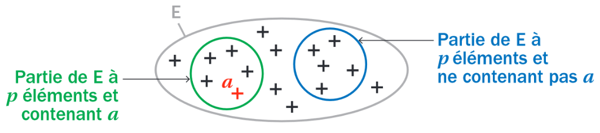

# Démonstration au programme

!!!- info "[Théorème : Relation de Pascal - Triangle de Pascal]"
    Pour tout $n \in \N$ et pour tout $p \in \N$ tel que $0\leq p \leq n$:

    \[
    \comb{n-1}{p-1}+\comb{n-1}{p} = \comb{n}{p}
    \]

???- abstract "Démonstration au programme"
    Pour tout $n \in \N$ et pour tout $p \in \N$ tel que $0\leq p \leq n$:
    
    \begin{eqnarray*}
    \comb{n-1}{p-1}+\comb{n-1}{p} & = & \dfrac{(n-1)!}{(n-1-(p-1))!(p-1)!} + \dfrac{(n-1)!}{(n-1-p))!p!}\\
    & = &  \dfrac{(n-1)!}{(n-1-p)!(n-1-(p-1))(p-1)!} + \dfrac{(n-1)!}{(n-1-p))!(p-1)!p}\\
    & = &  \dfrac{(n-1)!p}{(n-1-p)!(n-1-(p-1))(p-1)!p} + \dfrac{(n-1)!(n-1-(p-1))}{(n-1-p))!(n-1-(p-1))(p-1)!p}\\
    & = &  \dfrac{(n-1)!p + (n-1)!(n-1-(p-1))}{(n-1-(p-1))!(p-1)!p}\\
    & = &  \dfrac{(n-1)!p + (n-1)!(n-1-p+1)}{(n-1-p+1)!p!}\\
    & = &  \dfrac{(n-1)!p + (n-1)!n-(n-1)!p}{(n-p)!p!}\\
    & = &  \dfrac{n!}{(n-p)!p!}\\
    & = & \comb{n}{p}
    \end{eqnarray*}

???- abstract "Une autre façon de le démontrer"
    Soit $E$ un ensemble à $n$ éléments.
    
    Exprimons de deux façons différentes le nombre de parties de $E$ à $p$ éléments.

    - Par définition, ce nombre de parties est égal à $\comb{n}{p}$
    - Notons $a$ l'un des éléments de l'ensemble $E$
    
    [{.Center .VignetteMed}](../Image/dem.png)

    Il y a deux catégories de sous-ensemble :
    
    - ceux qui contiennent $a$ : pour trouver leur nombre il faut déterminer le nombre de combinaison de $p-1$ éléments parmi les $n-1$ éléments restants, soit $\comb{n-1}{p-1}$
    - ceux qui ne contiennent pas $a$ : pour trouver leur nombre il faut déterminer le nombre de combinaison de $p$ éléments parmi les $n-1$ éléments restants, soit $\comb{n-1}{p}$
    
    Ces deux catégories sont disjointes, donc, d'après le principe additif, le nombre de parties de $E$ à $p$ éléments est $\comb{n-1}{p-1}+\comb{n-1}{p}$
    
    Donc $\comb{n}{p} =  \comb{n-1}{p-1}+\comb{n-1}{p}$
 
