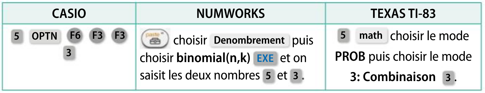
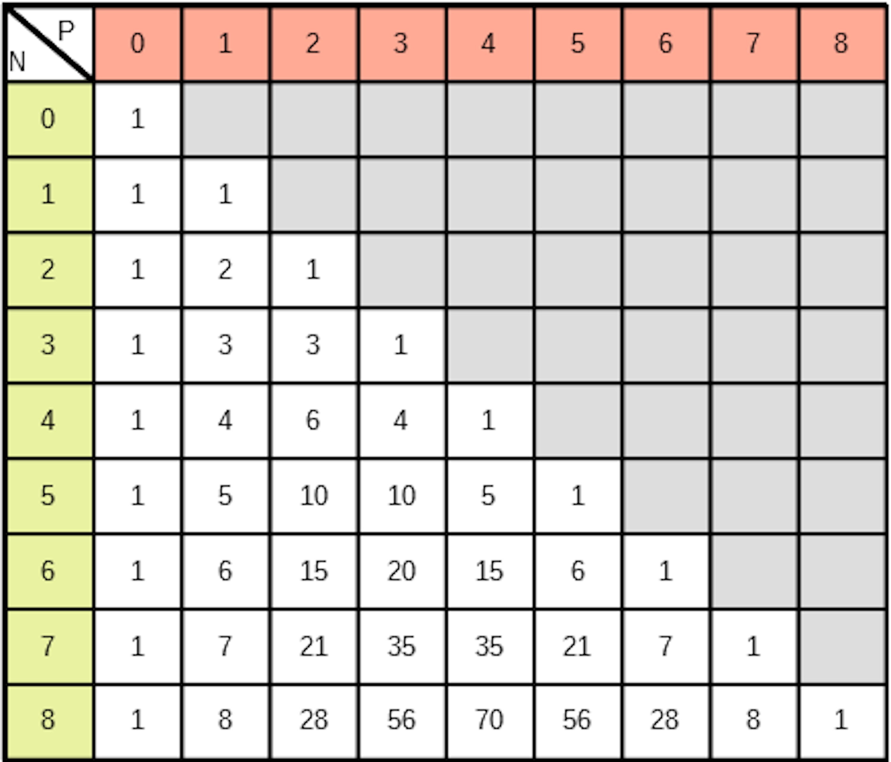

# Ensemble

## Vocabulaire

!!! info "Définition d'un ensemble"
    **Un ensemble** $E$ est une collection d'objets *distincts* $x$ qu'on appelle **éléments**.

    On dit alors $x$ appartient à $E$ et on le note $x \in E$.
    
    Le nombre d'éléments de $E$ s'appelle **le cardinal** de $E$ et se note $\text{card}(E)$.

???- example "Exemple"

    1. $E=\{a;b;c;d\}$ est un ensemble à 4 éléments. Donc $\text{card}(E)=4$.
    2. $\N$, $\Z$, $\R$ ou $\Q$ sont des ensembles de cardinal infini.
    3. L'ensemble vide noté $\emptyset$ est le seul ensemble qui ne contient aucun élément.


Lorsqu'un ensemble est décrit à l'aide de la collection de ses éléments, on dit qu'il est défini **en extension**. Dans ce cas, l'ordre n'a pas d'importance ( $\{a;b;c;d\} = \{b;d;a;c\}$ ) et il n'y a pas de répétition d'un élément.

!!! info "Partie d'un ensemble"
    On appelle **partie d'un ensemble** $\mathbf{E}$ (ou sous-ensemble de $E$) un ensemble $F$ tel que tous les éléments de $F$ appartiennent aussi à $E$.
    
    On dit alors que $F$ **est inclus** dans $E$ et on note $F \subset E$.

## Opération sur les ensembles

!!! info "Réunion d'ensembles"
    **La réunion** $\mathbf{A \cup B}$ de deux ensembles $A$ et $B$ est l'ensemble des éléments appartenant à $A$ ou (non exclusif) à $B$.

!!! info "Intersection d'ensembles"
    **L'intersection** $\mathbf{A \cap B}$ de deux ensembles $A$ et $B$ est l'ensemble des éléments appartenant à $A$ et $B$.

!!! info "Ensembles disjoints"
    Deux ensembles $A$ et $B$ dont l'intersection est vide sont dits **disjoints** et on écrit $A \cap B = \emptyset$.


!!! info "Complémentaire d'une partie"
    Soit $E$ un ensemble et $A$ une partie de $E$. On appelle **complémentaire de A dans E** et on note $\mathbf{\non{A}}$ l'ensemble qui contient tous les éléments de E *qui ne sont pas* dans $A$.

???- example "Exemple"
    Soit $A$ l'ensemble des nombres pairs entre $0$ et $20$ et $B$ l'ensemble des multiples de $3$ compris entre $0$ et $20$.

    1. Donner en extension les ensembles $A$ et $B$.
    2. Décrire en extension l'ensemble $C$ des multiple de $4$ compris enter $0$ et $20$. Est-ce une partie de $A$ ? de $B$ ?
    3. Décrire $A\cup B$.
    4. Décrire $A\cap B$. Que remarquez-vous ?
    5. Donner l'ensemble des éléments qui sont dans $B$ mais qui ne sont pas dans $A$. On note un tel ensemble $B\smallsetminus A$.

    ???- done "Réponse"

        1. $A=\{0;2;4;6;8;10;12;14;16;18;20\}$ et $B=\{0;3;6;9;12;15;18 \}$
        2. $C=\{0;4;8;12;16;20\} \subset A$. Mais ce n'est pas une partie de $B$.
        3. $A \cup B=\{ 0;2;3;4;6;8;9;10;12;14;15;16;18;20 \}$
        4. $A\cap B = \{ 0;6;12;18 \}$. Il s'agit de l'ensemble des multiples de $2 \times 3$ compris entre $0$ et $20$.
        5. $B \smallsetminus A=\{3;9;15\}$


## Le principe additif

!!! info "Le principe additif"

    Si $A$ et $B$ sont deux ensembles finis et disjoints :
    
    \[
    \text{card}(A \cup B) = \text{card}(A)+\text{card}(B)
    \]

    Ce théorème se généralise : soient $E_1, E_2, \ldots, E_n$ $n$ ensembles **deux à deux disjoints** (i.e. pour tout $i$ tel que $1\leq i \leq n$ et pour tout $j$ tel que $1\leq j \leq n$ et $i\neq j$, $E_i \cap E_j = \emptyset$) :

    \[
    \text{card}(E_1 \cup E_2 \cup \ldots \cup E_n) = \text{card}(E_1) + \text{card}(E_2) +\ldots \text{card}(E_n)
    \]

!!! info "Conséquence immédiate"

    Soient $A$ une partie d'un ensemble $E$ fini et $\non{A}$ le complémentaire de $A$ dans $E$.
    
    \[
    \text{card}\left( \non{A} \right) = \text{card}(E)-\text{card}(A)
    \]


???- example "Exemple"
    Soit $A=\{2;3;5;7\}$ et $B=\{0;4;8;12;16\}$. Déterminer le cardinal de $A \cup B$.
 
    ???- done "Réponse"
    
        Comme $A$ et $B$ sont disjoints, d'après le principe additif, card$(A \cup B)=\text{card}(A)+\text{card}(B)=4+5=9$


!!! info "Si $A$ et $B$ sont quelconques ... "
    Soit $A$ et $B$ deux ensembles, alors 
    
    \[
    \text{card}(A\cup B) = \text{card}(A) + \text{card}(B) - \text{card}(A \cap B)
    \]

## Le produit cartésien

!!! info "Un $\mathbf{p}$-uplet"
    On appelle **$\mathbf{p}$-uplet** ou **$\mathbf{p}$-liste** une collection **ordonnée** d'objets. Un $p$-uplet se note entre parenthèses. 

    Un 2-uplet s'appelle *un couple* et un 3-uplet *un triplet*. Par analogie à la géométrie repérée, on parle parfois de coordonnées (ou de composantes en physique).


???- example "exemple"
    Soit $E=\{a;b;c\}$. Dresser l'ensemble de tous les 2-uplets à partir des éléments de $E$.
 
    ???- done "Réponse" 
        Il s'agit de $\{(a;a),(a;b),(a;c),(b;a),(b;b),(b;c),(c;a),(c;b),(c;c)\}$.
  
 

!!! info "Le produit cartésien"
    $E,F$ et $G$ sont trois ensembles.
    
    - Le **produit cartésien de $\mathbf{E}$ par $\mathbf{F}$** est l'ensemble des *couples* $(a;b)$ où $a \in E$ et $b \in F$. Il est noté $E \times F$.

    \[
    E \times F = \{ (a;b) : a \in E \text{ et } b \in F \}
    \]

    - Le **produit cartésien $E\times F \times G$** est l'ensemble des *triplet* $(a;b;c)$ où $a \in E$, $b \in F$ et $c \in G$.

    \[
    E \times F \times G= \{ (a;b;c) : a \in E,\ b \in F \text{ et } c \in G \}
    \]

    - Le **produit cartésien $E_1 \times E_2 \times \ldots \times E_p$** de $p$ ensembles $E_1, E_2, \ldots , E_p$ est l'ensemble des *$p$-uplets* $(a_1;a_2; \ldots ; a_p)$ où $a_1 \in E_1,\ a_2 \in E_2, \ldots,\ a_p \in E_p$.
    
    \[
    E_1 \times E_2 \times \ldots \times E_p=\{ (a_1;a_2; \ldots ; a_p) : a_1 \in E_1,\ a_2 \in E_2, \ldots,\ a_p \in E_p \}
    \]

    
!!! tip "Notations"
    $E \times E$ est noté $E^2$ et $\underbrace{E \times E \times \ldots \times E}_{k \text{ fois}}$ est notée $E^k$.


## Le principe multiplicatif

!!! info "Le principe multiplicatif"
    $E_1, E_2, \ldots , E_p$ sont $p$ ensembles finis alors:

    \[
    \text{card}(E_1 \times E_2 \times \ldots \times E_p) = \text{card}(E_1) \times \text{card}(E_2) \times \ldots \text{card}(E_p)
    \]
    
    Cas particulier : si $E$ est un ensemble de cardinal $n$ et si $k \in \N^*$, alors card$(E^k)=n^k$.


???- example "exemple"
    En informatique, un bit est un $0$ ou un $1$. Combien de mots de 4 bits existe-t-il ?
 
    ???- done "Réponse" 
        Soit $E=\{0;1 \}$. On cherche le cardinal de $E^4$ qui est, d'après le principe multiplicatif, $2^4$.
  
 

???- example "exemple"
    Soit deux ensembles $E =\{ a;b \}$ et $F=\{1;2;3;4 \}$. Déterminer le nombre d'éléments de $E \cup F$ et de $E \times F$.
 
    ???- done "Réponse" 
        Comme $E$ et $F$ sont disjoints, donc, d'après le principe additif, card$(E \cup F)=\text{card}(E)+\text{card}(F)=2+4=6$.

        Par le principe multiplicatif, $\text{card}(E \times F) = \text{card}(E) \times \text{card}(F) = 2 \times 4 =8$
  
 

???- example "exemple"
    Un restaurant propose un menu &laquo; plat + dessert &raquo;.
    
    Un client qui décide de prendre ce menu doit choisir un plat parmi les trois viandes et les deux poissons proposés, puis un dessert parmi les quatre desserts proposés.

    Déterminer le nombre de choix différents permettant de construire son menu.

    ???- done "Réponse" 
        L'ensemble des viandes $V$ et des poissons $F$ sont disjoints et un plat se choisit dans l'ensemble $P=V \cup F$.
        
        Donc le nombre de plats différents est, d'après le principe additif, $3+2=5$.
        
        Le choix d'un menu est un couple du produit cartésien $P \times D$ (où $D$ est l'ensemble des desserts). Donc d'après le principe multiplicatif, $\text{card}(P \times D) = \text{card}(P) \times \text{card}(D)=5 \times 4=20$.
        
        Il y a donc 20 menus possibles.
  
## L'ensemble des parties d'un ensemble

!!! info "L'ensemble des parties"
    Soit $E$ un ensemble. **L'ensemble des parties** de $E$ se note $\mathcal{P}(E)$ et il contient toutes les parties de $E$ (ou tous les sous-ensembles de $E$).


!!! warning "Attention"
    Une évidence : $E \in \mathcal{P}(E)$ !

    De plus, l'ensemble vide est toujours un sous-ensemble d'un ensemble. 
    
    Ainsi $\mathcal{P}(E)$ n'est jamais vide puisque $\emptyset \in \mathcal{P}(E)$ et $E \in \mathcal{P}(E)$!

???- example "Exemple"
    Soit $E=\{ a;b;c\}$. Décrire $\mathcal{P}(E)$.
    
    ???- done "Réponse"
        $\mathcal{P}(E) = \{ \emptyset, \{a\}, \{b\}, \{c\}, \{a,b\}, \{a,c\}, \{b,c\}, E\}$

# Dénombrement

Pour compter le nombre d'éléments d'un ensemble, le principe additif et multiplicatif ne couvrent pas les situations les plus usuelles.

## Factorielle

!!! info "Factorielle"
    Soit $n \in \N$, on appelle **factorielle n** et on note $\mathbf{n!}$, le produit de tous les nombres entiers de $1$ à $n$.
    
    \[
    n! = 1 \times 2 \times \ldots \times n
    \]
 

???- example "Exemple"
    Calculer (sans calculatrice) et/ou simplifier les expressions suivantes :
    
    1. $5!$
    2. $\dfrac{10!}{8!}$
    3. $n!-(n-1)!$ pour tout $n>0$
    4. $\dfrac{n!}{(n-3)!}$ pour tout $n>2$
    
 
    ???- done "Réponse"

        1. $5!=120$
        2. $\dfrac{10!}{8!}=90$
        3. $n!-(n-1)! = (n-1)!(n-1)$
        4. $\dfrac{n!}{(n-3)!}=n \times (n-1) \times (n-2)$


!!!- info "Conséquence"
    
    - $0!=1$ (Convention)
    - Si $n \geq 1$, $n!=n\times (n-1)!$
    - $(n+1)!=(n+1) \times n!$


???- example "Exemple"
    Ecrire en python la fonction qui retourne factorielle $n$.
 
    ???- done "Réponse"

        ```python
        def fact(n):
            p=1
            for i in range(1,n+1):
                p=p*i
            return p

        n=int(input("Valeur de n ? "))
        print(fact(n))
        ```
 

## Nombre de p-uplets

!!!- info "Nombre de $p$-uplets"
    Le nombre de $p$-uplet d'un ensemble à $n$ éléments est $n^p$.

    On rappelle qu'un $p$-uplet est une liste (donc **on tient compte de l'ordre**) de $p$ éléments (**pas forcément distincts**).

???- example "Exemple" 
    On lance 7 fois une pièce de 1 euro pour jouer à pile ou face. Déterminer le nombre de résultats possibles.
 
    ???- done "Réponse"
        $E=\{ P;F \}$. Exemple d'un résultat : $(P;F;F;F;P;F;P)$. La répétition est possible (i.e tous les éléments de la liste ne sont pas forcément distincts) et l'ordre est important !
    
        On s'intéresse aux $7$-uplets de $E$ ou (ce qui est équivalent) au nombre d'élément de $E^7$.
        
        Il y a donc $2^7=128$ résultats possibles.
 
???- example "Exemple"
    Combien de numéros de téléphone commençant par $06$ existe-t-il ? Commençant par $06$ ou $09$ ?
 
    ???- done "Réponse"
        $E=\{0;1;2;3;4;5;6;7;8;9 \}$. La répétition est possible et l'ordre est important.

        On s'intéresse aux $8$-uplets de $E$. Il y a donc $10^8$ numéros possibles.

        Soit $F$ (respectivement $G$) l'ensemble des numéros commençant par $06$ (resp. par $09$). $F$ et $G$ sont disjoints, donc $\text{card}(F \cup G) = \text{card}(F)+\text{card}(G)=10^8+10^8=2\times 10^8$.
 
???- example "Exemple"
    Un immeuble est protégé par un digicode. Ce code peut être constitué de quatre, cinq ou six chiffres allant de 0 à 9, puis d'une lettre sélectionnée parmi les lettres $A,B$ et $C$. Combien de codes peut-on former avec ce système ?
 
    ???- done "Réponse"
        Notons $A_4$ (respectivement $A_5$, $A_6$) l'ensemble des codes à $4$ chiffres (resp. $5$ et $6$ chiffres) et d'une lettre.

        - $\text{card}(A_4)=\text{card}\left( \{0;1;2;3;4;5;6;7;8;9\}^4 \times \{ A;B;C\} \right) = 10^4 \times 3$
        - $\text{card}(A_5)=\text{card}\left( \{0;1;2;3;4;5;6;7;8;9\}^5 \times \{ A;B;C\} \right) = 10^5 \times 3$
        - $\text{card}(A_6)=\text{card}\left( \{0;1;2;3;4;5;6;7;8;9\}^6 \times \{ A;B;C\} \right) = 10^6 \times 3$

        L'ensemble de codes possibles est donc $A_4 \cup A_5 \cup A_6$.

        Comme $A_4,A_5$ et $A_6$ sont deux à deux disjoints, il y a $\text{card}(A _4 \cup A_5 \cup A_5) = \text{card}(A_4)+\text{card}(A_5)+\text{card}(A_6) = 3\ 333\ 000$ codes possibles.
 
 

## Nombre de p-uplets d'éléments *distincts* ou arrangement

!!!- info "Nombre d'arrangements"
    Le nombre de $p$-uplets d'éléments distincts d'un ensemble à $n$ éléments est $\dfrac{n!}{(n-p)!}$.


???- tip "Vocabulaire hors programme"
    Un $p$-uplets d'éléments **distincts** d'un ensemble à $n$ éléments s'appelle aussi *un arrangement de $p$ éléments parmi $n$*.


???- example "Exemple"
    Le tableau final d'un tournoi de judo féminin met en présence quinze athlètes. Le palmarès désigne la gagnante, ainsi que les $2^\text{e}$, $3^\text{e}$, $4^\text{e}$ et $5^\text{e}$ au classement final.
    
    Combien de palmarès différents peut-il exister ?
 
    ???- done "Réponse"
        Soit $E$ l'ensemble de 15 participants. Comme l'ordre est important et qu'un même participant ne peut pas occuper deux places différentes, on recherche le nombre de $5$-uplets d'éléments distincts parmi les 15 participants. Le nombre de palmarès est donc $\dfrac{15!}{(15-5)!}=15 \times 14 \times 13 \times 12 \times 11 = 360\ 360$.
 
 

???- example "Exemple"
    Dans le championnat de France de rugby, composé de 14 équipes, les six premières équipes qui ont le plus de points à la fin des matches aller-retour passent à la deuxième phase du championnat.

    1. Combien de classements composés des six équipes qui atteignent la deuxième phase sont possibles ?
    2. Lors de la saison 2018-2019, c'est le Stade Toulousain qui a fini premier de la phase régulière.  
    Combien de classements composés des six premières équipes de cette phase régulière étaient possibles alors possibles avec le Stade Toulousain en tête ?

 
    ???- done "Réponse"

        1. Comme il n'y a pas de répétitions et que l'ordre est important, il faut trouver le nombre de $6$-uplets parmi les 14 équipes : $\dfrac{14!}{(14-6)!}=14 \times 13 \times 12 \times 11 \times 10 \times 9 = 2\ 162\ 160$.
        2. Il ne reste que 13 équipes pour 5 places : $\dfrac{13!}{(13-5)!}=13 \times 12 \times 11 \times 10 \times 9 = 154\ 400$.

???- example "Exemple"
    Donner l'ensemble des $3$-uplets d'éléments distincts de l'ensemble $E=\{ a;b;c\}$.
 
    ???- done "Réponse"
        Il s'agit de $\{ (a;b;c); (a;c;b); (b;a;c); (b;c;a); (c;a;b); (c;b;a); \}$
 
 

!!!- info "Corollaire et définition"
    Un $n$-uplets d'éléments distincts d'un ensemble $E$ à $n$ éléments est **une permutation de $E$**. Le nombre de ces permutations est donc $n!$ (ce que confirme la formule $\dfrac{n!}{(n-n)!}=\dfrac{n!}{1}=n!$).

???- example "Exemple"
    Dans une classe de terminale, cinq élèves n'ont pas encore été évalués à l'oral. Dans combien d'ordre différents le professeur peut-il les interroger, chaque élève n'étant interrogé qu'une et une seule fois ?
    
    Combien y a-t-il de possibilités s'il n'a le temps d'interroger que trois d'entre eux ?
 
    ???- done "Réponse"
        Soit $E$ l'ensemble des 5 élèves. On cherche le nombre de permutations de $E$ qui est $5!=120$.
        
        On cherche par contre ici les $3$-uplets d'éléments distincts parmi les 5. Il y en a $\dfrac{5!}{(5-3)!}=5 \times 4 \times 3 = 60$.
 
 
## Nombre de parties ou combinaison d'un ensemble fini

On rappelle qu'une partie d'un ensemble est un sous-ensemble : il n'y a donc pas de répétition possible et l'ordre importe peu.

!!!- info "Nombre de parties"
    Soit $E$ un ensemble fini à $n$ éléments. Le nombre de parties de $E$ est $2^n$.

???- abstract "Démonsrtation"
    Soit $A$ une partie de $E$. Construire une telle partie c'est associé le nombre 1 aux éléments  de $E$ qui sont dans $A$ et $0$ aux autres. Il y a donc autant de parties de $E$ que de $n$-uplets de $\{0;1\}$


!!! info "Une combinaison"
    Soit $E$ un ensemble fini à $n$ éléments et $k$ un entier naturel inférieur ou égal à $n$. Une **combinaison** de $k$ éléments de $E$ est une partie de $E$ de cardinal $k$ (on parle alors de combinaisons de $k$ éléments parmi $n$).
    
    Une combinaison est un ensemble : il n'y a donc pas d'ordre et pas de répétitions.

!!!- info "Nombre de combinaison"
    Le nombre de combinaisons de $k$ ($0\leq k \leq n$) éléments parmi $n$ est noté $\comb{n}{k}$ et vaut $\dfrac{n!}{(n-k)!k!}$.

    \[
    \comb{n}{k} = \dfrac{n!}{(n-k)!k!} = \dfrac{\overbrace{n \times (n-1) \times (n-2) \times \ldots \times (n-k+1)}^{k \text{ facteurs }}}{k!}
    \]


???- example "Exemple"
    On dispose d'un jeu de $32$ cartes, toutes différentes. Une &\laquo; main &\raquo; de $4$ cartes est un ensemble de $4$ cartes dont l'ordre n'importe pas.
    
    Combien de &\laquo; mains &\raquo; de 4 cartes peut-on former ?
 
    ???- done "Réponse"
        Une &\laquo; main &\raquo; est une combinaison de $4$ éléments parmi $32$. il y a donc 

        \begin{eqnarray*}
        \comb{32}{4} & = & \dfrac{32!}{(32-4)!4!}\\
        & = & \dfrac{32!}{28!4!}\\
        & = & \dfrac{32 \times 31 \times 30 \times 29}{4 \times 3 \times 2 \times 1}\\
        & = & 35\ 960
        \end{eqnarray*}

 
 
!!! tip "Utilisation de la calculatrice"

    [{.Center_lien .VignetteMed }](../Image/Comb.png)

???- example "Exemple"
    Calculer sans calculatrice :

    1. $\comb{7}{3}$
    2. $\comb{12}{0}$
    3. $\comb{11}{1}$
    4. $\comb{6}{6}$
    5. $\comb{8}{7}$
    6. $\comb{20}{12}$ (Utilisez une calculatrice)

 
    ???- done "Réponse"
        
        1. $\comb{7}{3} = \dfrac{7!}{(7-3)!3!}=\dfrac{7 \times 6 \times 5}{3 \times 2 \times 1} = 35$
        2. $\comb{12}{0}=\dfrac{12!}{(12-0)!0!}=1$
        3. $\comb{11}{1}=\dfrac{11!}{(11-1)!1!}=11$
        4. $\comb{6}{6}=\dfrac{6!}{(6-6)!6!}=1$
        5. $\comb{8}{7}=\dfrac{8!}{(8-7)!7!}=8$
 

!!!- info "Cas particulier à retenir"
    Pour tout $n \in \N$:
 
    1. $\comb{n}{0}=\comb{n}{n}=1$
    2. $\comb{n}{1}=\comb{n}{n-1}=n$
    3. et pour tout $k \in \N$ tel que $0\leq k \leq n$ : $\comb{n}{k} = \comb{n}{n-k}$  (symétrie)

???- example "Exemple"

    1. En utilisant les résultats de l'exemple précédent, calculer $\comb{7}{4}$.
    2. Déterminer $\comb{5}{k}$ pour tout $k \in \N$, $0\leq k \leq 5$.

 
    ???- done "Réponse"

    1. $\comb{7}{4}=\comb{7}{7-3}=\comb{7}{3}=35$
    2. $\comb{5}{0}=\comb{5}{5}=1$, $\comb{5}{1}=\comb{5}{4}=5$  
    $\comb{5}{3}=\comb{5}{2}=\dfrac{5!}{(5-2)!2!}=\dfrac{5 \times 4}{2\times 1}=10$

 
 

!!!- info "Théorème : Relation de Pascal - Triangle de Pascal"
    Pour tout $n \in \N$ et pour tout $p \in \N$ tel que $0\leq p < n$:

    \[
    \comb{n-1}{p-1}+\comb{n-1}{p} = \comb{n}{p}
    \]

    Cette relation permet la construction du **triangle de Pascal** :

    [{.Center_lien .Vignette}](../Image/TrianglePascalgif.gif)


???- example "Exemple : Différentes situations classiques et dénombrement"
    Une urne contient 5 jetons numérotés de 1 à 5.
    
    1. On tire 3 jetons simultanément et on s'intéresse au numéro des jetons obtenus. Quel est l'univers ? Quel est le cardinal de cet univers ?
    2. On tire successivement 3 jetons sans remise et on s'intéresse au numéro des jetons obtenus. Quel est l'univers ? Quel est le cardinal de cet univers ?
    3. On tire 3 jetons avec remise et on s'intéresse au numéro des jetons obtenus. Peut-on énumérer l'univers ? Quel est le cardinal de cet univers ?

    ???- done "Réponse"
    
        <ol><li> $\Omega_S=\{ \{1,2,3\} ; \{1,2,4\} ; \{1,2,5\} ; \{1,3,4\} ; \{1,3,5\} ; \{1,4,5\} ; \{2,3,4\} ; \{2,3,5\} ; \{2,4,5\} ; \{3,4,5\} \}$.  
            Card$(\omega_S)=10$.  
            L'ordre n'a pas d'importance et la répétition n'est pas possible ! On retrouve le nombre de parties à 3 éléments de l'ensemble $\{1;2;3;4;5 \}$ qui est le nombre de combinaison de 3 parmi 5 : 

            \[
            \comb{5}{3} = \dfrac{5!}{(5-3)!3!} = \dfrac{5 \times 4 \times 3}{3 \times 2 \times 1} = 10
            \]

        </li><li>
            $\Omega_{sr} = \{$(1,2,3) ; (1,3,2) ; (2,1,3) ; (2,3,1) ; (3,1,2) ; (3,2,1) ;  
            (1,2,4) ; (1,4,2) ; (2,1,4) ; (2,4,1) ; (4,1,2) ; (4,2,1) ;  
            (1,2,5) ; (1,5,2) ; (2,1,5) ; (2,5,1) ; (5,1,2) ; (5,2,1) ;  
            (1,3,4) ; (1,4,3) ; (3,1,4) ; (3,4,1) ; (4,1,3) ; (4,3,1) ;  
            (1,3,5) ; (1,5,3) ; (3,1,5) ; (3,5,1) ; (5,1,3) ; (5,3,1) ;  
            (1,4,5) ; (1,5,4) ; (4,1,5) ; (4,5,1) ; (5,1,4) ; (5,4,1) ;  
            (2,3,4) ; (2,4,3) ; (3,2,4) ; (3,4,2) ; (4,2,3) ; (4,3,2) ;  
            (2,3,5) ; (2,5,3) ; (3,2,5) ; (3,5,2) ; (5,2,3) ; (5,3,2) ;  
            (2,4,5) ; (2,5,4) ; (4,2,5) ; (4,5,2) ; (5,2,4) ; (5,4,2) ;  
            (3,4,5) ; (3,5,4) ; (4,3,5) ; (4,5,3) ; (5,3,4) ; (5,4,3) $\}$
    
        Card$(\Omega_{sr})=60$. L'ordre est important et pas de répétition. On retrouve le nombre $3$-uplets d'éléments distincts de l'ensemble $E=\{1;2;3;4;5 \}$ qui est $\dfrac{5!}{(5-3)!}=5 \times 4 \times 3 =60$.

        </li><li> Cette fois, il y en a beaucoup ! Pour trouver son cardinal, il faut comprendre que l'on recherche le nombre de d'éléments de $E^3$, soit $5^3=125$.</li>
        </ol>
 
# Démonstration au programme

!!!- info "[Théorème : Relation de Pascal - Triangle de Pascal]"
    Pour tout $n \in \N$ et pour tout $p \in \N$ tel que $0\leq p < n$:

    \[
    \comb{n-1}{p-1}+\comb{n-1}{p} = \comb{n}{p}
    \]

???- abstract "Démonstration au programme"
    Pour tout $n \in \N$ et pour tout $p \in \N$ tel que $0\leq p \leq n$:
    
    \begin{eqnarray*}
    \comb{n-1}{p-1}+\comb{n-1}{p} & = & \dfrac{(n-1)!}{(n-1-(p-1))!(p-1)!} + \dfrac{(n-1)!}{(n-1-p)!p!}\\
    & = &  \dfrac{(n-1)!}{(n-1-p)!(n-1-(p-1))(p-1)!} + \dfrac{(n-1)!}{(n-1-p)!(p-1)!p}\\
    & = &  \dfrac{(n-1)!p}{(n-1-p)!(n-1-(p-1))(p-1)!p} + \dfrac{(n-1)!(n-1-(p-1))}{(n-1-p)!(n-1-(p-1))(p-1)!p}\\
    & = &  \dfrac{(n-1)!p + (n-1)!(n-1-(p-1))}{(n-1-(p-1))!(p-1)!p}\\
    & = &  \dfrac{(n-1)!p + (n-1)!(n-1-p+1)}{(n-1-p+1)!p!}\\
    & = &  \dfrac{(n-1)!p + (n-1)!n-(n-1)!p}{(n-p)!p!}\\
    & = &  \dfrac{n!}{(n-p)!p!}\\
    & = & \comb{n}{p}
    \end{eqnarray*}

???- abstract "Une autre façon de le démontrer"
    Soit $E$ un ensemble à $n$ éléments.
    
    Exprimons de deux façons différentes le nombre de parties de $E$ à $p$ éléments.

    - Par définition, ce nombre de parties est égal à $\comb{n}{p}$
    - Notons $a$ l'un des éléments de l'ensemble $E$
    
    [{.Center_lien .VignetteMed}](../Image/dem.png)

    Il y a deux catégories de sous-ensemble :
    
    - ceux qui contiennent $a$ : pour trouver leur nombre il faut déterminer le nombre de combinaison de $p-1$ éléments parmi les $n-1$ éléments restants, soit $\comb{n-1}{p-1}$
    - ceux qui ne contiennent pas $a$ : pour trouver leur nombre il faut déterminer le nombre de combinaison de $p$ éléments parmi les $n-1$ éléments restants, soit $\comb{n-1}{p}$
    
    Ces deux catégories sont disjointes, donc, d'après le principe additif, le nombre de parties de $E$ à $p$ éléments est $\comb{n-1}{p-1}+\comb{n-1}{p}$
    
    Donc $\comb{n}{p} =  \comb{n-1}{p-1}+\comb{n-1}{p}$  
 

