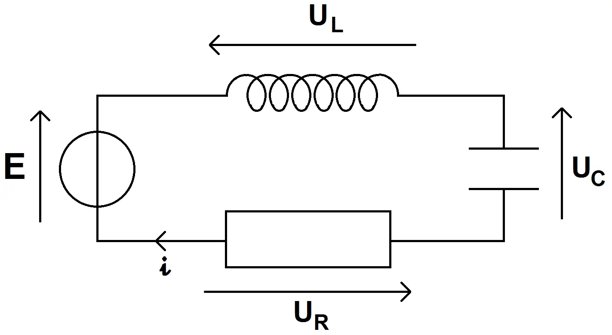
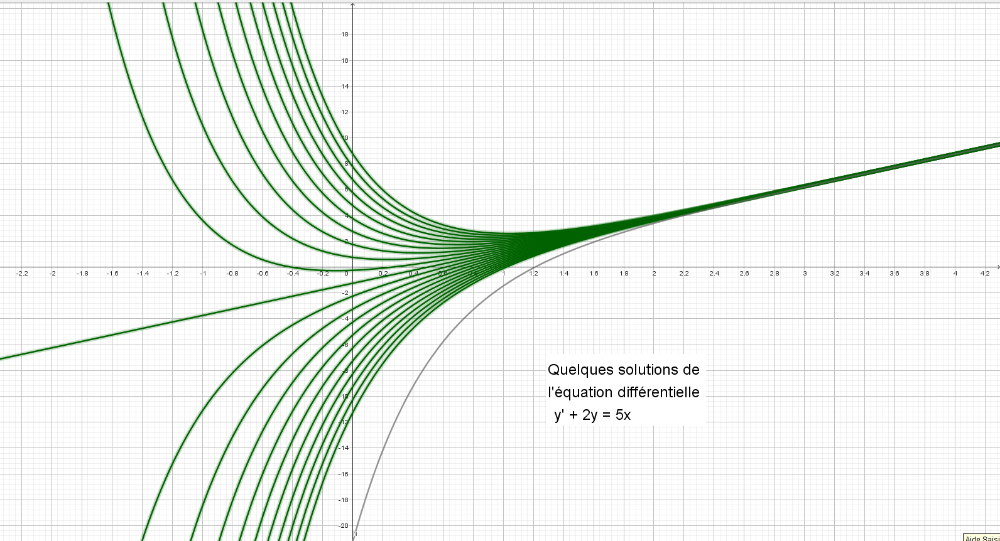

# Equation différentielle : Définition

!!! info "Défintion d'une équation différentielle"
    On appelle **équation différentielle** une équation dont l'inconnue est *une fonction* notée $y$ dans laquelle apparaissent une ou plusieurs dérivées successives de $y$ (dont peut-être $y$) et éventuellement d'autres fonctions.

    Une fonction qui vérifie une équation différentielle est une **solution** de l'équation différentielle.

???+ example "Premiers exemples"
    Si un circuit constitué d'une résistance $R$, d'un condensateur de capacité $C$ est soudainement connecté à une tension constante $E$. On commence l'étude du circuit au moment où la tension apparaît, en supposant que le condensateur est initialement vide. Alors la tension $u_c$ aux bornes du condensateur vérifie :

    \[
        \displaystyle u_{c}'(t) + \dfrac{1}{RC} u_{c}(t) - \dfrac{E}{RC} = 0
    \]

    [{.Center_lien .VignetteMed .Im_retaille}](../Image/RC01.png)
    
???+ example "Premiers exemples"
    Décharge d'un condensateur : si un circuit constitué d'une résistance $R$, d'un condensateur de capacité $C$ et d'une bobine d'inductance $L$ est monté en série aux bornes d'un générateur fournissant une tension variable $f(t)$, la charge $Q(t)$ du condensateur vérifie l'équation :

    \[
    LQ''(t) + RQ'(t) + \dfrac{1}{C}Q(t) = f(t)
    \]
    
    [{.Center_lien .VignetteMed .Im_retaille}](../Image/RLC01.png)

???+ example "Premiers exemples"
    Si une masse $m$ est suspendue à un ressort ayant un coefficient de rappel $F$ et un amortissement constant $k$, sa position $h(t)$ vérifie l'équation

    \[
        m \times h''(t)+k\times h′(t)+F\times h(t)=0
    \]

    [{.Center_lien .Vignette .Im_cache .Im_retaille}](../Image/ressort.gif)

    

    [Source wikipédia](https://fr.wikipedia.org/wiki/Syst%C3%A8me_masse-ressort)
    

???+ example "Premiers exemples"
    Un pendule, constitué d'une petite bille, se meut dans un plan vertical au bout d'une fine tige rigide de longueur l dont l'autre extrémité est fixe. Notons $\Theta(t)$ l'angle de la tige repéré depuis la position d'équilibre. $Theta(t)$ vérifie l'équation ($g$ désigne l'accélération de la pesanteur) :

    \[
        \Theta''(t) = −\dfrac{g}{l} \sin⁡ (\Theta(t)) 
    \]

    [{.Center_lien .Vignette .Im_retaille}](../Image/Pendulum.gif)

    

    [Source wikipédia](https://fr.wikipedia.org/wiki/Pendule_simple)
    

    

???- tip "Notation en physique"
    En sciences physiques, la variable est souvent le temps. Elle est donc alors notée $t$. Les fonctions sont parfois notées $x(t)$. L'inconnue d'une telle équation différentielle est alors notée $x$ (mais elle représente bien une fonction). La dérivée de cette inconnue est alors notée $x'$ et la dérivée seconde $x''$.

???- tip "Notation différentielle"
    En raison de ces différentes variables, il est possible d'utiliser la notation différentielle $\dfrac{\dx[ ]}{\dx}$.
    
    $LQ''(t) + RQ'(t) + \dfrac{1}{C}Q(t) = f(t)$ se note alors $L\dfrac{\dxx[Q]}{\dx[t]^2}(t) + R \dfrac{\dx[Q]}{\dx[t]}(t) + \dfrac{1}{C}Q(t) = f(t)$.
    
    $x''+2x'-x=2t$ se note alors $\dfrac{\dxx}{\dx[t]^2}(t) + 2 \dfrac{\dx}{\dx[t]}(t)-x(t)= 2t$.

!!! danger "Méthode"
    Pour montrer qu'une fonction $f$ est solution, il suffit de remplacer l'inconnue (souvent $y$) par $f$ dans le &laquo; membre de gauche &raquo;, de faire les calculs (dérivations et opérations) et de vérifier que le résultat est bien égal au &laquo; au membre de droite &raquo;.

???- example "Exemple"
    Soit $f(x)=30\ex^{5x}+10$ définie sur $\R$. Montrer que $f$ est une solution de l'équation différentielle :
    
    \[
    y'-5y=-50 \quad (E)
    \]

    ???- done "Réponse"
        $f'(x)=150\ex^{5x}$.
        
        \begin{eqnarray*}
        f'(x)-5f(x) & = & 150\ex^{5x}-5(30 \ex^{5x}+10)\\
        & = & -50
        \end{eqnarray*}
        
        Donc $f$ est une solution de $y'-5y=-50$.

???- example "Exemple"
    Ex 1, 2 p.226

<!--
\begin{exple}[Pour aller plus loin]
\begin{enumerate}
\item Soit $f(x)=\cos \left( 3x +\dfrac{\pi}{6} \right)$. Montrer que $f$ est une solution de l'équation différentielle :
\[ y'' + 9y=0 \]
\item Soit $g(x)=2\cos (3x)- 5\sin (3x)$. Montrer que $g$ est une solution de l'équation différentielle :
\[ y'' + 9y=0 \]
\end{enumerate}
\end{exple}

\begin{Solub}
\begin{enumerate}
\item $f'(x) = -3\sin \left( 3x +\dfrac{\pi}{6} \right)$ et $f''(x)=-9\cos \left( 3x +\dfrac{\pi}{6} \right)$
\begin{eqnarray*}
f''(x)+9f(x) & = & -9\cos \left( 3x +\dfrac{\pi}{6} \right) + 9 \times \cos \left( 3x +\dfrac{\pi}{6} \right)\\
 & = & 0
\end{eqnarray*}
Donc $f$ est une solution de $y''+9y=0$.
\item $g'(x)=-6\sin(3x)-15\cos (3x)$ et $g''(x)=-18\cos(3x)+45\sin (3x)$.
\begin{eqnarray*}
g''(x)+9g(x) & = & -18\cos(3x)+45\sin (3x) + 9\left( 2\cos (3x)- 5\sin (3x) \right) \\
& = & 0
\end{eqnarray*}
Donc $g$ est une solution de $y''+9y=0$.
\end{enumerate}
\end{Solub}-->

???- tip "Une infinité de solution"
    Une équation différentielle linéaire possède une infinité de solution.

    Cas d'une équation différentielle linéaire :

    Les fonctions de la formes $f(x)=C \times \ex^{-\dfrac{1}{2}x} + 5x-10$ où $C$ est un réel quelconque sont toutes des solutions de $2y'+y=5x$.

    

    
    [{.Center_lien .VignetteMed}](https://www.geogebra.org/m/juupw9cp)

    [Lien vers un image plus grande](../Image/Eq_diff_ggb01.png){.Print_eff}

    <!--<iframe scrolling="no" title="Eq diff linéaire" src="https://www.geogebra.org/material/iframe/id/z28bfpau/width/1296/height/500/border/888888/sfsb/true/smb/false/stb/false/stbh/false/ai/false/asb/false/sri/false/rc/false/ld/false/sdz/false/ctl/false" width="1296px" height="500px" style="border:0px;"> </iframe>-->

    

<!--\begin{exple}
Cas d'une équation différentielle non linéaire (hors programme) :

Les fonctions de la formes $f(x)=C \times x^2$ où $C$ est un réel quelconque sont toutes des solutions de $x \times y' -2y=0$.
\begin{eqnarray*}
x \times f'(x)-2f(x) & = & x \times 2\times C \times x -2 \times x^2 \\
 & = & 0\\
\end{eqnarray*}

\begin{center}
\begin{tikzpicture}[line cap=round,line join=round,>=triangle 45,x=2.0cm,y=0.5cm]
\draw[->,color=black] (-3.5,0) -- (3,0);
\foreach \x in {-3,-2.5,-2,-1.5,-1,-0.5,0.5,1,1.5,2,2.5}
\draw[shift={(\x,0)},color=black] (0pt,2pt) -- (0pt,-2pt) node[below] {\footnotesize $\x$};
\draw[->,color=black] (0,-8) -- (0,10);
\foreach \y in {-8,-6,-4,-2,2,4,6,8}
\draw[shift={(0,\y)},color=black] (2pt,0pt) -- (-2pt,0pt) node[left] {\footnotesize $\y$};
\draw[color=black] (0pt,-10pt) node[right] {\footnotesize $0$};
\clip(-3.5,-8) rectangle (3,10);

\draw [line width=2pt,domain=-3.4:2.9] plot(\x,{-3*\x*\x});
\draw [line width=2pt,domain=-3.4:2.9] plot(\x,{-2*\x*\x});
\draw [line width=2pt,domain=-3.4:2.9] plot(\x,{-1*\x*\x});
\draw [line width=2pt,domain=-3.4:2.9] plot(\x,{-0*\x*\x});
\draw [line width=2pt,domain=-3.4:2.9] plot(\x,{1*\x*\x});
\draw [line width=2pt,domain=-3.4:2.9] plot(\x,{2*\x*\x});
\draw [line width=2pt,domain=-3.4:2.9] plot(\x,{3*\x*\x});
%\draw[line width=2pt] plot[raw gnuplot, id=func0] function{set samples 100; set xrange [-3.4:2.9]; plot -3*x**2};
%\draw[line width=2pt] plot[raw gnuplot, id=func1] function{set samples 100; set xrange [-3.4:2.9]; plot -2*x**2};
%\draw[line width=2pt] plot[raw gnuplot, id=func2] function{set samples 100; set xrange [-3.4:2.9]; plot -x**2};
%\draw[line width=2pt] plot[raw gnuplot, id=func3] function{set samples 100; set xrange [-3.4:2.9]; plot 0*x**2};
%\draw[line width=2pt] plot[raw gnuplot, id=func4] function{set samples 100; set xrange [-3.4:2.9]; plot x**2};
%\draw[line width=2pt] plot[raw gnuplot, id=func5] function{set samples 100; set xrange [-3.4:2.9]; plot 2*x**2};
%\draw[line width=2pt] plot[raw gnuplot, id=func6] function{set samples 100; set xrange [-3.4:2.9]; plot 3*x**2};
\begin{scriptsize}
\draw[color=black] (-1.42,-7.76) node {$-3x^2$};
\draw[color=black] (-2.17,-7.68) node {$-2x^2$};
\draw[color=black] (-2.79,-6.81) node {$-x^2$};
\draw[color=black] (-3.32,-0.55) node {$0x^2$};
\draw[color=black] (-3.12,8.17) node {$x^2$};
\draw[color=black] (-2.26,8.6) node {$2x^2$};
\draw[color=black] (-1.61,9.42) node {$3x^2$};
\end{scriptsize}
\end{tikzpicture}\\
Les solutions à $xy'-2y=0$
\end{center}

\end{exple}-->
