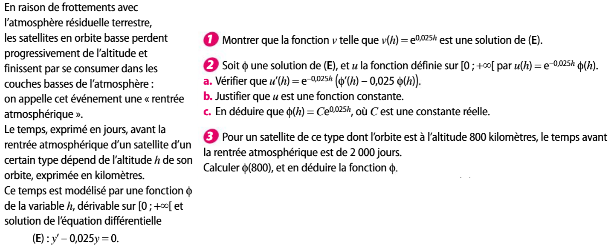
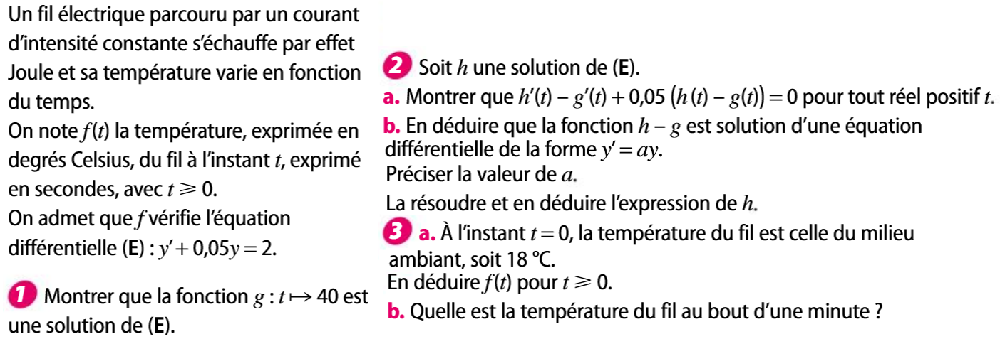

# Equation différentielle du premier ordre

!!! tip "cas particulier"
    Soit $f$ une fonction continue sur $I$. Résoudre l'équation différentielle $y'=f$ revient à chercher les primitives de $f$ ! 

???- example "Exemple"
    Situation 1 p. 210

## Equations différentielles $y'=ay$ {data-toc-label="Equations différentielles y'=ay"}

???- example "Exemple - découverte"

    

    ???- done "Réponse"
        AFAIRE

!!! info "Solution à $y'=ay$"
    Soit $a$ un réel.
    
    L'ensemble des solutions dans $\R$ de l'équation différentielle $y'=ay$ est l'ensemble des fonctions $x \mapsto C\ex^{ax}$, où $C$ est une constante réelle quelconque.

???- example "Exemple"

    1. Résoudre $(E)$ $y'=5y$.
    2. En déduire la solution $f$ de $E$ telle que $f(1)=-2$.

???- example "Exemple"
    
    1. Résoudre $(E)$ $2y'+3y=0$.
    2. En déduire la solution $f$ de $E$ telle que $f(0)=0.5$.

???- example "Exemple"
    Ex 21, 23, 28 p. 228

## Equations différentielles $y'=ay+b$ {data-toc-label="Equations différentielles y'=ay+b"}

???- example "Découverte"

    

!!! info "Solution à $y'=ay+b$"
    Soit $a$ et $b$ des réels, $a$ non nul.
    
    L'ensemble des solutions dans $\R$ de l'équation différentielle $(E)$ $y'=ay+b$ est l'ensemble des fonctions $x \mapsto h(x)+g(x)$ où 
    
    - $h$ est une solution de $y'=ay$, donc $h(x)=C\ex^{ax}$
    - $g$ est une solution particulière de $y'=ay+b$; ici on choisit la solution constante $g(x)=-\dfrac{b}{a}$

???- tip "Bilan"
    Soit $a$ et $b$ des réels, $a$ non nul.
    
    Les solutions sur $\R$ de l'équation différentielle $(E)$ $y'=ay+b$ sont les fonctions $f(x) = C\ex^{ax} - \dfrac{b}{a}$.
    

???- example "Exemple"

    1. Résoudre $(E)$ $y'=5y+10$.
    2. En déduire la solution $f$ de $E$ telle que $f(1)=-2$.

???- example "Exemple"
    
    1. Résoudre $(E)$ $2y'+3y=10$.
    2. En déduire la solution $f$ de $E$ telle que $f(0)=0.5$.

???- example "Exemple"
    Ex 29,30,31,32, 35 p. 229

## Equations différentielles $y'=ay+f$, où $f$ est une fonction {data-toc-label="Equations différentielles y'=ay + f, où f est une fonction"} 

!!! info "Méthode importante"
    Soit $a$ un réel et $f$ une fonction définie sur un intervalle $I$.
    
    Toute solution dans $I$ de l'équation différentielle $(E)$ $y'=ay+f$ est la somme d'une solution quelconque de l'équation $y'=ay$ et d'une solution particulière de l'équation $(E)$.

???- example "Exemple"
    Soit l'équation différentielle $(E)$ $y'=y+x-3$

    1. Montrer que la fonction $g$ définie sur $\R$ par $g(x)=-x+2$ est une solution de $(E)$.
    2. En déduire toutes les solutions de $(E)$

???- example "Exemple"
    Ex 37,38,39,40
    Ex 61,64, 62
    Méthode d'Euler p. 222

