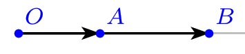
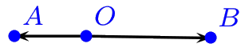
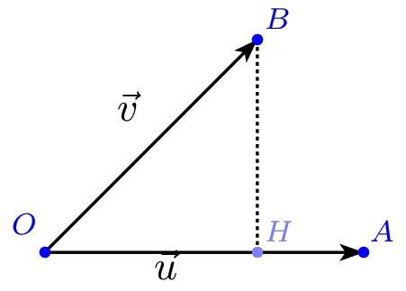

# Produit scalaire dans le plan

## Rappels sur le produit scalaire dans le plan

### Définition

!!! info "Formules du produit scalaire"
    Etant donnés deux vecteurs  $\dvec{u}$ et $\dvec{v}$ alors le produit scalaire de $\dvec{u}$ par $\dvec{v}$ est un nombre réel noté $\dvec{u}\cdot  \dvec{v}$ .

    - Si $\dvec{u}$ et $\dvec{v}$ sont deux vecteurs non nuls tels que  tels que $\dvec{u}=\dvec{OA}$ ,$\dvec{v}=\dvec{OB}$ (avec $O$,$A$ ,$B$ trois points du plan)  alors ,
        - Si $\dvec{u}$ et $\dvec{v}$ sont colinéaires et de même sens alors $\dvec{u}\cdot  \dvec{v}=OA\times OB$.
        
        [{.Center_lien .Vignette}](./Image/Im02.png)

        - Si $\dvec{u}$ et $\dvec{v}$ sont colinéaires et de  sens contraire alors $\dvec{u}\cdot  \dvec{v}=-OA\times OB$.

        [{.Center_lien .Vignette}](./Image/Im03.png)

    - Dans le cas où $\dvec{u}=\dvec{0}$ ou $\dvec{v}=\dvec{0}$ alors on pose $\dvec{u}\cdot  \dvec{v}=0$.

!!! tip "Notation &laquo; au carré &raquo;"
    Le produit scalaire de $\dvec{u}$ par $\dvec{u}$ est aussi noté $ \dvec{u}^2$ , c'est-à-dire que l'on écrit $\dvec{u}\cdot \dvec{u}=   \dvec{u}^2$.

!!! info "Rappel : norme"
    $\|\dvec{u}\|$ est la norme du vecteur $\dvec{u}$.
    
    Si $\dvec{u}=\dvec{OA}$ alors la norme du vecteur $\dvec{u}$ est la longueur du segment $OA$ .
    
    Dans un repère orthonormal ,  si $\dvec{u}$ a pour coordonnées $(x;y)$ alors $\|\dvec{u}\|=\sqrt{x^2+y^2}$.

### Formules

!!! info "Produit scalaire et projeté orthogonal"
    Si $H$ est le projeté orthogonal de $B$ sur la droite $(OA)$ alors  $\dvec{u}\cdot  \dvec{v}=\V{OA}\cdot \V{OH}$.

    [{.Center_lien .Vignette}](./Image/Im04.png)

!!! info "Les trois  autres expressions du produit scalaire"
    - **Expression à  l'aide des normes et d'un angle**
        
        Si $\dvec{u}$ et $\dvec{v}$ sont non nuls du plan alors le \underline{produit scalaire} de $\V{u}$ et de $\V{v}$ est le nombre défini par :

        \[
        \dvec{u}\cdot  \dvec{v}=OA\times OB\times \cos(\dvec{OA},\dvec{OB})=\|\dvec{u}\|\times \|\dvec{v}\|\times \cos(\dvec{u},\dvec{v})
        \]

    - **Expression à  l'aide des normes**
        
        Soient $\V{u}$ et $\V{v}$ deux vecteurs du plan, le \underline{produit scalaire} de $\V{u}$ et de $\V{v}$ est le nombre défini par :
  
        \[
            \V{u}\cdot\V{v}=\frac{1}{2}\left({||\V{u}+\V{v}||}^2-{||\V{u}||}^2-{||\V{v}||}^2 \right)
        \]
 
    - **Expression analytique**
        
        Dans un repère **orthonormal** du plan, si  $\V{u}(x,y)$ et $\V{v}(x',y')$ sont  deux vecteurs du plan, le produit scalaire de $\V{u}$ et de $\V{v}$ le réel défini par :

        \[
            \V{u}\cdot\V{v}=xx'+yy'
        \]

### Propriété du produit scalaire

!!! info "Règles de calcul"
    $\vec{u}$, $\V{v}$ et $\V{w}$ sont trois vecteurs du plan et  $k$ est un réel

    - Le produit scalaire de deux vecteurs est symétrique c'est-à-dire $\V{u}\cdot\V{v}=\V{v}\cdot\V{u}$
    - Le produit scalaire de deux vecteurs est bilinéaire c'est-à-dire :
        - $(k\vec{u})\cdot\V{v}=k\V{u}\cdot\V{v}$
        - $\V{u}\cdot(\V{v}+\V{w})=\V{u}\cdot\V{v}+\V{u}\cdot\V{w}$

!!! info "Identités remarquables"

    - $(\V{u}+\V{v})^2=\V{u}^2+2\V{u}\cdot\V{v}+\V{v}^2$
    - $(\V{u}-\V{v})^2=\V{u}^2-2\V{u}\cdot\V{v}+\V{v}^2$
    - $(\V{u}+\V{v})\cdot(\V{u}-\V{v}) =\V{u}^2-\V{v}^2$

### Produit scalaire et orthogonalité

!!! info "Définition"
    Dire que deux vecteurs $\dvec{u}$ et $\dvec{v}$ sont orthogonaux signifie:
    
    - soit $\dvec{u}=\dvec{0}$ ou $\dvec{v}=\V{0}$ ;
    - soit  les droites (OA) et (OB) sont perpendiculaires  si $\V{u}=\V{OA}$ et $\V{v}=\V{OB}$ sont non nuls.

!!! info "Théorème"
    Deux vecteurs du plan  sont orthogonaux  si et seulement si $\V{u}.\V{v}=0$.

## Produit scalaire et géométrie analytique du plan

### Distance, équation d'un cercle

!!! info "Formule de la distance"
    Soit $\Oij$ un repère **orthonormal** du plan.
    
    Si $A$ et $B$ sont des points de coordonnées $(x_A,y_A)$ et $(x_B,y_B)$ alors 
    
    \[
        d(A,B)=AB=\sqrt{(x_B-x_A)^2+(y_B-y_A)^2}
    \]

???- info "Equation d'un cercle"
    Le cercle $C$ de centre $\Omega (a ,b)$ et de rayon $R$ a pour équation \[(x-a)^2+(y-b)^2=R^2\]

???- info "Caractérisation d'un cercle"
    Le cercle $\mathcal{C}$   de diamètre [AB] est l’ensemble des points $M$ du plan tels que :$\V{AM}\cdot \V{BM} =0$

### Equation d'une droite de vecteur normal $\vec{n}$

Le plan est muni d'un repère orthonormal $\Oij$.

!!! info "Définition d'un vecteur normal à un droite"
    Dire qu'un vecteur non nul $\V{n}$ est **normal à une droite** $D$ signifie que $\V{n}$ est
    orthogonal à un vecteur directeur de $D$.

!!! info "Caractérisation d'une droite **dans le plan**"
    $A$ est un point de $D$ et  $\V{n}$ un vecteur normal à $D$  ,alors **la droite $D$ est l’ensemble des points M tels que** $\mathbf{\vect{AM}\cdot \vect{n} = 0}$.

!!! info "Equation cartésienne d'une droite **dans le plan**"
    Une  droite $D$ du plan de vecteur normal $\V{n}(a;b)$ a **une équation cartésienne** de la forme $ax+by+c=0$ où $c$ est un nombre réel.

    Réciproquement : la droite $D$ d'équation cartésienne $ax+by+c=0$ avec $(a,b)\neq(0,0)$ admet le vecteur $\dvec{n}(a,b)$ pour vecteur normal.

???- info "Rappel : vecteur directeur"
    La droite $D$ d'équation cartésienne $ax+by+c=0$ avec $(a,b)\neq(0,0)$ a pour vecteur directeur $\vec{u}=(-b;a)$. Et réciproquement !

???- example "Exemple"
    Soit $\Oij$ un repère orthonormal du plan.
    
    On considère les points $A(1,3)$ , $B(2,5)$ et $C(-1,4)$.

    1. Déterminer une équation cartésienne de la droite $(AB)$ 
    2. Démontrer que le triangle  ABC est rectangle en $A$ et isocèle.
    3. Déterminer une équation du cercle circonscrit au triangle $ABC$.
    4. Déterminer une équation de la médiatrice de $[BC]$.

    ???- done "Réponse"
        1. **Méthode 1** 
            $\vect{AB} = (1,2)$ est un vecteur directeur de $(AB)$ ; donc une équation cartésienne de $(AB)$ est $2x-y+c=0$. Or $A(1,3)$ est un point de cette droite. Donc $2x_A-y_A+c=0$, d'où $c=1$. Donc l'équation cartésienne de la droite $(AB)$ est $2x-y+1=0$.

            **Méthode 2** 
            $\vect{AB} = (1,2)$ est un vecteur directeur de $(AB)$ ; donc $M(x;y)$ est un point de $(AB)$, si et seulement si $\vect{AM}$ et $\vect{AB}$ sont colinéaires. Ce qui équivaut à $1\times(y-3)-2\times(x-1)=0$, c'est-à-dire $-2x+y-1=0$.
        2. $AB^2=1^2+2^2=5$, $AC^2=(-1-1)^2+(4-3)^2=5$, donc $ABC$ est isocèle en A. 
            Comme $BC^2=(-1-2)^2+(4-5)^2=10=AB^2+AC^2$, d'après la réciproque du théorème de Pythagore, $ABC$ est rectangle en A.
        3. Comme $ABC$ est rectangle en $A$, son cercle circonscrit a pour diamètre son hypoténuse, donc pour centre $I\left( \dfrac{2+(-1)}{2} ; \dfrac{5+4}{2} \right)= \left( \dfrac{1}{2} ; \dfrac{9}{2} \right)$ et pour rayon $\dfrac{BC}{2}=\dfrac{\sqrt{10}}{2}$. D'où l'équation cartésienne du cercle :
            
            \[
                \left( x- \dfrac{1}{2} \right)^2 + \left(y - \dfrac{9}{2} \right)^2 = \dfrac{10}{4}
            \]

        4.  **Méthode 1** 
            Cette médiatrice $d$ est perpendiculaire à $(BC)$ et passe par $I$. Donc $\vect{BC}=(-3;-1)$ est un vecteur normal à $(d)$. Donc, son équation cartésienne est $-3x-y+c=0$. Or $I$ est un point de $(d)$, donc $-3 \times \dfrac{1}{2} -\dfrac{9}{2}+c=0$, d'où $c=6$.

            Donc une équation cartésienne de $(d)$ est $-3x-y+6=0$
            
            **Méthode 2** 
            Cette médiatrice $d$ est perpendiculaire à $(BC)$ et passe par $I$. Donc $\vect{BC}=(-3;-1)$ est un vecteur normal à $(d)$. Donc $M(x;y)$ est sur $d$ si et seulement si $\vect{IM} \cdot \vect{BC} =0$, c'est-à-dire $\left( x-\dfrac{1}{2} \right)\times (-3) + \left( y - \dfrac{9}{2} \right) \times (-1) =0$. D'où une équation cartésienne de $(d)$ :
            
            \[
                -3x-y +6=0
            \]

???- example "Exemple"
    Soit $\Oij$ un repère orthonormal du plan.
    
    On considère le cercle $\mathcal{C}$ de centre $\Omega (1;2)$ passant par $A(2;1)$.
    
    Déterminer l'équation de la tangente à $\mathcal{C}$ au point $A$.

    ???- done "Réponse"
        Cette tangente $(d)$ a pour vecteur normal $\vect{A\Omega}=(-1;1)$ et passe par $A(2;1)$Donc une équation cartésienne de $(d)$ est $(-1 \times(x-2)+1 \times (y-1)=0$, c'est-à-dire $-x+y+1=0$.
