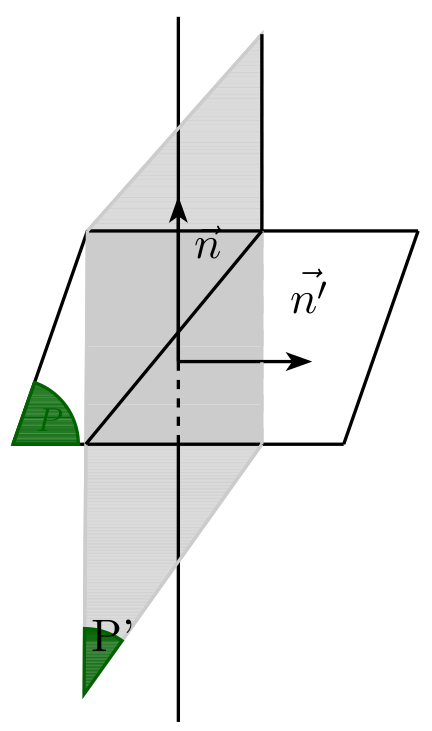
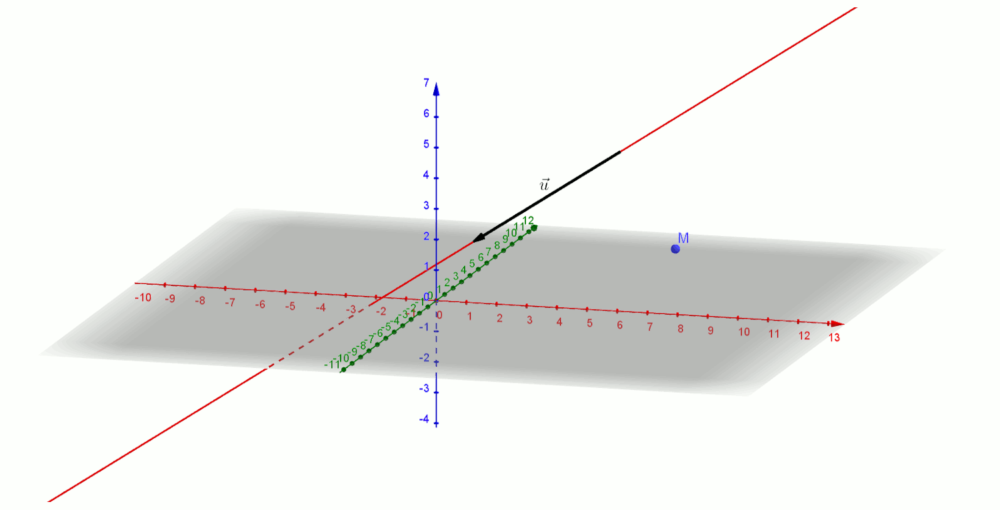

# Vecteur normal à un plan, plans perpendiculaires

## Vecteur normal

!!! info "Définition"
    Un vecteur non nul  $\dvec{n}$ est un vecteur normal à un plan $\mathcal{P}$ lorsque la droite de vecteur directeur $\dvec{n}$   est orthogonale  au plan  $\mathcal{P}$.

!!! tip "Conséquence"
    Si $\dvec{n}$  est orthogonal à un plan P alors $\dvec{n}$  est orthogonal à tous les vecteurs de ce plan et réciproquement **pour qu'un vecteur $\dvec{n}$ soit normal à un plan il suffit qu'il soit orthogonal à deux vecteurs d'une base (ou deux vecteurs non colinéaires) de $\mathcal{P}$**.

???- example "Exemple"
    On considère un cube $ABCDEFGH$.

    1. Justifier que $\V{AE}$ est normal au plan (ABC).
    2. En déduire la valeur de $\V{AE}\cdot\V{AC}$.
    3. Montrer que le vecteur $\V{AC}$ est normal au plan (BDH).

    [{.Center_lien .Vignette}](./Image/Im13.png)
    
    ???- done "Réponse"
        1. Le vecteur$\V{AE}$ est orthogonal aux vecteurs $\V{AB}$ et $\V{AD}$ , qui sont deux vecteurs non colinéaires du plan $(ABC)$.
        
        Donc $\V{AE}$ est normal au plan $(ABC)$.

        2. $A$ et $C$ étant dans le plan $ABC$ , le vecteur $\V{AE}$ est orthogonal au vecteur $\V{AC}$  donc $\V{AE}\cdot\V{AC}$.

        3. $\V{AE}=\V{DH}$ donc $\V{AC}$ est orthogonal au vecteur $\V{DH}$.
        
        De plus $\V{AC}$  est orthogonal au vecteur $\V{DB}$ car $(AC)$ et $(DB)$ sont les diagonales du carré $ABCD$.
        
        $\V{AC}$  est donc orthogonal aux vecteurs $\V{DH}$ et  $\V{DB}$ qui sont deux vecteurs non colinéaires du plan $(BDH)$.
        
        Donc $\V{AC}$  est normal au plan $(BDH)$.

!!! info "Caractérisation d'un plan"
    $\mathcal{P}$  est un plan ,$A$ un point de l'espace  et $\dvec{n}$ un vecteur non nul .
    
    L’ensemble des points M de l’espace tels que $\V{AM}\cdot \dvec{n}$ =0 est le plan $\mathcal{P}$ passant par $A$ et de vecteur normal $\dvec{n}$.

    [{.Center_lien .Vignette}](./Image/Im14.png)

!!! info "Orthogonalité de deux plans"
    $\mathcal{P}$ et $\mathcal{P’}$  sont deux plans de vecteurs normaux respectifs  $\dvec{n}$ et  $\dvec{n'}$ sont perpendiculaires lorsque $\dvec{n}$ et  $\dvec{n'}$ sont orthogonaux.

    [{.Center_lien .Vignette}](./Image/Im15.png)

## Projeté orthogonal

!!! info "Projeté orthogonal sur **une droite**"
    Le projeté orthogonal d'un point $M$ sur une droite $(d)$ est le point d'intersection de la droite $(d)$ et de la perpendiculaire à cette droite passant par le point $M$.

!!! tip "Méthode pour trouver un projeté orthogonal sur une droite"
    On considère une droite $(d)$ de vecteur directeur $\V{u}$ et un point $M$ extérieur à cette droite.

    Le projeté orthogonal de $M$ sur $(d)$ est l'intersection du plan normal à $\V{u}$ passant par $M$ avec la droite $(d)$.
    
    ???- tip "Construction"
        [{.Center_lien .VignetteMed}](./Image/proj_dte.gif)
    
        Ou [https://www.geogebra.org/m/qekbqjbt](https://www.geogebra.org/m/qekbqjbt) !

!!! info "Projeté orthogonal sur **un plan**"
    Le projeté orthogonal d'un point $M$ sur un plan $(P)$ est le point d'intersection du plan $(P)$ et de la perpendiculaire à ce plan passant par le point $M$.

!!! tip "Méthode pour trouver un projeté orthogonal sur un plan"
    On considère un plan $(P)$ de l'espace dont on connait un vecteur normal $\V{n}$ et un point $M$ extérieur au plan.

    Le projeté orthogonal de $M$ sur $(P)$ est l'intersection du plan $(P)$ et de la droite de vecteur $\V{n}$ passant par $M$.

