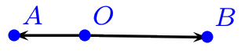
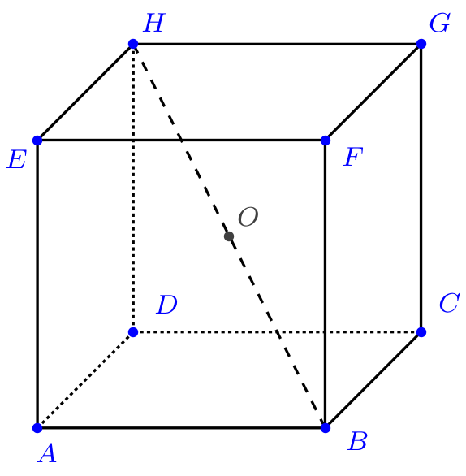
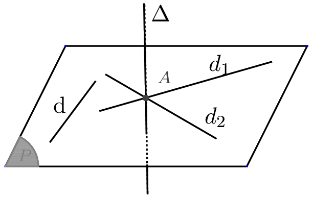
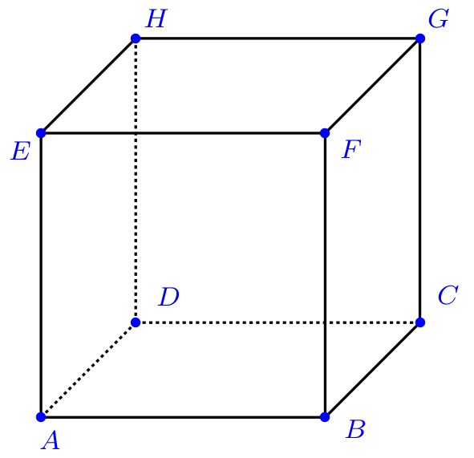

# Produit scalaire dans le plan

## Rappels sur le produit scalaire dans le plan

### Définition

!!! info "Formules du produit scalaire"
    Etant donnés deux vecteurs  $\dvec{u}$ et $\dvec{v}$ alors le produit scalaire de $\dvec{u}$ par $\dvec{v}$ est un nombre réel noté $\dvec{u}\cdot  \dvec{v}$ .

    - Si $\dvec{u}$ et $\dvec{v}$ sont deux vecteurs non nuls tels que  tels que $\dvec{u}=\dvec{OA}$ ,$\dvec{v}=\dvec{OB}$ (avec $O$,$A$ ,$B$ trois points du plan)  alors ,
        - Si $\dvec{u}$ et $\dvec{v}$ sont colinéaires et de même sens alors $\dvec{u}\cdot  \dvec{v}=OA\times OB$.
        
        [{.Center_lien .Vignette}](../Image/Im02.png)

        - Si $\dvec{u}$ et $\dvec{v}$ sont colinéaires et de  sens contraire alors $\dvec{u}\cdot  \dvec{v}=-OA\times OB$.

        [{.Center_lien .Vignette}](../Image/Im03.png)

    - Dans le cas où $\dvec{u}=\dvec{0}$ ou $\dvec{v}=\dvec{0}$ alors on pose $\dvec{u}\cdot  \dvec{v}=0$.

!!! tip "Notation &laquo; au carré &raquo;"
    Le produit scalaire de $\dvec{u}$ par $\dvec{u}$ est aussi noté $ \dvec{u}^2$ , c'est-à-dire que l'on écrit $\dvec{u}\cdot \dvec{u}=   \dvec{u}^2$.

!!! info "Rappel : norme"
    $\|\dvec{u}\|$ est la norme du vecteur $\dvec{u}$.
    
    Si $\dvec{u}=\dvec{OA}$ alors la norme du vecteur $\dvec{u}$ est la longueur du segment $OA$ .
    
    Dans un repère orthonormal ,  si $\dvec{u}$ a pour coordonnées $(x;y)$ alors $\|\dvec{u}\|=\sqrt{x^2+y^2}$.

### Formules

!!! info "Produit scalaire et projeté orthogonal"
    Si $H$ est le projeté orthogonal de $B$ sur la droite $(OA)$ alors  $\dvec{u}\cdot  \dvec{v}=\V{OA}\cdot \V{OH}$.

    [{.Center_lien .Vignette}](../Image/Im04.png)

!!! info "Les trois  autres expressions du produit scalaire"
    - **Expression à  l'aide des normes et d'un angle**
        
        Si $\dvec{u}$ et $\dvec{v}$ sont non nuls du plan alors le \underline{produit scalaire} de $\V{u}$ et de $\V{v}$ est le nombre défini par :

        \[
        \dvec{u}\cdot  \dvec{v}=OA\times OB\times \cos(\dvec{OA},\dvec{OB})=\|\dvec{u}\|\times \|\dvec{v}\|\times \cos(\dvec{u},\dvec{v})
        \]

    - **Expression à  l'aide des normes**
        
        Soient $\V{u}$ et $\V{v}$ deux vecteurs du plan, le \underline{produit scalaire} de $\V{u}$ et de $\V{v}$ est le nombre défini par :
  
        \[
            \V{u}\cdot\V{v}=\frac{1}{2}\left({||\V{u}+\V{v}||}^2-{||\V{u}||}^2-{||\V{v}||}^2 \right)
        \]
 
    - **Expression analytique**
        
        Dans un repère **orthonormal** du plan, si  $\V{u}(x,y)$ et $\V{v}(x',y')$ sont  deux vecteurs du plan, le produit scalaire de $\V{u}$ et de $\V{v}$ le réel défini par :

        \[
            \V{u}\cdot\V{v}=xx'+yy'
        \]

### Propriété du produit scalaire

!!! info "Règles de calcul"
    $\vec{u}$, $\V{v}$ et $\V{w}$ sont trois vecteurs du plan et  $k$ est un réel

    - Le produit scalaire de deux vecteurs est symétrique c'est-à-dire $\V{u}\cdot\V{v}=\V{v}\cdot\V{u}$
    - Le produit scalaire de deux vecteurs est bilinéaire c'est-à-dire :
        - $(k\vec{u})\cdot\V{v}=k\V{u}\cdot\V{v}$
        - $\V{u}\cdot(\V{v}+\V{w})=\V{u}\cdot\V{v}+\V{u}\cdot\V{w}$

!!! info "Identités remarquables"

    - $(\V{u}+\V{v})^2=\V{u}^2+2\V{u}\cdot\V{v}+\V{v}^2$
    - $(\V{u}-\V{v})^2=\V{u}^2-2\V{u}\cdot\V{v}+\V{v}^2$
    - $(\V{u}+\V{v})\cdot(\V{u}-\V{v}) =\V{u}^2-\V{v}^2$

### Produit scalaire et orthogonalité

!!! info "Définition"
    Dire que deux vecteurs $\dvec{u}$ et $\dvec{v}$ sont orthogonaux signifie:
    
    - soit $\dvec{u}=\dvec{0}$ ou $\dvec{v}=\V{0}$ ;
    - soit  les droites (OA) et (OB) sont perpendiculaires  si $\V{u}=\V{OA}$ et $\V{v}=\V{OB}$ sont non nuls.

!!! info "Théorème"
    Deux vecteurs du plan  sont orthogonaux  si et seulement si $\V{u}.\V{v}=0$.

## Produit scalaire et géométrie analytique du plan

### Distance, équation d'un cercle

!!! info "Formule de la distance"
    Soit $\Oij$ un repère **orthonormal** du plan.
    
    Si $A$ et $B$ sont des points de coordonnées $(x_A,y_A)$ et $(x_B,y_B)$ alors 
    
    \[
        d(A,B)=AB=\sqrt{(x_B-x_A)^2+(y_B-y_A)^2}
    \]

???- info "Equation d'un cercle"
    Le cercle $C$ de centre $\Omega (a ,b)$ et de rayon $R$ a pour équation \[(x-a)^2+(y-b)^2=R^2\]

???- info "Caractérisation d'un cercle"
    Le cercle $\mathcal{C}$   de diamètre [AB] est l’ensemble des points $M$ du plan tels que :$\V{AM}\cdot \V{BM} =0$

### Equation d'une droite de vecteur normal $\vec{n}$

Le plan est muni d'un repère orthonormal $\Oij$.

!!! info "Définition d'un vecteur normal à un droite"
    Dire qu'un vecteur non nul $\V{n}$ est **normal à une droite** $D$ signifie que $\V{n}$ est
    orthogonal à un vecteur directeur de $D$.

!!! info "Caractérisation d'une droite **dans le plan**"
    $A$ est un point de $D$ et  $\V{n}$ un vecteur normal à $D$  ,alors **la droite $D$ est l’ensemble des points M tels que** $\mathbf{\vect{AM}\cdot \vect{n} = 0}$.

!!! info "Equation cartésienne d'une droite **dans le plan**"
    Une  droite $D$ du plan de vecteur normal $\V{n}(a;b)$ a **une équation cartésienne** de la forme $ax+by+c=0$ où $c$ est un nombre réel.

    Réciproquement : la droite $D$ d'équation cartésienne $ax+by+c=0$ avec $(a,b)\neq(0,0)$ admet le vecteur $\dvec{n}(a,b)$ pour vecteur normal.

???- info "Rappel : vecteur directeur"
    La droite $D$ d'équation cartésienne $ax+by+c=0$ avec $(a,b)\neq(0,0)$ a pour vecteur directeur $\vec{u}=(-b;a)$. Et réciproquement !

???- example "Exemple"
    Soit $\Oij$ un repère orthonormal du plan.
    
    On considère les points $A(1,3)$ , $B(2,5)$ et $C(-1,4)$.

    1. Déterminer une équation cartésienne de la droite $(AB)$ 
    2. Démontrer que le triangle  ABC est rectangle en $A$ et isocèle.
    3. Déterminer une équation du cercle circonscrit au triangle $ABC$.
    4. Déterminer une équation de la médiatrice de $[BC]$.

    ???- done "Réponse"
        1. **Méthode 1** 
            $\vect{AB} = (1,2)$ est un vecteur directeur de $(AB)$ ; donc une équation cartésienne de $(AB)$ est $2x-y+c=0$. Or $A(1,3)$ est un point de cette droite. Donc $2x_A-y_A+c=0$, d'où $c=1$. Donc l'équation cartésienne de la droite $(AB)$ est $2x-y+1=0$.

            **Méthode 2** 
            $\vect{AB} = (1,2)$ est un vecteur directeur de $(AB)$ ; donc $M(x;y)$ est un point de $(AB)$, si et seulement si $\vect{AM}$ et $\vect{AB}$ sont colinéaires. Ce qui équivaut à $1\times(y-3)-2\times(x-1)=0$, c'est-à-dire $-2x+y-1=0$.
        2. $AB^2=1^2+2^2=5$, $AC^2=(-1-1)^2+(4-3)^2=5$, donc $ABC$ est isocèle en A. 
            Comme $BC^2=(-1-2)^2+(4-5)^2=10=AB^2+AC^2$, d'après la réciproque du théorème de Pythagore, $ABC$ est rectangle en A.
        3. Comme $ABC$ est rectangle en $A$, son cercle circonscrit a pour diamètre son hypoténuse, donc pour centre $I\left( \dfrac{2+(-1)}{2} ; \dfrac{5+4}{2} \right)= \left( \dfrac{1}{2} ; \dfrac{9}{2} \right)$ et pour rayon $\dfrac{BC}{2}=\dfrac{\sqrt{10}}{2}$. D'où l'équation cartésienne du cercle :
            
            \[
                \left( x- \dfrac{1}{2} \right)^2 + \left(y - \dfrac{9}{2} \right)^2 = \dfrac{10}{4}
            \]

        4.  **Méthode 1** 
            Cette médiatrice $d$ est perpendiculaire à $(BC)$ et passe par $I$. Donc $\vect{BC}=(-3;-1)$ est un vecteur normal à $(d)$. Donc, son équation cartésienne est $-3x-y+c=0$. Or $I$ est un point de $(d)$, donc $-3 \times \dfrac{1}{2} -\dfrac{9}{2}+c=0$, d'où $c=6$.

            Donc une équation cartésienne de $(d)$ est $-3x-y+6=0$
            
            **Méthode 2** 
            Cette médiatrice $d$ est perpendiculaire à $(BC)$ et passe par $I$. Donc $\vect{BC}=(-3;-1)$ est un vecteur normal à $(d)$. Donc $M(x;y)$ est sur $d$ si et seulement si $\vect{IM} \cdot \vect{BC} =0$, c'est-à-dire $\left( x-\dfrac{1}{2} \right)\times (-3) + \left( y - \dfrac{9}{2} \right) \times (-1) =0$. D'où une équation cartésienne de $(d)$ :
            
            \[
                -3x-y +6=0
            \]

???- example "Exemple"
    Soit $\Oij$ un repère orthonormal du plan.
    
    On considère le cercle $\mathcal{C}$ de centre $\Omega (1;2)$ passant par $A(2;1)$.
    
    Déterminer l'équation de la tangente à $\mathcal{C}$ au point $A$.

    ???- done "Réponse"
        Cette tangente $(d)$ a pour vecteur normal $\vect{A\Omega}=(-1;1)$ et passe par $A(2;1)$Donc une équation cartésienne de $(d)$ est $(-1 \times(x-2)+1 \times (y-1)=0$, c'est-à-dire $-x+y+1=0$.

# Produit scalaire de deux vecteurs de l'espace

## Définition

!!! info "Définition"

    $\V{u}$ et $\V{v}$ sont deux vecteurs de l’espace.

    A,B,C sont trois points de l’espace tels que   $\V{u}=\V{AB}$  et  $\V{v}=\V{AC}$
    Il existe toujours au moins un plan P contenant les  points A,B,C.

    Dans l’espace, le produit scalaire des vecteurs $\V{u}$ et $\V{v}$ est le produit scalaire   calculé dans le plan P.

Il en résulte que les expressions du produit scalaire établies dans le plan sont encore valables .

!!! info "Formules connues"
    - $\V{u}.\V{v}=AB\times AC \cos(\theta)$  avec $\theta= \widehat{BAC}$

        [{.Center_lien .Vignette}](../Image/Im06.png)

    - $\V{u}.\V{v}=\V{AB}\cdot\V{AH}$

        où $H$ est le projeté orthogonal de $C$ sur $(AB)$ c'est-à-dire le point d'intersection du plan $\mathcal{P'}$ passant par $C$ et orthogonal à la droite $(AB)$.

        [{.Center_lien .Vignette}](../Image/Im07.png)

    - Avec les normes (par exemple) : 
    
        \[
            \V{u}.\V{v}=\frac{1}{2}\left({||\V{u}+\V{v}||}^2-{||\V{u}||}^2-{||\V{v}||}^2 \right)
        \]
        
!!! info "Règles de calcul : comme dans le plan"
    $\V{u}$, $\V{v}$ et $\V{w}$ sont trois vecteurs de l'espace et  $k$ est un réel.

    - Le produit scalaire de deux vecteurs de l'espace est symétrique c'est-à-dire $\V{u}.\V{v}=\V{v}.\V{u}$.
    - Le produit scalaire de deux vecteurs de l'espace est bilinéaire c'est-à-dire :

        - $(k\V{u}).\V{v}=k\V{u}.\V{v}$
        - $\V{u}.(\V{v}+\V{w})=\V{u}.\V{v}+\V{u}.\V{w}$
        
    - $\V{u}\cdot\V{u}=\|\V{u}\|^2=\V{u}^2$
    - $(\V{u}+\V{v})^2=\V{u}^2+2\V{u}\cdot\V{v}+\V{v}^2$ ou $\|\V{u}+\V{v}\|^2=\|\V{u}\|^2+2\V{u}\cdot\V{v}+\|\V{v}\|^2$
    - z$(\V{u}-\V{v})^2=\V{u}^2-2\V{u}\cdot\V{v}+\V{v}^2$ ou $\|\V{u} - \V{v}\|^2=\|\V{u}\|^2-2\V{u}\cdot\V{v}+\|\V{v}\|^2$ 
    - $(\V{u}+\V{v})\cdot(\V{u}-\V{v}) =\V{u}^2-\V{v}^2=\|\V{u}\|^2-\|\V{v}\|^2$

???- example "Exemple"
    ABCDEFGH est un cube de centre O et d'arête $a$ .
    
    Calculer en fonction de $a$ , les produits scalaires suivants:

    1. $\V{AE}\cdot\V{BG}$
    2. $\V{HB}\cdot\V{BA}$
    3. $\V{AB}\cdot\V{AO}$

    [{.Center_lien .Vignette}](../Image/Im08.png)

    ???- done "Réponse"
        1. $\V{AE}\cdot \V{BG}=\V{AE}\cdot \V{AH}=AE\times AH\times  \cos(\widehat{EAH})=a\times a \sqrt{2}\times \dfrac{1}{\sqrt{2}}=a^2$.
        2.  $(AB)$ est orthogonale à deux droites sécantes ( $(AE)$ et $(AD)$) du plan $(AED)$. Donc $(AB)$ est orthogonale au plan $(AED)$. Elle est donc orthogonale à toutes les droites de $(AED)$, en particulier à $(AH)$.
        
            Le point $A$ est le projeté orthogonal de $H$ sur $(AB)$.
        
            Donc $\V{HB}\cdot\V{BA}=\V{AB} \cdot \V{BA}=-AB \times AB =-a^2$.
        3. Le projeté orthogonal de O sur $(AB)$ est le milieu $I$ du segment $[AB]$.
        
        Donc $\V{AB}\cdot\V{AO}=\V{AB}\cdot\V{AI}=AB\times AI=a\times\dfrac{a}{2}=\dfrac{a^2}{2}$.

!!!- info "Formule de polarisation"

    - $\V{u}.\V{v}=\frac{1}{2}\left({||\V{u}+\V{v}||}^2-{||\V{u}||}^2-{||\V{v}||}^2 \right)$
    - $\V{u}.\V{v}=\frac{1}{2}\left({||\V{u}||}^2+{||\V{v}||}^2 - ||\V{u}-\V{v}||^2\right)$
    - $\V{u}.\V{v}=\frac{1}{4}\left({||\V{u}+\V{v}||}^2 - ||\V{u}-\V{v}||^2\right)$

## Repère orthonormé

!!! info "Base orthonormé"
    Une **base orthonormée ou orthonormale** de l'espace est la donnée de trois vecteurs linéairement indépendants (ou non coplanaires) $\V{i}$, $\V{j}$ et $\V{k}$ tels que $\|\V{i}\| = \|\V{j}\| = \|\V{k}\| = 1$ et $\V{i} \cdot \V{j} =\V{j} \cdot \V{k} = \V{i} \cdot \V{k} =0$.

!!! info "Repère orthonormé"
    Un **repère orthonormée ou orthonormal** est un point $O$ et une base orthonormée $(\V{i},\V{j},\V{k})$. on le note alors : $\Oijk$.

!!! info "Formule du produit scalaire"
    On se place dans un repère orthonormé de l'espace \Oijk. Soient $\V{u}(x,y,z)$ et $\V{v}(x',y',z')$  deux vecteurs de l'espace, on a :

    \[
        \V{u}.\V{v}=xx'+yy'+zz' \quad \quad \text{et} \quad \quad  \|\V{u}\|=\sqrt{x^2+y^2+z^2}
    \]

???- example "Exemple"
    ABCDEFGH est un parallélépipède rectangle tel que $AD=AE=1$cm et $AB=2$cm.
    
    $I$ est le centre du carré $ADHE$ et $J$ est le milieu du segment $[GH]$.
    
    L'espace est rapporté au repère orthonormal $\left(A,\dfrac12\V{AB},\V{AD},\V{AE}\right)$.
    
    1. Donner sans justifier les coordonnées de $I,J,F$.
    2. Calculer $\V{JI}\cdot\V{JF}$.
    3. Déterminer l'arrondi au dixième de degré de l'angle $\widehat{IJF}$.

    [{.Center_lien .Vignette}](../Image/Im09.png)

    ???- done "Réponse"
        1. $I\left(0,\dfrac12,\dfrac12\right)$ , $J(1,1,1)$ et $F(2,0,1)$.
        2. $\V{JI}\left(-1,-\dfrac12,-\dfrac12\right)$ , $\V{JF}(1,-1,0)$ et donc $\V{JI}\cdot \V{JF}=-\dfrac12$.
        3. $\cos(\V{JI},\V{JF})=\dfrac{\V{JI}\cdot \V{JF}}{JI\times JF}$.
        
        Or $JI=\sqrt{(-1)^2+\left(-\dfrac12\right)^2+\left(-\dfrac12\right)^2}=\sqrt{\dfrac32}$ et $JF=\sqrt{2}$ donc $\cos(\V{JI},\V{JF})=\cos(\widehat{IJF})=-\dfrac{1}{2\sqrt{3}}$.

        On obtient :$\widehat{IJF}\approx106,8^{\circ}$.

## Orthogonalité dans l'espace

!!! info "Droites orthogonales"
    Deux droites sont dites orthogonales lorsque leurs parallèles respectives passant par un même point sont perpendiculaires.

!!! info "Droite orthogonale à un plan"
    Une droite est orthogonale à un plan lorsqu'elle est orthogonale à **deux droites sécantes** de ce plan.

!!! info "Vecteurs orthogonaux"
    Dire que deux vecteurs $\V{u}$  et $\V{v}$   sont orthogonaux et on note $\V{u}\perp \V{v}$ signifie :
    
    - soit que $\V{u}=\V{0}$ ou  $\V{v}=\V{0}$ 
    - soit les vecteurs $\V{u}$  et $\V{v}$ ( non nuls) sont les vecteurs directeurs de deux  droites  orthogonales.

!!! info "Caractérisation de l'orthogonalité"
    
    - Deux vecteurs $\V{u}$ et $\V{v}$    sont orthogonaux si et seulement si   $\V{u}\cdot\V{v}=0$  
    - Deux droites $D_1$ et $D_2$ de vecteurs directeurs $\V{u_1}$ et $\V{u_2}$ sont orthogonales si et seulement si  $\V{u_1}\cdot \V{u_2}=0$.
    - _Remarque_ : si un vecteur $\V{u}$ est orthogonal à tout vecteur , alors $\V{u}$ est le vecteur nul.

!!! info "Une équivalence à un sens pratique"
    Une droite est orthogonale à un plan si et seulement si elle est orthogonale à toute droite de ce plan.

    [{.Center_lien .Vignette}](../Image/Im10.png)

!!! tip "En pratique"
    Pour démontrer qu'une droite $\Delta$ est orthogonale à un plan $\mathcal{P}$, il suffit d'établir qu'elle orthogonale à deux droites sécantes de ce plan (d'après la définition) !

    Ainsi, pour démontrer qu'une droite $\Delta$ est orthogonale à un plan $\mathcal{P}$, il suffit d'établir qu'un vecteur directeur de $\Delta$ est orthogonal à une base (ou un couple de vecteurs directeurs) du plan $\mathcal{P}$.

???- example "Exemple"
    ABCDEFGH est un cube de côté 1.

    1. Donner les coordonnées des sommets du cube dans le repère orthonormé $(D;\V{DA} ; \V{DC} ; \V{DH})$
    2. Démontrer que les droites(DF) et (EB) sont orthogonales .
    3. Démontrer que la droite (DF) et le plan (EBG) sont orthogonaux.

    [{.Center_lien .Vignette}](../Image/Im11.png)

    ???- done "Réponse"
        1. D(0,0,0) ; A( 1,0,0) ; C(0,1,0) ; H(0,0,1) ; B(1,1,0) ; E( 1,0,1) ; G( 0,1,1)  ; F( 1,1,1)
        2. On va démontrer que les vecteurs $\V{DF}$ et $\V{EB}$ sont orthogonaux.

            $\V{DF}(1,1,1)$ et $\V{EB}(0,1,-1)$.

            Donc $\V{DF} \cdot\V{EB} = 0$.
            
            Ainsi les droites (DF) et (EB) sont orthogonales.

        3. On va démontrer que les vecteurs $\V{EB}$ et $\V{EG}$ sont orthogonaux au vecteur $\V{DF}$.
        
            $\V{EG} (-1,1,0)$  donc   $\V{DF}\cdot\V{EG}=0$.
            
            Les droites (DF) et (EG) sont orthogonales.
            
            La droite (DF) est orthogonale aux droites sécantes (EB) et (EG) du plan (EBG) donc la droite (DF) et le plan (EBG) sont orthogonaux.

# Vecteur normal à un plan, plans perpendiculaires

## Vecteur normal

!!! info "Définition"
    Un vecteur non nul  $\dvec{n}$ est un vecteur normal à un plan $\mathcal{P}$ lorsque la droite de vecteur directeur $\dvec{n}$   est orthogonale  au plan  $\mathcal{P}$.

!!! tip "Conséquence"
    Si $\dvec{n}$  est orthogonal à un plan P alors $\dvec{n}$  est orthogonal à tous les vecteurs de ce plan et réciproquement **pour qu'un vecteur $\dvec{n}$ soit normal à un plan il suffit qu'il soit orthogonal à deux vecteurs d'une base (ou deux vecteurs non colinéaires) de $\mathcal{P}$**.

???- example "Exemple"
    On considère un cube $ABCDEFGH$.

    1. Justifier que $\V{AE}$ est normal au plan (ABC).
    2. En déduire la valeur de $\V{AE}\cdot\V{AC}$.
    3. Montrer que le vecteur $\V{AC}$ est normal au plan (BDH).

    [{.Center_lien .Vignette}](../Image/Im13.png)
    
    ???- done "Réponse"
        1. Le vecteur$\V{AE}$ est orthogonal aux vecteurs $\V{AB}$ et $\V{AD}$ , qui sont deux vecteurs non colinéaires du plan $(ABC)$.
        
        Donc $\V{AE}$ est normal au plan $(ABC)$.

        2. $A$ et $C$ étant dans le plan $ABC$ , le vecteur $\V{AE}$ est orthogonal au vecteur $\V{AC}$  donc $\V{AE}\cdot\V{AC}$.

        3. $\V{AE}=\V{DH}$ donc $\V{AC}$ est orthogonal au vecteur $\V{DH}$.
        
        De plus $\V{AC}$  est orthogonal au vecteur $\V{DB}$ car $(AC)$ et $(DB)$ sont les diagonales du carré $ABCD$.
        
        $\V{AC}$  est donc orthogonal aux vecteurs $\V{DH}$ et  $\V{DB}$ qui sont deux vecteurs non colinéaires du plan $(BDH)$.
        
        Donc $\V{AC}$  est normal au plan $(BDH)$.

!!! info "Caractérisation d'un plan"
    $\mathcal{P}$  est un plan ,$A$ un point de l'espace  et $\dvec{n}$ un vecteur non nul .
    
    L’ensemble des points M de l’espace tels que $\V{AM}\cdot \dvec{n}$ =0 est le plan $\mathcal{P}$ passant par $A$ et de vecteur normal $\dvec{n}$.

    [{.Center_lien .Vignette}](../Image/Im14.png)

!!! info "Orthogonalité de deux plans"
    $\mathcal{P}$ et $\mathcal{P’}$  sont deux plans de vecteurs normaux respectifs  $\dvec{n}$ et  $\dvec{n'}$ sont perpendiculaires lorsque $\dvec{n}$ et  $\dvec{n'}$ sont orthogonaux.

    [{.Center_lien .Vignette}](../Image/Im15.png)

## Projeté orthogonal

!!! info "Projeté orthogonal sur **une droite**"
    Le projeté orthogonal d'un point $M$ sur une droite $(d)$ est le point d'intersection de la droite $(d)$ et de la perpendiculaire à cette droite passant par le point $M$.

!!! tip "Méthode pour trouver un projeté orthogonal sur une droite"
    On considère une droite $(d)$ de vecteur directeur $\V{u}$ et un point $M$ extérieur à cette droite.

    Le projeté orthogonal de $M$ sur $(d)$ est l'intersection du plan normal à $\V{u}$ passant par $M$ avec la droite $(d)$.
    
    ???- tip "Construction"
        [{.Center_lien .VignetteMed}](../Image/proj_dte.gif)
    
        Ou [https://www.geogebra.org/m/qekbqjbt](https://www.geogebra.org/m/qekbqjbt) !

!!! info "Projeté orthogonal sur **un plan**"
    Le projeté orthogonal d'un point $M$ sur un plan $(P)$ est le point d'intersection du plan $(P)$ et de la perpendiculaire à ce plan passant par le point $M$.

!!! tip "Méthode pour trouver un projeté orthogonal sur un plan"
    On considère un plan $(P)$ de l'espace dont on connait un vecteur normal $\V{n}$ et un point $M$ extérieur au plan.

    Le projeté orthogonal de $M$ sur $(P)$ est l'intersection du plan $(P)$ et de la droite de vecteur $\V{n}$ passant par $M$.

# Equation cartésienne du plan, distance

## Equation cartésienne

!!! info "Rappel"
    Un plan peut être déterminé par : 

    - Trois points A,B,C non alignés.
    - Deux droites sécantes (c’est à dire un point et deux vecteurs non colinéaires)
    - Deux droites strictement parallèles.

!!! info "Equation cartésienne d'un plan"
    Dans un repère orthonormal
    
    - Un plan $P$ de vecteur  normal $\V{n}(a,b,c)$ a **une équation cartésienne** de la forme $ax+by+cz+d=0$ où  $d$ est un réel. 
    - Réciproquement : l'ensemble des points $M(x,y,z)$ tels que $ax+by+cz+d=0$  avec $(a,b,c)\neq(0,0,0)$ est un plan qui a pour vecteur normal est $\V{n}(a,b,c)$.

???- tip "Equation de plans particuliers"

    - Le plan $(x O y)$  a pour équation cartésienne $z=0$.
    - Le plan $(xOz)$ a pour équation cartésienne $y=0$.
    - Le plan $(yOz)$ a pour équation cartésienne $x=0$.

???- example "Exemple"
    Chercher une équation du plan  $P$  de vecteur normal  $\V{n}(3,-2,1)$ et qui passe par le point $A(-1,2,-3)$.

    ???- done "Réponse"
        Une équation du  plan est $3x-2y+z+d=0$.
        
        Comme le plan passe par $A$ les coordonnées de $A$ vérifient l'équation du plan et on a : $-3-4 -3+d=0$ d'où $d= 10$. 
        
        **Une équation de $P$ est $3x-2y+z+10=0$**
 
        ???-tip "Autre méthode" 
            On peut aussi écrire que $\V{AM}\cdot \V{n}=0$ ...

???- example "Exemple"
    Dans un repère orthonormal de l'espace on donne les trois points  $A(0,1,-1) , B(2,1,-2)$ et $C(1,0,-2)$.

    1. Démontrer que ces trois points déterminent un plan 
    2. Déterminer un vecteur $\V{n}$ normal du plan (ABC)
    3. Déterminer une équation du plan (ABC)

    ???- done "Réponse"

        <ol>
        <li>Les trois points sont non alignés car $\V{AB} (2,0,-1)$et $\V{AC}  (1,-1,-1)$  sont non colinéaires. Donc ils déterminent un plan.</li>
        <li>On cherche $\V{n}(x,y,z)$ tel que $\V{n}\cdot \V{AB}=0$ et $\V{n}\cdot \V{AC}=0$ \cad on cherche $x,y,z$ tels que

        \[
            \left\lbrace
            \begin{array}{l}
            2x-z=0   \\
            x-y-z=0   
            \end{array}
            \right.
        \]

           En posant $x=1$ , on a $y=-1$ et $z=2$.

           Un vecteur normal au plan (ABC) est $\V{n}(1,-1,2)$.</li>
        <li>Une équation de (ABC) est $x-y+2z+d=0$  or $A \in (ABC)$ donc $d=+3$ ;
        
        Une équation de $(ABC)$ est : $x-y+2z+3=0$.</li>
        </ol>

???- example "Exemple"
    On considère le plan $\mc{P}$ d'équation $3x+y-z-2=0$.
    
    Déterminer les coordonnées du projeté orthogonal du point $A(5;1;3)$ sur le plan $\mc{P}$.

## Distance d'un point à une droite ou à un plan

### Distance entre un point et un plan

!!! info "Distance point-plan"
    Soient $\mc{P}$ un plan de l'espace et $A$ un point.
    La **distance du point A au plan** $\mathbf{\mc{P}}$, notée $d(A, \mc{P})$, est la plus petite des longueurs $AM$ où $M \in \mc{P}$.

!!! info "Comment calculer cette distance ?"
    Si on note $H$ le projeté orthogonal de $A$ sur le plan $\mc{P}$, alors $d(A, \mc{P}) = AH$.

???- example "Exemple"
    On se place dans un repère orthonormé.

    Déterminer la distance entre $A(-1;3;2)$ et $\mc{P}$ : $x-3y+2z-4=0$.

    ???- done "Réponse"
        Soient $H(x_H;y_H;z_H)$ le projeté orthogonal de $A$ sur $\mc{P}$ et $\V{n}(1;-3;2)$ un vecteur normal à $\mc{P}$.

        - $H$ est un point de $\mc{P}$ donc $x_H-3y_H+2z_H-4=0$
        - $H$ est sur la droite $(AH)$ passant par $A$ et dirigée par $\V{n}$. Ainsi, une représentation paramétrique de cette droite $(AH)$ est 

        \[
            \left\lbrace
            \begin{array}{lr}
            x = -1 + t\\
            y = 3 -3t\ ,\qquad t\in \R \\
            z = 2+ 2t
            \end{array}
            \right.
        \]

        Comme $H$ est cette droite et sur le plan $\mc{P}$,

        \[
            \left\lbrace
            \begin{array}{lr}
            x_H = -1 + t\\
            y_H = 3 -3t\ ,\qquad \text{ pour un } t \in \R \\
            z_H = 2+ 2t
            x_H-3y_H+2z_H-4=0
            \end{array}
            \right.
        \]

        On résout $t-1-3(-3t+3)+2(2t+2)-4=0$. On trouve $t = \dfrac{5}{7}$. D'où :

        \[
            \left\{
            \begin{array}{l}
            x_H  =  -\dfrac{2}{7}\\
            y_H  =  \dfrac{6}{7}\\
            \rule[-0.5cm]{0pt}{1.2cm}z_H  =  \dfrac{24}{7}
            \end{array}
            \right.
        \]

        Donc, d'après le théorème, la distance entre $A$ et $\mc{P}$ est la longueur $AH = \sqrt{}AH=\sqrt{\left( -\dfrac{2}{7} +1\right)^2 + \left( \dfrac{6}{7} -3\right)^2+\left( \dfrac{24}{7} -2\right)^2}=\sqrt{\dfrac{50}{7}}=5\dfrac{\sqrt{14}}{7}$.

### Distance entre un point et une droite

!!! info "Distance point-droite"
    Soit $(d)$ une droite de l'espace et $A$ un point. La **distance du point $\mathbf{A}$ à la droite $\mathbf{(d)}$**, notée $d(A, d)$, est la plus petite des longueurs $AM$ où $M \in (d)$.

!!! tip "Comment calculer cette distance ?"
    Si on note $H$ le projeté orthogonal de $A$ sur la droite $(\Delta)$, alors $d(A, \Delta)=AH$.

???- example "Exemple"
    On se place dans un repère orthonormé.
    
    Soit $(d)$ la droite passant par $I(1;0;-1)$ et dirigée par $\V{u}(2;-1;1)$. Déterminer la distance entre $A(2;-1;2)$ et la droite $(d)$.

    ???- done "Réponse"
        Notons $H$ le projeté orthogonal de $A$ sur $(d)$.
        
        Et soit $(P)$ le plan passant par $A$ et ayant pour vecteur normal $\V{u}(2;-1;1)$. Donc $\mc{P}$ a pour équation cartésienne $2(x-2)-(y+1)+(z-2)=0$, c'est-à-dire $2x-y+z-7=0$. Or $H$ appartient à ce plan $\mc{P}$. Donc $2x_H-y_H+z_H-7=0$.

        $H$ est un point de $(d)$ qui a pour équation paramétrique $\left\lbrace \begin{array}{lr} x = 1 + 2t\\ y=-t \ \quad t \in \R\\ z = -1+t \end{array}\right.$

        Les coordonnées de $H$ vérifient : $\left\{\begin{array}{l} 2x_H-y_H+z_H-7=0 \\ x_H  =  1 + 2t\\ y_H  =  -t \\ z_H   = -1 + t \end{array} \right.$.

        On résout : $2(2t+1)-(-t)+(t-1)-7=0$. On trouve $t = 1$. D'où :

        \[
            \left\{
            \begin{array}{l}
            x_H  =  3\\
            y_H  =  -1 \\
            z_H  =  0
            \end{array}
            \right.
        \]

        Or d'après le théorème précédent, la distance entre $A$ et la droite $(d)$ est la longueur $AH$.

        Donc $d(A, d)= \displaystyle\sqrt{\left( 3-2\right)^2+\left( -1+1\right)^2+\left( 0-2\right)^2} = \sqrt{5}$.

