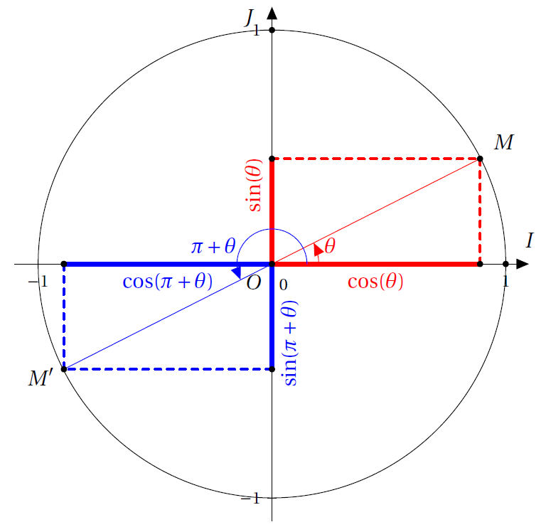

# Fonction trigonométrique

## Fonctions sinus et cosinus

### Définitions

!!! info "Définition"
    On se place dans le repère $\rep$. Soit $x$ un réel, il lui correspond un unique point $M$ de $(\mathcal{C})$ tel que $x$ soit une mesure en radians de $(\widehat{\V{OA}, \V{OM}})$.
    <ul>
    <li> Le **cosinus** de $x$, noté $\cos x$, est l'abscisse de $M$ dans le repère $\rep$.</li>
    <li> La fonction $x\mapsto \cos x$ définie sur $\R$ est appelé **fonction cosinus** et notée $\cos$.</li>
    <li> Le **sinus** de $x$, noté $\sin x$, est l'ordonnée de $M$ dans le repère $\rep$.</li>
    <li> La fonction $x\mapsto \sin x$ définie sur $\R$ est appelé **fonction sinus** et notée $\sin$.</li>
    </ul>

[{.Center_lien .VignetteMed .Im_retaille30}](../Image/Im01.png)

 $M\Coor{\cos x}{\sin x}$

???- tip Print_eff "Geogebra" 

    <iframe scrolling="no" title="Def trigo" src="https://www.geogebra.org/material/iframe/id/gpjtwczx/width/1306/height/556/border/888888/sfsb/true/smb/false/stb/false/stbh/false/ai/false/asb/false/sri/false/rc/false/ld/false/sdz/false/ctl/false" width="1306px" height="556px" style="border:0px;"> </iframe>

!!! info "Formules"
    <ul>
    <li> $\cos^{2}x + \sin^{2}x=1$</li>
    <li> $-1 \leqslant \cos x \leqslant 1$ et $-1 \leqslant \sin x \leqslant 1$</li>
    </ul>
 

### Valeurs remarquables

!!! info "Valeur remarquable : à connaitre par c&#0156;ur"

    

    | $x$ | $0$ | $\dfrac{\pi}{6}$ | $\dfrac{\pi}{4}$ | $\dfrac{\pi}{3}$ | $\dfrac{\pi}{2}$ | $\pi$ |
    |:---:|:---:|:---:|:---:|:---:|:---:|:---:|
    |$\sin x$ | $0$ | $\dfrac{1}{2}$ | $\dfrac{\sqrt{2}}{2}$ | $\dfrac{\sqrt{3}}{2}$ | $1$ | $0$ |
    |$\cos x$ | $1$ | $\dfrac{\sqrt{3}}{2}$ | $\dfrac{\sqrt{2}}{2}$ | $\dfrac{1}{2}$ | $0$ | $-1$ |

    

???- example "Exemple : à connaitre"
    Placer sur le cercle trigonométrique, les points associés aux angles suivants :
    
    

    
    <ul>
    <li> 0 </li>
    <li> $\dfrac{\pi}{3}$ </li>
    <li> $\dfrac{\pi}{6}$ </li>
    <li> $\dfrac{\pi}{4}$ </li>
    </ul>

    

    

    
    <ul>
    <li> $\dfrac{\pi}{2}$ </li>
    <li> $\pi$ </li>
    <li> $\dfrac{2\pi}{3}$ </li>
    </ul>

    

    

    <ul>
    <li> $\dfrac{-5\pi}{6}$ </li>
    <li> $\dfrac{3\pi}{4}$ </li>
    <li> $\dfrac{-8\pi}{6}$ </li>
    </ul>

    

### Cosinus et sinus des angles orientés.

!!! info "Définition"
    Le cosinus (resp. sinus) d'un angle orienté $( \vec{u}; \vec{v})$ est le cosinus (resp. le sinus) de l'une quelconque de ses mesures en radians. On note alors $\cos( \vec{u}; \vec{v})$ (resp. $\sin( \vec{u}; \vec{v})$).
 
!!! info "Symétrie par rapport à $(Ox)$"

    

    Avec la symétrie d'axe $(Ox)$, on remarque que 
    <ul>
    <li> $\cos(-\theta)=\cos(\theta)$</li>
    <li> $\sin(-\theta)=-\sin(\theta)$.</li>
    </ul> 

    

    

    [{.Center_lien .VignetteMed}](../Image/Im02.png)

    

 
!!! info "Symétrie par rapport à $O$"
    Avec la symétrie centrale de centre $O$, on remarque que 
    
    

    <ul>
    <li> $\cos(\pi+\theta) = -\cos(\theta)$</li>
    <li> $\sin(\pi+\theta)=-\sin(\theta)$</li>
    </ul>

    

    

    [{.Center_lien .VignetteMed}](../Image/Im03.png)

    

 
!!! info "Symétrie par rapport à $(Oy)$"
    Avec la symétrie d'axe $(Oy)$, on remarque que 

    

    <ul>
    <li> $\cos(\pi-\theta)=-\cos(\theta)$</li>
    <li> $\sin(\pi-\theta)=\sin(\theta)$</li>
    </ul>

    

    

    [{.Center_lien .VignetteMed}](../Image/Im04.png)

    

 

!!! info "Symétrie par rapport à $y=x$"
    Avec la symétrie d'axe la première bissectrice, on remarque que
    
    

    <ul>
    <li> $\cos \left( \frac{\pi}{2}-\theta \right)=\sin(\theta)$
    </li>
    <li> $\sin \left( \frac{\pi}{2}-\theta \right)=\cos(\theta)$
    </li>
    </ul>

    

    

    [{.Center_lien .VignetteMed}](../Image/Im05.png)

    

 
 

!!! info "Rotation de centre $O$ et d'angle $\frac{\pi}{2}$"
    Avec la rotation de centre $O$ et d'angle $\frac{\pi}{2}$, on remarque que

    

    <ul>
    <li> $\cos \left( \frac{\pi}{2}+\theta \right)=-\sin(\theta)$</li>
    <li> $\sin \left( \frac{\pi}{2}+\theta \right)=\cos(\theta)$</li>
    </ul>

    

    

    [{.Center_lien .VignetteMed}](../Image/Im06.png)

    

 
 

## Dérivabilité - Primitive

!!! info "Dérivée"
    Les fonctions sinus et cosinus   sont dérivables sur $\R$ et pour tout $x$ réel 
    <ul>
    <li> $\sin '(x)=\cos (x)$</li>
    <li> $\cos' (x)=- \sin(x)$</li>
    <li> en particulier la fonction sinus est dérivable en 0 et $\dlim{x}{0}\dfrac{\sin x}{x}=1$</li>
    </ul>
 

!!! info "Primitive"
    <ul>
    <li> Une primitive de $f(x)= \cos (x)$ est $F(x)=\sin(x)$.</li>
    <li> Une primitive de $f(x)= \sin (x)$ est $F(x)=-\cos(x)$.</li>
    </ul>
 

!!! abstract "Démonstration de la limite"

    La fonction sinus est dérivable en 0 donc $\dlim{x}{0}\dfrac{\sin x}{x}=\dlim{x}{0}\dfrac{\sin x-\sin 0}{x-0}=\sin'(0)=\cos (0)=1$

 
!!! info "Dérivée et composée"
    <ul>
    <li> La fonction $x\mapsto \sin (ax+b)$ est dérivable sur $\R$ et $f'(x)=a\cos (ax+b)$.
    
    Plus généralement, $\left( \cos (u(x)) \right)' = -u'(x) \sin(u(x))$.</li>
    <li> La fonction $x\mapsto \cos (ax+b)$ est dérivable sur $\R$ et $f'(x)=-a\sin (ax+b)$.
    
    Plus généralement, $\left( \sin (u(x)) \right)' = u'(x) \cos(u(x))$.</li>
    </ul>

    Pour les primitives, voir le tableau des primitives.

???- example "Exemple"
    Calculer la dérivée de $g(x)=\cos(3x+\dfrac{\pi}{4})$ définie sur $\R$.
    
    ???- done "Réponse"
        $g(x)=f(ax+b)$ 
    
        $g$ est définie sur $\R$ et $g'(x)=$ $a\times f'(ax+b) =-3\sin(3x+\dfrac{\pi}{4})$.

## Etude des fonctions sinus et cosinus

### Fonctions sinus et cosinus sur $[0,\pi]$

!!! info "Variations de la fonction sinus"

    [{.Center_lien .Vignette50 .Im_retaille40}](../Image/Im07.png)

    ???- tip Print_eff "Courbe de sinus"

        <!--<iframe scrolling="no" title="Courbe sinus" src="https://www.geogebra.org/material/iframe/id/gjvbdjgd/width/1296/height/704/border/888888/sfsb/true/smb/false/stb/false/stbh/false/ai/false/asb/false/sri/false/rc/false/ld/false/sdz/false/ctl/false" width="1296px" height="704px" style="border:0px;"> </iframe>-->

        <iframe scrolling="no" title="Courbe sinus" src="https://www.geogebra.org/material/iframe/id/gjvbdjgd/width/1296/height/704/border/888888/sfsb/true/smb/false/stb/false/stbh/false/ai/false/asb/false/sri/false/rc/false/ld/false/sdz/false/ctl/false" width="1296px" height="704px" style="border:0px;"> </iframe>

!!! info "Variations de la fonction cosinus"

    [{.Center_lien .Vignette30 .Im_retaille40}](../Image/Im08.png)

    ???- tip Print_eff "Courbe de cosinus"

        <iframe scrolling="no" title="Courbe cos" src="https://www.geogebra.org/material/iframe/id/dynbm2ky/width/1296/height/704/border/888888/sfsb/true/smb/false/stb/false/stbh/false/ai/false/asb/false/sri/false/rc/false/ld/false/sdz/false/ctl/false" width="1296px" height="704px" style="border:0px;"> </iframe>

### Courbe représentative sur $[-\pi,\pi]$

!!! info "Parité de la fonciton sinus"
    On sait que $\sin(-x)=-\sin x$.
    
    On dit que la fonction sinus est **impaire**.

    La courbe représentative de la fonction sinus est **symétrique par rapport au point O**.
 
!!! info "Parité de la fonction cosinus"
    On sait que $\cos(-x)=\cos x$.

    On dit que la fonction cosinus est **paire**.

    La courbe représentative de la fonction cosinus est **symétrique par rapport à l'axe \Oj** (axe des ordonnées).

### Courbe représentative sur $\R$

!!! info "Périodique"
    <ul>
    <li> Pour tout réel $x$ , $\sin (x+2\pi)=\sin x$</li>
    <li> Pour tout réel $x$ , $\cos (x+2\pi)=\cos x$</li>
    </ul>

    On dit que les fonctions sinus et cosinus sont **périodiques** de périodes $2\pi$.

    On en déduit alors que  $\sin(x+k\times 2\pi)=\sin(x)$ pour $k\in\Z$ et  $\cos(x+k\times 2\pi)=\cos(x)$ pour $k\in\Z$.

    Les courbes représentatives des fonctions sinus et cosinus sont **invariantes par translation de vecteur $2\pi \dvec{i}$ et $-2\pi \dvec{i}$**.

    Ces courbes s'appellent des **sinusoïdes**.
 

 

???- example "Exemple"
    Mettre votre feuille en format paysage, puis en le centrant sur la page tracer un repère $(O;I,J)$ tel que sur l'axe des abscisses $1$ cm correspond à $\dfrac{\pi}{6}$ et sur l'axe des ordonnées $6$ cm correspond à $1$ unité.

    A l'aide des valeurs remarquables et du tableau de variations, tracez la courbe de $x \mapsto \cos(x)$ sur $[0;\pi]$.

    Puis, utilisez la parité de $x \mapsto \cos(x)$ pour compléter la courbe sur $[-\pi ; 0]$.

    Enfin, utilisez la périodicité de $x \mapsto \cos(x)$ pour compléter la courbe sur $[-2\pi ; 2\pi]$.
 

???- example "Exemple"
    Mettre votre feuille en format paysage, puis en le centrant sur la page tracer un repère $(O;I,J)$ tel que sur l'axe des abscisses $1$ cm correspond à $\dfrac{\pi}{6}$ et sur l'axe des ordonnées $6$ cm correspond à $1$ unité.

    A l'aide des valeurs remarquables et du tableau de variations, tracez la courbe de $x \mapsto \sin(x)$ sur $[0;\pi]$.

    Puis, utilisez la parité de $x \mapsto \sin(x)$ pour compléter la courbe sur $[-\pi ; 0]$.

    Enfin, utilisez la périodicité de $x \mapsto \sin(x)$ pour compléter la courbe sur $[-2\pi ; 2\pi]$.
 

## Equations trigonométriques

### Résolution de $\cos(x)=a$

!!! tip "Méthode"
    <ul>
    <li> Si $a \notin [-1;1]$, alors $\cos(x)=a$ ne possède pas de solutions !</li>
    <li> Si $a \in [-1;1]$, alors $\cos(x)=a$ possède une infinité de solutions sur $\R$.

    Comme $x \mapsto \cos(x)$ est une fonction paire, pour tout $x \in \R$, $\cos(-x)=\cos(x)$. Donc, si $\theta$ est une solution de $\cos(x)=a$, alors $-\theta$ en est une autre.

    Comme $x \mapsto \cos(x)$ est une fonction $2\pi$-périodique, pour tout $x \in \R$ et pour tout $k \in \Z$, $\cos(x+k\times 2\pi)=\cos(x)$. Donc, si $\theta$ est une solution de $\cos(x)=a$, alors $\theta+k\times 2\pi$ en est une autre pour tout $k \in \Z$.

    A l'aide des valeurs remarquables (ou pour certains cas avec la calculatrice), on trouve une solution à l'équation $\cos(x) = a$, puis à l'aide de la courbe ou du cercle trigonométrique et des remarques précédentes il est facile de déterminer toutes les solutions dans un intervalle donné.
    </li>
    </ul>
 

???- example "Exemple"
    Résoudre sur $I$ :
    <ol>
    <li> $\cos(x)=-\dfrac{\sqrt{2}}{2}$ et $I=[-\pi;2\pi]$</li>
    <li> $2\cos(x) +1=0$ et $I=[-2\pi;0]$</li>
    <li> $2\cos(x)-\sqrt{3}=0$ et $I=[-\pi; \pi]$</li>
    </ol>
 

### Résolution de $\cos(x)\leq a$

???- example "Exemples de cas particuliers : réfléchissez !"
    <ol>
    <li> $\cos(x) \leq 1$</li>
    <li> $\cos(x) < -1$</li>
    </ol>
 

!!! tip "Méthode"
    A l'aide des valeurs remarquables (ou pour certains cas avec la calculatrice), on trouve une solution à l'équation $\cos(x) = a$, puis à l'aide de la courbe ou du cercle trigonométrique, il est possible de déterminer toutes les solutions de $\cos(x) \leq a$ dans un intervalle donné.
 

???- example "Exemple"
    Résoudre sur $I$ :
    <ol>
    <li> $\cos(x)\leq-\dfrac{\sqrt{2}}{2}$ et $I=[-\pi;2\pi]$</li>
    <li> $2\cos(x) +1\leq 0$ et $I=[-2\pi;0]$</li>
    <li> $2\cos(x)-\sqrt{3}\leq 0$ et $I=[-\pi; \pi]$</li>
    </ol>
 

## Prolongement (Hors programme)

### Périodicité

<!--
!!! info "Définition"
    \underline{Fonction paire}\\
    Une fonction $f$ définie sur un intervalle $D$ de $\R$ est paire  si 
    <ol>
    </li>
    <li> $D$ est centré en zéro
    </li>
    <li>  $f(-x) = f(x)$
    </li>
    <li> Dans un repère orthogonal , la courbe représentative d'une fonction paire est symétrique par rapport à l'axe des ordonnées.
    </li>
    </ol>
 
\end{minipage}
&
\begin{minipage}{\linewidth}
!!! info "Définition"
\underline{Fonction impaire}\\
Une fonction $f$ définie sur un intervalle $D$ de $\R$ est impaire  si 
<ol>
  </li>
<li> $D$ est centré en zéro
  </li>
<li>  $f(-x) = -f(x)$
  </li>
<li> Dans un repère orthogonal , la courbe représentative d'une fonction impaire est symétrique par rapport à l'origine du repère.
</li>
</ol>
 
\end{minipage}
\end{tabular}
 -->

!!! info "Définition d'une fonction périodique"

    Une fonction $f$ définie sur un intervalle $D$ de $\R$ est périodique de période $T$ non nul si 
    <ol>
    <li> pour tout $x\in D$ , $x+T$ et $x-T$ appartiennent à $D$ </li>
    <li>  $f(x+T) = f(x)$</li>
    </ol>
    
    Dans un repère orthogonal , la courbe représentative d'une fonction périodique  est invariantes par translation de vecteur $T\dvec{i}$ ou $-T\dvec{i}$
    

### Mesure principale - Modulo

!!! info "Définition de la mesure principale"
    La mesure principale d'un angle est la seule mesure de cette angle appartenant à $]-\pi ; \pi]$.
 

???- example "Exemple"
    Donner la mesure principale des valeurs suivantes :
    <ol>
    <li> $x=\dfrac{17\pi}{4}$</li>
    <li> $x=-\dfrac{25\pi}{3}$</li>
    </ol>
 

!!! info "Définition"
    Soient $\theta_1$ et $\theta_2$ tels que $\theta_1=\theta_2+k \times 2\pi$ pour $k \in \Z$. On note alors $\theta_1 = \theta_2 \ [2\pi]$ et on lit &laquo; $\theta_1$ est égal à $\theta_2$ modulo $2\pi$ &raquo;.
 

### Equation

!!! info "Formule pour résoudre une équation"
    Soient $a \in [-1 ; 1]$ et $\theta \in \R$ tel que $\cos(\theta) = a$, alors les solutions de $\cos(x) =a$ sont :
    
    \[
    x = \theta + k \times 2\pi \ k \in \Z \quad \text{ ou } \quad  x = -\theta + k \times 2\pi \ k \in \Z
    \]
 
!!! info "Formule pour résoudre une équation"
    Soient $a \in [-1 ; 1]$ et $\theta \in \R$ tel que $\sin(\theta) = a$, alors les solutions de $\sin(x) =a$ sont :

    \[
    x = \theta + k \times 2\pi \ k \in \Z \quad \text{ ou } \quad  x = \pi - \theta + k \times 2\pi \ k \in \Z
    \]

