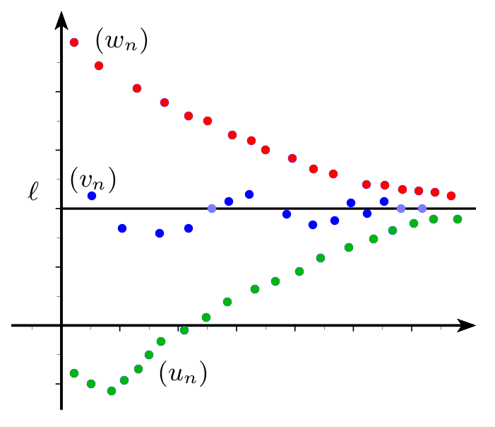

# Théorèmes de comparaison

## Limite infinie et comparaison

!!! info "Comparaison et limites infinies"

    Soit $(u_n)$ et $(v_n)$ sont deux suites telles que :
    
    - si $u_n  \leq v_n$  à partir d'un certain rang 
    - si $\lim\limits_{n\to +\infty}~u_n = +\infty$

    alors $\lim\limits_{n \to +\infty}~v_n=+\infty$.

???- example "Exemple"

    Etudier la convergence de la suite définie par $v_n=n^2+(-1)^n$

    ???- done "Réponse"

        $(-1)^n$ vaut -1 ou 1 donc $(-1)^n \geq -1$ et $n^2+(-1)^n \geq n^2-1$ donc $v_n \geq  n^2-1$  .
        
        Or $\dlim{n}{+\infty }(n^2-1)=+\infty$ donc $\dlim{n}{+\infty}v_n=+\infty$

## Limite finie et comparaison

???- info "Un théorème important ... pour plus tard"

    Une suite convergente est bornée.

!!! info "Thèorème d'encadrement"
    Soit $(u_n)$ ,$(v_n)$ et $(w_n)$ sont 3 suites telles que :
    
    - Si $u_n \leq v_n \leq w_n$ à partir d'un certain rang 
    - Si $\lim\limits_{n\to +\infty}~u_n=\ell$ et $\lim\limits_{n\to +\infty}~w_n=\ell$
    
    alors $\lim\limits_{n \to +\infty}~v_n=\ell$.

    

???- example "Exemple"

    Etudier la convergence de la suite $(v_n)$ définie par $v_n=1+\dfrac{\sin n}{n}$  pour $n \geq 1$.

    ???- done "Réponse"

        La fonction  sinus n'a pas de limite , on est donc obligé d'utiliser un théorème d'encadrement .
    
        On a $-1 \leq  \sin n  \leq  1$  donc  en multipliant par $\dfrac1n$ strictement positif , on a : $-\dfrac1n \leq  \dfrac{\sin n}{n}  \leq  \dfrac1n$ .
        
        Donc 
        
        $\forall ~ n \geq 1$ ,  $1-\dfrac1n  \leq  v_n  \leq  1+\dfrac1n$ .
        
        Or $\dlim{n}{+\infty} 1-\dfrac1n=1$ et $\dlim{n}{+\infty} 1+\dfrac1n =1$ donc d'après le théorème d'encadrement $\dlim{n}{+\infty} v_n= 1$.

???- example "Exemple"

    Etudier la convergence de la suite $(u_n)$ définie par $u_n=2-\dfrac{(-1)^n}{n}$  pour $n \geq 1$.

## Thèorème de convergence des suites monotones

!!! info "Suites monotones **et** convergentes"

    - Si une suite est croissante **et a pour limite** $\mathbf{\ell}$ (c'est donc une suite convergente !) alors tous les termes de la suite sont inférieurs ou égaux à $\ell$ c'est-à-dire, pour tout entier naturel $n$ , $u_n \leq  \ell$ .
    - Si une suite est décroissante **et a pour limite** $\mathbf{\ell}$ (c'est donc une suite convergente !) alors tous les termes de la suite sont supérieurs  ou égaux à $\ell$ c'est-à-dire, pour tout entier naturel $n$ , $u_n \geq \ell$.

    ???- warning "Attention"

        Pour utiliser ces théorèmes, il faut d'abord s'assurer de la convergence de la suite.

!!! info "Théorème de convergence des suites monotones"

    - Si une suite est croissante et majorée par $M$ alors elle converge vers $\ell$ et $\ell \leq M$ (attention , on connait pas la limite).
    - Si une  suite est décroissante et minorée par $m$ alors elle converge vers $\ell$ et $\ell \geq m$.

    ???- warning "ATTENTION"
        Le majorant (ou le minorant) du théorème **ne permet pas** de déterminer la valeur de la limite. 

        Les exemples (purement scolaires) les plus rencontrés utilisent souvent la limite comme majorant ou minorant. 

        Mais ce n'est pas une raison pour utiliser le théorème précédent et conclure sur la valeur de la limite !

!!! info "Conséquence"

    - Une suite croissante non majorée a pour limite $+\infty$.
    - Une suite décroissante et non minorée a pour limite $-\infty$.

???- example "Exemple"

    On considère la suite $(u_n)$ définie par $\Syst{u_0 & = &1,8}{u_{n+1} & = & f(u_n)}$ avec $f(x) =\dfrac{2}{3-x}$.

    On a vu que la suite $(u_n)$ est décroissante et que pour tout $n\in \N$, $u_n\in [1,2]$ (cf <a href="../../Suites_et_recurrence/Suites_bases/07_majoree_minoree_bornee.html#ex2_16">Exple 2.16</a>)

    1. Montrer que la suite $(u_n)$ converge et justifier que sa limite appartient à $[1;1,8]$.
    2. Conjecturer graphiquement sa limite .Puis déterminer la limite par le calcul.

    ???- done "Réponse"

        1. La suite est décroissante et minorée par 1 donc elle converge vers $\ell$ d'après le théorème de convergence des suites monotones. De plus, $\ell>1$.

            Par ailleurs, comme $(u_n)$ est une suite cdécroissante et convergente, pour tout $n\in\N$, $u_n \geq \ell$ (cf [ce th](#mono_conv)).

            De plus  la suite $(u_n)$ est décroissante donc $u_n \leq u_0$  donc pour tout $n\in\N$ on a $1< \ell \leq u_n  \leq u_0$. D'où $1 \leq \ell \leq  1,8$.
  
        2. $u_{n+1}=\dfrac{2}{u_n-3}$ par opérations sur les limites : 
       
            $\dlim{n}{+\infty} u_{n+1}=\dlim{n}{+\infty} \dfrac{2}{3-u_n}=\dfrac{2}{3-\lim\limits_{n \to +\infty}u_n}=\dfrac{2}{3-\ell}$ (possible car $3-\ell \neq 0$ puisque $1 \leq \ell \leq  1,8$)

            Or  $\dlim{n}{+\infty} u_{n+1}=\ell$ donc

            $u_{n+1}$ tend à la fois vers $\ell$ et vers $\dfrac{2}{3-\ell}$ donc par  unicité de la limite on a : $\ell= \dfrac{2}{3-\ell}$ soit $\ell^2-3\ell+2=0$ d'où $\ell=1$ ou $\ell=2$. 
        
            Comme $1 \leq \ell \leq  1,8$ alors $\ell=1$.