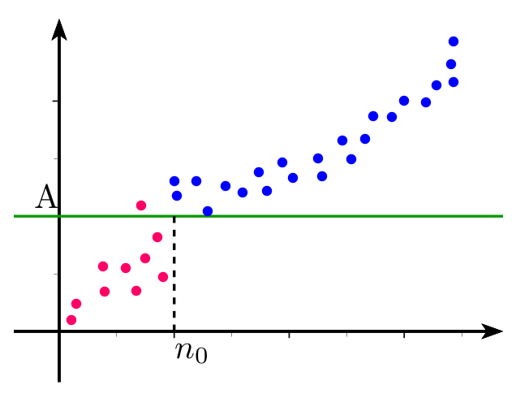

# Limites d'une suite

## Limite infinie d'une suite

### Définition

!!! info "Définition"
	**Une suite $(u_n)$ a pour limite $+\infty$ quand $n$ tend vers $+\infty$**, si tout intervalle de la forme $]A,+\infty[$<!--]--> contient tous les termes $u_n$ à partir d'un certain rang.
	Autrement dit : pour tout réel $A$ , on peut trouver un entier $n_0$ tel que , pour tout $n \geq n_0$ , on ait $u_n>A$.	
	On note : 
	
	\[
	\lim_{n \to +\infty} u_n=+\infty
	\]

[{.Center_lien .VignetteMed}](../Image/Cours_001.png)

!!! info "Définition"
	De même , **une suite $(u_n)$ a pour limite $-\infty$ quand $n$ tend vers $+\infty$**, si tout intervalle de la forme $]-\infty,B[$<!--]--> contient tous les termes $u_n$ à partir d'un certain rang. 
	Autrement dit : pour tout réel $B$ , on peut trouver un entier $n_0$ tel que , pour tout $n \geq n_0$ , on ait $u_n<B$.
	

	On note : 
	
	\[
	\lim_{n \to +\infty} u_n=-\infty
	\]

??? question "Exercice"
	Soit $u_n=2n-5$ pour tout $n \geq 0$ .	
	1. Conjecturer à l'aide de la calculatrice la limite de la suite $(u_n)$ en $+\infty$.
	2. Résoudre l'inéquation $u_n>A$ où $n$ est l'inconnue et où $A$ est un réel donné.
	3. Justifier que la suite ($u_n$)  a pour limite $+\infty$ 
	
	??? done "Solution"
		1. $\lim_{n \to +\infty}u_n=+\infty$
		2. $2n-5>A \iff 2n> A+5 \iff n>\dfrac{A+5}{2}$
		3. Soit$A$ un réel donné. 
		Soit $n_0$ le plus petit entier naturel tel que $n_0 \geq  \dfrac{A+5}{2}$ (on prend ceci car on ne sait pas si $\dfrac{A+5}{2}$ est un entier ), alors , pour tout $n \geq n_0$ on a : $u_n>A$ .Donc 
		
		\[
		\lim_{n \to +\infty}u_n=+\infty
		\]

??? question "Exercice"
	Soit $v_n=-4n-1$ pour tout $n\geq 0$ .
	1. Conjecturer à l'aide de la calculatrice la limite de la suite $(v_n)$ en $+\infty$.
	2. Résoudre l'inéquation $v_n<A$ où $n$ est l'inconnue et où $A$ est un réel donné.
	3. Justifier que la suite ($v_n$)  a pour limite $-\infty$ 
	
	??? done "Solution"
		1. $\lim_{n \to+\infty}v_n=-\infty$
		2. $-4n-1<A \iff -4n<A+1 \iff n>-\dfrac{A+1}{4}$
		3. Soit$A$ un réel donné.
		Soit $n_0$ le plus petit entier naturel tel que $n_0 \geq  -\dfrac{A+1}{4}$  alors , pour tout $n \geq n_0$ on a : $v_n<A$ . Donc 
		
		\[
		\lim_{n \to +\infty}v_n=-\infty
		\]

### Algorithme de seuil pour une limite infinie

Soit $u$ la suite définie par $u_n =0,5n^2-n+1$.

??? question "Exercice"
	1. Conjecturer à l'aide de la calculatrice la limite de la suite $(u_n)$ en $+\infty$.
	2. Déterminer un seuil (c'est-à-dire un entier $n$) à partir duquel on a , $u_n\in ]A,+\infty[$<!--]-->  c'est-à-dire $u_n > A$, pour tout $n \in \mathbb{N}$
	3. Ecrire le programme python qui permet déterminer le seuil.

	!!! warning
		Un programme (seul) ne trouve pas la valeur seuil, mais la plus petite valeur $n_0$ telle que $u_{n_0} > A$. Mais rien ne permettra alors d'affirmer, que pour tout $n \geq n_0$, $u_n>A$!

### Suites de référence de limite infinie

!!! abstract "Théorème"
	- Les suites ($\sqrt{n}$) , ($n$) ,($n^2$),$\cdots$ ,($n^p$), ($e^n$)ont pour limite $+\infty$
	- Si $k>0$ alors  ($k\sqrt{n}$) , ($kn$) ,($kn^2$),$\cdots$ ,($kn^p$), ($ke^n$) ont pour limite $+\infty$ quand $n $ tend vers $+\infty$
	- Si $k >0$ alors  ($-k\sqrt{n}$) , ($-kn$) ,($-kn^2$),$\cdots$ ,($-kn^p$),($-ke^n$)   ont pour limite $-\infty$ quand $n $ tend vers $+\infty$

[{.Center_lien .VignetteMed}](../Image/Cours_002.png)

## Limite finie d'une suite

### Définition

!!! note "Définition"
	Une suite **$(u_n)$ a pour limite le  réel $\ell$  quand $n$ tend vers $+\infty$** ou la suite **$(u_n)$ converge vers $\ell$**, si tout intervalle ouvert $I$ contenant $\ell$  contient tous les termes  $u_n$ à partir d'un certain rang.
	On note : 
	
	\[
	\lim_{n_+\infty} u_n=\ell
	\]

!!! abstract "Théorème"
	Cette limite est **unique**.

[{.Center_lien .VignetteMed}](../Image/Cours_003.png)

!!! tip "Remarque"
	- Tout intervalle ouvert contenant $\ell$ contient un intervalle ouvert centré en $\ell$ de la forme $]\ell-\epsilon,\ell+\epsilon[$<!--]--> où $\epsilon>0$. On peut donc se contenter de chercher si tout intervalle ouvert centré en $\ell$  contient tous les termes  $u_n$ à partir d'un certain rang.
	- Quand $n$ tend vers $+\infty$ , &laquo; ($u_n$) tend vers $\ell$ &raquo; équivaut à $u_n-\ell$ tend vers 0.
	- Si $(u_n)$ converge vers $\ell$ alors les suites $(u_{n+1})$ , ($u_{2n}$) , ($u_{2n+1}$) convergent aussi vers $\ell$.
	- Une suite convergente est bornée.

### Algorithme de seuil pour une limite finie 

???- question "Exercice"
	Soit la suite ($u_n$) définie par : 

	\[
		\Syst{u_0 & = & 0,1}{u_{n+1} & = &2u_n(1-u_n)}
	\]

	1. Programmer la suite à la calculatrice .Cette suite  converge vers $\ell =0,5$ 
	2. Déterminer un seuil \cad un entier $n$, à partir duquel les  $u_n$ sont  dans un intervalle contenant $\ell$. On peut traduire aussi par trouver un entier $n$ tel que $|u_n-\ell|<\epsilon$.
	3. Ecrire le programme python qui permet déterminer le seuil. Utilisez-le pour connaître à partir de quel entier $n$ la suite est dans l’intervalle ouvert centré en 0,5 et de rayon $10^{-3}$.

### Suites de référence de limite 0

!!! abstract "Théorème"
	- Les suites $\left(\dfrac{1}{\sqrt{n}}\right)$, $\left(\dfrac{1}{n}\right)$, $\left(\dfrac{1}{n^2}\right)$,$\left(\dfrac{1}{n^3}\right)$\dots $\left(\dfrac{1}{n^p }\right)$ ($p\in\N^{*}$) ont pour limite 0
	- Si $k$ est un réel , les suites $\left(\dfrac{k}{\sqrt{n}}\right)$, $\left(\dfrac{k}{n}\right)$, $\left(\dfrac{k}{n^2}\right)$,$\left(\dfrac{k}{n^3}\right)$\dots $\left(\dfrac{k}{n^p }\right)$ ($p\in\N^*$) ont pour limite 0.

## Suites qui n'ont pas de limite

Certaines suites n'ont pas de limite c'est le cas des suites de termes généraux: $(-1)^n$ , $(-3)^n$ , $\cos n$ , $\sin n$.

!!! note "Définition"
	On dit qu'une suite est **divergente** si elle n'est pas convergente c'est-à-dire : 
	
	- soit  elle tend vers $\pm \infty$
	- soit elle n'a pas de limite.

???- tip "Méthode"

	Il est souvent demandé de justifier qu'une suite est convergente **sans** qu'il soit possible de trouver sa limite (cf [plus loin](AFAIRE)) !

# Limite de la suite $q^n$

!!! abstract "Théorème"
	$q$ désigne un nombre réel.
	
	- Si $q>1$ alors 
	
	\[
	q>1 \Rightarrow \lim_{n \to +\infty} q^n=+\infty
	\]
	
	- Si $q=1$ alors 
	
	\[
	q=1 \Rightarrow \lim_{n \to +\infty} q^n=1
	\]
	
	- Si $-1<q<1$ alors 
	
	\[
	-1<q<1 \Rightarrow \lim_{n \to +\infty} q^n=0
	\]
	
	- Si $q \leq-1$ alors la suite $ q^n$ n'a pas de limite.

Dessiner à la calculatrice les termes de la  suite $1,8^n$ , $(-0,7)^n$ et $(-1,2)^n$

??? question "Exercice"
	Calculer 
	
	\[
	\lim_{n \to +\infty} e^{-n}
	\]

	??? done "Solution"
		$e^{-n}=\dfrac{1}{e^n}=\left(\dfrac{1}{e}\right)^n$ . 
		Comme $-1< \dfrac{1}{e} <1$ alors 
		
		\[
		\lim_{n \to +\infty}\left(\dfrac{1}{e}\right)^n=0
		\]
		
		donc 
		
		\[
		\lim_{n \to +\infty} e^{-n}=0
		\]

# Théorèmes d'opérations

Dans tout ce qui suit, $\ell$ et $\ell'$ désignent deux nombres réels.

!!! warning "Attention"
	La notation "FI" désigne une Forme Indéterminée, c'est à dire qu'on ne sait pas calculer par une opération élémentaire.
	
## Limite d'une somme

!!! info "Théorème"
	<table class="AvecBordure" style="width:70%;margin:auto;"> 
	<tr>
	 <td>Si $\lim\limits_{n \to +\infty}~u_n=\cdots$ </td><td> $\ell$ </td><td> $\ell$ </td><td> $\ell$ </td><td> $+\infty$ </td><td> $-\infty$ </td><td> $-\infty$ </td>
	</tr>
	<tr>
	<td>$\text{et si }\lim\limits_{n \to +\infty} v_n=\cdots$ </td><td> $\ell'$ </td><td> $+\infty$ </td><td> $-\infty$</td><td>$+\infty$ </td><td> $-\infty$ </td><td> $+\infty$ </td>
	</tr>
	<tr>
	<td> alors $\lim\limits_{n \to +\infty}~(u_n+v_n)=\cdots$ </td><td> $\ell+\ell'$ </td><td> $+\infty$ </td><td> $-\infty$ </td><td> $+\infty$ </td><td> $-\infty$ </td><td> On ne peut pas conclure : $FI$ </td>
	</tr> 
	</table>

??? question "Exercice"
	Calculer les  limites des suites $(a_n)$ , $(b_n)$ et $(c_n)$ définies par $a_n=n^2+4n+1$ ,~$b_n=\dfrac1n-n^2$ et $c_n=n^3-n^2$ 
	
	1. $a_n=n^2+4n+1$
	
	??? done "Solution"
		
		\[
		\left.
		\begin{array}{l}
		\lim\limits_{n \to +\infty}~n^2 = +\infty \\
		\lim\limits_{n\to +\infty}~n = +\infty \quad \text{et} \lim\limits_{n\to +\infty}~4n=+\infty \quad\text{et} \lim\limits_{n\to +\infty}~4n+1 & = & +\infty
		\end{array}
		\right\}
		\quad \text{par somme} \quad \lim\limits_{n \to +\infty}~\left(n^2+4n+1\right)=+\infty.
		\]
  
	2. $b_n=\dfrac1n-n^2$ 

	??? done "Solution"

		\[
		\left.
		\begin{array}{l}
		\lim\limits_{n \to +\infty}~\dfrac{1}{n}&=&0\\
		\lim\limits_{n \to +\infty}~-n^2&=&-\infty 
		\end{array}
		\right\}
		\quad \text{par somme} \quad \lim\limits_{n \to +\infty}\left(\dfrac{1}{n}-n^2\right)=-\infty
		\]

	3. $c_n=n^3-n^2$

	??? done "Solution"
  
		\[
		\left.
		\begin{array}{l}
		\lim\limits_{n\to +\infty}~n^3&=&+\infty\\
		\lim\limits_{n \to +\infty}~-n^3&=&-\infty
		\end{array}
		\right\}
		\quad \lim\limits_{x \to -\infty}\left(n^3-n^2\right)$ \quad\text{ est une forme indeterminee du type }\infty-\infty.
		\]

## Limite d'un produit

!!! info "Théorème"
	<table class="AvecBordure"  style="width:70%;margin:auto;"> 
	<tr>
	 <td>Si $\lim\limits_{n \to +\infty}~u_n=\cdots$ </td><td> $\ell$ </td><td> $\ell>0$ </td><td> $\ell>0$</td><td>$\ell<0$</td><td>$\ell<0$</td><td>$+\infty$</td><td>$+\infty$</td><td>$-\infty$</td><td>$0$</td><td>0</td>
	</tr>
	<tr>
	<td> et si $\lim\limits_{n \to +\infty}~v_n=\cdots$</td><td>$\ell'$</td><td>$+\infty$</td><td>$-\infty$</td><td>$+\infty$</td><td>$-\infty$</td><td>$+\infty$</td><td>$-\infty$</td><td>$-\infty$</td><td>$+\infty$</td><td>$-\infty$</td>
	</tr>
	<tr>
	<td>alors $\lim\limits_{n \to +\infty}~(u_n\times v_n)=\cdots$</td><td>$\ell\times\ell'$</td><td>$+\infty$</td><td>$-\infty$</td><td>$-\infty$</td><td>$+\infty$</td><td>$+\infty$</td><td>$-\infty$</td><td>$+\infty$</td><td>$FI$</td><td>$FI$</td>
	</tr>
	<tr>
	<td colspan="2"  style="border-left:1px solid white;border-bottom:1px solid white;"> </td><td colspan="4"> Règle des signes </td><td colspan="3"> Règle des signes </td><td style="border-right:1px solid white;border-bottom:1px solid white;"> </td><td style="border-right:1px solid white;border-bottom:1px solid white;"> </td>
	</tr>
	</table>

??? question "Exercice"
	En utilisant les suites de l'exemple 3 , calculer les limites des suites 
	
	1. $p_n=a_n \times b_n$ 
	2. $c_n$.
	
	??? done "Solution"
		
		1. Pour $p_n$
		
			\[
			\left.
			\begin{array}{l}
			\lim\limits_{n \to +\infty}~a_n&=&+\infty\\
			\lim\limits_{n \to +\infty}~b_n&=&-\infty
			\end{array}
			\right\}
			\quad \text{par produit } \quad \lim\limits_{n\to +\infty}p_n=-\infty
			\]
		
		2. On a une forme indéterminée $(\infty-\infty)$.
		
		!!! tip "Méthode"
			On factorise par le terme prépondérant c'est-à-dire celui qui tend le plus vite vers $+\infty$.
		
		$c_n=n^3-n^2=n^3(1-\dfrac1n)$
		
		\[
		\left.
		\begin{array}{l}
		\lim\limits_{n \to +\infty}~n^3 =  +\infty\\		
		\lim\limits_{n\to +\infty}~1=1 \quad \text{et} \lim\limits_{n\to +\infty}~-\dfrac1n=0 \quad\text{et par somme } \lim\limits_{n\to +\infty}~1-\dfrac1n & =& 1
		\end{array}
		\right\}
		\quad \text{par produit } \quad \lim\limits_{n \to +\infty}~c_n=+\infty.
		\]

## Limite de l'inverse

!!! info "Théorème"
	<table class="AvecBordure"  style="width:70%;margin:auto;"> 
	<tr>
	 <td>Si  $\lim\limits_{n \to +\infty}~v_n$  = </td><td> $\ell\neq  0$</td><td>$0$  avec $v_n>0$ à partir d'un certain rang</td><td>$0$  avec $v_n<0$ à partir d'un certain rang</td><td>$+\infty$ ou $-\infty$</td>
    </tr>
	<tr>
	<td>alors  $\lim\limits_{n \to +\infty }~\dfrac{1}{v_n}$=</td><td>$\dfrac{1}{\ell}$</td><td>$+\infty$</td><td>$-\infty$</td><td>$0$</td>
	</tr>
    </table>

## Limite d'un quotient

???- tip "Méthode"
	Parfois, pour chercher la limite d'un quotient $\dfrac{u_n}{v_n}$ , on l'écrit comme le produit $u_n\times \dfrac{1}{v_n}$.

!!! info "Théorème"

	Pour la limite d'un quotient $\frac{u_n}{v_n}$, distinguons deux cas :

	- Cas où $\lim\limits_{n \to +\infty} v_n \neq 0$ :
	
	<table class="AvecBordure" style="width:70%;margin:auto;"> 
	<tr>
	<td>Si $\lim\limits_{n \to +\infty} u_n =$ </td><td> $\ell$ </td><td> $\ell$ </td><td> $+\infty$ </td><td> $-\infty$ </td><td> $+\infty$ </td><td> $-\infty$ </td><td> $+\infty$  ou  $-\infty$</td>
	</tr>
	<tr>
	<td>Si $\lim\limits_{n \to +\infty} v_n =$ </td><td> $\ell' \neq 0$ </td><td> $+ \infty$  ou $-\infty$ </td><td> $\ell' > 0$ </td><td> $\ell' > 0$ </td><td> $\ell' < 0$ </td><td> $\ell' < 0$ </td><td> $+ \infty$ ou $-\infty$</td>
	</tr>
	<tr>
	<td>$\lim\limits_{n \to +\infty} \left( \frac{u_n}{v_n} \right) =$ </td><td> $\frac{\ell}{\ell '}$ </td><td> $0$ </td><td> $+\infty$ </td><td> $- \infty$ </td><td> $-\infty$ </td><td> $+\infty$ </td><td>  FI </td>
	</tr>
	</table>

	- Cas où $\lim\limits_{n \to +\infty} v_n = 0$

	
	<table class="AvecBordure"  style="width:70%;margin:auto;"> 
	<tr>
	<td>Si $\lim\limits_{n \to +\infty} u_n =$ </td><td> $\ell>0$ ou $+ \infty$ </td><td> $\ell>0$ ou $+ \infty$ </td><td> $\ell<0$ ou $- \infty$ </td><td> $\ell<0$ ou $- \infty$ </td><td> $0$ </td>
	</tr>
	<tr>
	<td>Si $\lim\limits_{n \to +\infty} v_n =$ </td><td> $0$ en restant positif </td><td> $0$ en restant négatif</td><td> $0$ en restant positif </td><td> $0$ en restant négatif </td><td> $0$ </td>
	</tr>
	<tr>
	<td>$\lim\limits_{n \to +\infty} \left( \frac{u_n}{v_n} \right) =$ </td><td> $+\infty$ </td><td> $-\infty$ </td><td> $-\infty$ </td><td> $+ \infty$ </td><td>  FI </td>
	</tr>
	<tr>
	<td style="border-left:1px solid white;border-bottom:1px solid white;"></td><td colspan="4"> Règle des signes </td><td style="border-right:1px solid white;border-bottom:1px solid white;"> </td>
	</tr>
	</table>

???+ example "Exemple"
	
    Déterminer les limites des suites $(u_n)$ , $(v_n)$ et $(w_n)$ définies par $u_n=\dfrac{2}{\left(1+\dfrac{1}{\sqrt{n}}\right)}$ , $v_n=\dfrac{n^2+3n}{3n^2+4}$ et $w_n=\dfrac{n+3}{n^2-2}$

    ???- done "Réponse pour $u_n$"
	
        $u_n=\dfrac{2}{\left(1+\dfrac{1}{\sqrt{n}}\right)}=2\times\dfrac{1}{\left(1+\dfrac{1}{\sqrt{n}}\right)}$

        $\displaystyle\lim_{n \to +\infty} 2  =  2$

        $\lim\limits_{n\to +\infty}~\left(\dfrac{1}{\sqrt{n}}\right)=0 \quad \text{et} \lim\limits_{n\to +\infty}~\left(1+\dfrac{1}{\sqrt{n}}\right)=1\quad \text{d'où} \lim\limits_{n\to +\infty}~\dfrac{1}{\left(1+\dfrac{1}{\sqrt{n}}\right)} = 1$

        par produit : $\lim\limits_{n \to +\infty}~u_n=2$
    
    ???- done "Réponse pour $v_n$"

        $v_n=\dfrac{n^2+3n}{3n^2+4}$

        $\lim\limits_{n \to +\infty}~n^2+3n = +\infty$

        $\lim\limits_{n\to +\infty}~3n^2+4=+\infty$

        par quotient, on a  une forme indéterminée du type &laquo; $\dfrac{\infty}{\infty}$ &raquo;.

        ???- tip "Méthode"

            On factorise par le terme prépondérant au numérateur et le terme prépondérant au dénominateur. Puis il faut simplifier !

        $v_n=\dfrac{n^2+3n}{3n^2+4}=\dfrac{n^2(1+\dfrac3n)}{n^2(3+\dfrac{4}{n^2})}=\dfrac{1+\dfrac3n}{3+\dfrac{4}{n^2}}$

        $\lim\limits_{n \to +\infty}~1+\dfrac3n=1$

        $\lim\limits_{n\to +\infty}~3+\dfrac{4}{n^2}=3$

        Par quotient $\lim\limits_{n \to +\infty}~v_n=\dfrac13$

    ???- done "Réponse pour $w_n$"

        $w_n=\dfrac{n+3}{n^2-2}$

        $\lim\limits_{n \to +\infty}~n+3=+\infty$

        $\lim\limits_{n\to +\infty}~n^2-2=+\infty$

        par quotient, on a  une forme indéterminée du type &laquo; $\dfrac{\infty}{\infty}$ &raquo;

        $w_n=\dfrac{n+3}{n^2-2}=\dfrac{n(1+\dfrac3n)}{n^2(1-\dfrac{2}{n^2})}=\dfrac{1}{n}\times \dfrac{1+\dfrac3n}{1-\dfrac{2}{n^2}} = \dfrac{1}{n}\times \left(1+\dfrac3n\right)\times \dfrac{1}{1-\dfrac{2}{n^2}}$

        $\lim\limits_{n \to +\infty}~\dfrac1n=0$

        $\lim\limits_{n \to +\infty}~1+\dfrac3n=1$

        $\lim\limits_{n\to +\infty}~1-\dfrac{2}{n^2}=1$ d'où $\lim\limits_{n\to +\infty}~\dfrac{1}{\left(1-\dfrac{2}{n^2}\right)}=1$

        Ainsi, par produit, $\lim\limits_{n \to +\infty}~w_n=0$

!!! tip "Bilan"
    En résumé , il y a 4 formes indéterminées: &laquo; $\infty-\infty$ &raquo;,  &laquo; $0\times \infty$ &raquo;, &laquo; $\dfrac{\infty}{\infty}$ &raquo; et &laquo;$\dfrac{0}{0}$ &raquo; .

# Théorèmes de comparaison

## Limite infinie et comparaison

!!! info "Comparaison et limites infinies"

    Soit $(u_n)$ et $(v_n)$ sont deux suites telles que :
    
    - si $u_n  \leq v_n$  à partir d'un certain rang 
    - si $\lim\limits_{n\to +\infty}~u_n = +\infty$

    alors $\lim\limits_{n \to +\infty}~v_n=+\infty$.

???- example "Exemple"

    Etudier la convergence de la suite définie par $v_n=n^2+(-1)^n$

    ???- done "Réponse"

        $(-1)^n$ vaut -1 ou 1 donc $(-1)^n \geq -1$ et $n^2+(-1)^n \geq n^2-1$ donc $v_n \geq  n^2-1$  .
        
        Or $\dlim{n}{+\infty }(n^2-1)=+\infty$ donc $\dlim{n}{+\infty}v_n=+\infty$

## Limite finie et comparaison

???- info "Un théorème important ... pour plus tard"

    Une suite convergente est bornée.

!!! info "Thèorème d'encadrement"
    Soit $(u_n)$ ,$(v_n)$ et $(w_n)$ sont 3 suites telles que :
    
    - Si $u_n \leq v_n \leq w_n$ à partir d'un certain rang 
    - Si $\lim\limits_{n\to +\infty}~u_n=\ell$ et $\lim\limits_{n\to +\infty}~w_n=\ell$
    
    alors $\lim\limits_{n \to +\infty}~v_n=\ell$.

    [{.Center_lien .Vignette}](../Image/Cours_004.png)
    

???- example "Exemple"

    Etudier la convergence de la suite $(v_n)$ définie par $v_n=1+\dfrac{\sin n}{n}$  pour $n \geq 1$.

    ???- done "Réponse"

        La fonction  sinus n'a pas de limite , on est donc obligé d'utiliser un théorème d'encadrement .
    
        On a $-1 \leq  \sin n  \leq  1$  donc  en multipliant par $\dfrac1n$ strictement positif , on a : $-\dfrac1n \leq  \dfrac{\sin n}{n}  \leq  \dfrac1n$ .
        
        Donc 
        
        $\forall ~ n \geq 1$ ,  $1-\dfrac1n  \leq  v_n  \leq  1+\dfrac1n$ .
        
        Or $\dlim{n}{+\infty} 1-\dfrac1n=1$ et $\dlim{n}{+\infty} 1+\dfrac1n =1$ donc d'après le théorème d'encadrement $\dlim{n}{+\infty} v_n= 1$.

???- example "Exemple"

    Etudier la convergence de la suite $(u_n)$ définie par $u_n=2-\dfrac{(-1)^n}{n}$  pour $n \geq 1$.

## Thèorème de convergence des suites monotones

!!! info "Suites monotones **et** convergentes"

    - Si une suite est croissante **et a pour limite** $\mathbf{\ell}$ (c'est donc une suite convergente !) alors tous les termes de la suite sont inférieurs ou égaux à $\ell$ c'est-à-dire, pour tout entier naturel $n$ , $u_n \leq  \ell$ .
    - Si une suite est décroissante **et a pour limite** $\mathbf{\ell}$ (c'est donc une suite convergente !) alors tous les termes de la suite sont supérieurs  ou égaux à $\ell$ c'est-à-dire, pour tout entier naturel $n$ , $u_n \geq \ell$.

    ???- warning "Attention"

        Pour utiliser ces théorèmes, il faut d'abord s'assurer de la convergence de la suite.

!!! info "Théorème de convergence des suites monotones"

    - Si une suite est croissante et majorée par $M$ alors elle converge vers $\ell$ et $\ell \leq M$ (attention , on connait pas la limite).
    - Si une  suite est décroissante et minorée par $m$ alors elle converge vers $\ell$ et $\ell \geq m$.

    ???- warning "ATTENTION"
        Le majorant (ou le minorant) du théorème **ne permet pas** de déterminer la valeur de la limite. 

        Les exemples (purement scolaires) les plus rencontrés utilisent souvent la limite comme majorant ou minorant. 

        Mais ce n'est pas une raison pour utiliser le théorème précédent et conclure sur la valeur de la limite !

!!! info "Conséquence"

    - Une suite croissante non majorée a pour limite $+\infty$.
    - Une suite décroissante et non minorée a pour limite $-\infty$.

???- example "Exemple"

    On considère la suite $(u_n)$ définie par $\Syst{u_0 & = &1,8}{u_{n+1} & = & f(u_n)}$ avec $f(x) =\dfrac{2}{3-x}$.

    On a vu que la suite $(u_n)$ est décroissante et que pour tout $n\in \N$, $u_n\in [1,2]$ (cf <a href="../../Suites_et_recurrence/Suites_bases/07_majoree_minoree_bornee.html#ex2_16">Exple 2.16</a>)

    1. Montrer que la suite $(u_n)$ converge et justifier que sa limite appartient à $[1;1,8]$.
    2. Conjecturer graphiquement sa limite .Puis déterminer la limite par le calcul.

    ???- done "Réponse"

        1. La suite est décroissante et minorée par 1 donc elle converge vers $\ell$ d'après le théorème de convergence des suites monotones. De plus, $\ell>1$.

            Par ailleurs, comme $(u_n)$ est une suite cdécroissante et convergente, pour tout $n\in\N$, $u_n \geq \ell$ (cf [ce th](#mono_conv)).

            De plus  la suite $(u_n)$ est décroissante donc $u_n \leq u_0$  donc pour tout $n\in\N$ on a $1< \ell \leq u_n  \leq u_0$. D'où $1 \leq \ell \leq  1,8$.
  
        2. $u_{n+1}=\dfrac{2}{u_n-3}$ par opérations sur les limites : 
       
            $\dlim{n}{+\infty} u_{n+1}=\dlim{n}{+\infty} \dfrac{2}{3-u_n}=\dfrac{2}{3-\lim\limits_{n \to +\infty}u_n}=\dfrac{2}{3-\ell}$ (possible car $3-\ell \neq 0$ puisque $1 \leq \ell \leq  1,8$)

            Or  $\dlim{n}{+\infty} u_{n+1}=\ell$ donc

            $u_{n+1}$ tend à la fois vers $\ell$ et vers $\dfrac{2}{3-\ell}$ donc par  unicité de la limite on a : $\ell= \dfrac{2}{3-\ell}$ soit $\ell^2-3\ell+2=0$ d'où $\ell=1$ ou $\ell=2$. 
        
            Comme $1 \leq \ell \leq  1,8$ alors $\ell=1$.