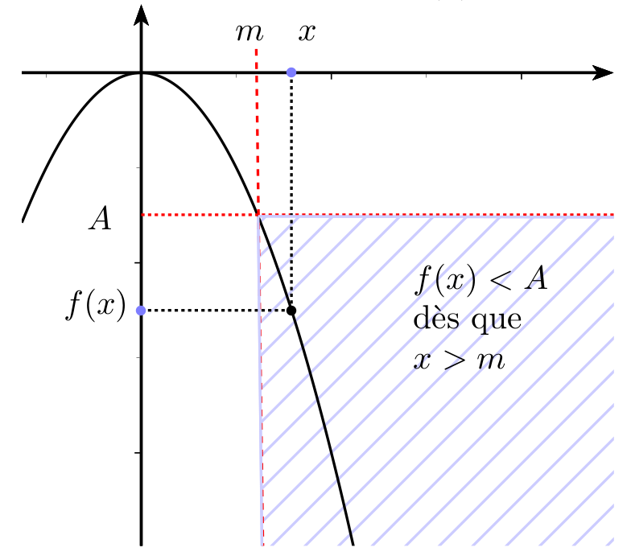
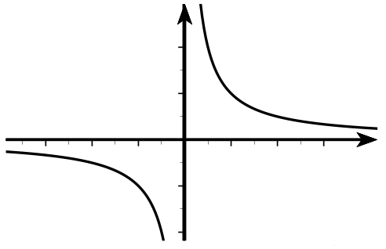
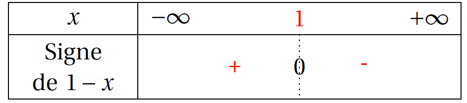

# Limites d'une fonction vers l'infini

La limite d'une fonction lorsque $x$ tend vers $+\infty$ est très semblable à la limite d'une suite !

## Limites infinies

!!! info "Définition"
    $f$ a pour limite  $+\infty$ en $+\infty$ si les images $f(x)$ sont plus grandes que n'importe quel réel donné à condition de prendre $x$ assez grand c'est-à-dire si tout intervalle $]A,+\infty[$ (avec A réel) contient toutes les valeurs $f(x)$ pour $x$ assez grand.

    \[
    \lim_{x \to +\infty} f(x) = +\infty \equivaut\ \forall\ A\ \in\ \R\ \exists\ m\ \in\ \R\ :\ \forall\ x\ \geq\ m\ f(x)\geq A
    \]

    [{.Center_lien .Vignette}](../Image/Cours_001.png)

    
!!! info "Définition"
    $f$ a pour limite $-\infty$ en $+\infty$ si les images $f(x)$ sont plus petites  que n'importe quel réel donné à condition de prendre $x$ assez grand c'est-à-dire si tout intervalle $]-\infty,A [$ (avec A réel) contient toutes les valeurs $f(x)$ pour $x$ assez grand.
    
    \[
    \lim_{x \to +\infty} f(x) = -\infty \equivaut\ \forall\ A\ \in\ \R\ \exists\ m\ \in\ \R\ :\ \forall\ x\ \geq\ m\ f(x)\leq A
    \]

    [{.Center_lien .Vignette}](../Image/Cours_002.png)

    

De même, lorsque $x$ tend vers $-\infty$

???- info "Définition"
    $f$ a pour limite  $+\infty$ en $-\infty$ si les images $f(x)$ sont plus grandes que n'importe quel réel donné à condition de prendre $x$ assez petit (donc &laquo; grand négatif &raquo;) c'est-à-dire si tout intervalle $]A,+\infty[$ (avec A réel) contient toutes les valeurs $f(x)$ pour $x$ assez petit (donc &laquo; grand négatif &raquo;).

    \[
    \lim_{x \to -\infty} f(x) = +\infty \equivaut\ \forall\ A\ \in\ \R\ \exists\ m\ \in\ \R\ :\ \forall\ x\ \leq\ m\ f(x)\geq A
    \]
    

???- info "Définition"
    $f$ a pour limite $-\infty$ en $-\infty$ si les images $f(x)$ sont plus petites  que n'importe quel réel donné à condition de prendre $x$ assez petit (donc &laquo; grand négatif &raquo;) c'est-à-dire si tout intervalle $]-\infty,A [$ (avec A réel) contient toutes les valeurs $f(x)$ pour $x$ assez petit (donc &laquo; grand négatif &raquo;).
    
    \[
    \lim_{x \to -\infty} f(x) = -\infty \equivaut\ \forall\ A\ \in\ \R\ \exists\ m\ \in\ \R\ :\ \forall\ x\ \leq\ m\ f(x)\leq A
    \]

!!! tip "Limites de fonctions de références"
    $\dlim{x}{+\infty}x^2=+\infty$ et $\dlim{x}{-\infty}x^2=+\infty$ 

    [{.Center_lien .Vignette}](../Image/Cours_003.png)

    Plus généralement, pour tout entier $p \geq 1$,

    $\dlim{x}{+\infty}x^p=+\infty$

    \[
    \dlim{x}{-\infty}x^p = \left\{
    \begin{array}{l}
    +\infty  \text{ si $p$ est pair } \\
    -\infty \text{ si $p$ est impair }
    \end{array}
    \right.
    \]

    $\dlim{x}{+\infty}\sqrt{x}=+\infty$

    [{.Center_lien .Vignette}](../Image/Cours_004.png)

    $\dlim{x}{+\infty}e^x=+\infty$

    [{.Center_lien .Vignette}](../Image/Cours_005.png)

???- tip "Suite définie explicitement"
    Si une fonction $f$ a pour limite $\pm\infty$ en $+\infty$ , la suite définie par $u_n=f(n)$ a la même limite.

    ???- danger "ATTENTION"
        Attention la réciproque est fausse !
        
        Contre-exemple : $f(x) = x\sin\left( \dfrac{\pi}{2}+2\pi x \right)$

        - $f(n)=n\sin(\dfrac{\pi}{2})=n$ donc la suite $\left( f(n) \right)$ diverge vers $+\infty$ 
        - $f$  n'a pas pour limite $+\infty$ en $+\infty$ [ggb](AFAIRE)

## Limite finie à l'infini. Asymptote horizontale

!!! info "Définition"
    Soit $f$ une fonction définie au moins sur un intervalle $]a,+\infty[$.

    $f$ a pour limite le réel $\ell$ quand $x$ tend vers $+\infty$ si les images $f(x)$ sont aussi proches que l'on veut de $\ell$ à condition de prendre $x$ assez grand.
    
    On note $\dlim{x}{+\infty}f(x)=\ell$

    **De façon formalisée :**
    
    $\dlim{x}{+\infty}f(x)=\ell$ si et seulement si tout intervalle ouvert contenant $\ell$ c'est-à-dire de la forme $]\ell-\epsilon,\ell+\epsilon[$ (avec $\epsilon>0$) contient toutes les valeurs $f(x)$ pour $x$ assez grand. 

    Ou encore ,  il existe $m$ tel que pour tout $x \geq m$ , on a  $f(x)\in ]\ell-\epsilon,\ell+\epsilon[$.

    \[
    \lim_{x \to +\infty} f(x)=\ell \equivaut \forall \epsilon >0\ \exists m \in \R\ :\ \forall x \geq m \quad |f(x)-\ell|< \epsilon
    \]

    [{.Center_lien .Vignette}](../Image/Cours_006.png)

De même lorsque $x$ tend vers $-\infty$ :

???- info "Définition"
    Soit $f$ une fonction définie au moins sur un intervalle $]-\infty; a[$.

    $f$ a pour limite le réel $\ell$ quand $x$ tend vers $-\infty$ si les images $f(x)$ sont aussi proches que l'on veut de $\ell$ à condition de prendre $x$ négatif et assez grand en valeur absolue.

    On note $\dlim{x}{-\infty}f(x)=\ell$.

    **De façon formalisée} :**
    
    $\dlim{x}{+\infty}f(x)=\ell$ si et seulement si tout intervalle ouvert contenant $\ell$ c'est-à-dire de la forme $]\ell-\epsilon,\ell+\epsilon[$ (avec $\epsilon>0$) contient toutes les valeurs $f(x)$ pour $x$ négatif et assez grand en valeur absolue. 
    
    Ou encore ,  il existe $m$ tel que pour tout $x \leq m$ , on a  $f(x)\in ]\ell-\epsilon,\ell+\epsilon[$.

    \[
    \lim_{x \to -\infty} f(x)=\ell \equivaut \forall \epsilon >0\ \exists m \in \R\ :\ \forall x \leq m \quad |f(x)-\ell|< \epsilon
    \]

!!! info "Asymptote horizontale"
    **Interprétation graphique de la limite en $\pm\infty$**
    
    La droite d'équation $y=\ell$ est **asymptote horizontale**  à la courbe représentant $f$ en $+\infty$ (resp $-\infty$) si et seulement si $\dlim{x}{+\infty}f(x)=\ell$  (resp. $\dlim{x}{-\infty}f(x)=\ell$).

!!! tip "Limite de fonctions de références"
    $\dlim{x}{-\infty}\dfrac1x=0$ et $\dlim{x}{+\infty}\dfrac1x=0$

    [{.Center_lien .Vignette}](../Image/Cours_007.png)

    **L'axe des abscisses est asymptote horizontale** à la courbe en $-\infty$ et $+\infty$.

    $\dlim{x}{-\infty}e^x=0$

    **L'axe des abscisses est asymptote horizontale** à la courbe en $-\infty$.

# Limite d'une fonction lorsque $x$ tend vers un réel

???- example "Exemple"
    Soit $f$ la fonction définie sur $]-\infty,0[\cup]0,+\infty[$  par $f(x)=\dfrac{1}{x^2}$.

    Faire apparaître la table des valeurs de la fonction $f$ au voisinage de 0 ( depuis -0,04 jusqu'à 0,03 en prenant un pas de 0,001).
    
    Comment se comporte $f(x)$  lorsque $x$ devient proche de 0?

    ???- done "Réponse"
        $f$ semble avoir pour limite $+\infty$ en $0$ .
        Pour le démontrer , on se donne un réel  $A > 0$.
        
        $\dfrac{1}{x^2}>A\iff x^2 < \dfrac1A  \text{ avec } x\neq0 \iff -\dfrac{1}{\sqrt{A}}<x<\dfrac{1}{\sqrt{A}}$ avec $x\neq0$.
        
        Donc $]A,+\infty[$ contient toutes les valeurs de $f(x)$ pour $x$ assez proche de 0 et $\dlim{x}{0^0}\dfrac{1}{x^2}=+\infty$.

!!! info "Défintion"
    $f$ a pour limite $+\infty$ quand $x$ tend vers $a$ si $f(x)$ est aussi grand que l'on veut à condition de prendre $x$ assez proche de $a$ .

    C'est-à-dire si tout intervalle $]A,+\infty[$ (avec A réel) contient toutes les valeurs $f(x)$ pour $x$ assez proche de $a$.

    On note :$\dlim{x}{a} f(x)=+\infty$.
    
    **De façon formalisée} :**

    $\dlim{x}{a}f(x)=+\infty$ si et seulement si pour tout réel $A$ , on peut trouver un réel $\alpha >0$ tel que pour tout $x\neq a$ tel que $a-\alpha<x<a+\alpha$, on a $f(x)>A$.

!!! info "Définition"
    $f$ a pour limite $-\infty$ quand $x$ tend vers $a$ si $f(x)$ est négatif et aussi grand en valeur absolue que l'on veut à condition de prendre $x$ assez proche de $a$ .
    
    C'est-à-dire si tout intervalle $]-\infty;A[$ (avec A réel) contient toutes les valeurs $f(x)$ pour $x$ assez proche de $a$.
    
    On note :$\dlim{x}{a} f(x)=-\infty$.

    **De façon formalisée} :**

    $\dlim{x}{a}f(x)=-\infty$ si et seulement si pour tout réel $A$ , on peut trouver un réel $\alpha >0$ tel que pour tout $x\neq a$ tel que $a-\alpha<x<a+\alpha$, on a $f(x)<A$.

!!! info "Asymptote verticale"
    **Interprétation graphique de la limite en a**

    La droite d'équation $x=a$ est **asymptote verticale** à la courbe représentant $f$ en un réel $a$  si et seulement si $\dlim{x}{a}~f(x)~=~+~\infty$ ou $\dlim{x}{a} f(x)=-\infty$.

???- tip "Exemple"
    Si $x$ tend vers 0 avec $x>0$ , $\dfrac1x$ tend vers $+\infty$.
    
    On dit que la fonction inverse qui n'est pas définie en 0 a pour limite $+\infty$  **à droite en 0.**

    On note $\lim\limits_{\substack{x\to0\\x>0}}~\dfrac1x=+\infty$. On note aussi $\dlim{x}{0^+}{\dfrac{1}{x}} = +\infty$.

    [{.Center_lien .Vignette}](../Image/Cours_009.png)

    Si $x$ tend vers 0 avec $x<0$ , $\dfrac1x $ tend vers $-\infty$.
    
    On dit que la fonction inverse qui n'est pas définie en 0  a pour limite $-\infty$  **à gauche en 0.**
    
    On note $ \lim\limits_{\substack{x\to0\\x<0}}~\dfrac1x=-\infty$. On note aussi $\dlim{x}{0^-}{\dfrac{1}{x}} = +\infty$.

    Comme ces limites sont distinctes , la fonction inverse n'a pas de limite en 0.

# Opération sur les limites

## Résumé : limites de références

 <table class="AvecBordure" style="width:70%;margin:auto;"> 
<tr>
<td style="height:4em;"> $\dlim{x}{+\infty}x^2=+ \infty$ </td><td> $\dlim{x}{+\infty}x^3=+\infty$ </td><td> $\dlim{x}{+\infty}x^p=+ \infty \ (\ p \in \N^*)$ </td><td> $\dlim{x}{+\infty}\sqrt{x}=+ \infty$ </td><td> $\dlim{x}{+\infty}e^x=+ \infty$ </td>
</tr>
<tr>
<td style="height:4em;"> $\dlim{x}{-\infty}x^2=+ \infty$ </td><td> $\dlim{x}{-\infty}x^3=-\infty$ </td><td> $\dlim{x}{-\infty}x^p=+ \infty  \ (\ p \in \N^*, p \text{ pair })$ </td><td> $\dlim{x}{-\infty}x^p=- \infty  \ (\ p \in \N^*, p \text{ impair })$</td><td style="border-right:1px solid white;border-bottom:1px solid white"></td>
</tr>
<tr>
<td style="height:4em;"> $\dlim{x}{\pm\infty}\dfrac 1x=0$ </td><td> $\dlim{x}{\pm\infty}\dfrac{1}{x^2}=0$ </td><td> $\dlim{x}{\pm\infty}\dfrac{1}{x^n}=0$ </td><td> $\dlim{x}{+\infty}\dfrac{1}{\sqrt{x}}=0$</td><td style="border-right:1px solid white;border-bottom:1px solid white"></td>
</tr>
<tr>
<td style="height:4em;"> $\dlim{x}{0}\dfrac{1}{x^2}=+\infty$ </td><td> $\dlim{x}{0}\dfrac{1}{x^n}=+\infty \ (\ n \in \N^* n \text{ pair })$ </td><td style="border-right:1px solid white;"> </td><td style="border-right:1px solid white;"> </td><td style="border-right:1px solid white;border-bottom:1px solid white"></td>
</tr>
<tr>
<td style="height:4em;"> $\dlim{x}{0^+}\dfrac 1x=+\infty$ </td><td> $\dlim{x}{0^-}\dfrac 1x=-\infty$ </td><td> $\dlim{x}{0^+}\dfrac{1}{x^n}=+\infty \ (\ n \in \N^* n \text{ impair })$ </td><td> $\dlim{x}{0^-}\dfrac{1}{x^n}=-\infty \ (\ n \in \N^* n \text{ impair })$</td><td  style="border-right:1px solid white;border-bottom:1px solid white;"></td>
</tr>
 </table>

## Limite et opérations

Dans tout ce qui suit, $\ell$ et $\ell'$ désignent deux nombres réels $a$ désigne un réel ou $+\infty$ ou $-\infty$.

!!! warning "Attention"
	La notation "FI" désigne une Forme Indéterminée, c'est à dire qu'on ne sait pas calculer par une opération élémentaire.
	
### Limite d'une somme

!!! info "Théorème"
	<table class="AvecBordure" style="width:70%;margin:auto;"> 
	<tr>
	 <td>Si $\lim\limits_{xn \to a}~f(x)=\cdots$ </td><td> $\ell$ </td><td> $\ell$ </td><td> $\ell$ </td><td> $+\infty$ </td><td> $-\infty$ </td><td> $-\infty$ </td>
	</tr>
	<tr>
	<td>$\text{et si }\lim\limits_{x \to a} g(x)=\cdots$ </td><td> $\ell'$ </td><td> $+\infty$ </td><td> $-\infty$</td><td>$+\infty$ </td><td> $-\infty$ </td><td> $+\infty$ </td>
	</tr>
	<tr>
	<td> alors $\lim\limits_{x \to a}~(f(x) + g(x))=\cdots$ </td><td> $\ell+\ell'$ </td><td> $+\infty$ </td><td> $-\infty$ </td><td> $+\infty$ </td><td> $-\infty$ </td><td> On ne peut pas conclure : $FI$ </td>
	</tr> 
	</table>

### Limite d'un produit

!!! info "Théorème"
	<table class="AvecBordure" style="width:70%;margin:auto;"> 
	<tr>
	 <td>Si $\lim\limits_{x \to a}~f(x)=\cdots$ </td><td> $\ell$ </td><td> $\ell>0$ </td><td> $\ell>0$</td><td>$\ell<0$</td><td>$\ell<0$</td><td>$+\infty$</td><td>$+\infty$</td><td>$-\infty$</td><td>$0$</td><td>0</td>
	</tr>
	<tr>
	<td> et si $\lim\limits_{x \to a}~g(x)=\cdots$</td><td>$\ell'$</td><td>$+\infty$</td><td>$-\infty$</td><td>$+\infty$</td><td>$-\infty$</td><td>$+\infty$</td><td>$-\infty$</td><td>$-\infty$</td><td>$+\infty$</td><td>$-\infty$</td>
	</tr>
	<tr>
	<td>alors $\lim\limits_{x \to a}~(f(x) \times g(x))=\cdots$</td><td>$\ell\times\ell'$</td><td>$+\infty$</td><td>$-\infty$</td><td>$-\infty$</td><td>$+\infty$</td><td>$+\infty$</td><td>$-\infty$</td><td>$+\infty$</td><td>$FI$</td><td>$FI$</td>
	</tr>
	<tr>
	<td colspan="2"  style="border-left:1px solid white;border-bottom:1px solid white;"> </td><td colspan="4"> Règle des signes </td><td colspan="3"> Règle des signes </td><td style="border-right:1px solid white;border-bottom:1px solid white;"> </td><td style="border-right:1px solid white;border-bottom:1px solid white;"> </td>
	</tr>
	</table>

### Limite de l'inverse

!!! info "Théorème"
	<table class="AvecBordure" style="width:70%;margin:auto;"> 
	<tr>
	 <td>Si  $\lim\limits_{x \to a}~f(x)$  = </td><td> $\ell\neq  0$</td><td>$0$  avec $f(x)>0$ au voisinage de $a$</td><td>$0$  avec $f(x)<0$ au voisinage de $a$</td><td>$+\infty$ ou $-\infty$</td>
    </tr>
	<tr>
	<td>alors  $\lim\limits_{x \to a }~\dfrac{1}{f(x)}$=</td><td>$\dfrac{1}{\ell}$</td><td>$+\infty$</td><td>$-\infty$</td><td>$0$</td>
	</tr>
    </table>

### Limite d'un quotient

???- tip "Méthode"
	Parfois, pour chercher la limite d'un quotient $\dfrac{u_n}{v_n}$ , on l'écrit comme le produit $u_n\times \dfrac{1}{v_n}$.

!!! info "Théorème"

	Pour la limite d'un quotient $\frac{f(x)}{g(x)}$, distinguons deux cas :

	- Cas où $\lim\limits_{x \to a} g(x) \neq 0$ :

	<table class="AvecBordure" style="width:70%;margin:auto;"> 
	<tr>
	<td>Si $\lim\limits_{x \to a} f(x) =$ </td><td> $\ell$ </td><td> $\ell$ </td><td> $+\infty$ </td><td> $-\infty$ </td><td> $+\infty$ </td><td> $-\infty$ </td><td> $+\infty$  ou  $-\infty$</td>
	</tr>
	<tr>
	<td>Si $\lim\limits_{x \to a} g(x) =$ </td><td> $\ell' \neq 0$ </td><td> $+ \infty$  ou $-\infty$ </td><td> $\ell' > 0$ </td><td> $\ell' > 0$ </td><td> $\ell' < 0$ </td><td> $\ell' < 0$ </td><td> $+ \infty$ ou $-\infty$</td>
	</tr>
	<tr>
	<td>$\lim\limits_{x \to a} \left( \frac{f(x)}{g(x)} \right) =$ </td><td> $\frac{\ell}{\ell '}$ </td><td> $0$ </td><td> $+\infty$ </td><td> $- \infty$ </td><td> $-\infty$ </td><td> $+\infty$ </td><td>  FI </td>
	</tr>
	</table>

	- Cas où $\lim\limits_{x \to a} g(x) = 0$

	
	<table class="AvecBordure"  style="width:70%;margin:auto;"> 
	<tr>
	<td>Si $\lim\limits_{x \to a} f(x) =$ </td><td> $\ell>0$ ou $+ \infty$ </td><td> $\ell>0$ ou $+ \infty$ </td><td> $\ell<0$ ou $- \infty$ </td><td> $\ell<0$ ou $- \infty$ </td><td> $0$ </td>
	</tr>
	<tr>
	<td>Si $\lim\limits_{x \to a} g(x) =$ </td><td> $0$ en restant positif </td><td> $0$ en restant négatif</td><td> $0$ en restant positif </td><td> $0$ en restant négatif </td><td> $0$ </td>
	</tr>
	<tr>
	<td>$\lim\limits_{x \to a} \left( \frac{f(x)}{g(x)} \right) =$ </td><td> $+\infty$ </td><td> $-\infty$ </td><td> $-\infty$ </td><td> $+ \infty$ </td><td>  FI </td>
	</tr>
	<tr>
	<td style="border-left:1px solid white;border-bottom:1px solid white;"></td><td colspan="4"> Règle des signes </td><td style="border-right:1px solid white;border-bottom:1px solid white;"> </td>
	</tr>
	</table>

???- example "Exemple"

	1. $\lim\limits_{x \to 0}~\left(e^x+x^3\right)$ ?
	2. $\lim\limits_{x \to -\infty}\left(\dfrac{1}{x}+x^2\right)=$?
	3. $\lim\limits_{x \to +\infty}\left(e^ x+x^2\right)$ = ?
	4. $\lim\limits_{x \to -\infty}\left(x+x^3\right)=$ ?
	5. $\lim\limits_{x \to -\infty}\left(x^2+x^3\right)$  ?
	
	???- done "Réponse"
      	1. $\Lim{\lim\limits_{x \to 0}~e^x&=& 1}{\lim\limits_{x \to 0}~x^3&=& 0 } \quad \text{ par somme}\quad  \lim\limits_{x \to 0}~\left(e^x+x^3\right)= 1$.
      	2. $\Lim{\lim\limits_{x \to -\infty}~\dfrac{1}{x}&=&0^- }{\lim\limits_{x \to -\infty}~x^2&=& +\infty } \quad\text{ par somme}\quad  \lim\limits_{x \to -\infty}\left(\dfrac{1}{x}+x^2\right)=+\infty$
      	3. $\Lim{\lim\limits_{x \to +\infty}~e^x&=& +\infty }{\lim\limits_{x \to +\infty}~x^2&=& {\color{reponse} +\infty }} \quad \text{ par somme}\quad \lim\limits_{x \to +\infty}\left(e^x+x^2\right)={\color{reponse} +\infty }$.
      	4. $\Lim{\lim\limits_{x \to -\infty}~x&=& {\color{reponse}-\infty}}{\lim\limits_{x \to -\infty}~x^3&=&{\color{reponse} -\infty }} \quad \text{ par somme}\quad \lim\limits_{x \to -\infty}\left(x+x^3\right)={\color{reponse} -\infty }$.
      	5.  $\Lim{\lim\limits_{x \to -\infty}~x^2&=& {\color{reponse} +\infty}}{\lim\limits_{x \to -\infty}~x^3&=& {\color{reponse} -\infty }} \quad \text{ par somme}\quad \lim\limits_{x \to -\infty}\left(x^2+x^3\right)$  est une forme indéterminée du type &laquo; $\infty-\infty$ &raquo;. Seule une étude particulière permet de lever l'indétermination.

		???- tip "Lever une FI avec une somme : astuce"
			On transforme l'expression en factorisant par le terme prépondérant.

			Pour un polynôme, le terme prépondérant est le terme de plus haut degré.
		
		  Pour $x\neq0$ , $x^2+x^3= x^3\left(\dfrac1x+1\right)$.

 		  Or $\Lim{\lim\limits_{x \to -\infty}~x^3&=&-\infty}{\lim\limits_{x \to -\infty}~\dfrac1x+1&=&1} \quad \lim\limits_{x \to -\infty}\left(x^2+x^3\right)=-\infty$

!!! info "Pour **les polynômes** au voisinage de **l'infini** !"
	La limite  d'une  **fonction polynôme** en $+ \infty$ et en $-\infty$ est la limite  de son terme de plus haut degré.

???- example "Exemple"
	En utilisant le théorème précédent, trouver  la limite en $\pm \infty$ de  $3x^3+2x+1$.

	???- done "Réponse"
		$\dlim{x}{-\infty} 3x^3+2x+1 = \dlim{x}{-\infty} 3x^3=-\infty$  et $\dlim{x}{+\infty} 3x^3+2x+1 = \dlim{x}{-\infty} 3x^3=+\infty$.

???- example "Exemple"
	1. $\lim\limits_{x \to 0}~[(e^x+3)\times(e^x-2)]$ ?
	2. $\lim\limits_{x \to 0^+}\left[(x-3)\times \dfrac{1}{x}\right]$ ?
	3. $\lim\limits_{x \to -\infty}[(x-1)\times x^3]$ ?
	4. $\lim\limits_{x \to -\infty}\left[(x^2+1)\times \dfrac{1}{x}\right]$?

	???- done "Réponse"
		1. $\Lim{\lim\limits_{x \to 0}~(e^x+3)&=&{\color{reponse} 4} }{\lim\limits_{x\to 0}~(e^x-2)&=&{\color{reponse} -1}} \quad \lim\limits_{x \to 0}~[(e^x+3)\times(e^x-2)]={\color{reponse} -4}$.
		2. $\Lim{\lim\limits_{x \to 0^+}~(x-3)&=&{\color{reponse} -3 }}{\lim\limits_{x \to 0^+}~\dfrac{1}{x}&=& {\color{reponse} +\infty }} \quad \lim\limits_{x \to 0^+}\left[(x-3)\times \dfrac{1}{x}\right]= {\color{reponse}-\infty}$
		3. $\Lim{\lim\limits_{x \to -\infty}~(x-1) &=& {\color{reponse}-\infty}}{\lim\limits_{x \to -\infty}~x^3&=& {\color{reponse}-\infty}} \quad \lim\limits_{x \to -\infty}[(x-1)\times x^3]={\color{reponse}+\infty}$. 
		4. $\Lim{\lim\limits_{x \to -\infty}~(x^2+1)&=&{\color{reponse} +\infty}}{\lim\limits_{x \to -\infty}~\dfrac{1}{x}&=&{\color{reponse} 0^- }} \quad \lim\limits_{x \to -\infty}\left[(x^2+1)\times \dfrac{1}{x}\right]$  est une forme indéterminée du type &laquo; $0\times \infty$ &raquo;

		???- tip "Lever une FI avec un produit : astuce"
			On peut essayer de développer !
		
		$f(x)=(x^2+1)\dfrac{1}{x}={\color{reponse}x+\dfrac{1}{x}}$.

		$\Lim{\lim\limits_{x\to -\infty}~x&=&-\infty}{\lim\limits_{x\to -\infty}~\dfrac{1}{x}&=&0}$ d'où $\lim\limits_{x\to -\infty}f(x)=-\infty$.

???- example "Exemple"
	$f$ est définie pour $x\neq 2$ par $f(x) =\dfrac{1}{2-x}$. Déterminer $\lim\limits_{x \to 2}\left(\dfrac{1}{2-x}\right)$?

	???- done "Réponse"
		Comme $\dlim{x}{2} 2-x = 0$, il faut étudier le signe de la fonction $f(x) = \dfrac{1}{2-x}$ _au voisinage de_ 2. Or $1>0$ au voisinage de 2 (et sur tout $\R$). Il suffit donc d'étudier le signe de $2-x$.

		[{.Center_lien .VignetteMed}](../Image/Cours_011.png)

		$\lim\limits_{x \to 2^+}~(2-x)={\color{reponse}0^-}    \quad \lim\limits_{x \to 2^+}~\dfrac{1}{2-x}={\color{reponse}-\infty }$.
		
		$\lim\limits_{x \to 2^-}~(2-x)={\color{reponse}0^+}    \quad \lim\limits_{x \to 2^-}~\dfrac{1}{2-x}={\color{reponse}+\infty}$.

???- example "Exemple"
	1. $\lim\limits_{x \to -\infty}~\left(\dfrac{e^x+3}{e^x-2}\right)$ ?
	2. $\lim\limits_{x \to -\infty}~\left(\frac{\frac{1}{x}-3}{x^2}\right)?$ ?
	3. $\lim\limits_{x \to 3}\left(\dfrac{x-4}{3-x}\right)$ ?
	4. $\dlim{x}{3}=\dfrac{2x-5}{-x^2+3x}$ ?
	5. $\lim\limits_{x \to -\infty}\left(\dfrac{x-1}{x^3-2}\right)$  ?

	???- done "Réponse"
		<ol>
		<li> $\Lim{\lim\limits_{x \to -\infty}~(e^x+3)={\color{reponse}3}}{\lim\limits_{x\to -\infty}~(e^x-2)={\color{reponse}-2}}$ \quad par quotient $\lim\limits_{x \to -\infty}~\left(\dfrac{e^x+3}{e^x-2}\right)={\color{reponse} -\dfrac32}$.</li>
		<li> $\Lim{\lim\limits_{x \to -\infty}~\frac{1}{x}-3={\color{reponse}-3}}{\lim\limits_{x\to -\infty}~x^2={\color{reponse}+\infty} }$ \quad par quotient $\lim\limits_{x \to -\infty}~\left(\dfrac{\frac{1}{x}-3}{x^2}\right)={\color{reponse} 0}$.</li>
		<li> Quand $x$ tend vers 3, le dénominateur tend vers 0 . On doit étudier le signe de $f(x) = \dfrac{x-4}{3-x}$ au voisinage de 3. Or $x-4$ est proche de $3-4=-1$ au voisinage de $3$. Il est donc inutile de faire un tableau de signe pour le numérateur ! 

		[{.Center_lien .VignetteMed}](../Image/Cours_012.png)

		$\Lim{\lim\limits_{x \to 3^+}~x-4={\color{reponse}-1}}{\lim\limits_{x \to 3^+}~3-x={\color{reponse} 0^-}} \quad \text{ par quotient } \lim\limits_{x \to 3^+}\left(\dfrac{x-4}{3-x}\right)={\color{reponse}+\infty}$.

		$\Lim{\lim\limits_{x \to 3^-}~x-4={\color{reponse}-1}}{\lim\limits_{x \to 3^-}~3-x={\color{reponse} 0^+ } } \quad \text{ par quotient } \lim\limits_{x \to 3^-}\left(\dfrac{x-4}{3-x}\right)={\color{reponse} -\infty}$.</li>
		<li> Quand $x$ tend vers 3, le dénominateur tend vers 0 . On doit étudier le signe de $-x^2+3x$ (en effet, au voisinage de $3$, $2x-5$ est proche de $2\times 3 -5 =1$).

		[{.Center_lien .VignetteMed style="text-align:center;width:40%;"}](../Image/Cours_013.png)

		$\Lim{\dlim{x}{3}2x-5=1}{\dlim{x}{3^-}-x^2+3x={\color{reponse}0^+} }$\quad par quotient $\dlim{x}{3^-}f(x)={\color{reponse}+\infty}$.
  		
		$\Lim{\dlim{x}{3}2x-5=1}{\dlim{x}{3^+}-x^2+3x={\color{reponse}0^-} }$\quad par quotient $\dlim{x}{3^+}f(x)={\color{reponse}-\infty }$.
		</li>
		<li> $\Lim{\lim\limits_{x \to -\infty}~(x-1)={\color{reponse}-\infty}}{\lim\limits_{x\to -\infty}~(x^3-2)={\color{reponse}-\infty}}$ par quotient $ \lim\limits_{x \to -\infty}\left(\dfrac{x-1}{x^3-2}\right)$   est une forme indéterminée du type &laquo; $0\times {\infty}$ &raquo;

		???- tip "Lever une FI pour un quotient : astuce"
			On transforme l'expression en mettant en facteur le terme prépondérant au numérateur et au dénominateur. Puis on simplifie !
		
		Pour $x\neq0$ , on a $\dfrac{x-1}{x^3-2}={\color{reponse}\dfrac{x\left(1-\dfrac{1}{x}\right)}{x^3\left( 1 - \dfrac{2}{x^3}\right)}=\dfrac{\left(1-\dfrac1x\right)}{1 - \dfrac{2}{x^3}} \times \dfrac{1}{x^2}}$

		$\Lim{\lim\limits_{x \to -\infty}~1-\dfrac1x&=&{\color{reponse} 1}}{\lim\limits_{x \to -\infty}~1 - \dfrac{2}{x^3}&=& {\color{reponse} 1}} \quad \text{ par quotient } \lim\limits_{x \to -\infty}\left(\dfrac{1-\dfrac{1}{x}}{1 - \dfrac{2}{x^3}}\right)= {\color{reponse} 1}$

		$\dlim{x}{-\infty} \dfrac{1}{x^2} = 0$. Ainsi, $\dlim{x}{-\infty} \left(\dfrac{x-1}{x^3-2}\right)=0$.
		</li>
		</ol>

???- tip "Limite d'une **fonction rationnelle** au voisinage de **l'infini**"
	La limite en $+\infty$ et en $-\infty$  **d'une fonction rationnelle** (quotient de deux fonctions polynômes)  est la limite du quotient des  termes de plus haut degré du numérateur et du dénominateur (pensez à simplifier).

???- example "Exemple"
	1. $\dlim{x}{-\infty}\dfrac{x+4}{x^2+5}$ ?
	2. $\dlim{x}{+\infty}\dfrac{5x-7}{2x+1}$ ?
	3. $\lim\limits_{x\to -\infty}~\left(\dfrac{x^2+2x+1}{2x^2-3}\right)$ ?

	???- done "Réponse"
		AFAIRE

???- example "Exemple d'une FI &laquo; $\dfrac{0}{0}$ &raquo; "
	$\lim\limits_{x \to 0}~\left(\dfrac{x^2}{\sqrt{x}}\right)$

	???- done "Réponse"
		$\Lim{\lim\limits_{x \to 0}~x^2&=& {\color{reponse} 0} }{\lim\limits_{x \to 0}~\sqrt{x}&=& {\color{reponse} 0} } \quad \lim\limits_{x \to 0}~\left(\dfrac{x^2}{\sqrt{x}}\right)$ est une forme indéterminée  du type &laquo; $\dfrac{0}{0}$ &raquo;.

		$\dfrac{x^2}{\sqrt{x}}={\color{reponse}\dfrac{x^2\sqrt{x}}{x}=x\sqrt{x}}$.
  		
		$\Lim{\lim\limits_{x \to 0}~x&=& {\color{reponse} 0} }{\lim\limits_{x \to 0}~\sqrt{x}&=& {\color{reponse} 0} } \quad \lim\limits_{x \to 0}~x\sqrt{x}={\color{reponse} 0}$.

### Résumé : Opérations sur les limites de fonctions

!!! tip "Opérations sur les limites"
	Soient $f$ et $g$ deux fonctions  définies sur un intervalle I et admettant $\ell$ et $\ell'$ pour limite en $a$ ($\ell$, $\ell'$, $a$ sont  finis ou infinis).

	- La somme de deux fonctions $f+g$   a pour limite en a  ,la somme des limites $\ell +\ell'$   sauf si l'on obtient &laquo; $\infty-\infty$&raquo;
	- Le produit  de deux fonctions$f\times g$   a pour limite en a  le produit des limites $\ell\times \ell$' (règle des signes)   sauf si l'on obtient &laquo; $0\times \infty$ &raquo;
	- si $k$ est un nombre réel alors $\dfrac{k}{g}$ a pour limite en "a", $\dfrac{k}{\ell'}$ (règle des signes ) en particulier si $\left\lbrace\begin{array}{ l} {\dlim{x}{a} g(x) =\,  \text{ alors }\,   \dlim{x}{a} \dfrac{k}{g(x)}=\pm \infty}\\ { \dlim{x}{a} g(x) =\pm \infty\,  \text{ alors }\,  \dlim{x}{a} \dfrac{k}{g(x)}=0} \end{array}\right.$
	- Pour le  quotient de deux fonctions $\dfrac{f}{g}$ on se ramène aux cas précédents en écrivant $\dfrac{f}{g}=f\times \dfrac{1}{g}$  sauf si l'on obtient &laquo; $\dfrac{0}{0}$ &raquo; ou \&laquo; $\dfrac{\infty}{\infty}$ &raquo;
	- Pour lever les indéterminations si l'expression est factorisée on développe et si l'expression est développée on factorise par le terme prépondérant.
	- Pour les **fonctions polynômes** au voisinage de **l'infini** : la limite  d'une  **fonction polynôme** en $+ \infty$ et en $-\infty$ est la limite  de son terme de plus haut degré.
	- Pour les **fonctions rationnelles** au voisinage de **l'infini** : la limite en $+\infty$ et en $-\infty$  **d'une fonction rationnelle** (quotient de deux fonctions polynômes)  est la limite du quotient des  termes de plus haut degré du numérateur et du dénominateur (penser à simplifier).  

## Limite et composée

Soit $f$ la fonction définie par :$f(x)= \sqrt{-2x+4}$

$x \stackrel{u}{\longmapsto} u(x){\color{reponse}=-2x+4 =X} \stackrel{v}{\longmapsto} v(X){\color{reponse}=\sqrt{X}=\sqrt{-2x+4}=f(x)}$.

Ainsi, on a $f(x)={\color{reponse}v[u(x)]=\sqrt{-2x+4}}$ et  $f$ est définie pour tous les $x$ tels que $-2x+4 \geq 0$ c'est-à-dire $x \leq 2$.

!!! info "Limite d'une composée"
	Soient deux fonctions : $u$ , $v$ et $f$ la composée de $u$ suivie de $v$.  $a$ , $b$ , $c$ désignent des réels ou $+\infty$ ou $-\infty$
	
	Si $\quad \Lim{
		\lim\limits_{
			x \to {
				\color{
					red
				}
				a
			}
		}
		u(x)={
			\color{
				blue
			}
			b
		}
	}{
		\lim\limits_{
			X \to {
				\color{
					blue
				}
				b
			}
		}
		v(X)= {\color{green} c}
	}$
	alors par composition $\lim\limits_{
		x \to {
			\color{
				red
			}
			a
		}
	} v \left(u(x) \right)= {\color{green} c}$.

???- example "Exemple"
	Soit $f$ la fonction définie sur $]-\infty, 2[$ par $f(x) =\sqrt{-2x+4}$.
	Déterminer la limite en 2.

	???- done "Réponse"
		$\Lim{\lim\limits_{x \to {\color{red}2}}~(-2x+4)&=& {\color{blue}0} }{\lim\limits_{X\to {\color{blue}0} }~\sqrt{X}&=& {\color{green}0}} \quad \lim\limits_{x \to 2}~\sqrt{-2x+4}= {\color{green}0}$.

???- example "Exemple"
	Soit $g$ la fonction définie sur $\R-\{1\}$ par $g(x) = \exp\left(\frac{x+3}{1-x} \right)$.

	1. Déterminer la limite en $-\infty$.
	2. Déterminer la limite en 1.

	???- done "Réponse"
		<ol>
		<li> $\Lim{\lim\limits_{x \to -\infty}~\dfrac{x+3}{1-x}& = &\lim\limits_{x \to -\infty} \dfrac{x}{-x}=\lim\limits_{x \to -\infty} -1={\color{blue}-1} }{ \lim\limits_{X\to {\color{blue}-1}} e^X &=& {\color{green} \ex^{-1} }} \quad \lim\limits_{x \to -\infty}~\ex^{\frac{x+3}{1-x}}= {\color{green} \ex^{-1} }$
		</li>
		<li> Etude du signe de $1-x$ :

		[{.Center_lien .VignetteMed}](../Image/Cours_014.png)

		$\Lim{\Lim{\lim\limits_{x \to 1^+}~x+3&=&{\color{reponse}4}}{\lim\limits_{x \to 1^+}~1-x&=&{\color{reponse}0^-} }\text{donc} \quad \lim\limits_{x \to 1^+} \dfrac{x+3}{1-x}={\color{reponse}-\infty} }{\lim\limits_{X\to -\infty}~e^X={\color{reponse}0}&& }\quad \lim\limits_{x \to 1^+}~\ex^{\frac{x+3}{1-x}}={\color{reponse} 0}$.

		$\Lim{\Lim{\lim\limits_{x \to 1^-}~x+3&=&{\color{reponse} 4}}{\lim\limits_{x \to 1^-}~1-x&=&{\color{reponse}0^+} }\text{donc} \quad \lim\limits_{x \to 1^+}(x+3)\times \dfrac{1}{1-x}={\color{reponse}+\infty} }{\lim\limits_{X\to +\infty}~e^X={\color{reponse}+\infty}&&}\quad \lim\limits_{x \to 1^-}~e^{\frac{x+3}{1-x}}={\color{reponse}+\infty}$.

		Courbe ggb AFAIRE
		</li>
		</ol>

???- example "Exemple"
	Soit $h$ la fonction définie sur $\R-\{0\}$ par $h(x)= \dfrac{\sin(2x)}{x}$.
	
	Déterminer la limite en 0.

	???- done "Réponse"
		On a  une forme indéterminée  du type \og $\dfrac{0}{0}$ \fg.
		
		???- tip "Limite et taux d'accroissement"
			On  utilise la définition du nombre dérivé en 0 de la fonction $\sin$ :  $\lim\limits_{x \to 0}~\dfrac{\sin(x)}{x}=1$.
    
		$\dfrac{\sin(2x)}{x}={\color{reponse}2 \times \dfrac{\sin(2x)}{2x}= 2\times \dfrac{\sin(X)}{X}}$ avec $X = 2x$.

      	$\Lim{\lim\limits_{x \to 0}~2x&=&{\color{reponse}0}}{\lim\limits_{X\to 0}~&\dfrac{\sin X}{X}=&{\color{reponse} 1}} \quad \lim\limits_{x \to 0}~\dfrac{\sin(2x)}{2x}={\color{reponse}1}$
		et ainsi $\dlim{x}{0} \dfrac{\sin(2x)}{x}={\color{reponse}2 }$.

# Limites et comparaison

## Théorème semblable à ceux des suites !

!!! info "Théorème de comparaison"
    Si $f$ et $g$ sont deux fonctions telles que pour $x$ assez grand  , $f(x) \leq g(x)$

    - Si $\dlim{x}{+\infty}f(x)=+\infty$ alors $\dlim{x}{+\infty}g(x) =+\infty$
    - Si $\dlim{x}{+\infty}g(x)=-\infty$ alors $\dlim{x}{+\infty}f(x) =-\infty$

!!! info "Théorème d'encadrement"
    Soit $f ,g, h$ trois fonctions telles que :
    
    $\Lim{\text {Si pour } x \text{ assez grand } f(x) \leq g(x) \leq h(x) }{\text {si} \quad \lim\limits_{x\to +\infty} f(x) =\ell \text{ et si } \quad \lim\limits_{x\to +\infty} h(x) =\ell } \quad \text{ alors } \quad\lim\limits_{x \to +\infty} g(x)=\ell$.

    [{.Center_lien .VignetteMed}](../Image/Cours_010.png)

???- example "Exemple"
    Etudier la limite en $+\infty$ de la fonction $f$ définie sur $]0,+\infty[$ par $f(x)=\dfrac{\sin x}{x}$

    ???- done "Réponse"
        Pour tout réel $x$ $-1 \leq \sin x  \leq 1$ donc pour tout $x>0$ , $\dfrac{-1}{x} \leq  f(x) \leq  \dfrac1x$.
        
        Or $\dlim{x}{+\infty} \dfrac{-1}{x}=0$ et $\dlim{x}{+\infty} \dfrac{1}{x}=0$ donc $\dlim{x}{+\infty}\dfrac{\sin x}{x}=0$.

## Théorème avec l'exponentielle

On rappelle que :

- $\dlim{x}{+\infty} \ex^x=+\infty$
- $\dlim{x}{-\infty} \ex^x=0$

!!! info "Croissance comparée"
    
    - Pour tout $n\in \N$, $\dlim{x}{+\infty}\dfrac{\ex^x}{x^n}=+\infty$
    - Pour tout $n\in \N$, $\dlim{x}{-\infty} x^n \ex^x=0$

!!! info "Limite et taux d'accroissement"
    
    - $\dlim{x}{0} \dfrac{e^x-1}{x}=1$
    - $\dlim{x}{0} \dfrac{\sin(x)}{x}=1$

???- example "Exemple"
    $\dlim{x}{0} \dfrac{e^{3x}-1}{x}$ ?

    ???- done "Réponse"
        On  pose  $X=3x$.

        $\dfrac{e^{3x}-1}{x}= \dfrac{e^{X}-1}{\dfrac{X}{3}}= 3 \dfrac{e^{X}-1}{X}$.

        On utilise le théorème sur la limite d'une fonction composée.
        
        $\Lim{\dlim{x}{0}3x=0}{\dlim{X}{0}\dfrac{e^X-1}{X}=1\quad \text{ (limite du cours)} }$  donc par composition $\dlim{x}{0}\dfrac{e^{3x}-1}{3x}=1$ et par  produit $\dlim{x}{0} f(x)=3$.
