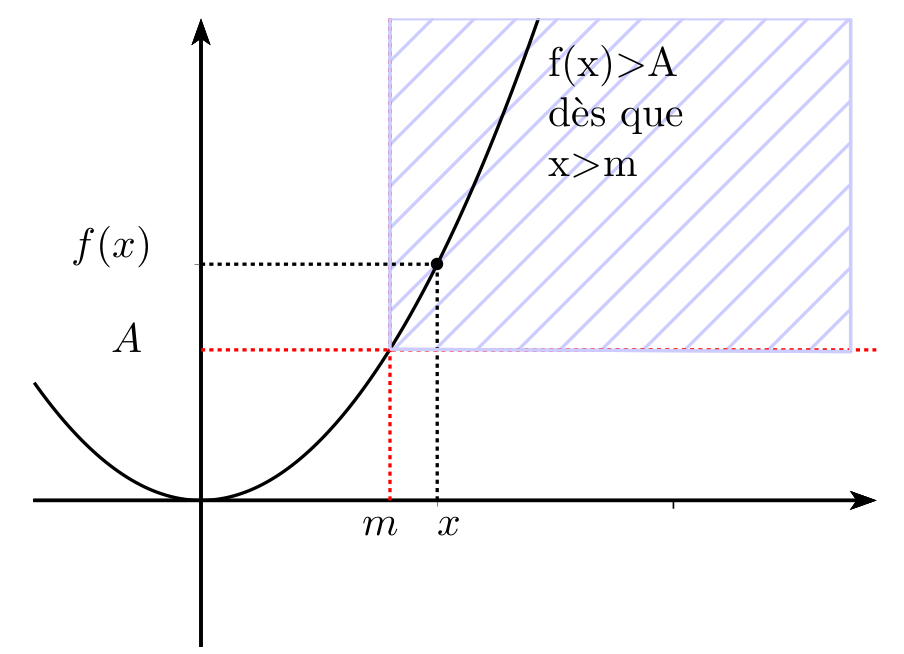
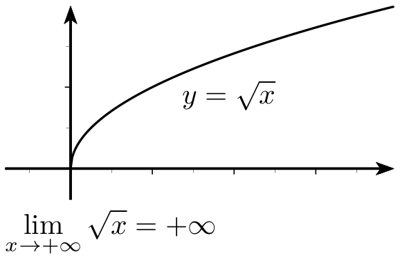

# Limites d'une fonction vers l'infini

La limite d'une fonction lorsque $x$ tend vers $+\infty$ est très semblable à la limite d'une suite !

## Limites infinies

!!! info "Définition"
    $f$ a pour limite  $+\infty$ en $+\infty$ si les images $f(x)$ sont plus grandes que n'importe quel réel donné à condition de prendre $x$ assez grand c'est-à-dire si tout intervalle $]A,+\infty[$ (avec A réel) contient toutes les valeurs $f(x)$ pour $x$ assez grand.

    \[
    \lim_{x \to +\infty} f(x) = +\infty \equivaut\ \forall\ A\ \in\ \R\ \exists\ m\ \in\ \R\ :\ \forall\ x\ \geq\ m\ f(x)\geq A
    \]

    [{.Center_lien .Vignette}](../Image/Cours_001.png)

    
!!! info "Définition"
    $f$ a pour limite $-\infty$ en $+\infty$ si les images $f(x)$ sont plus petites  que n'importe quel réel donné à condition de prendre $x$ assez grand c'est-à-dire si tout intervalle $]-\infty,A [$ (avec A réel) contient toutes les valeurs $f(x)$ pour $x$ assez grand.
    
    \[
    \lim_{x \to +\infty} f(x) = -\infty \equivaut\ \forall\ A\ \in\ \R\ \exists\ m\ \in\ \R\ :\ \forall\ x\ \geq\ m\ f(x)\leq A
    \]

    [{.Center_lien .Vignette}](../Image/Cours_002.png)

    

De même, lorsque $x$ tend vers $-\infty$

???- info "Définition"
    $f$ a pour limite  $+\infty$ en $-\infty$ si les images $f(x)$ sont plus grandes que n'importe quel réel donné à condition de prendre $x$ assez petit (donc &laquo; grand négatif &raquo;) c'est-à-dire si tout intervalle $]A,+\infty[$ (avec A réel) contient toutes les valeurs $f(x)$ pour $x$ assez petit (donc &laquo; grand négatif &raquo;).

    \[
    \lim_{x \to -\infty} f(x) = +\infty \equivaut\ \forall\ A\ \in\ \R\ \exists\ m\ \in\ \R\ :\ \forall\ x\ \leq\ m\ f(x)\geq A
    \]
    

???- info "Définition"
    $f$ a pour limite $-\infty$ en $-\infty$ si les images $f(x)$ sont plus petites  que n'importe quel réel donné à condition de prendre $x$ assez petit (donc &laquo; grand négatif &raquo;) c'est-à-dire si tout intervalle $]-\infty,A [$ (avec A réel) contient toutes les valeurs $f(x)$ pour $x$ assez petit (donc &laquo; grand négatif &raquo;).
    
    \[
    \lim_{x \to -\infty} f(x) = -\infty \equivaut\ \forall\ A\ \in\ \R\ \exists\ m\ \in\ \R\ :\ \forall\ x\ \leq\ m\ f(x)\leq A
    \]

!!! tip "Limites de fonctions de références"
    $\dlim{x}{+\infty}x^2=+\infty$ et $\dlim{x}{-\infty}x^2=+\infty$ 

    [{.Center_lien .Vignette}](../Image/Cours_003.png)

    Plus généralement, pour tout entier $p \geq 1$,

    $\dlim{x}{+\infty}x^p=+\infty$

    \[
    \dlim{x}{-\infty}x^p = \left\{
    \begin{array}{l}
    +\infty  \text{ si $p$ est pair } \\
    -\infty \text{ si $p$ est impair }
    \end{array}
    \right.
    \]

    $\dlim{x}{+\infty}\sqrt{x}=+\infty$

    [{.Center_lien .Vignette}](../Image/Cours_004.png)

    $\dlim{x}{+\infty}e^x=+\infty$

    [{.Center_lien .Vignette}](../Image/Cours_005.png)

???- tip "Suite définie explicitement"
    Si une fonction $f$ a pour limite $\pm\infty$ en $+\infty$ , la suite définie par $u_n=f(n)$ a la même limite.

    ???- danger "ATTENTION"
        Attention la réciproque est fausse !
        
        Contre-exemple : $f(x) = x\sin\left( \dfrac{\pi}{2}+2\pi x \right)$

        - $f(n)=n\sin(\dfrac{\pi}{2})=n$ donc la suite $\left( f(n) \right)$ diverge vers $+\infty$ 
        - $f$  n'a pas pour limite $+\infty$ en $+\infty$ [ggb](AFAIRE)

## Limite finie à l'infini. Asymptote horizontale

!!! info "Définition"
    Soit $f$ une fonction définie au moins sur un intervalle $]a,+\infty[$.

    $f$ a pour limite le réel $\ell$ quand $x$ tend vers $+\infty$ si les images $f(x)$ sont aussi proches que l'on veut de $\ell$ à condition de prendre $x$ assez grand.
    
    On note $\dlim{x}{+\infty}f(x)=\ell$

    **De façon formalisée :**
    
    $\dlim{x}{+\infty}f(x)=\ell$ si et seulement si tout intervalle ouvert contenant $\ell$ c'est-à-dire de la forme $]\ell-\epsilon,\ell+\epsilon[$ (avec $\epsilon>0$) contient toutes les valeurs $f(x)$ pour $x$ assez grand. 

    Ou encore ,  il existe $m$ tel que pour tout $x \geq m$ , on a  $f(x)\in ]\ell-\epsilon,\ell+\epsilon[$.

    \[
    \lim_{x \to +\infty} f(x)=\ell \equivaut \forall \epsilon >0\ \exists m \in \R\ :\ \forall x \geq m \quad |f(x)-\ell|< \epsilon
    \]

    [{.Center_lien .Vignette}](../Image/Cours_006.png)

De même lorsque $x$ tend vers $-\infty$ :

???- info "Définition"
    Soit $f$ une fonction définie au moins sur un intervalle $]-\infty; a[$.

    $f$ a pour limite le réel $\ell$ quand $x$ tend vers $-\infty$ si les images $f(x)$ sont aussi proches que l'on veut de $\ell$ à condition de prendre $x$ négatif et assez grand en valeur absolue.

    On note $\dlim{x}{-\infty}f(x)=\ell$.

    **De façon formalisée} :**
    
    $\dlim{x}{+\infty}f(x)=\ell$ si et seulement si tout intervalle ouvert contenant $\ell$ c'est-à-dire de la forme $]\ell-\epsilon,\ell+\epsilon[$ (avec $\epsilon>0$) contient toutes les valeurs $f(x)$ pour $x$ négatif et assez grand en valeur absolue. 
    
    Ou encore ,  il existe $m$ tel que pour tout $x \leq m$ , on a  $f(x)\in ]\ell-\epsilon,\ell+\epsilon[$.

    \[
    \lim_{x \to -\infty} f(x)=\ell \equivaut \forall \epsilon >0\ \exists m \in \R\ :\ \forall x \leq m \quad |f(x)-\ell|< \epsilon
    \]

!!! info "Asymptote horizontale"
    **Interprétation graphique de la limite en $\pm\infty$**
    
    La droite d'équation $y=\ell$ est **asymptote horizontale**  à la courbe représentant $f$ en $+\infty$ (resp $-\infty$) si et seulement si $\dlim{x}{+\infty}f(x)=\ell$  (resp. $\dlim{x}{-\infty}f(x)=\ell$).

!!! tip "Limite de fonctions de références"
    $\dlim{x}{-\infty}\dfrac1x=0$ et $\dlim{x}{+\infty}\dfrac1x=0$

    [{.Center_lien .Vignette}](../Image/Cours_007.png)

    **L'axe des abscisses est asymptote horizontale** à la courbe en $-\infty$ et $+\infty$.

    $\dlim{x}{-\infty}e^x=0$

    **L'axe des abscisses est asymptote horizontale** à la courbe en $-\infty$.