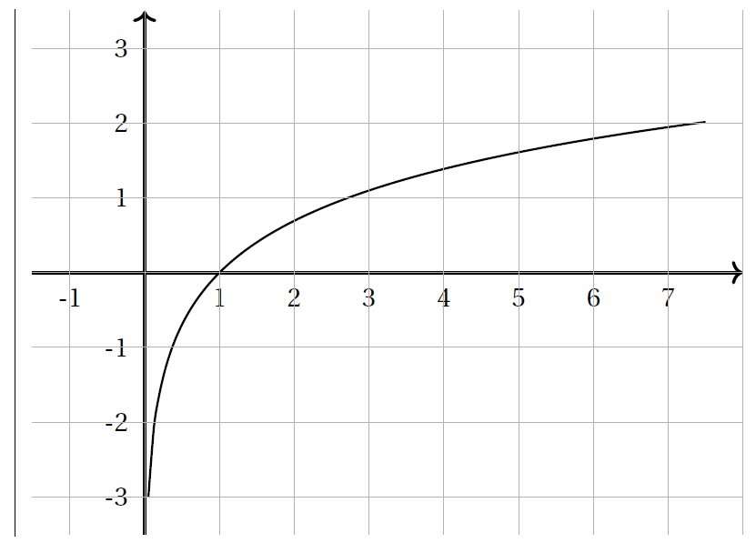

# La fonction logarithme népérien

## Définition

La fonction exponentielle étant continue et strictement croissante sur $\R$, pour tout réel $a>0$ l'équation $\ex^x = a$ , a une unique solution appelée logarithme népérien  de $a$ et notée  $\ln(a)$.

<iframe scrolling="no" title="Construction point par point" src="https://www.geogebra.org/material/iframe/id/tmrvs3rf/width/1906/height/862/border/888888/sfsb/true/smb/false/stb/false/stbh/false/ai/false/asb/false/sri/false/rc/false/ld/false/sdz/false/ctl/false" width="1906px" height="862px" style="border:0px;"> </iframe>

La fonction exponentielle et la fonction logarithme  népérien sont des fonctions réciproques. Dans un repère orthonormal les courbes représentatives des fonctions exponentielles et logarithme népérien sont symétriques par rapport à la droite d'équation $y = x$.

!!! info "La fonction logarithme"
	
	La fonction définie pour $x>0$ par $f(x)= \ln(x)$  est appelée fonction logarithme népérien. C'est la fonction réciproque de la fonction exponentielle. Ainsi : 
	
	\[
		\left. \begin{array}{lcl}
		y = \ln(x) \\
		\text{ et } x>0
		\end{array} \right\}  \equivaut x=\ex^y 
	\]

	Remarque : l'image d'un réel $x$ par la fonction  $\ln$  se note souvent $\ln x$  au lieu de $\ln(x)$.

!!! info "Conséquence immédiate"

	- Pour tout réel $x>0$, $\ex^{\ln x} = x$.
	- Pour tout réel $x$, $\ln \left( \ex^x \right) = x$.
	- $\ln 1= 0$ car $\ex^0 = 1$
	- $\ln \ex= 1$ car $\ex^1 = \ex$
	- $\ln \left( \dfrac{1}{\ex} \right)= -1$ car $\ex^{-1} = \dfrac{1}{\ex}$

???- example "Exemple"

	Simplifier les écritures :

	1. $\ln \ex^2 =$
	2. $\ln \ex^{-3} =$
	3. $\ex^{\ln 6} =$
	4. $\ex^{\ln 2+\ln 3} =$

	???- done "Réponse"
		
		1. $\ln \ex^2 = 2$
		2. $\ln \ex^{-3} = -3$
		3. $\ex^{\ln 6} = 6$
		4. $\ex^{\ln 2+\ln 3} = \ex^{\ln 2} \times \ex^{\ln 3} = 2 \times 3 = 6$

???- example "Exemple"
	Déterminer une solution aux équations suivantes :

	1. $\ln x = 4$
	2. $\ln x = -2$
	3. $3 \ln x = 2$
	
	???- done "Réponse"
		
		1. $\ln x = 4$  
        $x=\ex^4$
		2. $\ln x = -2$  
        $x = \ex^{-2}$
		3. $3 \ln x = 2$  
        $x = \ex^{\frac{2}{3}}$

## Propriétés

### Calcul et logarithme

!!! info "Propriétés algébriques"
	- Pour tous réels $a>0$ et $b>0$ : $\ln (ab)= \ln a + \ln b$.
	- Pour tout réel $a>0$ : $\ln \left( \dfrac{1}{a} \right) = - \ln a$.
	- Pour tous réels $a>0$ et $b>0$ : $\ln \left( \dfrac{a}{b} \right) = \ln a - \ln b$.
	- Pour tout réel $a>0$ et pour tout entier $n \in \Z$, $\ln \left( a^n \right) = n \ln a$.
	- Pour tout réel $a>0$ : $\ln \left( \sqrt{a} \right) = \dfrac{1}{2} \ln (a)$.
	
???- abstract "Démonstration"

	- Notons $x=\ln(ab)$.
	
	\begin{eqnarray*}
		x = \ln (ab) & \equivaut & \ex^x = \ex^{\ln(ab)}\\
		& \equivaut & \ex^x = ab\\
		& \equivaut & \ex^x = \ex^{\ln(a)} \times \ex^{\ln(b)}\\
		& \equivaut & \ex^x = \ex^{\ln(a)+\ln(b)}\\
		& \equivaut & x = \ln(a)+\ln(b)\\
	\end{eqnarray*}
	
	- Notons $x=\ln \left( \dfrac{1}{a} \right)$.

	\begin{eqnarray*}
		x=\ln \left( \dfrac{1}{a} \right) & \equivaut & \ex^x = \ex^{\ln \left( \frac{1}{a} \right)} \\
		& \equivaut & \ex^x = \dfrac{1}{a} \\
		& \equivaut & \ex^x = \dfrac{1}{\ex^{\ln a}}  \\
		& \equivaut & \ex^x = \ex^{-\ln a}  \\
		& \equivaut & x = -\ln a  
	\end{eqnarray*}

	- En utilisant les deux propriétés pérécedentes:

	- Notons $x=\ln \left( a^n \right)$
	
	\begin{eqnarray*}
		x=\ln \left( a^n \right) & \equivaut  & \ex^x = \ex^{\ln \left( a^n \right)}  \\
		& \equivaut & \ex^x = a^n\\
		& \equivaut & \ex^x = \left( \ex^{\ln a}\right)^n\\
		& \equivaut & \ex^x =  \ex^{n\ln a}\\
		& \equivaut & x = n\ln a
	\end{eqnarray*}

	\item Notons $A = \sqrt{a}$ et $x = \ln(a)$
	
	\begin{eqnarray*}
		x = ln (A^2) & \iff & x = 2\ln(A)\\
		& \iff & \dfrac{1}{2} x = \ln(A)
	\end{eqnarray*}
	
	Donc $\dfrac{1}{2} \ln(a) = \ln(\sqrt{a})$

!!! info "Variations de la fonction logarithme"
	La fonction $\ln$ est strictement croissante sur  $]0, +\infty[$.

### Résolution d'équation et d'inéquation

!!! info "Conséquences"

	- Si $a>0$ et $b>0$ : $\ln a = \ln b$ équivaut à $a=b$.
	- Si $a>0$ et $b>0$ : $\ln a < \ln b$ équivaut à $a < b$.
	- $\ln a >0$ équivaut à $a>1$.
	- $\ln a <0$ équivaut à $0<a<1$.

???- example "Exemple"

	Résoudre dans $\R$ l'équation : $\ln (2x-1) = \ln (x-2)$

	???- done "Réponse"
	
    	- **Domaine d'étude :** on cherche les réels $x$ tels que $2x-1>0$ c'est-à-dire $x>\dfrac{1}{2}$ **et** $x-2>0$   c’est-à-dire $x>2$. Donc $D=\left] \dfrac{1}{2} ; +\infty \right[ \cap ]2 ; +\infty[ = ]2 ; +\infty[$.
    	- On résout alors l'équation sur $D=]2 ;+\infty[$

    	\begin{eqnarray*}
    		\ln(2x-1)= \ln(x-2) & \equivaut & 2x-1 = x-2 \text{ et } x \in ]2 ;+\infty[ \\
    		& \equivaut & x = -1  \text{ et } x \in ]2 ;+\infty[ 
    	\end{eqnarray*}

    	- Mais $-1 \notin ]2 ;+\infty[$ , donc l'équation n'a pas de solution. Donc $S=\{ \emptyset \}$

???- example "Exemple"
	
	Résoudre dans l'équation : $\ln(x+1) + \ln(x+3) = \ln(x+7)$.

	???- done "Réponse"

		- **Domaine d'étude :** on cherche les réels $x$ tels que $x+1>0$ et $x+3>0$ et $x+7>0$. Donc $x\in ]-1;+\infty[ \cap ]-3;+\infty[ \cap ]-7 ; +\infty[ = ]-1 ; +\infty[$ .
		- On résout alors l'équation sur $D=]-1 ; +\infty[$.
		
		\begin{eqnarray*}
			\ln(x+1) + \ln(x+3) = \ln(x+7) & \equivaut & \ln((x+1)(x+3))= \ln(x+7)  \text{ et } x \in ]-1 ;+\infty[ \\
			& \eq &  x^2+4x+3=x+7  \text{ et } x \in ]-1 ;+\infty[ \\
			& \eq &  x^2+3x-4=0  \text{ et } x \in ]-1 ;+\infty[ \\
			& \eq & ( x=-4 \text{ ou } x=1 ) \text{ et } x \in ]-1 ;+\infty[ 
		\end{eqnarray*}

		- Comme $-4 \notin ]-1 ; +\infty[$, $S=\{ 1 \}$.

???- example "Exemple"
	Résoudre dans l'inéquation:  $\ln(x^2 - 4) \leq \ln x$.

	???- done "Réponse"
		- **Domaine d'étude :** On cherche les réels $x$ tels que $x^2-4>0$ et $x>0$. Donc $D=]2 ; +\infty[$.
		- On résout sur $D=]2 ; +\infty[$.
		
		\begin{eqnarray*}
		\ln(x^2 - 4) \leq \ln x & \eq & x^2-4 \leq x   \text{ et } x \in ]2 ;+\infty[ \\
		& \eq & x^2-x-4 \leq 0  \text{ et } x \in ]2 ;+\infty[\\
		& \eq & x\in \left[ \dfrac{1-\sqrt{17}}{2} ; \dfrac{1+\sqrt{17}}{2} \right]   \text{ et } x \in ]2 ;+\infty[
		\end{eqnarray*}

		- Donc $S =  \left] 2 ; \dfrac{1+\sqrt{17}}{2} \right]$.

???- example "Exemple"
	Résoudre dans $\R$ :

	1. L'équation $(E)$ : $2(\ln x )^2 -3 \ln x +1 = 0$
	2. L'inéquation $(F)$ : $2(\ln x )^2 -3 \ln x +1 \geq 0$
	
	???- done "Réponse"
		On pose $X = \ln x$, avec $x>0$.
		
		1. \begin{eqnarray*}
		(E) & \eq & 2X^2-3X+1 = 0 \text{ et } X=\ln x \text{ et } x>0\\
		& \eq & \left( X_1=1 \text{ ou } X_2 = \dfrac{1}{2} \right) \text{ et } X=\ln x \text{ et } x>0\\
		\end{eqnarray*}
		
		On résout alors $\ln x = 1 \eq x = \ex$ et $\ln x =\dfrac{1}{2} \eq x = \sqrt{\ex}$.
		
		Donc $S = \left\{ \ex ; \sqrt{\ex} \right\}$
		
		2. \begin{eqnarray*}
		(F) & \eq & 2X^2-3X+1 \geq 0 \text{ et } X=\ln x \text{ et } x>0\\
		& \eq & \left( X< \dfrac{1}{2} \text{ ou } X>1 \right) \text{ et } X=\ln x \text{ et } x>0\\
		\end{eqnarray*}

		On résout alors $\ln x < \dfrac{1}{2} \eq x < \sqrt{\ex}$ ou $\ln x > 1 \eq x > \ex$. Comme $x>0$, $S=\left]0 ; \sqrt{\ex} \right] \cup [\ex ; +\infty [$

???- example "Exemple"
	Une voiture perd en moyenne $15\%$ de son prix en un an.
	
	Au bout de combien d'années a-t-elle perdu la moitié de sa valeur?

	???- done "Réponse"
		Diminuer un prix de $15\%$ chaque année revient à multiplier le prix précédent par $0.85$. Donc $(P_n)_{n \in \N}$ est une suite géométrique de raison $0.85$ et de premier terme $P_0$. Donc pour tout $n \in \N$, $P_n = P_0 \times 0.85^n$. On veut résoudre $P_n \leq \dfrac{P_0}{2}$
		
		\begin{eqnarray*}
		P_n \leq \dfrac{P_0}{2} & \eq & P_0 \times 0.85^n \leq \dfrac{P_0}{2}\\
		& \eq & 0.85^n \leq \dfrac{1}{2} \text{ car } P_0>0\\
		& \eq & \ln \left( 0.85^n \right) \leq 0.5 \\
		& \eq & n \times \ln 0.85 \leq 0.5\\
		& \eq & n \geq \dfrac{0.5}{\ln(0.85)} \text{ car } \ln 0.85 <0\\
		& \eq & n \geq 4.26
		\end{eqnarray*}

		Donc au bout de 5 ans , la voiture a perdu la moitié de sa valeur.

# Etude de la fonction logarithme népérien

## Variations

!!! info "Dérivée de la fonction $\ln$"

	La fonction $\ln$ est dérivable sur $]0,+\infty[$ et pour tout réel $x$ de $]0,+\infty[$, et a pour dérivée  $\dfrac{1}{x}$.

	\[
	\left( \ln x \right)' = \dfrac{1}{x}
	\]

???- tip "Primitive"
	Ainsi d'après le théorème précédent, les primtives de $h(x) = \dfrac{1}{x}$ sont $\ln(x) + k$, $k \in \R$.

???- abstract "Démonstration"
	On admet que la fonction logarithme népérien est dérivable sur $]0 ; +\infty[$.  
	On considère la fonction $f$ définie, pour tout $x>0$, par $f(x)=\ex^{\ln x} -x$.  
	$f'(x)=(\ln(x))' \times \ex^{\ln x} -1= (\ln(x))' \times x -1$.  
	Or $f(x)=0$ pour tout $x>0$, donc $f'(x)=0$.  
	Donc pour tout $x>0$, $(\ln(x))' \times x -1=0$. Donc $(\ln(x))' =\dfrac{1}{x}$, pour tout $x>0$.

!!! info "Conséquence"
	
	- La fonction $\ln$ est continue sur $]0 ; +\infty[$ (car elle est dérivable sur $]0 ; +\infty[$).
	- Comme la fonction $\ln$ est dérivable en $1$, donc $\dlim{h}{0} \dfrac{\ln(1+h)-\ln(1)}{h} = \ln'(1)=1$ donc :
	
	\[
	\dlim{x}{0} \dfrac{\ln(1+x)}{x} =1
	\]

!!! info "Variations (suite)"

	La fonction $\ln$ est strictement croissante sur $]0 ; +\infty[$ et 
	
	\[
		\dlim{x}{+\infty} \ln x = +\infty \qquad \dlim{x}{0^+} \ln x = -\infty
	\]

	Donc la courbe de la fonction $\ln$ possède une asymptote verticale d'équation $x=0$.

	[{.Center_lien .VignetteMed}](../Image/courbe001.png)

	[{.Center_lien .VignetteMed}](../Image/courbe002.png)

???- abstract "Démonstration partielle"
	On admet que $\dlim{x}{+\infty} \ln(x) = +\infty$.  
	Pour $\dlim{x}{0^+} \ln(x)$, on pose $X=\dfrac{1}{x}$.

	Alors $\ln(x) = \ln\left( \dfrac{1}{X} \right)= -\ln(X)$.
	
	Or si $x$ tend vers $0^+$, $X$ tend vers $+\infty$. Donc $\dlim{x}{0^+} \ln(x) = \dlim{X}{+\infty} -\ln(X) = -\infty$.

???- example "Exemple"
	Déterminer l'équation de la tangente à la courbe de $\ln$ au point d'abscisse 1.

???- example "Exemple"
	Après avoir étudier la convexité de la fonction $\ln$ sur $\R$, déterminer la position relative de sa courbe et de la droite d'équation $y=x-1$.

???- example "Exemple"
	f est la fonction définie sur $]0; +\infty[$ par $f(x) = (\ln x)^2$ .

	1. Etudier les limites de $f$ en $0$ et en $+\infty$.
	2. Déterminer la fonction dérivée de $f$. 
	3. Etudier le signe de $f'(x)$ et en déduire le sens de variation de $f$. 
	4. Dresser le tableau de variation de $f$. 
	5. Tracer la courbe représentative de f dans un repère orthonormé. 

	???- done "Réponse"

		<ol>
		<li> $\left\{ \begin{array}{l}
		\dlim{x}{0} \ln(x) = -\infty\\
		\dlim{x}{-\infty} X^2 = +\infty
		\end{array} \right.$

		Donc par composée, $\dlim{x}{0} \left( \ln(x) \right)^2 = +\infty$.

		$\left\{ \begin{array}{l}
		\dlim{x}{+\infty} \ln(x) = +\infty\\
		\dlim{x}{+\infty} X^2 = +\infty
		\end{array} \right.$
	
		Donc par composée, $\dlim{x}{+\infty} \left( \ln(x) \right)^2 = +\infty$.
		</li>
		<li> $f'(x) =2\times  \dfrac{1}{x} \times \ln(x)$
		</li>
		<li> Sur $]0 ; + \infty[$, $\dfrac{2}{x}>0$, donc $f'$ est du signe de $\ln(x)$.

		[{.Center_lien .VignetteMed}](../Image/courbe003.png)

		</li>
		</ol>

## Limites

!!! info "Croissance comparée"

	-  $\dlim{x}{+\infty} \ \dfrac{\ln x}{x} = 0$.
	- $\dlim{x}{0} \ x \ln x = 0$.
	- Pour tout $n\in\N^*$, $\dlim{x}{+ \infty} \ \dfrac{\ln x}{x^n} = 0$.
	- Pour tout $n\in\N^*$, $\dlim{x}{0} \ x^n \ln x  = 0$.

???- abstract "Démonstration"

	1. Soit $f(x)=\ln(\sqrt{x})-\sqrt{x}$ définie sur $I=]1;+\infty[$

		1. Etudier les variations de $f$ sur $I$.
		2. En déduire le signe de $f$ sur $I$.
		3. En déduire que pour tout $x>1$, $0<\ln(\sqrt{x}) \leq \sqrt{x}$.
		4. En déduire que $\dlim{x}{+\infty} \dfrac{\ln x}{x} = 0$.

	2. Déterminer, en utilisant la limite précédente, $\dlim{x}{0} x \ln x$.

	???- done "Réponse"

		<ol>
		<li><ol>
		<li> Calcul de $f'$ sur $]1;+\infty[$.  

		\begin{eqnarray*}
		f'(x) & = & \dfrac{\dfrac{1}{2\sqrt{x}}}{\sqrt{x}}-\dfrac{1}{2\sqrt{x}}\\
		& = & \dfrac{1}{2x}-\dfrac{1}{2\sqrt{x}}\\
		& = & \dfrac{1-\sqrt{x}}{2x}\\
		\end{eqnarray*}  
		
		Sur $]1 ; +\infty[$, $2x>0$ et $\sqrt{x}>1$ (la fonction $x \mapsto \sqrt{x}$ est croissante sur $]1 ; +\infty[$), donc $f'(x)<0$ sur $]1 ; +\infty[$.  
		Donc $f$ est décroissante sur $]1 ; +\infty[$.  
		</li>
		<li> Comme $f(1)=-1$ et que $f$ est décroissante sur $]-1;+\infty[$, le maximum de $f$ est $-1$. Donc $f$ est négative sur  $]1;+\infty[$.
		</li>
		<li> Comme $f(x)\leq 0$ sur $]1;+\infty[$, $0<\ln(\sqrt{x}) \leq \sqrt{x}$.
		</li>
		<li> Pour tout $x \in ]1;+\infty[$ :
		
		\begin{eqnarray*}
		0<\ln(\sqrt{x}) \leq \sqrt{x} & \equivaut & \dfrac{0}{x} < \dfrac{\ln(\sqrt{x})}{x} \leq \dfrac{\sqrt{x}}{x} \quad \text{ car } x>1 \\
		& \equivaut & 0 < \dfrac{\dfrac{1}{2}\ln(x)}{x} \leq \dfrac{1}{\sqrt{x}} \\
		& \equivaut & 0 < \dfrac{\ln(x)}{x} \leq \dfrac{2}{\sqrt{x}}
		\end{eqnarray*}

		Comme $\dlim{x}{+\infty} 0 =0$ et $\dlim{x}{+\infty} \dfrac{2}{\sqrt{x}} = 0$, d'après le théorème d'encadrement $\dlim{x}{+\infty} \dfrac{\ln(x)}{x} =0$
		</li>
		</ol>
		</li>
		<li> On pose $X=\dfrac{1}{x}$.

		$\left\{ \begin{array}{l}
		\dlim{x}{0} \dfrac{1}{x} = + \infty\\
		\dlim{X}{+\infty} \dfrac{\ln(X)}{X} = 0
		\end{array} \right.$

		Donc par composée, $\dlim{x}{0} \dfrac{\ln\left( \dfrac{1}{x} \right)}{\dfrac{1}{x}} =0$.
		
		Donc $\dlim{x}{0} -x\ln(x) = 0$. D'où $\dlim{x}{0} x \ln(x) =0$.
		</li>
		</ol>

???- example "Exemple"
	Montrer que  la suite $(v_n)$ définie pour $n\geq 1$ par  $v_n = \dfrac{\ln n}{n}$   est bornée.
	
	???- done "Réponse"
		Comme $\dlim{n}{+\infty} \dfrac{\ln (n)}{n} =0$ (par croissance comparée), alors la suite $v_n$ est bornée.
		
		En effet, comme $\dlim{n}{+\infty} \dfrac{\ln(n)}{n}=0$, pour un réel $\epsilon$ il existe un rang $N_0$ à partir duquel $|v_n - 0 | < \epsilon$.
		
		Donc, $\forall n \geq N_0$,  $\ -\epsilon < v_n < \epsilon$.

		Si $n<N_0$,  $\min(v_1,v_2,\ldots,v_{\displaystyle  N_0}) < v_n < \max(v_1,v_2,\ldots,v_{N_0})$.

		Donc $(v_n)$ est bornée.

## La composée $\ln(u(x))$

!!! info ""
	Si $u$ est une fonction **strictement positive** et dérivable sur un intervalle $I$ ouvert alors la fonction $f$ définie sur $I$ par $f(x) = \ln(u(x))$ est dérivable sur $I$ et pour tout $x\in I$ , $f'(x) = \dfrac{u'(x)}{u(x)}$, i.e.

	\[
	\left( \ln(u(x)) \right)' = \dfrac{u'(x)}{u(x)}
	\]

???- example "Exemple"
	Calculer la dérivée de sfonctions suivantes :

	1. $f(x) = \ln(x^2+3)$
	2. $f(x) = \dfrac{\ln(2x+3)}{x-1}$
