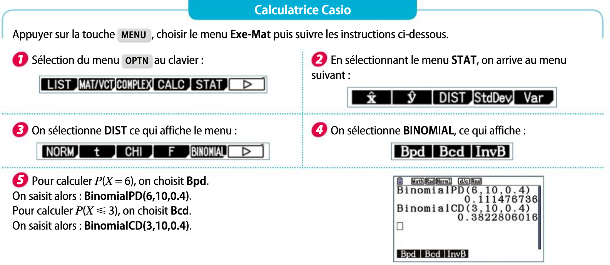

# Probabilité : rappel

!!! info "Rappel : probabilité conditionnelle"

    Pour tous événements $A$ et $B$ d'un même univers $\Omega$ avec  $P(B)\neq 0$ et $P(A)\neq 0$ , on a : 

    \[
    \Pb(A\cap B)=\Pb_B(A)\times \Pb(B) = \Pb_A(B)\times  \Pb(A)
    \]

???- tip "Astuce"

    En conséquence,sous les hypothèses précédentes :

    \[
    \Pb_B(A) = \dfrac{\Pb(A\cap B)}{\Pb(B)}
    \]

    \[
    \Pb_A(B) = \dfrac{\Pb(A\cap B)}{\Pb(A)}
    \]

En général on construit un arbre pondéré avec les notations et lois suivantes :

- **Loi des noeuds** : La somme des probabilités affectées aux branches issues d'un même noeud est égale à 1.
- **Loi des chemins** : La probabilité d'un évènement correspondant à un chemin est égale au produit des probabilités de chaque branche de ce chemin.
- La probabilité d'un évènement  correspondant à  plusieurs chemins est la somme des probabilités de ces  chemins.

[{.Center_lien .VignetteMed}](../Image/arbre.png)

!!! info "Evénements indépendants"
    On dit que $A$ et $B$ sont des événements **indépendants** si et seulement si $\Pb(A\cap B)=\Pb(A)\times \Pb(B)$.

???- warning "Indépendants et incompatibles"
    Ne pas confondre "indépendants" et "incompatibles".
    
    En effet si $A$ et $B$ sont incompatibles , de probabilités non nulles alors  $\Pb(A\cap B)=0$.
    
    Mais $\Pb(A)\times \Pb(B) \neq 0$ donc $A$ et $B$ ne sont pas indépendants.

# Succession d'épreuves indépendantes

!!! info "Succession d'épreuves"
    Soit $n \in \N$. On note $E_i$, pour $1\leq i \leq n$, $n$ épreuves indépendantes issues respectivement des univers $\Omega_i$. La succession de ces $n$ épreuves successives est une épreuve dont les issues sont les éléments de l'univers $\Omega_1 \times \Omega_2 \times \ldots \times \Omega_n$.

???- example "Exemple"
    Il y a 3 urnes : l'une avec des jetons numérotés entre 1 et 4, la deuxième avec des numéros entre 1 et 6 et la dernière avec des numéros entre 1 et 8. On prélève successivement (dans l'ordre décrit précédemment) un jeton dans ces urnes. Cette succession d'épreuves est associée à l'univers $\{1;2;3;4\} \times \{1;2;3;4;5;6 \} \times \{1;2;3;4;5;6;7;8\}$.
    
    Une issue possible est $(2;6;7)$.

!!! info "Théorème"
    Soit une succession de $n$ **épreuves indépendantes**.

    La probabilité d'obtenir une issue $(x_1;x_2;\ldots;x_n)$ est :

    \[
    \Pb(x_1;x_2;\ldots;x_n) = \Pb(x_1) \times \Pb(x_2) \times \ldots \times \Pb(x_n)
    \]

???- example "Exemple"
    Dans l'exemple précédent, la probabilité de $(2;5;7)$ est 
    
    $\Pb((2;5;7)) = \Pb(2) \times \Pb(5) \times \Pb(7) = \dfrac{1}{4} \times \dfrac{1}{6} \times \dfrac{1}{8} = \dfrac{1}{192}$.

???- tip "Cas des épreuves non indépendantes"
    Dans le cas d'une succession d'épreuve non indépendants, on revient à l'arbre pondéré !

    ???- example "Exemple"
        On tire au sort successivement deux boules sans remise dans une urne contenant 2 boules rouges et 3 boules vertes.
        
        Calculer la probabilité de l'événement $A$ : &laquo; obtenir exactement une boule rouge &raquo;.

        ???- done "Réponse"
            A l'aide d'un arbre, on trouve que $\Pb (A)= 0.4 \times 0.75+0.6 \times 0.5=0.6$.

???- tip "Remarque"
    Ici,  &laquo; succession d'épreuve &raquo; est une modélisation de la réalité. Il est possible d'avoir une situation réelle avec des événements simultanés mais elle serait modélisée par &laquo; une succession d'épreuves &raquo;.

    Par exemple, on lance (simultanément) trois dés de couleurs différentes et on note les numéros (toujours dans le même ordre, grâce aux couleurs). Cette situation peut se modéliser par une succession d'épreuve !

Pour cette année, on considère que des \textbf{épreuves sont indépendantes} lorsque :

- ou l'énoncé le précise clairement
- ou la situation est assimilée à un tirage avec remise.

???- example "Exemple"
    Dans une urne, il y  a 3 jetons rouges et 7 jetons verts. On tire successivement et avec remise 3 jetons de l'urne.
    
    1. Décrire explicitement une épreuve, la succession d'épreuve. Est-ce une succession indépendante ? Expliquer.

    2. Soit $E=\{R;V\}$. Exprimer l'univers $\Omega$ en fonction de $E$.
    
    3. En déduire la probabilité de l'issue $(R,R,V)$.

    ???- done "Réponse"
    
        1. L'épreuve est &laquo; tirer un jeton &raquo;. On répète successivement 3 fois cette épreuve. Il s'agit bien d'une succession indépendante car c'est un tirage avec remise.
        2. $\Omega=E^3$
        3. On note $R_i$ l'événement &laquo; avoir un jeton rouge au i-ème tirage&raquo;, et $V_i$ l'événement &laquo; avoir un jeton vert au i-ème tirage&raquo;.
        
        $\Pb((R,R,V))=\Pb(R_1) \times \Pb(R_2) \times \Pb(V_3)=0.3^2 \times 0.7$
        
        Rque : on notera plus simplement $\Pb((R,R,V))=\Pb(R) \times \Pb(R) \times \Pb(V)$

# Loi binomiale

## Schéma de Bernoulli

!!! info "Epreuve de Bernoulli"
    **Une épreuve (ou expérience) de Bernoulli** de paramètre $p$ est une expérience aléatoire présentant deux issues dont l'une, nommée &laquo; succès &raquo;, a pour probabilité $p$ et l'autre, nommée &laquo; échec &raquo; a pour probabilité $1-p$.

    - [La variable aléatoire](AFAIRE) qui prend la valeur $1$ en cas de succès et $0$ en cas d'échec est appelée **variable aléatoire de Bernoulli**.
    - La loi de probabilité de cette variable aléatoire (notée $X$ par exemple) est appelée **loi de Bernoulli de paramètre $\mathbf{p}$.**

    \[
    \begin{array}{|c|c|c|}
    \hline
    x_i & 0 & 1\\
    \hline
    \rule[-0.2cm]{0pt}{0.6cm} \Pb(X=x_i) & 1-p & p\\
    \hline
    \end{array}
    \]

???- example "Exemple"
    Une urne contient dix jetons indiscernables au toucher : 5 bleues, 2 jaunes et 3 rouges. On tire un jeton au hasard.
    
    - L'expérience qui consiste à observer la couleur du jeton tiré n'est pas une épreuve de Bernoulli car il y a 3 issues.
    - L'expérience qui consiste à observer si le jeton est jaune ou  non est une épreuve de Bernoulli. Si on choisit d'appeler &laquo; succès &raquo; : &laquo; obtenir un jeton jaune &raquo;, alors il s'agit d'une épreuve de Bernoulli de paramètre $p=\dfrac{2}{10}=\dfrac{1}{5}$.

!!!- warning "Succès ... discutable"
    Le choix de l'issue correspondant au succès dépend de l'énoncé ! Ce n'est pas toujours quelque chose de positif.

???- example "Exemple"
    Lors de la production de clous de 50 mm, on considère qu'un clou est conforme si sa taille est comprise entre 48 mm et 52 mm. On prélève un clou dans la chaîne de production. On note $X$ la variable aléatoire qui à un clou, associe $1$ si il n'est pas conforme, $0$ sinon.

    Donner la loi de probabilité de $X$, en sachant que la probabilité d'avoir un clou conforme est de $98.3 \%$.

    ???- done "Réponse"
        Il y a deux issues possibles &laquo; ne pas être conforme &raquo; et &laquo; être conforme &raquo;. $X$ est donc une variable aléatoire de Bernoulli. Or, elle associe $1$ si le clou n'est pas conforme. Donc le succès est  &laquo; Avoir un clou qui n'est pas conforme &raquo;. Donc sa loi de probabilité est la loi de Bernoulli de paramètre $p=0.017$.

        \[
        \begin{array}{|c|c|c|}
        \hline
        x_i & 0 & 1\\
        \hline
        \rule[-0.2cm]{0pt}{0.6cm} \Pb(X=x_i) & 0.983 & 0.017 \\
        \hline
        \end{array}
        \]

!!! info "Théorème"
    Si $X$ est une variable aléatoire qui suit une loi de Bernoulli de paramètre $p$, alors :

    - l'[espérance](AFAIRE) : $E(X)=p$
    - la [variance](AFAIRE) : $V(X)=p(1-p)$
    - l'[écart-type](AFAIRE) : $\sigma(X)=\sqrt{p(1-p)}$

???- abstract "Démonstration"
    A partir du tableau de la [loi de probabilité](#loi_prob_bin) :
    - $E(X)=(1-p) \times 0 + p \times 1 = p$
    - La variance :

    \begin{eqnarray*}
    V(X) & = & (1-p) \times (0 - E(X))^2 + p \times (1- E(X))^2\\
    & = & (1-p)p^2 + p(1-p)^2\\
    & = & (1-p)p \times \left( p+(1-p) \right)\\
    & = & (1-p)p
    \end{eqnarray*}

    - $\sigma(X) = \sqrt{V(X)} = \sqrt{p(1-p)}$.

!!! info "Schéma de Bernoulli"
    L'expérience aléatoire consistant en une succession de $n$ épreuves indépendantes de Bernoulli de paramètre $p$ ($p$ est donc la probabilité de succès à une épreuve) s'appelle **un schéma de Bernoulli de paramètre $\mathbf{n}$ et $\mathbf{p}$**.

!!! info "Théorème"
    L'univers des issues d'un schéma de Bernoulli de paramètres $n$ et $p$ est $\{0;1\}^n$.

???- example "Exemple"
    On lance un dé à six faces. On appelle succès &laquo; obtenir un 6 &raquo;. Répéter 3 fois cette épreuve de Bernoulli est un schéma de Bernoulli de paramètre $3$ et $p=\dfrac{1}{6}$.
    
    A l'aide d'un arbre, calculer $\Pb(X=1)$, où $X$ est la variable aléatoire de Bernoulli.

    ???- done "Réponse"
        Voici l'arbre :

        [{.Center_lien .VignetteMed}](../Image/arbre2.png)

        Les triplets formés d'un seul succès sont $(S;E;E),(E;S;E)$ et $(E;E;S)$. Or $\Pb((S;E;E)) =\Pb((E;S;E)) = \Pb((E;E;S)) = pq^2$.
        
        Donc $\Pb(X = 1)=3pq^2$

## Loi binomiale

!!! info "Loi binomiale"
    On considère un schéma de Bernoulli de paramètres $n$ (nombre de répétitions) et $p$ (probabilité d'un succès). La variable aléatoire $X$, qui, à chaque issue de cette expérience, associe le nombre de succès, suit \textbf{la loi binomiale de paramètre $\mathbf{n}$ et $\mathbf{p}$}.

    On note cette loi $\mathcal{B}(n;p)$ et on note $X \sim\mathcal{B}(n;p)$.

!!! tip "Méthode"
    Pour justifier qu'une variable aléatoire suit une loi binomiale :

    - on repère l'épreuve de Bernoulli et on note la probabilité du succès (le succès dépend de la phrase &laquo; $X$ compte le nombre de \ldots &raquo;);
    - on repère le schéma de Bernoulli ( une succession **indépendante** d'épreuve de Bernoulli) et on note le nombre de répétition;
    - on note que la variable aléatoire compte bien le nombre de succès.

!!! info "Théorème"
    $X$ est une variable aléatoire suivant **la loi binomiale** $\mathbf{\mathcal{B}}(n;p)$ et $k$ est un entier compris entre $0$ et $n$. La probabilité d'obtenir exactement $k$ succès parmi les $n$ tentatives est :

    \[
    \Pb(X=k) = \comb{n}{k} \times p^k \times (1-p)^{n-k}
    \]

    où $ \comb{n}{k}$ est le nombre de chemin comportant exactement $k$ succès parmi les $n$ tentatives. Il se lit &laquo; $k$ combinaison parmi $n$ &raquo;. Pour calculer ce nombre,  il est possible d'utiliser la calculatrice ou la formule suivante :

    \[  \comb{n}{k} = \dfrac{n!}{k! \times (n-k)!} \]

    où $k!=1 \times 2 \times \ldots \times k$ se lit &laquo; factorielle $k$ &raquo; (cf [chapitre post épreuve sur le dénombrement](AFAIRE)).

???- example "Exemple"
    La ville de Las Vegas accueille environ $100\,000$ touristes chaque jour. On estime que $5\%$ des touristes ne viennent pas à Las Vegas pour jouer au casino. On interroge au hasard $10$ touristes dans la rue. On note $Y$ la variable aléatoire qui compte le nombre de touristes témoignant ne pas être venus dans cette ville pour jouer.
    
    - Justifier que $Y$ suit une loi binomiale. Préciser ses paramètres.
    - Calculer la probabilité d'avoir exactement 2 touristes qui ne viennent pas pour jouer au casino, parmi les 10 touristes interrogés.

!!! tip "Méthode : utilisation de la calculatrice"
    Pour calculer $\begin{pmatrix} n\\ k \end{pmatrix}$

    ???- tip "Combinaison pour Casio, TI et Numworks"

        [{.Center_lien .VignetteMed}](../Image/Comb.png)
    
    ???- tip "Loi binomiale pour Casio"

        [{.Center_lien .VignetteMed}](../Image/Casio.png)
    
    ???- tip "Loi binomiale pour TI"

        [{.Center_lien .VignetteMed}](../Image/TI.png)

???- example "Exemple"
    On considère la variable aléatoire $X$ qui suit la loi $\mathcal{B}(20;0.36)$. Calculer à l'aide de la calculatrice :
    
    1. $\Pb(X=11)$
    2. $\Pb(X\leq 8)$
    3. $\Pb(X > 15)$
    4. $\Pb(X \geq 17)$
    5. $\Pb(12<X <15)$

???- example "Exemple"

    On lance $n$ fois une pièce équilibrée. Soit $X$ la variable aléatoire qui, à chaque série de $n$ laners, associe le nombre de &laquo; Pile &raquo; obtenus. Déterminer la plus petite valeur de $n$ telle que la probabilité d'obtenir au moins une fois &laquo; Pile &raquo; dépasse $0.999$.

    ???- done "Réponse"

        - L'épreuve de Bernoulli : on lance une pièce et on appelle succès &laquo; avoir Pile &raquo;. Donc $p=\dfrac{1}{2}$
        - Le schéma de Bernoulli : On répète $n$ fois cette expérience de façon indépendante.
        - $X$ est la variable qui, à chaque expérience, associe le nombre de succès.

        Donc $X$ suit une loi binomiale $\mathcal{B}\left( n ; \dfrac{1}{2}\right)$.

        \begin{eqnarray*}
        \Pb(X\geq 1) & = & 1-\Pb(X=0)\\
        & = & 1 - \comb{n}{0}\times \left( \dfrac{1}{2}\right)^0 \times \left( \dfrac{1}{2}\right)^{n-0}\\
        & = & 1-\left( \dfrac{1}{2}\right)^n
        \end{eqnarray*}

        On doit donc résoudre l'inéquation $1-\left( \dfrac{1}{2}\right)^n \geq 0.999$, soit $\left( \dfrac{1}{2}\right)^n \leq 0.001$.

        Avec la méthode par balayage, on trouve qu'à partir de $n=10$, la probabilité d'obtenir au moins un &laquo; Pile &raquo; est supérieure à $0.999$.

        cf [une autre méthode avec le logarithme](AFAIRE).

???- example "Exemple"

    Dans une chaîne de production pharmaceutique, la proportion de gélules non commercialisables en sortie de chaîne est $3\%$.
    Soit $X$ la variable aléatoire qui, à chaque échantillon de $200$ gélules (le prélèvement est assimilé à un tirage avec remise), associe le nombre de gélules non commercialisables.

    1. Quelle est la loi suivie par $X$ ? (Justifier)
    2. A l'aide d'une calculatrice, déterminer le plus petit entier $b$ tel que $\Pb(X \in [0;b]) \geq 0.9$. Interpréter ce résultat.
    3. A l'aide d'une calculatrice, déterminer les entiers $a$ et $b$ tels que $a$ est le plus petit entier tel que $\Pb(X\leq a) > 0.025$ et $b$ est le plus petit entier tel que $\Pb(X\leq b)\geq 0.975$.

    ???- done "Réponse"

        1. Le fait de choisir une gélule est une épreuve de Bernoulli dont le succès &laquo; la gélule est non commercialisable&raquo;  a pour probabilité $p=0.03$.
        
            La constitution de l'échantillon revient à réaliser $200$ fois de façon indépendante (en tant que tirage avec remise) cette épreuve de Bernoulli.
        
            Par ailleurs, $X$ compte le nombre de succès.

            Donc $X$ suit une loi binomiale $\mathcal{B}(200 ; 0.03)$.

        2. On utilise un tableau de valeur pour $\Pb(X\leq k)$, pour $k$ compris entre $0$ et $200$ :

            [{.Center_lien .VignetteMed}](../Image/Ex58.png)

            En parcourant les valeurs de la table, on obtient $b=9$, puisque $\Pb(X\leq 8) \approx 0.85$ et $\Pb(X\leq 9) \approx 0.92$.

            On peut affirmer qu'au moins $90\%$ des échantillons de 200 gélules ne contiennent pas plus de 9 gélules défectueuses

        3. En utilisant le même tableau de la calculatrice, on trouve $a=2$ et $b=11$.
        4. 

            \begin{eqnarray*}
            \Pb(X \in I) & = & \Pb(2 \leq X \leq 11)\\
            & = & \Pb(X \leq 11) - \Pb(X<2)\\
            & = & \Pb(X \leq 11) - \Pb(X\leq 1)
            \end{eqnarray*}
        
            Comme $a=2$ est le plus petit entier tel que $\Pb(X \leq a) > 0.25$, $\Pb(X \leq a-1) \leq 0.25$.

            Comme $\Pb(X \geq 11) \geq 0.975$ et $-\Pb(X \leq 1)\geq -0.25$, on trouve que $\Pb(X \leq 11) - \Pb(X \leq 1) \geq 0.975-0.025$.

            Donc $\Pb(X \in I) \geq 0.95$.

            La probabilité d'avoir entre 2 et 11 gélules non commercialisables est supérieure à $95\%$.

!!! info "Théorème"

    Si $X$ suit une loi binomiale de paramètre $n$ et $p$. Alors :

    - $E(X)=np$
    - $V(X)=np(1-p)$
    - $\sigma(X)=\sqrt{np(1-p)}$

