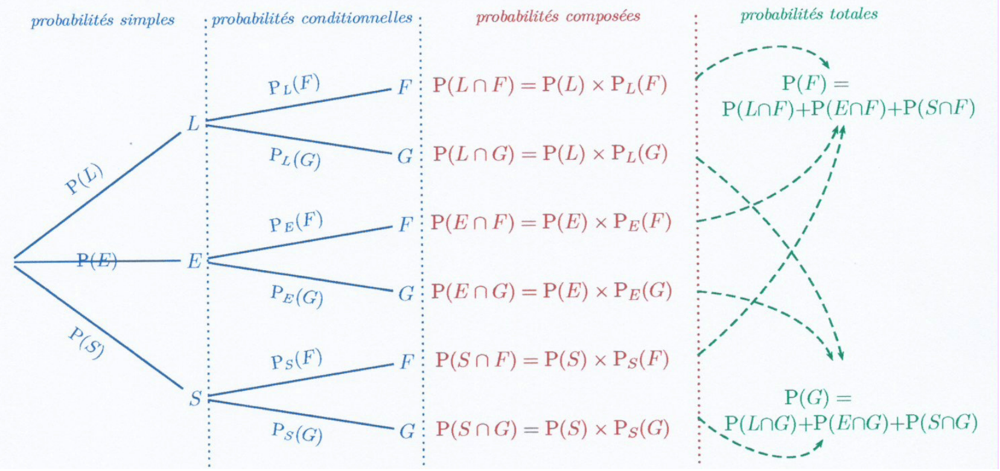

# Probabilité : rappel

!!! info "Rappel : probabilité conditionnelle"

    Pour tous événements $A$ et $B$ d'un même univers $\Omega$ avec  $P(B)\neq 0$ et $P(A)\neq 0$ , on a : 

    \[
    \Pb(A\cap B)=\Pb_B(A)\times \Pb(B) = \Pb_A(B)\times  \Pb(A)
    \]

???- tip "Astuce"

    En conséquence,sous les hypothèses précédentes :

    \[
    \Pb_B(A) = \dfrac{\Pb(A\cap B)}{\Pb(B)}
    \]

    \[
    \Pb_A(B) = \dfrac{\Pb(A\cap B)}{\Pb(A)}
    \]

En général on construit un arbre pondéré avec les notations et lois suivantes :

- **Loi des noeuds** : La somme des probabilités affectées aux branches issues d'un même noeud est égale à 1.
- **Loi des chemins** : La probabilité d'un évènement correspondant à un chemin est égale au produit des probabilités de chaque branche de ce chemin.
- La probabilité d'un évènement  correspondant à  plusieurs chemins est la somme des probabilités de ces  chemins.

[{.Center .VignetteMed}](../Image/arbre.png)

!!! info "Evénements indépendants"
    On dit que $A$ et $B$ sont des événements **indépendants** si et seulement si $\Pb(A\cap B)=\Pb(A)\times \Pb(B)$.

???- warning "Indépendants et incompatibles"
    Ne pas confondre "indépendants" et "incompatibles".
    
    En effet si $A$ et $B$ sont incompatibles , de probabilités non nulles alors  $\Pb(A\cap B)=0$.
    
    Mais $\Pb(A)\times \Pb(B) \neq 0$ donc $A$ et $B$ ne sont pas indépendants.