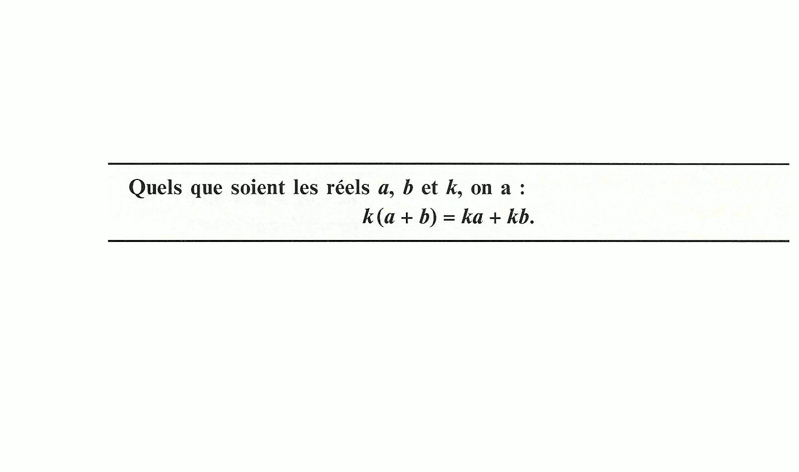
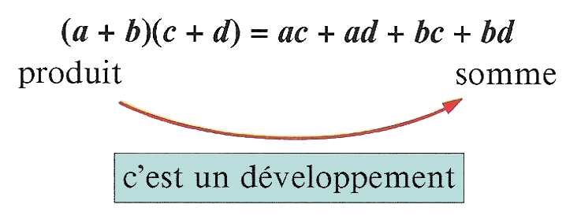

# Développement et factorisation

## Distributivité de la multiplication par rapport à l'addition

!!! info "Distributivité"
    Quels que soient les réels $a,b$ et $k$ on a :

    \[
    k(a+b) = ka + kb
    \]

    [{.Center_lien .Vignette60}](Image/Distrib.png)

## Développement

### Double disrtibutivité 

Développer : c'est transformer un produit en somme !

!!! info "La &laquo; double distributivité &raquo;"
    En utilisant la distributivité, on obtient :

    \[
    (a+b)(c+d) = ac + ad + bc + bd
    \]

    [{.Center_lien .Vignette30}](./Image/Dble_dist.png)

### Identité remarquable

!!! info "Formule d'identité remarquable"
    Pour tous réels $a$ et $b$ (mais il faut aussi imaginer des expressions, des fonctions à leur place) :

    \[
    \begin{eqnarray*}
    (a+b)^2 & = & a^2 + 2ab + b^2 \\
    (a-b)^2 & = & a^2 - 2ab + b^2 \\
    (a+b)(a-b) & = & a^2 - b^2
    \end{eqnarray*}
    \]

???- example "Exemple"

    Développer les expressions suivantes :
    <ol>
    <li>$(n+1)^2$</li>
    <li>$(x-1)^2$</li>
    <li>$(1-x)^2$</li>
    <li>$(2x+3)^2$</li>
    <li>$(5x-2)(5x+2)$</li>
    <li>$(\sqrt{2}+1)(\sqrt{2}-1)$</li>
    </ol>

    ???- done "Solution"

        <ol>
        <li>$(n+1)^2 = n^2 + 2n + 1$</li>
        <li>$(x-1)^2 = x^2-2x+1$</li>
        <li>$(1-x)^2 = 1-2x+x^2$</li>
        <li>$(2x+3)^2 = 4x^2+12x+9$</li>
        <li>$(5x-2)(5x+2) = 25x^2-4$</li>
        <li>$(\sqrt{2}+1)(\sqrt{2}-1) = (\sqrt{2})^2 - 1^2 = 1$</li>
        </ol>

???- info "Et au cube ?"

    En attendant la formule du binôme de Newton :

    

    \[
    \begin{eqnarray*}
    (a+b)^3 & = & a^3 + 3a^2b + 3ab^2 + b^3\\
    (a-b)^3 & = & a^3 - 3a^2b + 3ab^2 - b^3
    \end{eqnarray*}
    \]

    

    ???- done "Démonstration"
        En effet :

        \[
        \begin{eqnarray*}
        (a+b)^3 & = & (a+b)^2(a+b) \\
        & = & (a^2 + 2ab + b^2)(a+b) \\
        & = & a^3 +2a^2b + ab^2 + a^2b + 2ab^2 + b^3 \\
        & = & a^3 + 3a^2b + 3ab^2 + b^3
        \end{eqnarray*}
        \]

        et 

        \[
        \begin{eqnarray*}
        (a-b)^3 & = & (a-b)^2(a-b) \\
        & = & (a^2 - 2ab + b^2)(a-b) \\
        & = & a^3 -2a^2b + ab^2 - a^2b + 2ab^2 - b^3 \\
        & = & a^3 - 3a^2b + 3ab^2 - b^3
        \end{eqnarray*}
        \]

## Factorisation

!!! info "Factoriser"
    Factoriser : c'est transformer une somme en produit.

    En lisant les formules précédentes de la droite vers la gauche, on obtient des méthodes pour transformer une somme en produit.

    [{.Center_lien .Vignette30}](Image/Fact.png)

!!! info "Facteur commun"
    Dans une expression, on peut mettre en évidence un facteur commun à chacun des termes de la somme et utiliser la formule suivante. Pour tout réel $a,b$ et $k$:

    \[
    ka + kb = k(a+b)
    \]

???- example "Exemple"
    Pour factoriser une expression avec un facteur commun, il faut commencer par écrire chacun des termes sous la forme d'un produit avec un facteur commun :

    [{.Center_lien .Vignette60}](Image/Exple_fact01.png)

???- example "Exemple"
    Par fois il est nécessaire de réduire certaines parties de l'expression et à nouveau factoriser :

    [{.Center_lien .Vignette60}](Image/Exple_fact02.png)

!!! info "Identités remarquables"
    Pour tous réels $a$ et $b$ (mais il faut aussi imaginer des expressions, des fonctions à leur place) :

    \[
    \begin{eqnarray*}
    a^2 + 2ab + b^2 & = & (a+b)^2 \\
    a^2 - 2ab + b^2 & = & (a-b)^2 \\
    a^2 - b^2 & = & (a+b)(a-b)
    \end{eqnarray*}
    \]

???- tip "Reconnaitre une &laquo; potentielle &raquo; identités remarquables"
    Naturellement, pour de telles identités remarquables, l'expresison doit comporter deux carrés.

    <ul>
    <li>Si les signes devants les carrés sont différents, alors il faut essayer $a^2-b^2$.</li>
    <li>Si les signes devants les carrés sont les mêmes, alors il faut rechercher (ou faire apparaître) un double produit et alors utiliser $a^2-2ab+b^2$ et $a^2+2ab+b^2$.</li>
    </ul>

???- example "Exemple"
    Pour factoriser une expression avec une identité remarquable, on observe d'abord les signes devant les carrés. Ici ce sont les mêmes. Mais il faut bien vérifier que le double-produit est bien présent :

    [{.Center_lien .Vignette60}](Image/Exple_fact03.png)

???- example "Exemple"
    Pour factoriser une expression avec une identité remarquable, on observe d'abord les signes devant les carrés. Ici ce sont les mêmes. Mais il faut bien vérifier que le double-produit est bien présent :

    [{.Center_lien .Vignette60}](Image/Exple_fact04.png)

???- example "Exemple"
    Pour factoriser une expression avec une identité remarquable, on observe d'abord les signes devant les carrés. Ici ils sont différents. 

    [{.Center_lien .Vignette60}](Image/Exple_fact05.png)

???- example "Exemple"
    Les méthodes (facteur commun et/ou identités remarquables) peuvent se succéder en plusieurs étapes.

    [{.Center_lien .Vignette60}](Image/Exple_fact06.png)

???- example "Exemple"
    Les méthodes (facteur commun et/ou identités remarquables) peuvent se succéder en plusieurs étapes. Attention à la gestion des signes &laquo; - &raquo; !

    [{.Center_lien .Vignette60}](Image/Exple_fact07.png)

## Exercices

???- question "Exercice"
    $a,b,c$ sont des réels.

    [{.Center_lien .Vignette30}](Image/Ex01.png)

    ???- done "Solution"

        [{.Center_lien .Vignette20}](Image/SEx01.png)

???- question "Exercice"
    $x$ est un réel.

    [{.Center_lien .Vignette20}](Image/Ex02.png)

    ???- done "Solution"

        [{.Center_lien .Vignette30}](Image/SEx02.png)

???- question "Exercice"
    $x$ est un réel.

    [{.Center_lien .Vignette30}](Image/Ex03.png)

    ???- done "Solution"

        [{.Center_lien .Vignette20}](Image/SEx03.png)

???- question "Exercice"

    [{.Center_lien .Vignette30}](Image/Ex04.png)

    ???- done "Solution"

        [{.Center_lien .Vignette30}](Image/SEx04.png)

???- question "Exercice"
    $x$ est un réel.

    [{.Center_lien .Vignette30}](Image/Ex05.png)

    ???- done "Solution"

        [{.Center_lien .Vignette20}](Image/SEx05.png)

???- question "Exercice"
    $x$ est un réel.

    [{.Center_lien .Vignette30}](Image/Ex06.png)

    ???- done "Solution"

        [{.Center_lien .Vignette30}](Image/SEx06.png)

???- question "Exercice"
    $x$ est un réel.

    [{.Center_lien .Vignette30}](Image/Ex07.png)

    ???- done "Solution"

        [{.Center_lien .Vignette20}](Image/SEx07.png)

???- question "Exercice"
    $x$ est un réel.

    [{.Center_lien .Vignette20}](Image/Ex08.png)

    ???- done "Solution"

        [{.Center_lien .Vignette30}](Image/SEx08.png)
